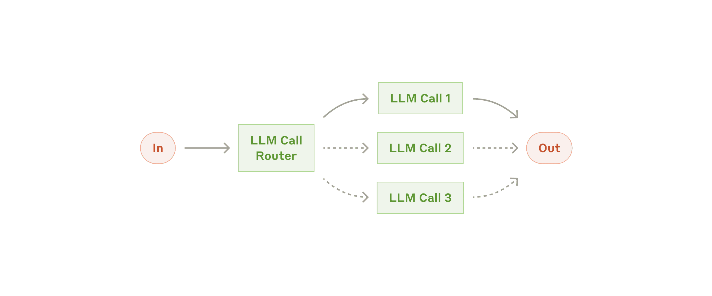
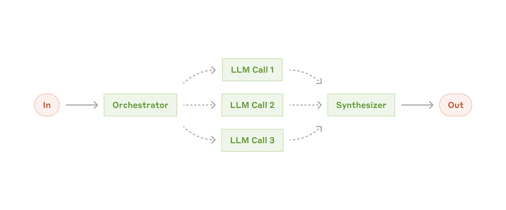
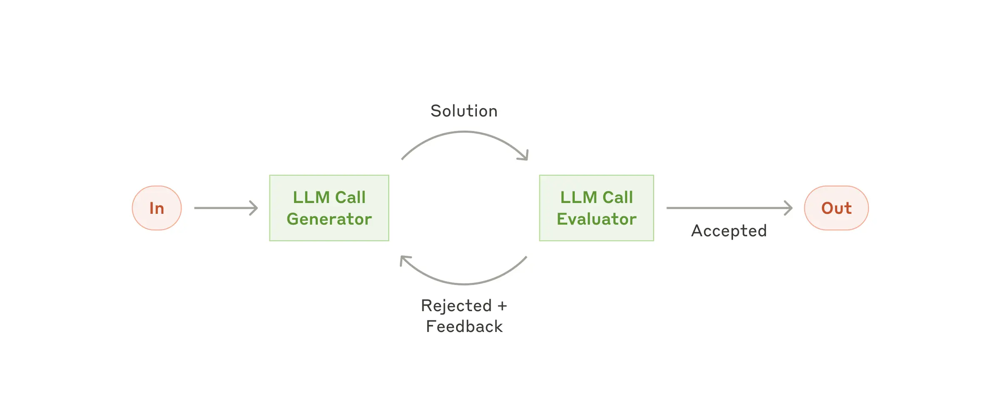
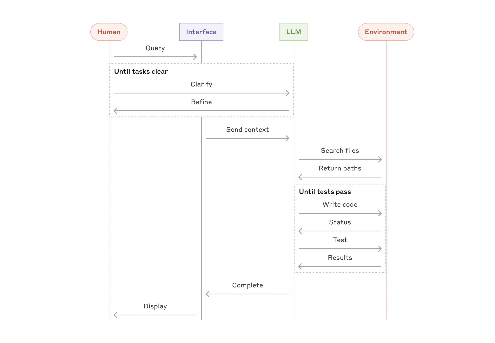

构建高效的智能体 Building effective agents(译)

> 译自：Anthropic 的工程博客 https://www.anthropic.com/engineering/building-effective-agents

Anthropic 工程博客 发布于 2024 年 12 月 19 日

> 我们曾与来自各行业的数十支团队合作开发大语言模型（LLM）Agent智能体。实践表明，最成功的实现方案往往采用简单且易于组合的模式，而非复杂的框架。

在过去的一年里，我们与来自各行各业的数十支团队合作，共同开发大型语言模型（LLM）代理。我们发现，最成功的实现方案往往并未采用复杂的框架或专用库，而是基于简单且可组合的模式进行构建。

在本文中，我们将分享在与客户合作以及自主开发智能体的过程中所积累的经验，并为开发者提供有关构建高效智能体的实用建议。

## 什么是智能体？

“Agent”（智能体）有多种定义方式。有些客户将其定义为完全自主的系统，能够长时间独立运行，使用各种工具完成复杂任务。另一些人则用它来描述遵循预定义工作流的规范性实现。在 Anthropic，我们将这些变体统称为 **agentic systems** 代理系统，但在架构上，我们对 **workflows** 工作流和 **agents** 智能体做了一个重要区分：

*   **Workflows 工作流**：工作流是一种通过预定义的代码路径来协调大语言模型（LLM）和工具的系统。
*   **Agents 智能体**：LLM 动态指导自身流程和工具使用、并自主掌控任务完成方式的系统。

下文将详细探讨这两类代理系统。在附录 1（“实践中的智能体”）中，我们将介绍客户发现此类系统特别有价值的两个领域。

## 何时使用（何时不使用）智能体

在使用 LLM 构建应用时，我们建议尽可能采用简单的解决方案，仅在必要时增加复杂度。这可能意味着根本不需要构建代理系统。代理系统通常以延迟和成本为代价换取更好的任务性能，你需要权衡这种代价是否合理。

当确实需要更复杂的方案时，工作流为定义明确的任务提供了可预测性和一致性；而在需要大规模灵活性和模型驱动决策时，智能体是更好的选择。然而，对于许多应用来说，通过检索和上下文示例优化单次 LLM 调用通常就足够了。

## 何时以及如何使用框架

有许多框架可以简化代理系统的实现，包括：

*   Anthropic 的 **Claude Agent SDK**；
*   AWS 的 **Strands Agents SDK**；
*   **Rivet**，一种拖拽式 GUI LLM 工作流构建器；
*   **Vellum**，另一种用于构建和测试复杂工作流的 GUI 工具。

这些框架通过简化调用大语言模型（LLM）、定义和解析工具以及串联调用等标准的底层任务，让开发者能够轻松入门。然而，它们往往会增加额外的抽象层，从而掩盖底层的提示词和响应内容，导致调试难度增加。此外，当更简单的配置已足够时，这些框架也可能让人不自觉地增加不必要的复杂性。

我们建议开发者首先直接使用 LLM API：许多功能模式仅需几行代码即可实现。若确实需要使用框架，请确保您理解其底层代码。对底层实现的错误假设是导致客户出错的常见原因

请参阅我们的 cookbook 获取一些示例实现。

## 构建模块、工作流与智能体

在本节中，我们将探讨我们在生产环境中见过的代理系统的常见模式。我们将从基础构建模块——增强型 LLM——开始，逐步增加复杂度，从简单的组合式工作流到自主智能体。

### 构建模块：增强型大语言模型

代理系统的基本构建模块是经过检索、工具和记忆等增强功能强化的大语言模型（LLM）。我们当前的模型能够主动运用这些能力——生成自己的搜索查询、选择合适的工具，并决定保留哪些信息。

我们建议在实现中关注两个关键点：针对特定用例定制这些能力，以及确保它们为 LLM 提供简单、文档完善的接口。实现这些增强的方法有很多，其中一种是通过我们最近发布的 **模型上下文协议(MCP)**，该协议允许开发者通过简单的客户端实现与不断增长的第三方工具生态系统集成。

在本文的剩余部分，我们假设每次 LLM 调用都能访问这些增强能力。

### 工作流：提示词链式调用

提示词链式调用将一项任务分解为一系列步骤，其中每次大型语言模型（LLM）调用都会处理前一次调用的输出结果。您可以在任何中间步骤中添加程序化检查（参见下图中的“gate”），以确保流程仍按计划进行。

**何时使用此工作流**：

当任务能够轻松且清晰地分解为固定子任务时，此工作流最为适用。其主要目标是通过将每次大语言模型（LLM）调用分解为更简单的任务，在延迟与更高准确度之间取得平衡。

**提示链（prompt chaining）的适用场景示例**：

- 生成营销文案，然后将其翻译成另一种语言。

- 撰写文档大纲，检查大纲是否符合特定标准，然后根据大纲撰写文档。

### 工作流：路由Routing

路由机制会对输入进行分类，并将其引导至相应的专项后续任务。这种工作流有助于实现关注点的分离，并构建更专业的提示词。如果没有这种工作流，针对某类输入进行的优化可能会影响其他输入的性能。

**何时使用此工作流**：

路由机制特别适用于那些存在明确分类且更适合分别处理的复杂任务，并且能够通过大型语言模型（LLM）或更传统的分类模型/算法进行准确分类的情况。

**路由机制的适用示例**：

- 将不同类型的客户服务咨询（如一般性问题、退款请求、技术支持）引导至不同的下游流程、提示词和工具。
- 将简单/常见的问题路由至小型、高性价比的模型（如 Claude Haiku 4.5），将复杂/特殊的问题路由至功能更强大的模型（如 Claude Sonnet 4.5），以优化性能表现。

### 工作流：并行化

大型语言模型（LLMs）有时可以同时处理同一任务，并通过程序化方式汇总其输出结果。这种称为“并行化”的工作流主要表现为两种形式：

- **分区**：将任务拆分为多个独立的子任务并行运行。
- **投票**：多次运行同一任务以获取多样化的输出结果。

**何时使用此工作流**：

当拆分的子任务可通过并行处理来提升速度时，或者为了获得更可靠的结果而需要多种视角或多次尝试时，并行化处理便能发挥效用。对于涉及多重考量因素的复杂任务，通常通过单独调用不同的 LLM 来处理每个考量因素，使每个特定方面都能得到专注的关注，这样LLM的表现会更佳。

**示例**：

- **分区处理**：
  - 实现防护机制，即一个模型实例处理用户查询，另一个则筛查其中是否存在不当内容或请求。这种方式通常比让同一个大语言模型（LLM）调用同时处理防护机制和核心响应的性能更优。
  - 自动化评估以衡量大语言模型（LLM）的性能，即每次 LLM 调用针对给定提示词评估模型性能的不同方面。

- **投票**：
  - 审查代码中的漏洞，由多个不同的提示词对代码进行审查，并在发现问题时进行标记。
  - 评估给定内容是否不适当，由多个提示词评估不同方面，或设置不同的投票阈值以平衡误报和漏报。

### 工作流：编排者-工作者

在编排者-工作者工作流中，一个中央 LLM 动态分解任务，并将其委托给工作者 LLM，并整合它们的处理结果。

**何时使用此工作流**：

此工作流非常适合无法预测所需子任务的复杂任务（例如在编程中，需要修改的文件数量以及每个文件的修改性质很可能取决于具体任务）。虽然它在拓扑结构上与并行化相似，但关键区别在于其灵活性——子任务不是预定义的，而是由编排者根据特定输入确定的。

**示例**：

*   每次需要对多个文件进行复杂更改的编程产品。
*   涉及从多个来源收集和分析信息以寻找相关信息的搜索任务。

### 工作流：评估者-优化者

在评估者-优化者工作流中，一个 LLM 调用生成响应，另一个则提供评估和反馈，两者在循环中交替进行。

**何时使用此工作流**： 

当评估标准明确，且迭代优化能带来可量化的价值时，此工作流尤为有效。判断其适用性的两个标志是：首先，当人类明确表达反馈意见时，大语言模型（LLM）的响应能够得到明显改善；其次，大语言模型能够提供此类反馈。这类似于人类作家在撰写一篇精炼的文档时所经历的迭代写作过程。

**示例**：

*   文学翻译，翻译 LLM 可能最初无法捕捉细微差别，但评估 LLM 可以提供有用的批评。
*   复杂的搜索任务，需要多轮搜索和分析以收集全面信息，由评估者决定是否需要进一步搜索。

## 智能体

随着大型语言模型（LLM）在关键能力上的成熟——包括理解复杂输入、进行推理和规划、可靠地使用工具以及从错误中恢复——智能代理正逐渐在实际生产环境中崭露头角。智能代理的工作通常始于接收人类用户的指令，或与人类用户进行交互式讨论。一旦任务明确，智能代理便会独立进行规划和操作，必要时可能会返回向人类用户寻求进一步的信息或判断。在执行过程中，代理必须在每个步骤从环境中获取“真实结果”（例如工具调用结果或代码执行结果），以评估其进展。随后，代理可以在检查点或遇到阻碍时暂停，以获取人类反馈。任务通常在完成后终止，但为了保持控制，通常也会包含停止条件（例如最大迭代次数）。

代理虽能处理复杂任务，但其实现往往较为简单。它们通常只是基于环境反馈循环调用工具的大型语言模型（LLMs）。因此，清晰且周全地设计工具集及其文档至关重要。我们在附录 2（“工具的提示工程”）中详细阐述了工具开发的最佳实践。

**何时使用智能体**： 

智能体可用于开放式问题，这些问题难以或无法预测所需步骤数，且无法硬编码固定路径。LLM 可能会运行多个回合，你必须对其决策能力有一定程度的信任。智能体的自主性使其成为在可信环境中扩展任务的理想选择。

智能体的自主性意味着更高的成本，且可能导致错误累积。我们建议在沙箱环境中进行广泛测试，并设置适当的防护措施。

**示例**：
以下示例来自我们自己的实现：

*   一个用于解决 [SWE-bench](https://www.anthropic.com/research/swe-bench-sonnet) 任务的编程智能体，涉及根据任务描述编辑许多文件；
*   我们的“[计算机使用](https://github.com/anthropics/anthropic-quickstarts/tree/main/computer-use-demo)”参考实现，Claude 使用计算机完成任务。

## 组合与自定义这些模式

这些构建模块并非强制性的。它们是开发者可以灵活调整和组合的，以适应不同的用例。与任何大语言模型（LLM）功能一样，成功的关键在于衡量性能并不断迭代实现方案。重申一点：只有当增加复杂性能切实改善结果时，才应考虑这样做。

## 总结

在 LLM 领域的成功不在于构建最复杂的系统，而在于构建适合你需求的正确系统。从简单的提示词开始，通过全面的评估进行优化，只有在简单解决方案不足时才添加多步骤代理系统。

在实现智能体时，我们遵循三个核心原则：

1.  保持设计简单。
2.  通过明确展示智能体的规划步骤，优先确保透明度。
3.  通过详尽的工具文档和测试，精心设计智能体-计算机接口（ACI）。

框架可以帮助你快速入门，但在投入生产时，不要犹豫减少抽象层，使用基本组件进行构建。遵循这些原则，你可以创建不仅强大，而且可靠、可维护并受用户信任的智能体。

## 致谢
本文由 Erik Schluntz 和 Barry Zhang 撰写。这项工作基于我们在 Anthropic 构建智能体的经验以及客户分享的宝贵见解，对此我们深表感谢。

---

## 附录 1：实践中的智能体

我们与客户的工作揭示了 AI 智能体的两个特别有前途的应用，展示了上述模式的实用价值。这两个应用都说明了智能体如何在需要对话和行动、有明确成功标准、启用反馈循环以及集成有意义的人工监督的任务中发挥最大价值。

### A. 客户支持

客户支持结合了熟悉的聊天机器人界面与通过工具集成增强的功能。这非常适合较开放的智能体，因为：
*   支持互动自然遵循对话流程，同时需要访问外部信息和行动；
*   可以集成工具以提取客户数据、订单历史和知识库文章；
*   退款或更新工单等操作可以通过编程处理；
*   成功与否可以通过用户定义的解决标准清晰衡量。

几家公司通过基于使用量的定价模式（仅对成功解决收费）证明了这种方法的可行性，显示了对其智能体有效性的信心。

### B. 编程智能体

软件开发领域显示出 LLM 功能的巨大潜力，能力从代码补全发展到自主解决问题。智能体特别有效，因为：
*   代码解决方案可通过自动化测试验证；
*   智能体可以利用测试结果作为反馈迭代解决方案；
*   问题空间定义明确且结构化；
*   输出质量可以客观衡量。

在我们自己的实现中，智能体现在可以仅根据拉取请求描述解决 SWE-bench Verified 基准中的真实 GitHub 问题。然而，虽然自动化测试有助于验证功能，但人工审查对于确保解决方案符合更广泛的系统需求仍然至关重要。

---

## 附录 2：提示工程你的工具

无论你构建哪种代理系统，工具都可能是智能体的重要组成部分。工具通过在我们的 API 中指定其确切结构和定义，使 Claude 能够与外部服务和 API 交互。当 Claude 响应时，如果它计划调用工具，将在 API 响应中包含一个工具使用块。工具定义和规范应与你的整体提示词一样受到重视。在这个简短的附录中，我们将描述如何对你的工具进行提示工程。

通常有几种方法可以指定同一个操作。例如，你可以通过编写 diff 或重写整个文件来指定文件编辑。对于结构化输出，你可以在 markdown 或 JSON 中返回代码。在软件工程中，这些差异是表面的，可以无损转换。然而，有些格式对 LLM 来说比其他格式更难编写。编写 diff 需要在编写新代码之前知道块头中有多少行正在更改。在 JSON 中编写代码（与 markdown 相比）需要额外的换行符和引号转义。

关于如何确定工具格式，我们的建议如下：

- 给模型提供足够的“思考”时间，以免它在写出代码时陷入死胡同。
- 确保格式尽可能接近模型在互联网文本中自然观察到的形式。
- 确保没有格式化的“额外负担”，例如必须精确统计数千行代码的行数，或者对生成的代码进行字符串转义。

一个经验法则是思考人机交互界面（HCI）投入了多少精力，并计划投入同样的精力创建良好的智能体-计算机接口（ACI）。以下是一些关于如何做到这一点的想法：

- 试着站在模型的角度思考。仅凭描述和参数，是否能直观地知道如何使用这个工具，还是需要仔细斟酌？如果是后者，那么模型可能也面临同样的情况。一个好的工具定义通常应包含使用示例、边界情况、输入格式要求，以及与其他工具的明确界限。
- 如何修改参数名称或描述以使其更直观？不妨将其视为在为团队中的初级开发者编写一份优秀的文档字符串。当使用大量类似工具时，这一点尤为重要。
- 测试模型如何使用你的工具：在工作台中运行大量示例输入，观察模型会犯哪些错误，并进行迭代优化。
- 对工具进行防错设计。修改参数设置，使其更难出错。

在为 [SWE-bench](https://www.anthropic.com/research/swe-bench-sonnet) 构建我们的智能体时，我们实际上花在优化工具上的时间比优化提示词本身还要多。例如，我们发现当智能体离开根目录后，模型在使用包含相对文件路径的工具时会出现错误。为了解决这个问题，我们将工具修改为始终要求使用绝对文件路径——结果发现模型使用这种方法时表现得非常完美。

- cookbook https://platform.claude.com/cookbook/patterns-agents-basic-workflows
- SWE-bench https://www.anthropic.com/research/swe-bench-sonnet
