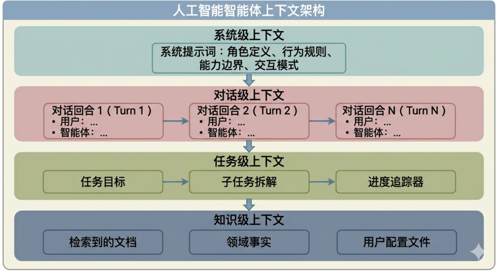
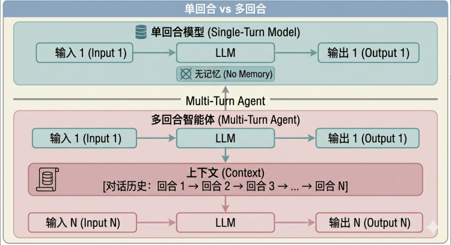
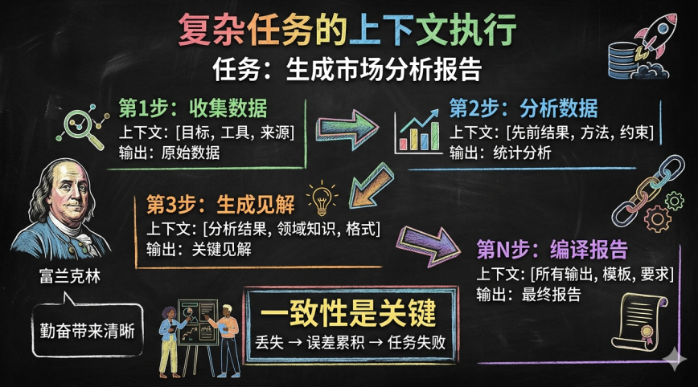
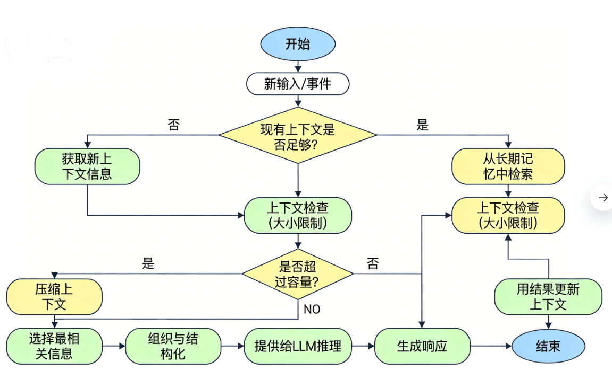
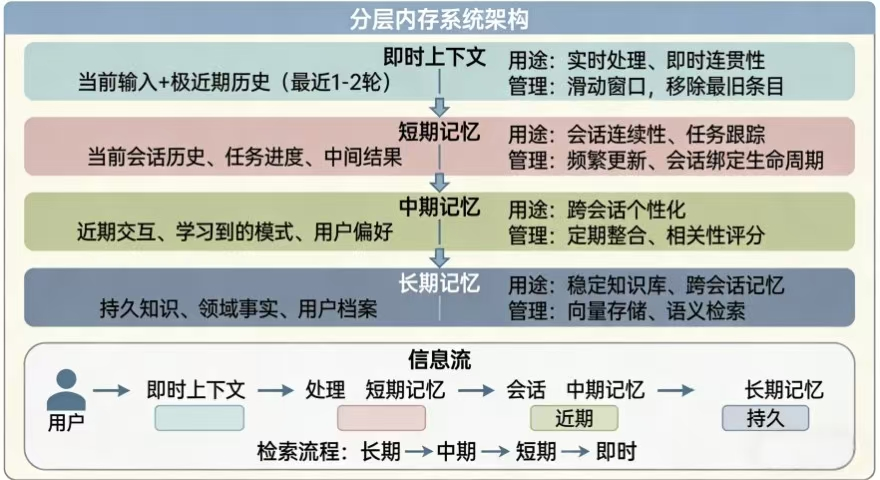
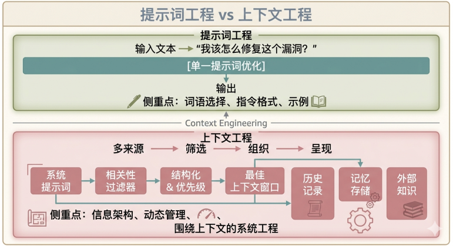
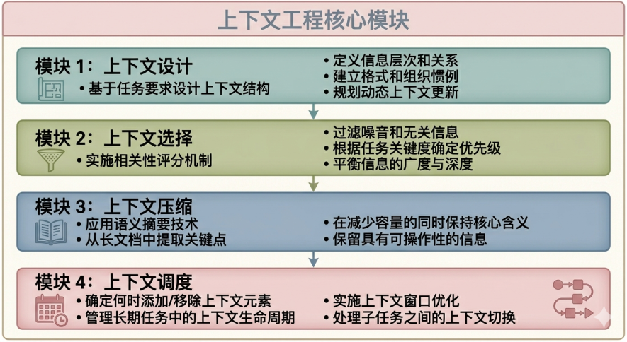
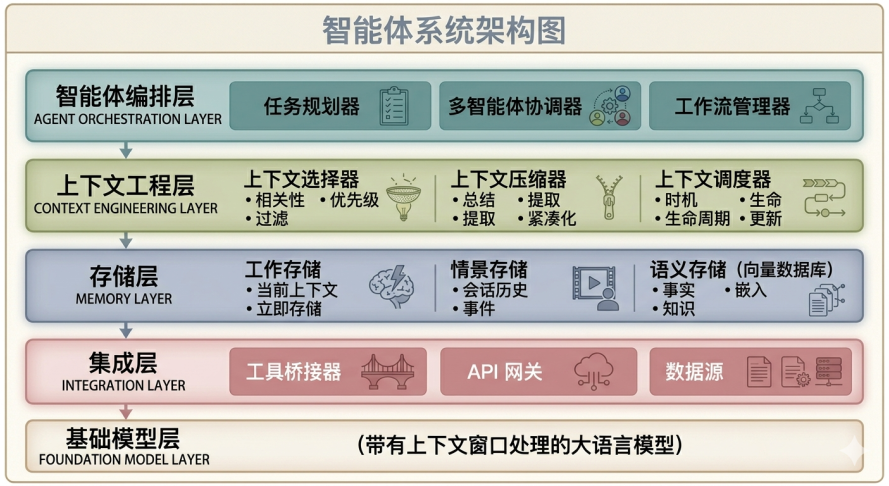
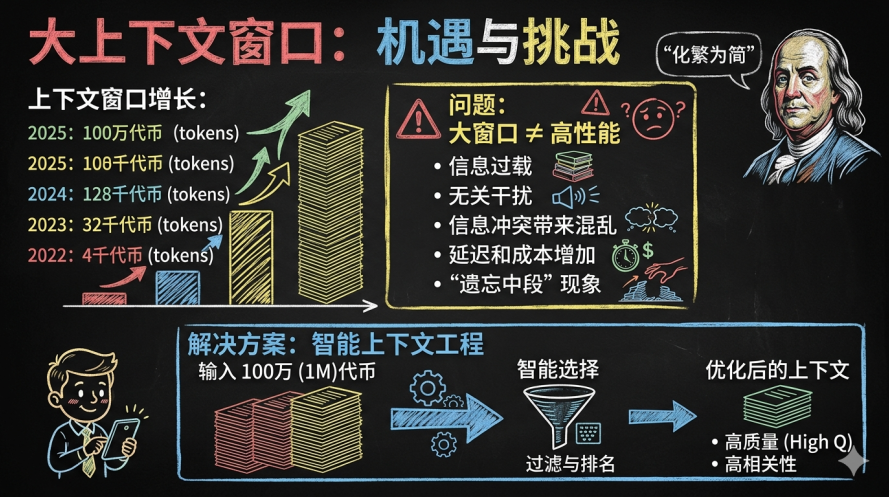

## 前言

在构建 AI Agent 智能体的过程中，上下文（Context）扮演着至关重要的角色。正如人类在进行复杂思考时，需要依赖大脑记忆来保持对信息的处理、聚焦与整合，AI Agent 同样需要精心设计的上下文机制来支撑智能决策与连贯交互。

而上下文工程（Context Engineering）作为兴起的关键技术范式，正在重新定义我们构建 AI Agent 系统的方式。


## 一、上下文的定义与本质

### 上下文Context概念

上下文（Context）是指 AI Agent 在推理过程中能够访问和使用的全部信息集合的总和。这些信息构成了模型理解和生成响应的基础环境，决定了 Agent 的行为方式和输出质量。

从技术实现角度来看，上下文以**上下文窗口**（Context Window）这一概念的技术实现，它决定了模型在任何给定时间，能够考虑或"记住"的文本量，这是大型语言模型处理信息的容量边界，通常以 token 为计量单位。

上下文窗口中可以存在的上下文内容类型如下，包括系统提示词、用户输入、对话历史、临时记忆、长期记忆、外部工具返回的结果、任务状态、Agent状态、外部知识等等信息。


### 上下文Context本质理解

如果将大型语言模型比作一个智能处理器，那么上下文就是它的"工作台"。模型的参数定义了它理解和生成语言的一般能力，而上下文则决定了这些模型能力在特定场景下如何发挥。相同模型在不同上下文下的表现可能截然不同，这凸显了上下文的重要性。

上下文还可以被理解为模型的"工作记忆"。就像人类在思考和交流时需要依赖短期记忆，来保持对当前话题的专注一样，大型语言模型也需要通过上下文来维持对话的连贯性和对任务的理解。一个更大的上下文窗口的使用，能够使 AI 模型处理更长的输入，并在每次输出中融入更多的信息。


## 二、上下文的组成要素

### 上下文的组成要素

AI Agent 的上下文由多个层次的信息构成，形成一个完整的信息体系。理解这些组成要素是掌握上下文管理的基础。

- 系统级上下文包括系统提示词（System Prompt），这是为 Agent 设定角色定位、行为规则和能力边界的核心指令。

- 对话级上下文涵盖多轮对话历史，记录了用户与 Agent 之间的交流过程，使 Agent 能够理解对话的演进脉络和用户的真实需求。

- 任务级上下文则包括当前正在执行的任务描述、目标设定、中间步骤和已完成的部分工作。

- 此外，还有知识级上下文，涵盖 Agent 从外部知识库或文档中检索到的相关信息，

- 以及状态级上下文，记录 Agent 当前的内部状态、已做出的决策和待处理的事项。

等等各种上下文的类型。

**上下文类型分层图**



（AI生成图片）

### 各层次详解

| 层次 | 组成要素 | 功能描述 | 生命周期 |
|------|----------|----------|----------|
| 系统层 | 系统提示词、角色定义 | 设定 Agent 基本行为模式 | 持久 |
| 对话层 | 多轮对话历史、消息记录 | 维持对话连贯性 | 会话级 |
| 任务层 | 任务描述、目标状态、中间结果 | 支撑复杂任务执行 | 任务级 |
| 知识层 | 外部文档、领域知识、用户画像 | 提供背景信息支持 | 可变 |


## 三、上下文的作用

### 支撑多轮对话与连续推理

上下文最基础也是最重要的作用是使多轮对话成为可能。

在单轮交互模式中，模型仅需理解当前输入并产生响应；

然而在真实的应用场景中，用户与系统的交互往往是连续迭代的过程，是多轮对话。模型需要"记住"之前说过的话、问过的问题以及做出的回应，这样才能进行连贯的交流和复杂的推理。这种连续推理能力是 AI Agent 与传统聊天机器人的本质区别之一。

所以，需要上下文记录之前所有关键信息的对话内容，使模型能够“记住”历史信息，从而进行连贯的交流和复杂的推理。

以智能客服场景为例，当用户描述一个技术问题时，Agent 需要记住问题出现的完整上下文，包括用户之前尝试过的解决方法、错误信息的完整内容、以及企业与该用户的历史交互记录。只有基于这些完整的上下文，Agent 才能做出准确的问题诊断而不是重复询问已经提供的信息。


**单轮对话 vs 多轮对话**：



​                                              （AI生成图片）

### 个性化服务与自适应学习

上下文管理使 AI Agent 能够提供真正个性化的服务。通过持续追踪用户的历史偏好、行为模式和交互反馈，Agent 可以动态调整自己的响应策略，使之更加贴合用户的个性化需求和习惯。这种个性化能力在企业级应用中尤为重要，因为它直接影响到用户体验的满意度和任务完成的效率。

同时，上下文机制还支撑着 Agent 的自适应学习能力。Agent 可以从当前的交互中提取新的知识并将其整合到后续对话中，无需重新训练模型就能不断优化自己的表现。这种持续学习的能力使 AI Agent 能够在实际使用中不断提升性能，逐步适应复杂多变的业务环境。


### 保障任务执行的准确性与一致性

在执行复杂多步骤任务时，上下文起着维持任务一致性和防止错误累积的关键作用。

一个典型的企业流程可能包含数十个步骤，需要数小时甚至数天才能完成。在此过程中，Agent 需要始终保持对任务目标、中间状态和已完成步骤的清晰认识，任何上下文信息的丢失都可能导致任务失败或产生错误结果。

上下文管理还帮助 Agent 在执行过程中进行有效的自我纠正。当 Agent 能够在每个步骤访问完整的上下文时，它就能够检查之前决策的正确性，发现潜在的错误，并在造成更大影响之前进行修正。这种自我纠正能力是实现可靠 AI Agent 的关键因素。

市场分析报告复杂任务步骤：



​              (AI 生成图片)

### 提升推理效率与资源利用

合理的上下文管理不仅关乎输出质量，还直接影响推理效率和成本。上下文窗口的大小直接决定了每次推理需要处理的 token 数量，而 token 数量与计算成本、响应延迟成正相关。

因此，优化上下文管理可以在保证任务性能的同时显著降低资源消耗。

通过智能地选择、压缩和组织上下文信息，Agent 可以在有限的上下文窗口内最大化有效信息的密度，避免被无关或冗余信息干扰。这种精细的上下文控制能力是区分高效 AI Agent 与普通系统的关键特征。

一些优化策略：

- 智能选择，过滤无关信息
- 语义压缩，总结长内容
- 优先级排序， 优先处理关键背景信息
- 动态更新 ， 根据需要添加/移除上下文


## 四、上下文管理最佳实践

### 四大核心策略

上下文管理主要遵循四种核心策略，这些策略相互配合形成完整的上下文管理体系。

根据业界研究和实践经验，上下文管理主要遵循四种核心策略：写入（Write）、选择（Select）、压缩（Compress）和隔离（Isolate）。

- 写入（Write），写入策略涉及确定哪些信息需要被添加到上下文中，包括对话历史的关键点、用户偏好更新和任务进度记录等。

- 选择（Select），选择策略关注如何从可用信息中筛选出最相关的内容，避免上下文窗口被无关信息填满。

- 压缩（Compress），压缩策略用于将长篇信息提炼为简洁的摘要，保留核心含义的同时减少 token 消耗。

- 隔离（Isolate），隔离策略则涉及如何组织上下文结构，使不同类型的信息互不干扰，便于模型快速定位所需内容。

  

这四种策略需要根据具体的应用场景和任务需求进行灵活组合和调整。

### 上下文窗口优化

有效管理上下文窗口是上下文工程的核心挑战之一。随着交互的进行，上下文会不断增长，如果不对其进行适当控制，最终会超出模型的上下文窗口限制。解决这个问题的方法包括：实施智能的对话历史截断策略，只保留最相关的对话轮次；使用语义压缩技术将长段落精简为关键信息摘要；以及采用层次化的记忆架构，将信息分为不同的重要性级别。

另一个重要实践是在每个步骤恰到好处地填充上下文。这意味着不仅要将相关信息放入上下文窗口，还要确保这些信息以正确的格式和顺序呈现，使模型能够最容易地理解和利用。上下文工程正是关于在 Agent 轨迹的每一步都将适量的正确信息填充到上下文窗口的艺术和科学。

### 上下文管理的流程图

下面展示一个完整的上下文管理流程，从信息输入到最终输出：




### 分层记忆系统

建立分层的记忆系统是实现有效上下文管理的最佳实践之一。这种架构将信息划分为不同的重要性级别，采用不同的管理策略。

为了实现有效的上下文管理，建立分层的记忆系统是一种被广泛采用的最佳实践。这种架构通常将记忆分为几个层次：

- 短期记忆用于存储当前对话的即时信息；

- 中期记忆记录近期交互中获得的重要知识；

- 长期记忆则保存持久的用户偏好、领域知识和任务模板。

不同层次的记忆采用不同的管理策略。短期记忆需要频繁更新但容量有限；中期记忆需要定期整合和精简；长期记忆则需要可靠的存储和高效的检索机制。通过这种分层设计，Agent 可以在保持对当前任务专注的同时，利用历史信息提供个性化的服务。



### 系统提示词设计

系统提示词是上下文中最为关键的部分之一，它决定了 Agent 的基本行为模式和能力边界。

设计有效的系统提示词需要遵循几个原则：

- 简洁直接的语言：使用简洁直接的语言，避免复杂晦涩的表达；

- 适当的抽象层级：在适当的抽象层次上呈现概念，使 Agent 能够理解任务要求而不会被不必要的细节干扰；
  - 技术领域： 使用准确术语
  - 通用用途： 使用通俗易懂的语言 
  - 高级用户：  跳过基础说明
  - 新手用户：请提供定义和示例

- 明确角色定位：明确设定 Agent 的角色定位，减少响应的不确定性。
> ☑️ GOOD：“您是一名专业的客户服务专员，专门负责我们软件产品的技术支持。请专注于提供准确的解决方案。”
>
> ❌ BAD： “你是一个帮助人们的AI助手。”

- 具体行为规则：系统提示词还需要包含清晰的指令和示例，帮助 Agent 理解在各种情况下应该如何响应。
  - 在提供之前，请务必确认对方是否理解
  - 当信息不充分时，请提出澄清性问题
  - 在适当的情况下提供分步解决方案
  - 承认不确定性，而不是妄加猜测

- 约束边界：能做什么，不能做什么
  - Agent 能够做什么（功能）
  - Agent 不应做的事情（限制）
  - 何时需要转交人工支持
  - 安全与隐私指南

一个经过精心设计的系统提示词可以显著提高 Agent 的一致性和可靠性，减少在长流程任务中出现行为漂移的可能性。


## 五、上下文工程详解

### 什么是上下文工程

**上下文工程**（Context Engineering）是近年来随着大型语言模型发展而兴起的关键技术范式。它指的是通过系统性设计、组织和管理模型推理时的上下文信息，以优化任务性能和推理结果的技术领域。

与传统的提示词工程（Prompt Engineering）不同，上下文工程不仅仅关注如何优化单次文本输入，而是涵盖围绕信息获取、组织、调度和动态更新的完整系统工程。

如果将提示词工程比作教会我们如何向模型提问，那么上下文工程则是帮助我们构建模型所需推理的场景信息。

上下文工程的兴起反映了 AI 应用从简单任务向复杂场景演进的趋势，是 AI Agent 从概念走向实际应用的关键技术支撑。


**提示词工程和上下文工程对比**



### 上下文工程的核心内容

上下文工程包含以下几个核心内容模块。

首先是上下文设计，这是指根据任务需求和模型特性，设计合适的上下文结构和内容框架。上下文设计需要考虑信息的组织方式、呈现顺序和格式规范，以确保模型能够高效地理解和利用上下文。

其次是上下文选择，涉及从大量可用信息中筛选出最相关的内容。这一步骤需要运用相关性判断、重要性评估和噪声过滤等技术，在保证关键信息不丢失的前提下最大化上下文的信息密度。

第三是上下文压缩，针对长篇内容实施智能摘要和要点提取，在保留核心语义的同时减少资源消耗。

最后是上下文调度，负责在适当的时机向上下文中添加或移除信息，实现动态的上下文管理。


这些模块相互关联形成完整的上下文工程核心模块内容：



### Agent智能体架构(包含上下文工程)

在实际技术实现中，上下文工程涉及多种工具和方法的综合运用。

- OpenAI 的函数调用功能允许 Agent 与外部系统进行结构化交互，获取实时信息；

- 长期记忆系统为 Agent 提供了跨会话的信息保持能力；

- 工具使用机制使 Agent 能够调用外部服务来完成复杂任务；

- 代理工作流则定义了多步骤任务的执行逻辑和上下文传递规则。

这些工具的结合使用使得上下文工程不再是理论概念，而是成为可以落地实施的技术方案。在构建如 Manus 这样的复杂 AI Agent 时，上下文工程被证明是优化 Agent 性能最有效的方法之一。

一个关键的实践经验是：在上下文中保留"错误的转折"有时反而有助于 Agent 学习避免类似错误，这种反直觉的发现说明上下文工程需要深入的实践经验和持续的迭代优化。



### 上下文工程实践案例：Manus 的经验

在构建复杂 AI Agent 的实践中，上下文工程被证明是优化性能最有效的方法之一。以下是从实际项目中学到的关键经验，Manus的关键背景工程经验：

- 经验 1：将错误的转折置于上下文中

当 Agemt 做出错误决策时，将其从上下文中移除往往会导致重复同样的错误。 

更佳方案：保留错误决策 + 添加纠正分析 

Context： “代理尝试了 X，但发生了 Y。这是因为 Z 的缘故。对于未来类似的情况，应改用 W。”


- 经验 2：明确的上下文边界

在不同上下文类型之间使用清晰的分隔符：

```
========== SYSTEM INFO ========== 

========== USER REQUEST ==========  

========== TASK HISTORY ==========  

========== RETRIEVED KNOWLEDGE ==========
```


- 经验 3：循序渐进的语境构建

不要一次性倾倒所有信息。建立上下文：

步骤 1：记录最小必要背景信息

步骤 2：根据需要添加检索到的具体信息

步骤 3：在完成每个子任务后更新进度

步骤 4：仅保留相关的历史信息


- 经验 4：语境质量重于数量

更多背景信息并不总是更好的。

一个内容聚焦、包含高质量且相关信息的上下文要优于一个充斥着可能有趣但无关紧要的细节的庞大上下文。


## 六、上下文窗口的容量挑战与应对

### 上下文窗口限制问题

随着模型上下文窗口容量的不断扩大，从最初的数千 token 到如今的百万级 token，AI Agent 处理复杂任务的能力显著增强。然而，单纯的窗口扩大并不等同于效率提升，当海量信息被一次性输入时，模型可能会被冲突或无关的信息干扰。

大窗口不等于高性能，可能存在的一些问题：

- 信息过载
- 无关信息干扰
- 信息冲突带来的混乱
- 延迟和增加成本
- “遗忘中断”现象

解决方案：智能上下文工程

输入的信息，经过智能选择，过滤，排名，成为优化后的高质量相关性高的上下文。



### 趋势：多智能体上下文协作

未来的上下文工程正在向结构化多智能体系统方向发展。这种方法不再追求在单一上下文中包含所有信息，而是通过多个 Agent 之间的协作和信息共享来实现更复杂的任务处理。

每个 Agent 维护自己的上下文，通过规范的协议进行信息交换和协调，这种分布式方法能够更好地处理大规模、复杂化的任务场景。


## 七、总结

### 核心要点总结

上下文管理是 AI Agent 系统的核心能力，它直接决定了 Agent 的智能程度、响应质量和运行效率。

**什么是上下文**：

• 大型语言模型（LLM）在推理过程中可访问的所有信息
• 包括提示词、历史记录、记忆、知识及工具结果
• 受上下文窗口容量的限制

**为何上下文至关重要**：

• 实现有意义的 AI 交互的基础
• 决定模型在参数之外的性能表现
• 支持多轮对话和复杂任务的执行
• 对个性化和一致性至关重要

**如何管理上下文**：

• 编写：策略性地添加相关信息
• 筛选：过滤出最相关的内容
• 压缩：智能地总结长篇内容
• 隔离：进行组织以确保清晰和可访问性

**什么是上下文工程**：

• 对上下文信息的系统化设计与管理
• 超越提示词工程，实现全生命周期管理
• 生产级AI代理的关键使能因素												   


### 未来发展趋势

上下文工程作为 AI Agent 开发的关键技术范式，正在从理论走向实践，为构建更强大的 AI Agent 提供方法论指导。随着技术的不断发展，上下文的组织方式、管理策略和利用效率都将持续优化：

| 发展趋势 | 描述 | 影响 |
|----------|------|------|
| 智能化上下文选择 | AI 自动判断和选择最相关上下文 | 减少人工干预，提高效率 |
| 分层上下文架构 | 多层次记忆系统协同工作 | 更好地处理复杂任务 |
| 多智能体上下文共享 | 多个 Agent 分工协作，共享上下文 | 突破单 Agent 能力边界 |
| 动态上下文优化 | 实时调整上下文组成 | 适应变化的任务需求 |

掌握上下文工程的原理和实践技能，将成为 AI 开发者和技术决策者的核心竞争力。


## 参考

- https://www.anthropic.com/engineering/effective-context-engineering-for-ai-agentsAnthropic anthropic 的文章 Effective context engineering for AI agents
- https://arxiv.org/abs/2307.03172  Lost in the Middle: How Language Models Use Long Contexts（长上下文注意力）主要是揭示长上下文 “中间遗忘” 现象，指导上下文排序与截断策略。
- https://arxiv.org/abs/2305.06284  Enhancing Language Models with Contextual Retrieval 利用上下文检索增强语言模型
- https://arxiv.org/abs/2310.03744 Evidence of Recency Bias in Long Context 长上下文中的近因偏好证据的研究，OpenAI 团队关于长上下文偏好最近内容的研究
- https://manus.im/zh-cn/blog/Context-Engineering-for-AI-Agents-Lessons-from-Building-Manus AI代理的上下文工程：构建Manus的经验教训  manus
