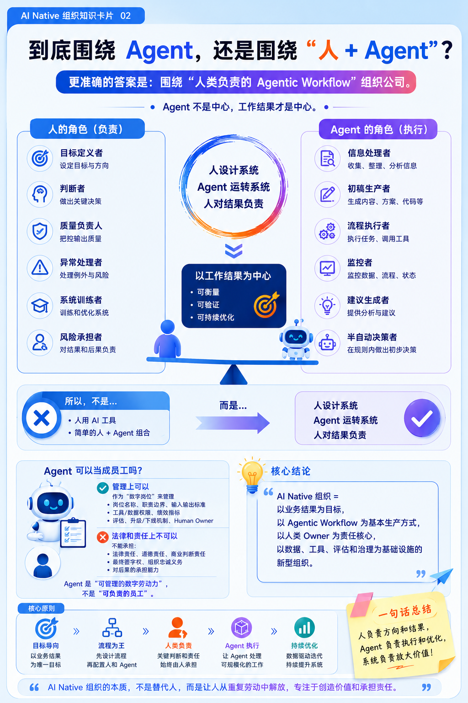

## 前言

我的判断很明确：

**AI Native 组织不是围绕 Agent 重建组织，也不是简单围绕“人 + Agent”改造组织，而是围绕“工作流 + 责任制 + 可度量产出”重构组织。**

Agent 可以被当成“数字员工”来管理，但不能被当成真正员工来负责。真正的责任主体仍然是人和组织。

## **一、AI Native 组织的核心单位**

传统组织的基本单位是：

> 岗位 → 人 → 部门 → 流程

AI Native 组织的基本单位应该变成：

> 目标 → 工作流 → 人类 Owner → Agent 群 → 数据/工具/权限 → 评估系统

也就是说，不应该先问“这个部门需要几个 Agent”，而应该问：

> 这个业务结果由哪些可重复、可验证、可自动化的工作流产生？

例如销售组织不再只是：

> 客户开发、客户经理、销售运营、客服

而是拆成：

> 线索发现流、线索研究流、个性化触达流、会议准备流、报价流、客户风险预警流、续约流

每条工作流里，有人负责判断、关系、策略、异常处理；Agent 负责研究、生成、执行、监控、整理、提醒、初步决策。

## **二、到底围绕 Agent，还是围绕“人 + Agent”？**

**都不完全对**。

更准确是：

> 围绕“**人类负责的 Agentic Workflow**”组织公司。

**Agent 不是中心，工作结果才是中心。**

人也不是传统意义上的执行中心，而是变成：

1. 目标定义者  

2. 判断者  

3. 质量负责人  

4. 异常处理者  

5. 系统训练者  

6. 风险承担者

   

Agent 变成：

1. 信息处理者  
2. 初稿生产者  
3. 流程执行者  
4. 监控者  
5. 建议生成者  
6. 半自动决策者

所以 AI Native 组织不是人用 AI 工具，而是：

> 人设计系统，Agent 运转系统，人对结果负责。

## **三、Agent 可以当成公司员工吗？**

管理上可以，法律和责任上不可以。

可以把 Agent 当成数字岗位来管理，比如给它：

1. 岗位名称  
2. 职责边界  
3. 输入输出标准  
4. 工具权限  
5. 数据权限  
6. 绩效指标  
7. 质量评估  
8. 升级和下线机制  
9. 人类 Owner

但不能把 Agent 当成真正员工，因为它没有：

1. 法律责任  
2. 道德责任  
3. 商业判断责任  
4. 最终签字权  
5. 组织忠诚义务  
6. 对后果的承担能力

所以更好的说法是：

> Agent 是“可管理的数字劳动力”，不是“可负责的员工”。

每个重要 Agent 都应该有一个 Human Owner。出了问题，不能说 Agent 干的，只能说这个 Agent 所属流程的 Owner 没有管理好系统。

## **四、AI Native 组织的标准**

我会用 8 个维度判断一家公司是不是 AI Native：

| 维度     | 低水平表现              | AI Native 表现                                    |
| -------- | ----------------------- | ------------------------------------------------- |
| 工作方式 | 人手工完成，AI 辅助一下 | 默认先设计 AI 可执行工作流                        |
| 组织结构 | 按职能部门分工          | 按业务流、任务流、Agent 流重组                    |
| 数据基础 | 数据散落在文档和人脑里  | 数据结构化、可调用、可追踪                        |
| 工具系统 | AI 是外挂工具           | AI 深度接入 CRM、代码库、知识库、财务、工单等系统 |
| 责任机制 | 不清楚 AI 输出谁负责    | 每个 Agent、流程、输出都有 Owner                  |
| 评估体系 | 看感觉、看节省时间      | 有质量、成本、速度、风险、转化率等指标            |
| 人才模型 | 招会用 AI 的人          | 招会设计、管理、评估 Agent 系统的人               |
| 治理机制 | 出问题再补救            | 权限、审计、安全、回滚、人工确认机制内建          |

一句话标准：

> 如果 AI 只是提高个人效率，不是 AI Native；如果 AI 改变了公司的工作流、岗位定义、组织边界和经营指标，才是 AI Native。

## **五、AI Native 组织 Level 等级**

我建议分为 6 级。

| Level | 名称                  | 组织特征                               | 衡量标准                                                     |
| ----- | --------------------- | -------------------------------------- | ------------------------------------------------------------ |
| L0    | 无 AI 组织            | 基本不用 AI                            | AI 使用率 < 10%，无制度、无流程                              |
| L1    | 个人增强型组织        | 员工各自用 ChatGPT、Copilot 等工具     | 个人效率提升，但流程没变                                     |
| L2    | 流程辅助型组织        | 在客服、销售、研发、运营中嵌入 AI 工具 | 20%-40% 重复任务被 AI 辅助                                   |
| L3    | Agent 协作型组织      | 出现正式 Agent 岗位和 Human Owner      | 核心流程中 30%-60% 任务由 Agent 执行                         |
| L4    | Agentic Workflow 组织 | 业务流程围绕 Agent 重新设计            | 多个端到端流程半自动运行，人主要审批和处理异常               |
| L5    | AI Native 自进化组织  | 公司像一个持续学习的智能系统           | Agent 能持续优化流程、发现问题、提出策略，人类负责方向和治理 |

## **六、每一级的判断标准**

**L1：个人增强**

典型表现：

> 员工用 AI 写文档、总结会议、生成代码、做分析。

衡量标准：

1. AI 工具覆盖率  
2. 员工使用频率  
3. 个人节省时间  
4. 输出质量主观评分

问题是：这一级只是“人变强了”，组织没变。

**L2：流程辅助**

典型表现：

> AI 被嵌入某些标准流程，比如客服回复、销售邮件、代码审查、合同初审。

衡量标准：

1. 单任务处理时间下降  
2. 人均产出提升  
3. 错误率下降  
4. 客户响应速度提升  
5. 单位成本下降

这一级开始有组织价值，但 AI 仍然是助手。

**L3：Agent 协作**

典型表现：

> 公司开始定义“研究 Agent”“客服 Agent”“销售跟进 Agent”“代码修复 Agent”“财务分析 Agent”。

每个 Agent 有：

1. 名称  
2. Owner  
3. 任务范围  
4. 工具权限  
5. 输入输出格式  
6. 评估指标  
7. 失败升级机制

衡量标准：

1. Agent 任务完成率  
2. 人工接管率  
3. 输出通过率  
4. 单 Agent 成本  
5. Agent 带来的人效提升  
6. Agent 出错后的恢复时间

这一级的关键不是有多少 Agent，而是Agent 是否进入正式生产关系。

**L4：Agentic Workflow**

典型表现：

> 组织不是给旧流程加 Agent，而是重写流程。

例如市场部门以前是：

> 选题 → 写稿 → 审稿 → 发布 → 复盘

AI Native 后变成：

> 趋势监控 Agent → 选题 Agent → 用户画像 Agent → 内容生成 Agent → 编辑 Owner → 分发 Agent → 数据分析 Agent → 策略建议 Agent

衡量标准：

1. 端到端流程自动化率  
2. 从输入到产出的周期缩短比例  
3. 人类只处理异常和高价值判断的比例  
4. 流程质量稳定性  
5. Agent 间协同成功率  
6. 业务结果提升，比如转化率、留存率、毛利率

这一级开始真正改变组织形态。

**L5：AI Native 自进化组织**

典型表现：

> Agent 不只是执行任务，还能发现流程问题、提出优化、自动实验、持续迭代。

例如：

1. Agent 发现某类客户转化下降  
2. 自动分析原因  
3. 提出 3 个实验方案  
4. 调用营销、销售、产品数据验证  
5. 生成行动建议  
6. 人类批准后执行  
7. 自动复盘效果

衡量标准：

1. 自动发现问题数量  
2. 自动提出有效改进数量  
3. 实验周期缩短比例  
4. 策略迭代频率  
5. 组织学习速度  
6. 新人进入系统后的上手时间  
7. 知识沉淀自动化程度

这一层的公司，本质上已经不是人在经营公司，AI 辅助，而是：

> 人设定方向，AI 系统持续运行、学习和优化公司。

## **七、AI Native 组织里的新岗位**

会出现一批新角色：

| 角色                      | 责任                                 |
| ------------------------- | ------------------------------------ |
| Agent Owner               | 对某个 Agent 的业务结果负责          |
| Workflow Architect        | 设计人和 Agent 协同的业务流程        |
| AI Ops                    | 监控 Agent 运行、成本、错误和权限    |
| Evaluation Engineer       | 设计 Agent 的评估集和质量标准        |
| Context Engineer          | 管理知识库、提示词、工具调用和上下文 |
| Human-in-the-loop Manager | 设计哪些地方必须人工确认             |
| AI Risk Officer           | 管理安全、合规、审计、数据泄漏风险   |

未来真正稀缺的人不是会提问的人，而是：

> 能把业务流程拆成 Agent 可执行系统，并对结果负责的人。

## **八、最重要的一条原则**

AI Native 组织的核心不是“把员工替换成 Agent”，而是：

> 把公司从“人驱动的流程”，升级成“人负责、Agent 执行、系统学习”的经营机器。

所以你可以这样定义：

> AI Native 组织 = 以业务结果为目标，以 Agentic Workflow 为基本生产方式，以人类 Owner 为责任核心，以数据、工具、评估和治理为基础设施的新型组织。
