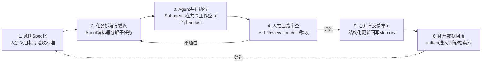

AI Native 对"价值创造基本单位"的重塑，可以用一句话锚定：

> **从"人+岗位"转向"人+Agent的任务闭环（task loop）"** —— 人不再作为价值生产的执行节点，而是作为闭环的设计者与验收者；
> 
> 执行动作被分解为可派发、可追溯、可回滚的 Token 化任务，由 Agent 在共享工作空间里完成。

Anthropic 官方在《Building effective human-agent teams》中把这种转变描述为"从单机模式到多人联机模式"：

> 过去是一个人对一个聊天框，现在是一群人和一群 Agent 共享同一个工作空间、共享上下文、共享目标。

GitHub Spec Kit 的提法更彻底:

> 规范成为"主创物（lingua franca）"，代码只是它在某种语言框架下的表达。

## 一、价值创造基本单位的演化

| 维度 | 传统组织 | AI+组织 | AI Native组织 |
|---|---|---|---|
| 基本生产单位 | 人+岗位 | 人+AI工具（辅助） | 人+Agent的任务闭环 |
| 价值产出形态 | 岗位产出（文档/代码/决策） | 增强后的岗位产出 | 可验证的结构化artifact（spec/task/diff/验收） |
| 协调方式 | 流程+会议+层级审批 | 工具叠加+人工串联 | Agent原生编排（Orchestrator-Worker） |
| 边际成本 | 人时成本 | 人时+Token | Token成本主导，人时仅用于判断 |
| 知识沉淀 | 个人经验/文档库 | 个人prompt库 | 团队级共享记忆+可复用技能 |
| 角色定义 | 职能岗位（产品/研发/运营） | 岗位+AI副驾驶 | 角色=（人×Agent×看板契约）的组合 |

这张表的底层逻辑是：

> 传统组织里"岗位"是价值创造的最小不可分单位——一个人对一个职能负责，产出对应该职能的交付物。

AI Native 组织把"岗位"解构了：

> **人贡献目标、判断与品味；**
>
> **Agent贡献执行、检索、生成；**
>
> **二者通过一个可验证的"任务闭环"耦合，产出结构化artifact**。

Anthropic 的编排-工作者（Orchestrator-Worker）架构就是这种闭环的工程化样本：

> 一个 LeadResearcher（编排者）拆解任务，多个 Subagents（工作者）并行执行，Memory（记忆）持久化整体计划，CitationAgent（引用Agent）做事后合规校验——这相当于在代码里复刻了一套现代公司管理体系。

## 二、AI Native工作流程

这套流程不是抽象模型，而是已经在Anthropic、GitHub、阿里QoderWork、Auto-Coder等团队跑通的真实工作流。下面把六个阶段逐个拆开。

### 步骤1：意图Spec化——人定义"做什么"与"做完什么样"

这是 AI Native 工作流与传统工作流最大的分水岭。

**人不再直接产出代码/文档/方案，而是先产出一份可被Review的规范（Spec）**。

袋鼠云数栈团队总结的 Spec-First 工作流把这步定义为：

>"做需求前，先让AI输出一份可被人工 review 的实现方案，人工确认后再让它按方案写代码"。

GitHub Spec Kit 把这一步进一步拆成两个子命令：

>`/speckit.constitution`建立项目治理原则，`/speckit.specify`描述要构建什么——"专注于做什么和为什么，而不是技术栈"。

Kiro 的规范驱动开发把这步强调到极致：

>传统AI编程是"模糊想法→AI生成代码→人工Debug→反复修改"，
>
>规范驱动是"清晰需求→AI生成规范→**人工确认**→AI生成设计→**人工确认**→AI拆分任务→**人工确认**→AI按计划编码"——每一步都有人工确认作为"缰绳"。

这一步的本质是：**人的认知精力从"怎么做"全部转移到"要什么、做成什么样算成功"**。

### 步骤2：任务拆解与委派——Agent编排器分解子任务

Spec 确认后，由编排 Agent（Orchestrator）把目标拆解为可并行的子任务，派发给工作者 Agent。

Anthropic 的多智能体架构里，LeadResearcher 负责拆解任务、制定计划，并把子任务分配给多个并行 Subagents，每个子Agent带着明确KPI去执行。

GitHub Spec Kit 对应的是`/speckit.plan`（技术实施计划）和`/speckit.tasks`（任务分解）两步。

Anthropic 在长程任务实践中发现，这一步必须解决"上下文窗口耗尽"问题——他们用双 Agent 架构（初始化 Agent +编码 Agent）让 Agent 跨会话保持进度：

- 初始化 Agent 生成功能列表（所有功能标记为failing）、进度文件、Git 提交；

- 后续每个编码Agent会话都读取这些结构化状态文件再增量推进。
- "文件即状态"架构把这一原则推向极致——用5个文件实现多步任务的稳定执行、断点续跑、幂等重试。

### 步骤3：Agent并行执行——在共享工作空间产出artifact

这是价值创造真正发生的环节。

Auto-Coder 的协作矩阵展示了这一步的组织形态：

- 业务负责人一句中文提需求 → 看板自动建卡 → Code Agent/Data Agent自动接活；
- 运营挂分析卡 → Data Agent自动跑SQL、出报告、回写卡片；
- 研发 Review Code Agent 的 commit→Agent 自校验+人审待审查列。

每个 Agent 有自己的凭证（credentials）、活在团队协作工具里、读取团队级而非个人级上下文——这是 Anthropic 定义的"multiplayer agent"。

APUS 的实践数据可作为这一步产出规模的参照：

新增代码中 AI 生成占比 91%，整体 AI 代码占比超 70%，实现" 1 周开发 1 款市场热门产品"。

Anthropic 内部则跑着上百个 Agent 在"自我改进循环"中持续运转，每一轮运行的反馈修正下一轮行为。

### 步骤4：人在回路审查——人工 Review spec/diff/ 验收

这一步是"人"作为价值创造者的核心存在场。

微软研究数据显示，超过 400 行 diff 后人类 reviewer 缺陷发现率断崖式下降——AI Code Review 的价值正在于此：

AI 同时"看到"整个变更集而非碎片化 diff，擅长发现空安全隐患、资源泄漏、线程安全、跨文件状态不一致等人类肉眼难追踪的 bug。

但 AI Review 不是替代人工，而是给人工减负：AI过滤掉40%的命名格式问题和25%的"建议换写法"争论，让人把注意力预算留给真正有价值的逻辑缺陷和架构讨论。

Spec-First 工作流把这步称为"验收 review"：

AI review +人工 review 双轨。Auto-Coder 的看板契约里，每张卡都带"角色+验收标准+共享实例+执行方式+判定理由"，人只看结果与差异，通过则进入"已完成"。

**这一步把"人的判断"从执行过程中抽离出来，集中到决策点上——人不再全程参与，而是在关键节点做是非题**。

### 步骤5：合并与反馈学习——结构化更新回写Memory

通过审查的 artifact 合并入主线，同时结构化更新回写 Memory。

Anthropic 的长程 Agent 方案要求每个编码Agent会话结束时"留下结构化更新"——进度文件、Git 历史、功能标记从 failing 改为passing。

这套机制让下一个 Agent 会话能迅速理解工作状态，相当于组织的"集体记忆"在自动沉淀。

传神公司的"能量金"制度是这一步的组织化版本：

每个 AI 应用被同事真实使用就积攒"能量金"，形成"越用越好→越好越用"的正向增强闭环。

Anthropic 收购 Humanloop 团队，核心目的也是强化这一步——Humanloop 专注于提示管理、LLM 评估、可观测性，让"反馈学习"从手工操作变成工程化系统。

### 步骤6：闭环数据回流——artifact进入训练/检索池

这是 AI Native 组织区别于" AI +组织"的关键。

**传统组织的产出是一次性的（代码写完就完了），AI Native 组织的产出是复利性的（每次产出都让下一次更便宜）**。

百雀智能的外贸获客系统把这一步做成了工业级闭环：

> 所有交互结果回流到模型中，持续优化匹配精度和触达策略，"越用越准"。

阿里云高飞的判断是"数据从副产品变成了核心生产力，从附加结果变成了数字员工的经验"——企业积累的数据量和被打通的程度，决定AI能走多深。

## 三、价值创造基本单位被重塑的深层逻辑

把六个步骤合起来看，"价值创造基本单位"的重塑其实发生了三重解构：

**第一重：岗位被解构为"角色×Agent×看板契约"的组合**。

Auto-Coder 的协作矩阵里，"业务负责人"不再是固定岗位，而是"人 + Code Agent+Data Agent +看板契约"的一种组合；

同一个人在不同任务里可以是需求发起者、也可以是 reviewer。

组织架构图被"信息流图"取代——YC 合伙人 Diana Hu 的要求是画哪些数据从哪里来、流向哪个 Agent、输出什么结论、反馈到哪个决策节点。

**第二重：交付物被解构为"可验证的结构化 artifact"**。

传统交付物是"一份 PRD ""一个功能""一篇报告"，边界模糊、质量难量化。

AI Native 交付物是spec/task/diff/验收标准的组合，每一步都可被Review、可回滚、可复用。

GitHub Spec Kit的提法是"规范成为主创物，代码只是它的表达"。

阿里QoderWork的"设计即代码"让设计师与研发从第一步起操作同一份可运行文件，设计产物直接进入研发环节。

**第三重：组织能力被解构为"可调度的智能密度"**。

Notion 创始人 Ivan Zhao 提出的 "Infinite Minds（无限心智）"概念点明了这一点：

当 AI 把心智变成可调度资源，人数就不再是规模的必要条件，"就像钢铁之于摩天大楼，靠密度不靠体积"。

Neo-labs 模式的判定标准是"日常工作流中 ≥80% 经过 Agent 编排、核心团队 1-7 人、研究占 30-50% 时间"——2 人团队月技术支出90美元就能跑出 20-50 人产出。

所以回到您的问题：

>AI Native公司的"工作基本单元"不是岗位、不是项目、不是Sprint，而是**一个由人发起、Agent执行、人验收、数据回流的任务闭环**

这个闭环本身就是价值创造的最小不可分单位——人贡献目标和判断，Agent贡献执行和生成，二者通过可验证的 artifact 耦合，每一次闭环都让下一次闭环更便宜。

这才是"重塑价值创造基本单位"的真正含义：不是换了种工具，而是换了价值创造的最小粒子。
