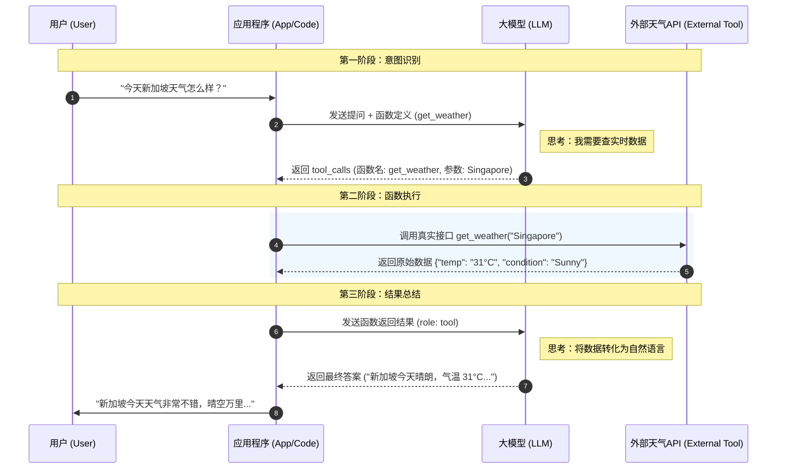
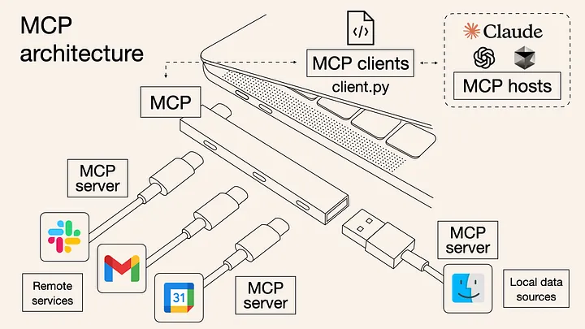

## 一、Function Call是什么

Function Call（函数调用）是 AI 大模型的一种重要能力，它允许模型在生成响应时主动调用预定义的外部函数或 API，以获取实时数据、执行特定操作，或解决需要外部信息的问题。

简单来说，Function Call 就像是给 AI 模型安装了一套工具箱，模型可以根据用户的需求，选择合适的工具来完成任务。

在传统的 AI 对话模式中，大模型只能基于其训练数据生成静态响应，这种方式存在明显的局限性——模型无法获取实时信息，也无法执行具体的操作。

而 Function Call 的出现，彻底改变了这一局面，它赋予了大模型行动的能力，使其能够与外部系统进行交互，获取最新的数据，执行具体的业务操作，从而大大扩展了 AI 的应用范围和实用性。

## 二、Function Call的作用

Function Call 的核心价值在于打破了大语言模型自身"信息孤岛"的特性。在传统的 AI 对话模式中，大模型只能基于其训练数据生成已存在的回答，模型无法获取实时信息，也无法执行具体的操作，而 Function Call 使其能够与外部系统进行交互，获取最新的数据。

它的主要作用如下：

**实时信息获取能力**

传统的 AI 模型受限于训练数据的时效性，无法提供股票价格、天气预报、新闻资讯等实时信息。通过 Function Call，模型可以实时调用天气 API 获取当前天气状况，查询股票交易所的实时数据，或者获取最新的新闻头条。

这种能力对于需要高度时效性的应用场景尤为重要，比如金融交易系统、实时监控系统或者需要最新资讯的新闻聚合平台。

**外部系统集成能力**

使得 AI 能够与现有业务系统进行无缝对接。企业现有的 CRM、ERP、数据库等系统都可以通过 Function Call 与 AI 进行集成，AI 可以读取和写入这些系统的数据，执行特定的业务操作。

比如，AI 可以帮助用户查询数据库中的客户信息、更新订单状态、或者触发特定的工作流程。这种集成能力使得AI不再是孤立存在的技术，而是成为企业数字化运营的重要组成部分。

**复杂任务自动化能力**

AI 可以通过组合多个函数调用来完成复杂的业务任务。比如，一个日程管理应用可以通过调用多个函数来完成"安排会议"这一复杂任务：先查询参与者的空闲时间，再调用日历 API 创建会议，最后发送邀请邮件。

这种任务自动化能力大大提升了工作效率，减少了人工操作的需要。

**个性化服务能力**

AI 可以通过调用用户偏好设置、历史行为数据等函数，为用户提供更加个性化的服务。

比如，根据用户的观看历史推荐电影、根据用户的位置提供个性化的餐厅推荐、或者根据用户的购物习惯提供个性化的商品建议。这种个性化能力显著提升了用户体验和满意度。

## 三、与LLM大模型交互的步骤与过程

### 步骤分析

比如：用户向大模型查询今天新加坡的天气怎么样？

这个查询与LLM大模型交互的步骤和过程分析，一共分为 5 个大的步骤：

**第一步**：定义与输入

首先，开发者需要在代码中预先定义好一个或多个工具（Functions），告诉模型：“我这有一个函数叫 `get_weather`，它需要一个参数 `location`。”

 用户发起请求： “帮我查询今天新加坡的天气。” 然后将用户的对话内容和函数定义列表一起发送给大模型。


**第二步**：模型判断与输出指令

大模型接收到信息后，并不会直接去爬网页，它会进行逻辑判断：

- 判断：用户的问题涉及实时信息，我现有的知识库（截止日期前）无法回答，但我发现开发者提供了一个 `get_weather` 工具。
- 输出：模型会返回一个特殊的信号（通常是 JSON 格式），表示它想调用函数。
  - 意图： `call: get_weather`
  - 参数： `{"location": "Singapore"}`


**第三步**：外部执行

大模型本身并不运行代码。后端应用程序接收到大模型发出的指令后，会代为执行：

- 程序解析出 `location="Singapore"`。
- 程序调用真实的第三方天气 API（如 OpenWeatherMap）。
- API 返回结果：`{"temp": "31°C", "condition": "Sunny"}`。


**第四步**：结果反馈

程序将 API 返回的原始数据再发送回给大模型。此时发送给模型的消息流包含：

1. 用户最初的问题。
2. 模型之前的调用指令。
3. 函数的执行结果。


**第五步**：最终总结

模型拿到结果后，再次进行理解和翻译，将冷冰冰的数据转化成自然语言。

- 模型输出： “今天新加坡的天气晴朗，气温大约在 **31°C** 左右，非常适合出门，但记得防暑哦！”

### 交互时序图

交互过程也可以分为大的**三个阶段**：

- 第一阶段：意图识别
- 第二阶段：函数执行
- 第三阶段：结果总结

下图是用户、应用程序、大模型LLM、外部天气API交互时序图：



### 代码模拟示例

在这个例子中，会模拟一个查询天气的 API

```python
import json

# 1. 模拟一个外部工具：真实获取天气的函数
def get_weather(location):
    """实际执行查询的函数（通常这里会去调用第三方 API）"""
    if "singapore" in location.lower():
        return json.dumps({"location": "Singapore", "temperature": "31°C", "condition": "Sunny"})
    else:
        return json.dumps({"location": location, "temperature": "unknown"})

def run_conversation():
    # 模拟用户的问题
    user_prompt = "帮我查查今天新加坡的天气怎么样？"
    
    # 2. 定义给大模型的“工具描述”（Function Definition）
    tools = [
        {
            "type": "function",
            "function": {
                "name": "get_weather",
                "description": "获取指定城市当前的天气情况",
                "parameters": {
                    "type": "object",
                    "properties": {
                        "location": {
                            "type": "string",
                            "description": "城市名称，例如：Singapore",
                        }
                    },
                    "required": ["location"],
                },
            },
        }
    ]

    # --- 步骤 A: 第一次调用大模型 ---
    # 我们把问题和工具定义一起发给模型
    print(f"发送请求给大模型: {user_prompt}")
    
    # 模拟模型返回 (这里假设使用的是 client.chat.completions.create)
    # 模型并不会直接回答天气，而是返回 tool_calls
    response_message = {
        "role": "assistant",
        "tool_calls": [
            {
                "id": "call_123",
                "type": "function",
                "function": {"name": "get_weather", "arguments": '{"location": "Singapore"}'}
            }
        ]
    }

    # --- 步骤 B: 检查模型是否要求调用函数 ---
    tool_calls = response_message.get("tool_calls")
    if tool_calls:
        print("模型判断：需要调用函数 get_weather")
        
        # 建立对话上下文（包含之前的对话和模型的调用请求）
        messages = [
            {"role": "user", "content": user_prompt},
            response_message
        ]

        # --- 步骤 C: 在本地执行函数 ---
        for tool_call in tool_calls:
            function_name = tool_call["function"]["name"]
            function_args = json.loads(tool_call["function"]["arguments"])
            
            # 真实运行 Python 代码
            function_response = get_weather(location=function_args.get("location"))
            print(f"本地函数返回数据: {function_response}")

            # 把函数结果放入对话记录
            messages.append({
                "tool_call_id": tool_call["id"],
                "role": "tool",
                "name": function_name,
                "content": function_response,
            })

        # --- 步骤 D: 第二次调用大模型 (把数据喂回给它) ---
        print("将数据发回模型，等待最终总结...")
        
        # 此时模型拿到数据，会输出：“新加坡今天晴朗，31度。”
        final_response = "新加坡今天天气非常不错，晴空万里，气温在 31°C 左右，适合出行。"
        
        print(f"\n最终 AI 回复: {final_response}")

run_conversation()
```

## 四、天气Function Call完整代码

要实现一个 DeepSeek Function Calling 的功能，首先将代码拆解为：工具定义层**、**API 调用层和核心逻辑驱动层。

DeepSeek 的 API 与 OpenAI 完全兼容，因此使用 `openai` 的 SDK 即可。

```python
import json
from openai import OpenAI

# ==========================================
# 模块 1: 外部工具定义 (Tools)

# 这里模拟一个真实的天气 API 接口
# ==========================================
def fetch_weather_data(location: str):
    """
    实际执行天气查询的函数。
    在真实场景中，你会在这里使用 requests 访问 OpenWeatherMap 或和风天气 API。
    """
    # 模拟 API 返回的结构化数据
    weather_database = {
        "singapore": {"temp": "31°C", "condition": "多云转晴", "humidity": "80%"},
        "beijing": {"temp": "15°C", "condition": "晴朗", "humidity": "20%"},
        "london": {"temp": "10°C", "condition": "小雨", "humidity": "90%"},
    }
    
    city = location.lower()
    # 简单处理：如果库里有就返回，没有就返回未知
    data = weather_database.get(city, {"temp": "未知", "condition": "未知", "humidity": "未知"})
    return json.dumps(data, ensure_ascii=False)

# ==========================================
# 模块 2: 函数配置描述 (Tool Specification)

# 告诉 DeepSeek 模型这个函数叫什么，怎么用
# ==========================================
TOOLS = [
    {
        "type": "function",
        "function": {
            "name": "get_weather",
            "description": "获取指定城市的当前天气信息",
            "parameters": {
                "type": "object",
                "properties": {
                    "location": {
                        "type": "string",
                        "description": "城市名称，例如：Singapore, Beijing",
                    }
                },
                "required": ["location"],
            },
        },
    }
]

# ==========================================
# 模块 3: 核心逻辑驱动层
# ==========================================
class WeatherAssistant:
    def __init__(self, api_key: str, base_url: str = "https://api.deepseek.com"):
        self.client = OpenAI(api_key=api_key, base_url=base_url)
        self.model = "deepseek-chat" # 或者使用 deepseek-reasoner

    def chat(self, user_input: str):
        # 初始化消息列表
        messages = [{"role": "user", "content": user_input}]

        # --- 第一轮交互：向大模型发送问题和工具定义 (1)---
        print(f"DEBUG: 正在询问 DeepSeek 意图...")
        first_response = self.client.chat.completions.create(
            model=self.model,
            messages=messages,
            tools=TOOLS,
            tool_choice="auto"  # 自动决定是否调用工具
        )
        
        assistant_message = first_response.choices[0].message
        # 把模型的回复（含 tool_calls）加入上下文 (2)
        messages.append(assistant_message) 

        # --- 第二轮交互：触发 Function Calling (3)---
        if assistant_message.tool_calls:
            print(f"DEBUG: 模型决定调用工具: {len(assistant_message.tool_calls)} 个")
            
            for tool_call in assistant_message.tool_calls:
                # 解析函数名和参数
                func_name = tool_call.function.name
                func_args = json.loads(tool_call.function.arguments)
                
                if func_name == "get_weather":
                    # 执行本地 fetch_weather_data 函数 (4)
                    print(f"DEBUG: 正在执行本地函数 {func_name}，参数: {func_args}")
                    observation = fetch_weather_data(location=func_args.get("location"))
                    
                    # 将执行结果反馈给模型 (5)
                    messages.append({
                        "tool_call_id": tool_call.id,
                        "role": "tool",
                        "name": func_name,
                        "content": observation,
                    })
            
            # --- 第三轮交互：模型根据fetch_weather_data函数结果生成最终人类语言回复 (6)---
            final_response = self.client.chat.completions.create(
                model=self.model,
                messages=messages
            )
            return final_response.choices[0].message.content
        
        else:
            # 如果模型觉得不需要调工具，直接返回内容
            return assistant_message.content

# ==========================================
# 模块 4: 入口执行 (Main)
# ==========================================
if __name__ == "__main__":
    # 请替换为你真实的 DeepSeek API Key
    YOUR_DEEPSEEK_API_KEY = "sk-xxxxxxxxxxxx"
    
    bot = WeatherAssistant(api_key=YOUR_DEEPSEEK_API_KEY)
    
    # 模拟对话
    question = "帮我看看新加坡现在的天气，顺便告诉我建议穿什么衣服？"
    print(f"用户: {question}\n")
    
    result = bot.chat(question)
    print(f"\nAI 回复: {result}")
```

## 五、与MCP的区别

### 介绍

简单来说：**Function Call 是一项技术手段，而 MCP 是一套通用标准。**

如果把 Function Call 比作每一家电器都要自备一套专用的插头（你需要为每个 API 写专门的适配代码），那么 MCP 就是 AI 界的“USB 接口标准”，它像一个通用插座。



Function Call 是 AI 大模型本身内置的一种机制，它是模型能力的一部分，直接集成在模型的推理过程中。当模型判断需要获取外部信息或执行特定操作时，会主动调用预定义的函数。

MCP（Model Context Protocol）则是一种专门设计的通信协议，它不是为了实现函数调用本身，而是为了解决 AI 模型与外部数据源和工具之间的连接问题。MCP 定义了一套标准化的通信规范，使得AI系统能够以一种统一的方式与各种外部系统进行交互。

### 对比

Function Call vs. MCP 对比表：

| **特性**     | **Function Call (传统方式)**                         | **MCP (Model Context Protocol)**                             |
| ------------ | ---------------------------------------------------- | ------------------------------------------------------------ |
| **本质定义** | 一种 LLM 输出结构化指令的 交互机制。                 | 一套连接 AI 模型与本地/远程数据的 开放协议。                 |
| **耦合度**   | 高耦合。你需要为每个模型手动编写工具定义和调用逻辑。 | 低耦合。模型通过 MCP 客户端直接访问标准化的 MCP 服务器。     |
| **复用性**   | 差。换一个模型或平台，往往需要重新重写适配代码。     | 强。写好一个 MCP 服务器（如 GitHub MCP），任何支持该协议的 AI（Claude, Cursor, IDE 等）都能直接用。 |
| **处理主体** | 开发者在 App 代码中手动“转接”数据。                  | MCP Server 直接提供数据，App 仅作为传输通道。                |
| **功能范围** | 仅限 **Tools**（函数执行）。                         | 包含 **Tools** (函数)、**Resources** (文件/数据库读写)、**Prompts** (提示词模板)。 |
| **典型场景** | 简单的、单一业务的 API 调用（如查个天气）。          | 复杂的、需要跨工具协作的生态（如让 AI 同时访问本地文件、Slack 和数据库）。 |

在当前的 AI 开发中：

- 如果你只是做一个简单的、特定功能的小插件，用 Function Call 依然是最快、最轻量的方式。
- 如果你是在构建一个复杂的 AI Agent 或者是企业级工作流，接入 MCP 是大势所趋，因为它可以让你免于编写重复的 API 胶水代码，直接复用社区现成的服务器。

