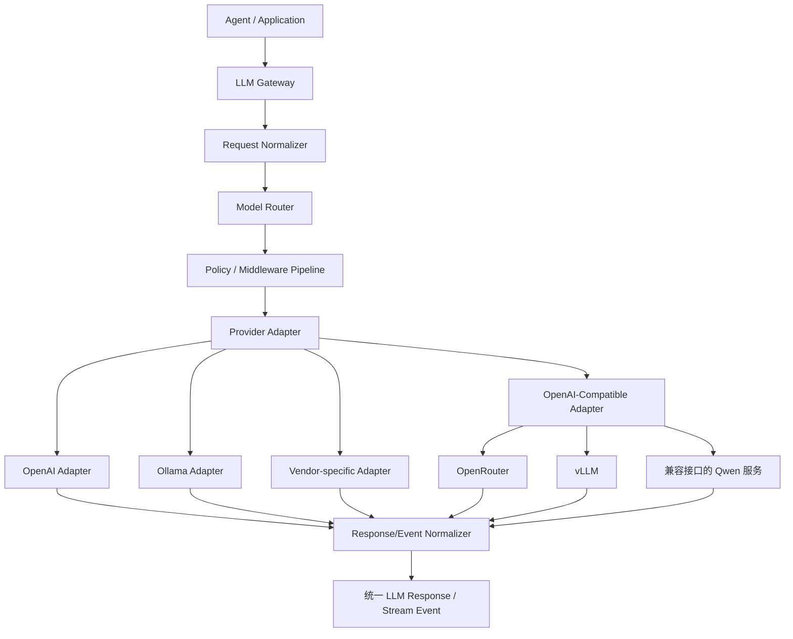
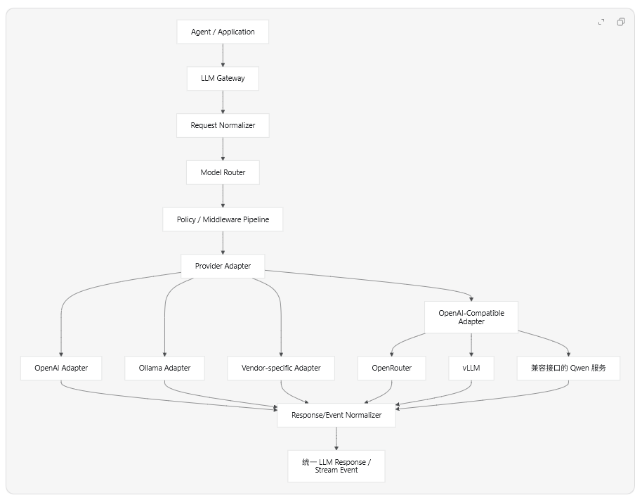
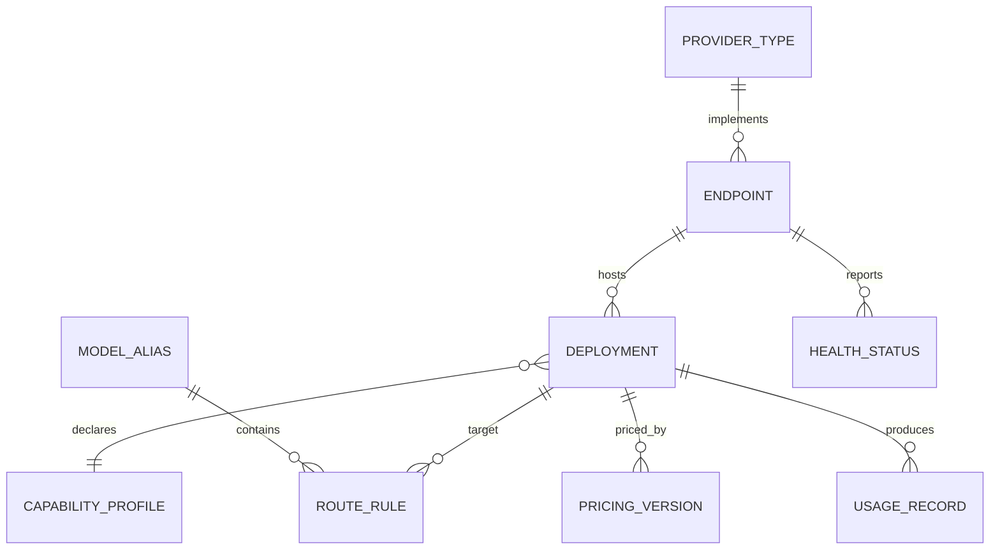

## 前言

核心建议：

> 不要围绕厂商设计 LLM Provider，而要围绕“统一语义、模型能力、协议适配、运行策略”设计。

OpenAI、OpenRouter、Ollama、Qwen、vLLM 并不处在同一个抽象层：

- OpenAI、OpenRouter：云端服务提供商
- Ollama、vLLM：本地或私有化推理服务
- Qwen：模型家族，既可能部署在 DashScope，也可能运行在 Ollama、vLLM、OpenRouter
- OpenAI-compatible：通信协议，不代表行为和能力完全一致

因此不要写成：

```
provider = openai | qwen | ollama | vllm
```

更合适的模型是：

```
Provider（服务商）
    → Endpoint（调用端点/凭证）
        → Deployment（部署实例）
            → Model（逻辑模型）
                → Capability（模型能力）
```

------

# 一、推荐的整体架构

````

````



可以分成六层：

```
1. Application API       业务和 Agent 使用的统一接口
2. Model Registry        模型、能力、部署实例和别名
3. Router                选择实际模型和端点
4. Middleware            重试、限流、日志、预算、缓存
5. Provider Adapter      协议与厂商差异适配
6. Transport             HTTP、SSE、WebSocket、进程调用
```

------

# 二、业务层只能依赖统一 LLM 接口

Agent 不应该知道自己调用的是 OpenAI 还是 Ollama：

```typescript
// ts 代码
interface LLMClient {
  generate(request: LLMRequest): Promise<LLMResponse>;

  stream(request: LLMRequest): AsyncIterable<LLMStreamEvent>;

  embed?(request: EmbeddingRequest): Promise<EmbeddingResponse>;

  listModels?(): Promise<DiscoveredModel[]>;
}
```

统一请求：

```typescript
// ts 代码
interface LLMRequest {
  model: ModelSelector;

  messages: LLMMessage[];

  system?: string;
  tools?: ToolDefinition[];
  toolChoice?: ToolChoice;

  responseFormat?: ResponseFormat;

  generation?: {
    temperature?: number;
    topP?: number;
    maxOutputTokens?: number;
    stop?: string[];
    seed?: number;
    frequencyPenalty?: number;
    presencePenalty?: number;
  };

  reasoning?: {
    effort?: "low" | "medium" | "high";
    maxTokens?: number;
  };

  metadata?: {
    requestId?: string;
    traceId?: string;
    userId?: string;
    tenantId?: string;
    agentId?: string;
    scenario?: string;
  };
}
```

统一响应：

```typescript
interface LLMResponse {
  id: string;
  model: string;
  deploymentId: string;
  providerId: string;

  content: ContentPart[];
  finishReason:
    | "stop"
    | "length"
    | "tool_call"
    | "content_filter"
    | "error"
    | "unknown";

  toolCalls?: ToolCall[];

  usage: {
    inputTokens?: number;
    outputTokens?: number;
    reasoningTokens?: number;
    cachedInputTokens?: number;
    totalTokens?: number;
    estimated: boolean;
  };

  latency: {
    totalMs: number;
    firstTokenMs?: number;
  };

  providerMetadata?: Record<string, unknown>;
}
```

统一流式事件：

```
type LLMStreamEvent =
  | { type: "response.started"; responseId: string }
  | { type: "text.delta"; delta: string }
  | { type: "reasoning.delta"; delta: string }
  | { type: "tool_call.started"; id: string; name: string }
  | { type: "tool_call.arguments.delta"; id: string; delta: string }
  | { type: "tool_call.completed"; call: ToolCall }
  | { type: "usage.updated"; usage: TokenUsage }
  | { type: "response.completed"; response: LLMResponse }
  | { type: "response.failed"; error: LLMError };
```

流式接口尤其需要标准化。否则不同 SDK 的 chunk 格式会一路泄漏到 Agent 代码中。

------

# 三、Provider Adapter 只处理协议差异

Adapter 负责：

- 请求字段映射
- 消息格式转换
- Tool Calling 转换
- Structured Output 转换
- SSE/流式事件解析
- Usage 数据转换
- Finish reason 转换
- 错误转换
- 厂商特有参数透传

Adapter 不应该负责：

- 业务模型选择
- 租户权限
- 预算控制
- Prompt 组装
- 多模型路由
- 全局重试策略
- 业务降级决策

接口可以这样设计：

```
interface ProviderAdapter {
  readonly adapterType: string;

  validateEndpoint(config: EndpointConfig): ValidationResult;

  discoverModels?(
    endpoint: ResolvedEndpoint,
  ): Promise<DiscoveredModel[]>;

  generate(
    context: ProviderCallContext,
    request: NormalizedLLMRequest,
  ): Promise<NormalizedLLMResponse>;

  stream(
    context: ProviderCallContext,
    request: NormalizedLLMRequest,
  ): AsyncIterable<LLMStreamEvent>;

  healthCheck(
    endpoint: ResolvedEndpoint,
  ): Promise<HealthCheckResult>;
}
```

建议优先提供这些 Adapter：

```
openai
openai-compatible
ollama
anthropic（如果需要）
google（如果需要）
```

OpenRouter、vLLM、部分 Qwen 服务可以复用 `openai-compatible`，通过兼容性配置处理差异。

但不要假设所有 OpenAI-compatible 服务都完全相同。至少要支持 compatibility profile：

```
interface CompatibilityProfile {
  chatEndpoint: string;
  modelsEndpoint?: string;

  supportsResponsesAPI: boolean;
  supportsChatCompletions: boolean;
  supportsStreamingUsage: boolean;
  supportsDeveloperRole: boolean;
  supportsToolChoiceRequired: boolean;
  supportsParallelToolCalls: boolean;
  supportsJsonSchema: boolean;

  maxTokensField:
    | "max_tokens"
    | "max_completion_tokens"
    | "max_output_tokens";

  toolCallIdRequired: boolean;
  usageAvailableInStream: boolean;
}
```

------

# 四、模型能力不能通过厂商名称推断

错误做法：

```
if (provider === "openai") {
  enableTools();
}
```

同一 Provider 下，不同模型能力不同；同一个模型在不同推理后端上的能力也可能不同。

正确做法是能力声明：

```
interface ModelCapabilities {
  modalities: {
    input: Array<"text" | "image" | "audio" | "video">;
    output: Array<"text" | "image" | "audio">;
  };

  tools: {
    supported: boolean;
    parallelCalls: boolean;
    forcedChoice: boolean;
  };

  structuredOutput: {
    jsonObject: boolean;
    jsonSchema: boolean;
    strictSchema: boolean;
  };

  reasoning: {
    supported: boolean;
    configurableEffort: boolean;
  };

  streaming: boolean;
  embeddings: boolean;

  limits: {
    contextWindow?: number;
    maxInputTokens?: number;
    maxOutputTokens?: number;
    maxImages?: number;
  };
}
```

调用前执行能力协商：

```
const requirements = inferRequirements(request);

const deployment = registry.resolve({
  alias: request.model,
  requiredCapabilities: requirements,
});
```

如果请求用了严格 JSON Schema，但模型不支持，应当在调用前报错或路由到兼容模型，而不是发出请求后等待厂商返回模糊错误。

------

# 五、区分逻辑模型和物理部署

业务代码最好引用逻辑别名：

```
model: {
  alias: "agent-reasoning"
}
```

不要直接写：

```
model: "qwen3-32b"
baseURL: "http://10.0.0.12:8000/v1"
```

后台通过路由绑定：

```
agent-reasoning
├── primary: openai-prod / model-A
├── fallback-1: openrouter-prod / model-B
└── fallback-2: vllm-cluster / qwen3-32b
```

建议建立四个核心实体。

## Provider Type

表示适配器类型，而不是具体账号：

```
{
  "id": "openai-compatible",
  "adapterType": "openai-compatible"
}
```

## Endpoint

表示一个可调用服务：

```
{
  "id": "vllm-prod-a",
  "adapterType": "openai-compatible",
  "baseUrl": "http://vllm.internal/v1",
  "credentialRef": "secret://llm/vllm-prod-a",
  "enabled": true,
  "timeoutMs": 120000
}
```

## Deployment

表示端点中的一个实际模型部署：

```
{
  "id": "vllm-qwen3-32b",
  "endpointId": "vllm-prod-a",
  "providerModelId": "Qwen/Qwen3-32B",
  "displayName": "Qwen3 32B - vLLM A",
  "capabilityProfileId": "qwen3-32b-vllm",
  "enabled": true
}
```

## Model Alias

表示业务使用的稳定名称：

```
{
  "alias": "agent-general",
  "routes": [
    {
      "deploymentId": "openrouter-model-a",
      "priority": 100,
      "weight": 80
    },
    {
      "deploymentId": "vllm-qwen3-32b",
      "priority": 100,
      "weight": 20
    }
  ]
}
```

这样更换模型时，不需要修改 Agent 代码和 Prompt。

------

# 六、Provider 配置建议分成五组

后台配置不要提供一个任意 JSON 大文本作为唯一入口。应当按语义分组。

## 1. 连接配置

```typescript
// ts 代码
interface ConnectionConfig {
  baseUrl: string;
  credentialRef?: string;

  headers?: Record<string, SecretOrPlainValue>;
  query?: Record<string, string>;

  timeoutMs: number;
  connectTimeoutMs?: number;

  proxyUrl?: string;
  tlsVerify?: boolean;
}
```

## 2. 模型能力配置

```typescript
// ts 代码
interface DeploymentConfig {
  providerModelId: string;
  capabilities: ModelCapabilities;
  tokenizer?: string;
}
```

## 3. 默认生成参数

```typescript
// ts 代码
interface GenerationDefaults {
  temperature?: number;
  topP?: number;
  maxOutputTokens?: number;
  stop?: string[];
  reasoningEffort?: "low" | "medium" | "high";
}
```

这些只是默认值，最终值通常按以下优先级合并：

```
平台默认值
  < Endpoint 默认值
  < Deployment 默认值
  < Agent/场景默认值
  < 本次请求参数
```

同时要支持参数锁定：

```
{
  "temperature": {
    "default": 0.2,
    "min": 0,
    "max": 1,
    "locked": false
  },
  "maxOutputTokens": {
    "default": 4096,
    "max": 8192,
    "locked": true
  }
}
```

## 4. 运行策略

```typescript
interface RuntimePolicy {
  concurrencyLimit?: number;
  requestsPerMinute?: number;
  tokensPerMinute?: number;

  retry: {
    maxAttempts: number;
    initialDelayMs: number;
    maxDelayMs: number;
    retryableErrors: LLMErrorCode[];
  };

  circuitBreaker: {
    enabled: boolean;
    failureThreshold: number;
    cooldownMs: number;
  };

  healthCheck: {
    enabled: boolean;
    intervalSeconds: number;
  };
}
```

## 5. 成本配置

```typescript
interface PricingConfig {
  currency: "USD" | "CNY";
  inputPerMillionTokens?: number;
  cachedInputPerMillionTokens?: number;
  outputPerMillionTokens?: number;
  reasoningPerMillionTokens?: number;

  effectiveFrom: string;
}
```

价格应当版本化，因为历史账单必须按当时价格计算。

------

# 七、后台数据库设计

可以使用以下核心表：

```
llm_provider_types
llm_endpoints
llm_credentials
llm_deployments
llm_capability_profiles
llm_model_aliases
llm_route_rules
llm_generation_profiles
llm_pricing_versions
llm_config_versions
llm_health_status
llm_usage_records
llm_audit_logs
```

关键关系：

````

````

配置记录推荐包括：

```typescript
// ts 代码
interface ConfigMetadata {
  id: string;
  version: number;
  status: "draft" | "active" | "archived";

  createdBy: string;
  createdAt: string;
  updatedBy: string;
  updatedAt: string;

  changeReason?: string;
}
```

不要直接覆盖线上配置。推荐流程：

```
编辑草稿
  → Schema 校验
  → 连接测试
  → 能力探测
  → 测试调用
  → 发布新版本
  → 灰度生效
  → 必要时回滚
```

------

# 八、密钥管理

数据库里不要保存明文 API Key，也不要把密钥返回给管理后台。

数据库仅保存引用：

```
{
  "credentialRef": "vault://production/openai/account-a"
}
```

运行时流程：

```
读取 Endpoint 配置
  → 使用 credentialRef 获取密钥
  → 在内存中构造请求
  → 日志脱敏
  → 调用完成后丢弃
```

最低要求：

- 数据库密文存储
- 单独的主密钥或 KMS
- API 返回永不包含密钥
- 日志屏蔽 Authorization、Cookie 和自定义密钥 Header
- 支持密钥轮换
- 记录谁修改了 credential reference
- 测试连接时不回显请求头
- 前端只显示 `已配置` 和密钥尾部少量字符

------

# 九、路由器怎么设计

Router 的输入不只是模型名称，而应该包含需求和约束：

```
interface RouteRequest {
  modelAlias: string;

  requiredCapabilities: Partial<ModelCapabilities>;

  constraints?: {
    allowedProviders?: string[];
    deniedProviders?: string[];

    region?: string;
    dataResidency?: string;
    maxCostPerRequest?: number;
    maxLatencyMs?: number;

    requireLocalDeployment?: boolean;
  };

  affinity?: {
    conversationId?: string;
    tenantId?: string;
  };
}
```

路由过程：

```
1. 找到 alias 对应的候选 Deployment
2. 过滤未启用和不健康实例
3. 过滤能力不满足的实例
4. 过滤租户、区域和数据安全限制
5. 过滤超过成本上限的实例
6. 按优先级、权重、延迟和负载评分
7. 选择 Deployment
8. 保存路由决策及原因
```

评分示例：

```
score =
  availabilityScore * 0.35 +
  latencyScore      * 0.25 +
  qualityScore      * 0.20 +
  costScore         * 0.15 +
  localityScore     * 0.05;
```

但必须区分两类机制：

- 负载均衡：同等模型实例间切换
- 模型降级：切换到另一个模型，可能改变输出质量和行为

模型降级不能完全透明。响应中至少需要记录：

```
{
  "requestedModel": "agent-reasoning",
  "resolvedDeployment": "vllm-qwen3-32b",
  "fallbackUsed": true,
  "fallbackReason": "primary_rate_limited"
}
```

------

# 十、统一错误体系

不要让业务层处理各厂商的原始异常文本。

```typescript
type LLMErrorCode =
  | "authentication_failed"
  | "permission_denied"
  | "model_not_found"
  | "invalid_request"
  | "unsupported_capability"
  | "context_length_exceeded"
  | "content_filtered"
  | "rate_limited"
  | "quota_exceeded"
  | "timeout"
  | "connection_failed"
  | "provider_unavailable"
  | "stream_interrupted"
  | "invalid_provider_response"
  | "cancelled"
  | "unknown";
```

错误对象：

```
class LLMError extends Error {
  code: LLMErrorCode;
  retryable: boolean;

  providerId?: string;
  deploymentId?: string;
  providerStatusCode?: number;
  retryAfterMs?: number;

  safeDetails?: Record<string, unknown>;
  cause?: unknown;
}
```

重试策略应该基于标准错误码：

- `rate_limited`：读取 Retry-After 后重试
- `timeout`：满足幂等条件时重试
- `provider_unavailable`：重试或切换实例
- `authentication_failed`：不重试
- `invalid_request`：不重试
- `context_length_exceeded`：返回上游重新压缩上下文
- `content_filtered`：按业务策略处理，不应盲目切换模型绕过

------

# 十一、中间件管线

横切能力建议使用 Middleware，不要重复写进每个 Adapter：

```
type LLMMiddleware = (
  context: LLMCallContext,
  next: () => Promise<LLMResponse>,
) => Promise<LLMResponse>;
```

推荐顺序：

```
Request ID
→ 权限校验
→ 参数规范化
→ 模型路由
→ Token 预估
→ 预算检查
→ 限流
→ 并发控制
→ 缓存
→ 重试
→ 熔断
→ Provider 调用
→ Usage 统计
→ 成本计算
→ 日志与 Trace
→ 内容处理
```

要注意：重试、Fallback 和 Tool Calling 组合时容易重复执行。LLM 请求本身通常可重试，但模型产生的工具调用不能自动重复执行，工具执行必须有幂等键：

```
agentRunId + stepId + toolCallId
```

------

# 十二、参数标准化与厂商扩展

完全统一所有参数是不现实的。建议采用“双层参数”：

```
interface GenerationOptions {
  temperature?: number;
  maxOutputTokens?: number;

  extensions?: {
    openai?: Record<string, unknown>;
    openrouter?: Record<string, unknown>;
    ollama?: Record<string, unknown>;
    vllm?: Record<string, unknown>;
  };
}
```

但 `extensions` 必须受控：

- Adapter 声明可接受的扩展字段
- 后台根据 JSON Schema 渲染配置表单
- 未知字段默认拒绝
- 日志记录最终生效参数
- 禁止通过扩展覆盖 URL、Authorization 等安全字段

每个 Adapter 可以暴露配置描述：

```
interface AdapterDescriptor {
  type: string;
  displayName: string;

  endpointConfigSchema: JsonSchema;
  deploymentConfigSchema: JsonSchema;
  generationConfigSchema: JsonSchema;

  defaultCompatibilityProfile?: CompatibilityProfile;
}
```

后台由 Schema 动态生成表单，这样新增 Provider Adapter 时不需要硬编码整个管理页面。

------

# 十三、后台管理功能

一个实用的 LLM 管理后台至少需要这些页面。

## Provider/Endpoint 管理

- Adapter 类型
- Base URL
- 鉴权方式
- 密钥状态
- 超时和代理
- 自定义请求头
- 启用状态
- 连接测试
- 健康状态

## Deployment 管理

- 实际模型 ID
- 上下文窗口
- 最大输出长度
- Tool Calling 能力
- 多模态能力
- Structured Output 能力
- 默认参数
- 并发限制
- Token 限额
- 定价

## Model Alias 和路由

- 业务别名
- 主模型
- 候选模型
- 权重
- Fallback 条件
- 租户规则
- 场景规则
- 地域规则

## Playground

必须允许选择：

- Model alias 或实际 Deployment
- System Prompt
- Messages
- Tools
- Structured Output
- Generation 参数
- Streaming

并显示：

- 最终解析到的模型
- 原始请求与标准化请求
- 首 Token 延迟
- 总延迟
- Token 使用量
- 估算费用
- Finish reason
- 原始 Provider metadata
- 路由与 Fallback 过程

## 监控

- 请求成功率
- P50/P95/P99 延迟
- 首 Token 延迟
- Token 吞吐量
- 429 比例
- 超时比例
- 各模型费用
- 各租户费用
- Fallback 比例
- Tool Call 成功率
- 无效 JSON 比例
- 健康检查状态

------

# 十四、配置热更新

配置更新建议使用不可变快照：

```
interface LLMConfigSnapshot {
  version: string;
  providers: ProviderConfig[];
  endpoints: EndpointConfig[];
  deployments: DeploymentConfig[];
  aliases: ModelAliasConfig[];
  routes: RouteRule[];
}
```

运行节点：

```
订阅配置变更
  → 拉取新快照
  → 完整校验
  → 原子替换内存快照
  → 旧请求继续使用旧版本
  → 新请求使用新版本
```

每次调用记录：

```
{
  "configVersion": "2026-07-13.18",
  "routeRuleVersion": 7,
  "generationProfileVersion": 12
}
```

这样才能复现线上问题。

不要在一次 Agent Run 中途随意更换配置版本。最好在 Run 开始时固定：

```
Agent Run
  └── Config Snapshot Version
      ├── 第一次 LLM 调用
      ├── 工具调用
      ├── 第二次 LLM 调用
      └── 最终回答
```

------

# 十五、推荐目录结构

```
llm/
├── domain/
│   ├── request.ts
│   ├── response.ts
│   ├── events.ts
│   ├── errors.ts
│   ├── capabilities.ts
│   └── model-registry.ts
│
├── application/
│   ├── llm-service.ts
│   ├── model-router.ts
│   ├── capability-negotiator.ts
│   └── config-service.ts
│
├── adapters/
│   ├── openai/
│   ├── openai-compatible/
│   ├── ollama/
│   └── vendor-specific/
│
├── middleware/
│   ├── retry.ts
│   ├── rate-limit.ts
│   ├── circuit-breaker.ts
│   ├── cache.ts
│   ├── budget.ts
│   ├── telemetry.ts
│   └── redaction.ts
│
├── routing/
│   ├── route-resolver.ts
│   ├── health-selector.ts
│   ├── weighted-selector.ts
│   └── fallback-policy.ts
│
├── config/
│   ├── schemas/
│   ├── validator.ts
│   ├── snapshot.ts
│   └── secret-resolver.ts
│
└── observability/
    ├── usage-recorder.ts
    ├── cost-calculator.ts
    ├── trace-recorder.ts
    └── metrics.ts
```

------

# 十六、最容易踩的坑

1. 把 Qwen 同时当厂商、模型和协议，导致领域概念混乱。
2. 业务代码直接依赖 OpenAI SDK 类型，后续无法真正替换 Provider。
3. 认为 OpenAI-compatible 等于 100% 兼容。
4. 根据 Provider 名称判断模型能力。
5. 把所有厂商参数强行压成一个最低公共集。
6. 允许任意 `extraBody` 绕过配置、安全和审计。
7. Fallback 后不记录真实使用的模型。
8. 流式输出只统一文本，不统一工具调用和结束事件。
9. 将密钥、Prompt 和完整模型响应无脱敏写入日志。
10. 配置直接覆盖，没有版本、发布和回滚。
11. 重试导致工具被重复执行。
12. 将 Provider Adapter 写成包含路由、重试、计费的“万能类”。

------

# 十七、最终推荐的边界

```
Agent
  只关心：我要什么能力、完成什么任务

PromptBuilder
  只关心：给模型组装什么输入

LLM Gateway
  只关心：统一调用、策略和治理

Model Router
  只关心：这次调用落到哪个 Deployment

Provider Adapter
  只关心：统一协议如何转换成厂商协议

Transport
  只关心：请求怎么发、流怎么接收

Config Center
  只关心：配置、版本、密钥引用、发布和审计
```

一句话总结：

> 以“逻辑模型别名”隔离业务，以“能力声明”选择模型，以“Deployment”表达物理部署，以“Adapter”处理协议差异，以“Middleware”实现治理，以“版本化配置中心”管理后台配置。

这样无论后续增加 OpenAI、OpenRouter、Ollama、DashScope、vLLM，还是公司内部推理平台，变化都主要被限制在 Adapter、能力配置和 Deployment 注册层，不会扩散到 Agent 业务代码。