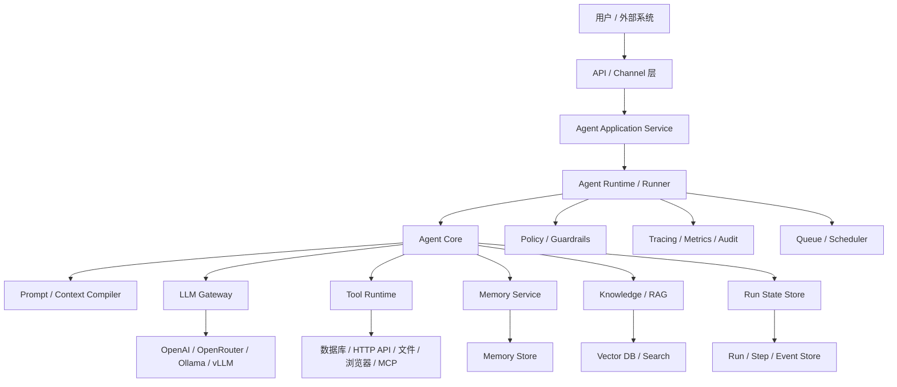
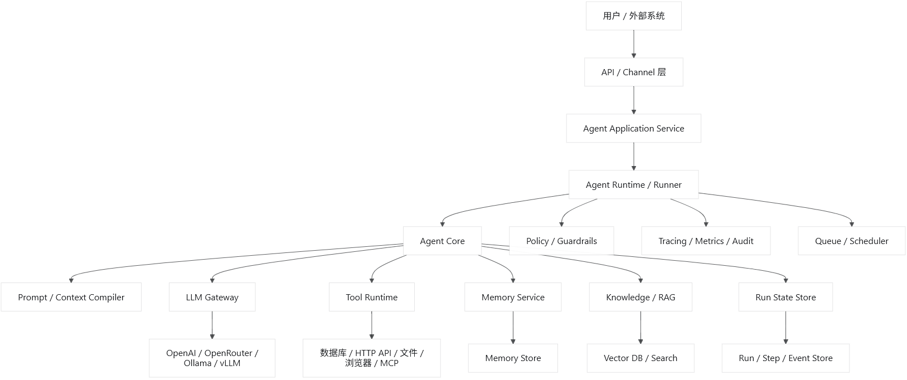
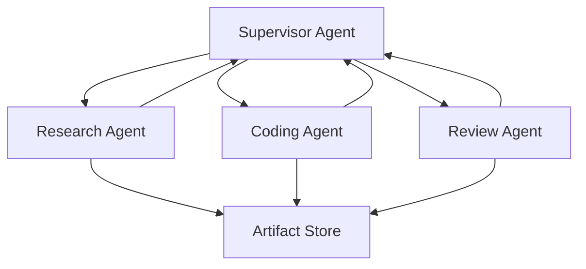

## 前言

AI Agent 应用的核心，不是“调用一次 LLM”，而是一个受约束的状态机：

```
接收目标
→ 感知当前上下文
→ 决定下一步动作
→ 执行动作
→ 观察执行结果
→ 更新状态
→ 继续决策或结束
```

因此整体架构应围绕以下五件事设计：

```
Reason：模型如何决策
Act：工具如何执行
Observe：结果如何反馈
State：运行状态如何保存
Control：循环如何受控
```

------

# 一、整体架构

````

````



推荐从外到内划分为八层：

```
1. Interface Layer         用户和外部系统入口
2. Application Layer       用例编排
3. Agent Runtime Layer     Agent 执行生命周期
4. Agent Core Layer        决策、行动、观察抽象
5. Capability Layer        Tool、Memory、RAG、Skills
6. Model Gateway Layer     大模型统一调用
7. Infrastructure Layer    数据库、队列、缓存、网络
8. Governance Layer        安全、成本、审计、可观测性
```

------

# 二、各层职责

## 1. Interface Layer：接入层

负责接收外部请求，不负责 Agent 推理。

典型组件：

- REST API
- WebSocket/SSE
- Web UI
- IM Bot
- Webhook
- CLI
- 定时任务入口

主要职责：

- 身份认证
- 请求校验
- 租户识别
- 会话识别
- 流式响应
- 协议转换

统一输入：

```typescript
// ts
interface AgentInvocation {
  agentId: string;

  input: AgentInput;

  sessionId?: string;
  userId?: string;
  tenantId?: string;

  execution?: {
    mode?: "sync" | "async" | "stream";
    timeoutMs?: number;
    idempotencyKey?: string;
  };

  metadata?: Record<string, string>;
}
```

------

## 2. Application Layer：应用用例层

负责“启动 Agent”“恢复 Agent”“取消运行”等应用用例。

它不应该包含具体推理逻辑。

典型服务：

```typescript
// ts
interface AgentApplicationService {
  start(input: AgentInvocation): Promise<AgentRunHandle>;

  resume(
    runId: string,
    input: ResumeInput,
  ): Promise<AgentRunHandle>;

  cancel(runId: string, reason?: string): Promise<void>;

  getRun(runId: string): Promise<AgentRunView>;

  streamEvents(runId: string): AsyncIterable<AgentEvent>;
}
```

这一层处理：

- 创建 Run
- 加载 Agent 定义
- 检查权限
- 创建配置快照
- 选择同步或异步执行
- 提交任务到队列
- 返回运行句柄

------

## 3. Agent Runtime：执行引擎

Runtime 是整个系统的发动机。

它负责：

- Agent 生命周期
- 执行循环
- Step 上限
- 超时和取消
- 重试
- 暂停与恢复
- 人工确认
- 并发控制
- 状态持久化
- 事件发布

Runtime 不负责理解业务，也不应该直接拼 Prompt。

```typescript
interface AgentRuntime {
  run(
    definition: AgentDefinition,
    input: AgentInput,
    context: ExecutionContext,
  ): Promise<AgentResult>;

  resume(
    checkpoint: AgentCheckpoint,
    input: ResumeInput,
  ): Promise<AgentResult>;

  cancel(runId: string, reason?: string): Promise<void>;
}
```

------

# 三、Agent Core 的核心抽象

推荐将 Agent Core 抽象成四部分：

```
AgentDefinition：它是谁、能做什么
AgentState：它当前处于什么状态
AgentPolicy：它接下来应该做什么
AgentRuntime：如何可靠地执行这个过程
```

最关键的分离是：

> Agent 决定“下一步做什么”，Runtime 决定“如何安全可靠地执行”。

------

## 1. AgentDefinition

AgentDefinition 是静态定义，不保存本次运行状态。

```typescript
interface AgentDefinition {
  id: string;
  version: string;
  name: string;
  description?: string;

  prompt: PromptSpec;

  model: ModelPolicy;

  tools: ToolBinding[];

  memory?: MemoryPolicy;
  knowledge?: KnowledgePolicy;

  execution: ExecutionPolicy;
  security: SecurityPolicy;

  output?: OutputContract;
}
```

配置示例：

```typescript
// ts
const researchAgent: AgentDefinition = {
  id: "research-agent",
  version: "1.0.0",
  name: "研究助手",

  prompt: {
    identity: "你是一名严谨的研究助手。",
    mission: "根据可靠资料回答用户问题。",
    constraints: [
      "区分事实、推断和未知信息",
      "重要结论必须提供来源",
    ],
  },

  model: {
    alias: "agent-reasoning",
    requiredCapabilities: {
      tools: true,
      structuredOutput: true,
    },
  },

  tools: [
    { toolId: "web-search", requiredPermission: "internet.read" },
    { toolId: "document-reader" },
  ],

  memory: {
    read: true,
    write: true,
    scopes: ["session", "user"],
  },

  execution: {
    maxSteps: 20,
    timeoutMs: 300_000,
    maxToolCalls: 30,
    maxCost: 1,
  },

  security: {
    requireApprovalFor: ["external.write", "payment"],
  },
};
```

------

## 2. AgentState

State 是某一次 Agent Run 的可恢复状态。

```typescript
type AgentRunStatus =
  | "created"
  | "running"
  | "waiting_for_tool"
  | "waiting_for_user"
  | "waiting_for_approval"
  | "suspended"
  | "completed"
  | "failed"
  | "cancelled";

interface AgentState {
  runId: string;
  agentId: string;
  agentVersion: string;

  status: AgentRunStatus;
  stepNumber: number;

  objective: string;

  messages: AgentMessage[];

  workingMemory: Record<string, unknown>;

  plan?: AgentPlan;

  observations: Observation[];

  pendingAction?: AgentAction;

  usage: {
    modelCalls: number;
    toolCalls: number;
    inputTokens: number;
    outputTokens: number;
    estimatedCost: number;
  };

  startedAt: string;
  updatedAt: string;

  configSnapshotVersion: string;
}
```

State 中只存可序列化数据。不要存：

- 数据库连接
- SDK Client
- 函数对象
- HTTP Response
- 打开的文件句柄
- 无法重放的闭包

否则 Agent 无法暂停、恢复和迁移到其他 Worker。

------

## 3. AgentPolicy

AgentPolicy 负责根据当前状态产生下一步动作。

```typescript
interface AgentPolicy {
  decide(input: AgentDecisionInput): Promise<AgentDecision>;
}

interface AgentDecisionInput {
  definition: AgentDefinition;
  state: Readonly<AgentState>;

  context: CompiledAgentContext;

  availableTools: ToolDescriptor[];

  signal?: AbortSignal;
}
```

决策结果不是自由文本，而是强类型动作：

```typescript
type AgentDecision =
  | {
      type: "action";
      action: AgentAction;
      reasoningSummary?: string;
    }
  | {
      type: "finish";
      output: AgentOutput;
    }
  | {
      type: "fail";
      error: AgentFailure;
    };
```

AgentAction：

```typescript
type AgentAction =
  | ThinkAction
  | ToolAction
  | RespondAction
  | AskUserAction
  | RequestApprovalAction
  | DelegateAction
  | UpdatePlanAction
  | FinishAction;

interface ThinkAction {
  type: "think";
  instruction?: string;
}

interface ToolAction {
  type: "tool";
  callId: string;
  toolId: string;
  arguments: unknown;
}

interface RespondAction {
  type: "respond";
  message: AgentMessage;
  final: boolean;
}

interface AskUserAction {
  type: "ask_user";
  question: string;
  expectedSchema?: JsonSchema;
}

interface RequestApprovalAction {
  type: "request_approval";
  operation: ProposedOperation;
  reason: string;
}

interface DelegateAction {
  type: "delegate";
  targetAgentId: string;
  task: string;
  context?: Record<string, unknown>;
}

interface UpdatePlanAction {
  type: "update_plan";
  plan: AgentPlan;
}

interface FinishAction {
  type: "finish";
  output: AgentOutput;
}
```

------

# 四、Agent 不应等于 LLM

这是核心设计原则：

```
Agent ≠ Prompt
Agent ≠ LLM Client
Agent ≠ while(true)
```

更准确地说：

```
Agent =
  Definition
  + State
  + Policy
  + Capabilities
  + Runtime
```

LLM 只是 `AgentPolicy` 的一种实现：

```typescript
class LLMAgentPolicy implements AgentPolicy {
  constructor(
    private readonly contextCompiler: ContextCompiler,
    private readonly llm: LLMGateway,
    private readonly decisionParser: DecisionParser,
  ) {}

  async decide(
    input: AgentDecisionInput,
  ): Promise<AgentDecision> {
    const modelInput = await this.contextCompiler.compile({
      definition: input.definition,
      state: input.state,
      context: input.context,
      availableTools: input.availableTools,
    });

    const response = await this.llm.generate({
      ...modelInput,
      model: input.definition.model,
      signal: input.signal,
    });

    return this.decisionParser.parse(response);
  }
}
```

这样也可以实现非 LLM Policy：

```typescript
class RuleBasedPolicy implements AgentPolicy {
  async decide(
    input: AgentDecisionInput,
  ): Promise<AgentDecision> {
    if (input.state.objective.startsWith("查询订单")) {
      return {
        type: "action",
        action: {
          type: "tool",
          callId: crypto.randomUUID(),
          toolId: "get-order",
          arguments: {},
        },
      };
    }

    return {
      type: "fail",
      error: {
        code: "unsupported_task",
        message: "任务类型不受支持",
      },
    };
  }
}
```

还可以组合：

```
规则判断
  → Workflow 节点
  → LLM 决策
  → 规则校验
  → 动作执行
```

------

# 五、Agent Runtime 核心执行循环

一个可用的 Runtime 不能只是简单的 `while` 循环。它必须在每一步设置持久化边界。

```typescript
class DefaultAgentRuntime implements AgentRuntime {
  constructor(
    private readonly policy: AgentPolicy,
    private readonly contextService: AgentContextService,
    private readonly toolRuntime: ToolRuntime,
    private readonly actionValidator: ActionValidator,
    private readonly stateStore: AgentStateStore,
    private readonly eventBus: AgentEventBus,
    private readonly guard: ExecutionGuard,
  ) {}

  async run(
    definition: AgentDefinition,
    input: AgentInput,
    context: ExecutionContext,
  ): Promise<AgentResult> {
    let state = await this.stateStore.create(
      createInitialState(definition, input, context),
    );

    await this.eventBus.publish({
      type: "run.started",
      runId: state.runId,
    });

    while (!isTerminal(state.status)) {
      await this.guard.assertCanContinue(definition, state, context.signal);

      const agentContext = await this.contextService.build({
        definition,
        state,
        executionContext: context,
      });

      const decision = await this.policy.decide({
        definition,
        state,
        context: agentContext,
        availableTools: this.toolRuntime.listAvailable(
          definition.tools,
          context,
        ),
        signal: context.signal,
      });

      const validation = await this.actionValidator.validate({
        decision,
        definition,
        state,
        context,
      });

      if (!validation.allowed) {
        state = applyRejectedDecision(state, validation);
        state = await this.stateStore.save(state);
        continue;
      }

      const transition = await this.executeDecision({
        decision,
        definition,
        state,
        context,
      });

      state = applyTransition(state, transition);
      state = await this.stateStore.save(state);

      await this.eventBus.publish(...transition.events);
    }

    return toAgentResult(state);
  }
}
```

关键顺序：

```
决策
→ 校验
→ 持久化意图
→ 执行动作
→ 保存观察结果
→ 发布事件
→ 进入下一步
```

对于可能产生副作用的工具，最好采用：

```
保存 pending action
→ 创建幂等执行记录
→ 执行工具
→ 保存结果
→ 标记 action completed
```

以防 Worker 在工具调用完成后、状态保存前崩溃，导致重复执行。

------

# 六、Tool 系统

Tool 是 Agent 与外部世界交互的统一能力接口。

```typescript
interface Tool<TInput = unknown, TOutput = unknown> {
  descriptor: ToolDescriptor;

  execute(
    input: TInput,
    context: ToolExecutionContext,
  ): Promise<ToolResult<TOutput>>;
}

interface ToolDescriptor {
  id: string;
  version: string;
  name: string;
  description: string;

  inputSchema: JsonSchema;
  outputSchema?: JsonSchema;

  sideEffect:
    | "none"
    | "read"
    | "write"
    | "destructive"
    | "external_communication";

  idempotency: "idempotent" | "key_required" | "non_idempotent";

  requiredPermissions?: string[];

  timeoutMs?: number;
}
```

执行上下文：

```typescript
interface ToolExecutionContext {
  runId: string;
  stepId: string;
  callId: string;

  userId?: string;
  tenantId?: string;

  idempotencyKey: string;

  credentials: CredentialResolver;
  signal?: AbortSignal;

  emit(event: ToolProgressEvent): Promise<void>;
}
```

结果：

```typescript
type ToolResult<T> =
  | {
      ok: true;
      data: T;
      metadata?: ToolResultMetadata;
    }
  | {
      ok: false;
      error: ToolError;
      metadata?: ToolResultMetadata;
    };
```

ToolRuntime 负责治理，不让 Agent 直接执行 Tool：

```typescript
interface ToolRuntime {
  listAvailable(
    bindings: ToolBinding[],
    context: ExecutionContext,
  ): ToolDescriptor[];

  execute(
    action: ToolAction,
    context: ToolExecutionContext,
  ): Promise<Observation>;
}
```

ToolRuntime 应处理：

- Schema 校验
- 权限校验
- 人工审批
- 超时
- 并发限制
- 幂等
- 重试
- 凭证注入
- 输出脱敏
- 审计日志
- 结果大小限制

------

# 七、Observation：统一反馈模型

工具返回结果不能直接以任意字符串塞回 Prompt，应先转成统一 Observation：

```typescript
interface Observation {
  id: string;
  type:
    | "tool_result"
    | "tool_error"
    | "user_input"
    | "approval_result"
    | "delegate_result"
    | "system_event";

  source: string;
  callId?: string;

  content: unknown;

  summary?: string;

  trust: "system" | "verified" | "external" | "user" | "untrusted";

  visibility: "model" | "user" | "internal";

  createdAt: string;

  metadata?: {
    truncated?: boolean;
    originalSize?: number;
    artifactRefs?: string[];
  };
}
```

大结果不要全部放进上下文：

```
Tool 原始结果
  → 保存 Artifact
  → 提取结构化摘要
  → 摘要进入模型 Context
  → 模型需要时按范围再次读取
```

------

# 八、Prompt 与 Context 子系统

结合前面的设计：

```
Prompt 管稳定行为
Context 管本次事实
PromptBuilder 管编译
```

在 Agent 架构中可以定义：

```typescript
interface AgentContextService {
  build(input: BuildAgentContextInput): Promise<CompiledAgentContext>;
}

interface BuildAgentContextInput {
  definition: AgentDefinition;
  state: AgentState;
  executionContext: ExecutionContext;
}

interface CompiledAgentContext {
  currentTask: string;
  executionState: Record<string, unknown>;

  recentMessages: AgentMessage[];
  relevantMemory: MemoryItem[];
  retrievedKnowledge: KnowledgeItem[];
  observations: Observation[];

  tokenBudget: ContextBudget;

  provenance: ContextProvenance[];
}
```

ContextCompiler 负责将这些材料转换成模型输入：

```
interface ContextCompiler {
  compile(input: ContextCompileInput): Promise<ModelInput>;
}
```

推荐上下文顺序：

```
1. Identity
2. Mission
3. System Constraints
4. Current Objective
5. Current Plan and State
6. Available Tools
7. Relevant Memory
8. Retrieved Knowledge
9. Recent Observations
10. Output Contract
11. User Input
```

------

# 九、Memory 架构

Memory 不应只是一个向量数据库。推荐分成四类：

```
Working Memory    本次运行的临时状态
Episodic Memory   过去发生过什么
Semantic Memory   已提取的稳定事实和知识
Procedural Memory 做某类任务的方法和经验
```

统一接口：

```typescript
interface MemoryService {
  search(query: MemoryQuery): Promise<MemoryItem[]>;

  write(input: MemoryWriteInput): Promise<MemoryItem>;

  update(
    id: string,
    patch: MemoryPatch,
  ): Promise<MemoryItem>;

  forget(id: string, reason: string): Promise<void>;

  consolidate(
    input: MemoryConsolidationInput,
  ): Promise<MemoryItem[]>;
}
```

MemoryItem 应包含来源和生命周期：

```typescript
interface MemoryItem {
  id: string;

  type: "episodic" | "semantic" | "procedural";
  scope: "run" | "session" | "user" | "tenant" | "agent";

  content: unknown;
  summary: string;

  source: {
    type: string;
    referenceId?: string;
  };

  confidence: number;
  importance: number;

  createdAt: string;
  updatedAt: string;
  expiresAt?: string;

  permissions?: string[];
}
```

不要让模型直接决定并永久保存所有 Memory。推荐流程：

```
模型提出记忆候选
→ 结构化校验
→ 隐私和权限检查
→ 去重与冲突检测
→ 决定作用域和有效期
→ 保存
```

------

# 十、Knowledge / RAG 架构

Memory 和 Knowledge 应分开：

- Memory：与用户、会话、Agent 经历相关
- Knowledge：来自文档、数据库、搜索系统的外部知识

```typescript
interface KnowledgeService {
  retrieve(
    query: KnowledgeQuery,
    context: AccessContext,
  ): Promise<KnowledgeResult>;
}

interface KnowledgeItem {
  id: string;
  content: string;

  source: {
    documentId: string;
    title?: string;
    uri?: string;
    location?: string;
  };

  relevance: number;
  trust: "verified" | "external" | "untrusted";

  updatedAt?: string;
  permissions?: string[];
}
```

RAG 服务负责：

- 查询改写
- 混合检索
- 权限过滤
- Rerank
- 去重
- 引文定位
- 上下文压缩
- 时效性判断

Agent Core 只消费结果，不应知道底层使用 Elasticsearch、向量库还是数据库。

------

# 十一、Planner、Executor、Reviewer 是否需要拆分

复杂 Agent 可以把 Policy 拆成三个角色：

```
Planner：制定计划
Executor：选择并执行下一步
Reviewer：检查是否完成、是否可信
```

接口：

```typescript
interface Planner {
  createPlan(input: PlanningInput): Promise<AgentPlan>;
  revisePlan(input: PlanRevisionInput): Promise<AgentPlan>;
}

interface Executor {
  nextAction(input: ExecutionDecisionInput): Promise<AgentAction>;
}

interface Reviewer {
  review(input: ReviewInput): Promise<ReviewDecision>;
}
```

计划：

```typescript
interface AgentPlan {
  id: string;
  version: number;
  goal: string;

  steps: PlanStep[];

  status: "draft" | "active" | "completed" | "failed";
}

interface PlanStep {
  id: string;
  description: string;

  status:
    | "pending"
    | "running"
    | "completed"
    | "failed"
    | "skipped";

  dependsOn?: string[];
  expectedOutcome?: string;
}
```

不过不要默认把所有 Agent 都做成 Planner–Executor–Reviewer。简单任务采用单循环更可靠、更便宜：

```
简单问答：一次模型调用
工具问答：单 Agent Loop
明确流程：Workflow
开放复杂任务：Planner + Executor + Reviewer
跨领域任务：Multi-Agent
```

------

# 十二、Workflow 与 Agent 的边界

很多系统把所有流程都交给 LLM，这是不稳定的。

推荐：

```
确定性流程由 Workflow 控制
不确定性决策由 Agent 处理
```

例如退款流程：

```
验证用户身份             Workflow
→ 查询订单               Tool
→ 判断是否符合退款规则    规则引擎
→ 收集缺失信息           Agent
→ 用户确认               Human-in-the-loop
→ 执行退款               Tool
→ 生成解释               Agent
```

Workflow 接口：

```typescript
interface WorkflowEngine {
  start(
    definition: WorkflowDefinition,
    input: unknown,
  ): Promise<WorkflowRun>;

  signal(
    runId: string,
    signal: WorkflowSignal,
  ): Promise<void>;

  resume(runId: string): Promise<WorkflowRun>;
}
```

Agent 可以作为 Workflow 的一个节点；Workflow 也可以成为 Agent 的一种 Tool。

------

# 十三、多 Agent 架构

只有任务确实存在明确职责边界时才使用多 Agent。

推荐采用 Supervisor 模式：

````

````

核心接口：

```typescript
interface AgentCoordinator {
  delegate(
    request: DelegationRequest,
    context: ExecutionContext,
  ): Promise<DelegationHandle>;

  awaitResult(
    handle: DelegationHandle,
  ): Promise<DelegationResult>;

  cancel(handle: DelegationHandle): Promise<void>;
}
```

DelegationRequest 必须明确：

```typescript
interface DelegationRequest {
  parentRunId: string;
  targetAgentId: string;

  objective: string;
  expectedOutput: OutputContract;

  contextRefs: string[];

  constraints: {
    maxSteps: number;
    timeoutMs: number;
    maxCost?: number;
    allowedTools?: string[];
  };
}
```

不要让子 Agent 获得父 Agent 的完整上下文和全部权限。遵循最小上下文、最小权限原则。

------

# 十四、人机协同

Agent 遇到以下动作时应进入暂停状态：

- 对外发送消息
- 删除数据
- 支付或退款
- 修改生产系统
- 泄露敏感信息风险
- 目标存在关键歧义
- 超过成本预算
- 权限不足

```typescript
interface ApprovalService {
  request(
    request: ApprovalRequest,
  ): Promise<ApprovalTicket>;

  resolve(
    ticketId: string,
    decision: ApprovalDecision,
  ): Promise<void>;
}
```

请求中应该包含实际操作，而不是模糊地询问“是否继续”：

```typescript
interface ApprovalRequest {
  runId: string;
  actionId: string;

  title: string;
  reason: string;

  operation: {
    toolId: string;
    arguments: unknown;
    sideEffect: string;
  };

  expiresAt?: string;
}
```

批准后必须执行当时冻结的操作参数，不能让模型在用户批准后偷偷改变参数。

------

# 十五、事件模型与状态存储

建议每次 Agent Run 至少保存：

```
AgentRun
AgentStep
AgentEvent
ModelCall
ToolCall
Approval
Artifact
UsageRecord
```

事件接口：

```typescript
type AgentEvent =
  | RunStartedEvent
  | StepStartedEvent
  | ModelCallStartedEvent
  | ModelCallCompletedEvent
  | ToolCallStartedEvent
  | ToolCallCompletedEvent
  | ApprovalRequestedEvent
  | UserInputRequestedEvent
  | StateUpdatedEvent
  | RunCompletedEvent
  | RunFailedEvent;
```

事件总线：

```typescript
interface AgentEventBus {
  publish(...events: AgentEvent[]): Promise<void>;

  subscribe(
    runId: string,
    options?: EventSubscriptionOptions,
  ): AsyncIterable<AgentEvent>;
}
```

状态存储：

```typescript
interface AgentStateStore {
  create(state: AgentState): Promise<AgentState>;

  get(runId: string): Promise<AgentState | null>;

  save(
    state: AgentState,
    expectedVersion?: number,
  ): Promise<AgentState>;

  createCheckpoint(
    state: AgentState,
  ): Promise<AgentCheckpoint>;
}
```

`expectedVersion` 用于乐观锁，防止两个 Worker 同时推进同一个 Run。

------

# 十六、Artifact 系统

大文件、代码、图片、长工具结果不适合直接保存在 AgentState 中。

```typescript
interface ArtifactStore {
  put(input: ArtifactInput): Promise<ArtifactRef>;

  get(
    ref: ArtifactRef,
    access: AccessContext,
  ): Promise<Artifact>;

  createSignedAccess?(
    ref: ArtifactRef,
    expiresInSeconds: number,
  ): Promise<string>;
}

interface ArtifactRef {
  id: string;
  type: string;
  name?: string;
  mimeType?: string;
  size?: number;
  checksum?: string;
}
```

模型上下文只放：

```
artifact_id
摘要
类型
大小
可用读取工具
```

而不是把整个文件重复塞进每轮 Prompt。

------

# 十七、LLM Gateway

Agent Core 不直接依赖具体厂商 SDK：

```typescript
interface LLMGateway {
  generate(request: ModelRequest): Promise<ModelResponse>;

  stream(
    request: ModelRequest,
  ): AsyncIterable<ModelStreamEvent>;
}
```

Gateway 负责：

- 模型别名解析
- Provider 适配
- 能力匹配
- 限流
- 重试
- Fallback
- 熔断
- Token 和成本统计
- 请求与响应标准化

Agent 定义中只表达需求：

```typescript
interface ModelPolicy {
  alias: string;

  requiredCapabilities?: {
    tools?: boolean;
    structuredOutput?: boolean;
    vision?: boolean;
    reasoning?: boolean;
  };

  routing?: {
    allowFallback?: boolean;
    localOnly?: boolean;
    maxLatencyMs?: number;
    maxCostPerCall?: number;
  };

  generation?: {
    temperature?: number;
    maxOutputTokens?: number;
    reasoningEffort?: "low" | "medium" | "high";
  };
}
```

------

# 十八、安全与治理层

安全不应只写在 System Prompt 中。

至少需要四道防线：

```
1. 输入阶段：认证、授权、内容分类
2. 决策阶段：Action 校验、能力限制
3. 执行阶段：Tool 权限、审批、沙箱、幂等
4. 输出阶段：敏感数据检测、脱敏、审计
```

ActionValidator：

```typescript
interface ActionValidator {
  validate(
    input: ActionValidationInput,
  ): Promise<ActionValidationResult>;
}

type ActionValidationResult =
  | {
      allowed: true;
    }
  | {
      allowed: false;
      reason: string;
      feedbackToAgent?: Observation;
    }
  | {
      allowed: false;
      requiresApproval: true;
      approvalRequest: ApprovalRequest;
    };
```

必须由代码强制执行的规则：

- 哪些 Tool 可用
- 哪些参数范围合法
- 用户是否有权限
- 是否允许访问该资源
- 是否超过成本
- 是否需要审批
- 是否允许外部通信
- 是否允许重试

Prompt 中的安全规则主要用于引导模型，不应作为唯一防线。

------

# 十九、可观测性

一次 Agent Run 应能回答：

- 使用了哪个 Agent 和版本？
- 使用了哪个 Prompt 版本？
- 实际路由到哪个模型？
- 为什么选择这个动作？
- 调用了哪些工具？
- 工具输入和结果是什么？
- 哪些 Context 被放进模型？
- 哪些内容因 Token 预算被裁剪？
- 为什么暂停、失败或 Fallback？
- 消耗多少 Token、时间和费用？

统一 Trace 关系：

```
Agent Run
├── Step 1
│   ├── Context Build
│   ├── Model Call
│   └── Decision
├── Step 2
│   ├── Tool Call
│   └── Observation
└── Step 3
    ├── Model Call
    └── Final Response
```

敏感字段必须脱敏，完整 Prompt 的存储应根据环境和数据等级控制。

------

# 二十、错误体系

```typescript
type AgentErrorCode =
  | "invalid_input"
  | "agent_not_found"
  | "permission_denied"
  | "unsupported_capability"
  | "model_failed"
  | "tool_failed"
  | "action_rejected"
  | "approval_denied"
  | "step_limit_exceeded"
  | "cost_limit_exceeded"
  | "timeout"
  | "cancelled"
  | "state_conflict"
  | "invalid_model_decision"
  | "context_overflow"
  | "internal_error";

interface AgentFailure {
  code: AgentErrorCode;
  message: string;

  retryable?: boolean;
  safeDetails?: Record<string, unknown>;

  stepId?: string;
  actionId?: string;
  cause?: unknown;
}
```

不同错误应有不同处理方式：

```
模型临时失败        → 重试或 Provider Fallback
Tool 临时失败       → 按 Tool 幂等策略重试
参数不合法          → 将校验反馈交给 Agent 修正
上下文超限          → 重新压缩 Context
需要授权            → 暂停等待
用户拒绝            → 重新规划或结束
Step 超限           → 强制终止并说明
状态并发冲突        → 重新加载最新 State
```

------

# 二十一、推荐的项目目录

```
src/
├── interfaces/
│   ├── http/
│   ├── websocket/
│   ├── webhook/
│   └── workers/
│
├── application/
│   ├── start-agent-run.ts
│   ├── resume-agent-run.ts
│   ├── cancel-agent-run.ts
│   └── query-agent-run.ts
│
├── agent/
│   ├── domain/
│   │   ├── agent-definition.ts
│   │   ├── agent-state.ts
│   │   ├── agent-action.ts
│   │   ├── observation.ts
│   │   └── agent-events.ts
│   │
│   ├── runtime/
│   │   ├── agent-runtime.ts
│   │   ├── execution-guard.ts
│   │   ├── action-validator.ts
│   │   └── transition-reducer.ts
│   │
│   ├── policies/
│   │   ├── llm-agent-policy.ts
│   │   ├── rule-based-policy.ts
│   │   └── hybrid-policy.ts
│   │
│   └── planning/
│       ├── planner.ts
│       ├── executor.ts
│       └── reviewer.ts
│
├── prompt/
│   ├── context-service.ts
│   ├── context-compiler.ts
│   ├── token-budgeter.ts
│   └── prompt-registry.ts
│
├── tools/
│   ├── tool.ts
│   ├── tool-registry.ts
│   ├── tool-runtime.ts
│   ├── permission-checker.ts
│   └── idempotency-store.ts
│
├── memory/
│   ├── memory-service.ts
│   ├── memory-selector.ts
│   └── memory-consolidator.ts
│
├── knowledge/
│   ├── knowledge-service.ts
│   ├── retriever.ts
│   └── reranker.ts
│
├── llm/
│   ├── llm-gateway.ts
│   ├── model-router.ts
│   ├── provider-adapters/
│   └── middleware/
│
├── workflow/
│   ├── workflow-engine.ts
│   └── definitions/
│
├── governance/
│   ├── approval-service.ts
│   ├── security-policy.ts
│   ├── budget-service.ts
│   └── audit-service.ts
│
└── infrastructure/
    ├── persistence/
    ├── queue/
    ├── cache/
    ├── secrets/
    ├── telemetry/
    └── artifact-store/
```

------

# 二十二、最小可用核心接口集合

如果希望先做一个不过度设计的版本，保留以下接口就够了：

```typescript
interface Agent {
  definition: AgentDefinition;

  decide(input: AgentDecisionInput): Promise<AgentDecision>;
}

interface AgentRuntime {
  run(
    agent: Agent,
    input: AgentInput,
    context: ExecutionContext,
  ): Promise<AgentResult>;
}

interface AgentStateStore {
  create(state: AgentState): Promise<AgentState>;
  get(runId: string): Promise<AgentState | null>;
  save(state: AgentState): Promise<AgentState>;
}

interface ToolRuntime {
  listAvailable(
    bindings: ToolBinding[],
    context: ExecutionContext,
  ): ToolDescriptor[];

  execute(
    action: ToolAction,
    context: ToolExecutionContext,
  ): Promise<Observation>;
}

interface ContextCompiler {
  compile(input: ContextCompileInput): Promise<ModelInput>;
}

interface LLMGateway {
  generate(request: ModelRequest): Promise<ModelResponse>;
  stream(request: ModelRequest): AsyncIterable<ModelStreamEvent>;
}

interface AgentEventBus {
  publish(...events: AgentEvent[]): Promise<void>;
  subscribe(runId: string): AsyncIterable<AgentEvent>;
}
```

Agent 本身可以非常薄：

```typescript
class DefaultAgent implements Agent {
  constructor(
    public readonly definition: AgentDefinition,
    private readonly policy: AgentPolicy,
  ) {}

  decide(input: AgentDecisionInput): Promise<AgentDecision> {
    return this.policy.decide(input);
  }
}
```

复杂性主要放在：

- Runtime 的可靠执行
- Context 的精准编译
- Tool 的安全治理
- State 的持久化和恢复
- LLM Gateway 的统一适配

------

# 二十三、架构演进建议

## 第一阶段：单体 Agent

```
API
→ Agent Runtime
→ PromptBuilder
→ LLM Gateway
→ Tool Registry
→ PostgreSQL
```

先实现：

- 单 Agent 循环
- 结构化 Action
- Tool Calling
- Run/Step 持久化
- 超时和 Step 限制
- 基础 Trace

## 第二阶段：可靠运行

增加：

- 队列和 Worker
- 暂停与恢复
- 人工审批
- 幂等 Tool
- Artifact Store
- 配置版本
- Token 与成本预算

## 第三阶段：平台化

增加：

- Agent Registry
- 可视化配置后台
- 多租户
- Model Router
- Prompt 版本管理
- Tool Marketplace
- 评测系统
- 灰度发布

## 第四阶段：复杂协作

按需要增加：

- Workflow
- Planner/Reviewer
- 子 Agent
- 并行任务
- 长期 Memory
- 自动优化和离线评测

不要在第一阶段就构建重型多 Agent 平台。

------

# 二十四、最终设计原则

1. Agent 是状态机，不是 Prompt 模板。
2. Agent 决策和 Runtime 执行必须分开。
3. AgentDefinition 与 AgentState 必须分开。
4. Action 和 Observation 使用强类型协议。
5. 所有副作用都必须经过 ToolRuntime。
6. LLM 只提出动作，程序负责验证和授权。
7. 确定性步骤交给 Workflow，不确定性决策交给 Agent。
8. 每一步都应持久化，支持暂停、恢复和重放。
9. 大数据存 Artifact，模型上下文只放摘要和引用。
10. Prompt、Provider、Tool、Memory 都应通过接口隔离。
11. 安全策略必须由代码执行，不能只依靠 Prompt。
12. 先做好单 Agent 的可靠性，再考虑多 Agent。

最终可以将整套核心抽象浓缩为：

```
AgentDefinition
      +
AgentState
      +
AgentPolicy: State → Decision
      +
AgentRuntime: Decision → Validated Action → Observation → New State
      +
Capabilities: LLM / Tool / Memory / Knowledge
```

其中最本质的两个函数是：

```
// 智能决策
decide(state, context): Promise<Decision>

// 可靠状态转换
execute(state, decision): Promise<Transition>
```

前者承载模型智能，后者承载工程确定性。把这两部分分开，才能得到一个可扩展、可测试、可恢复、可治理的 AI Agent 应用架构。