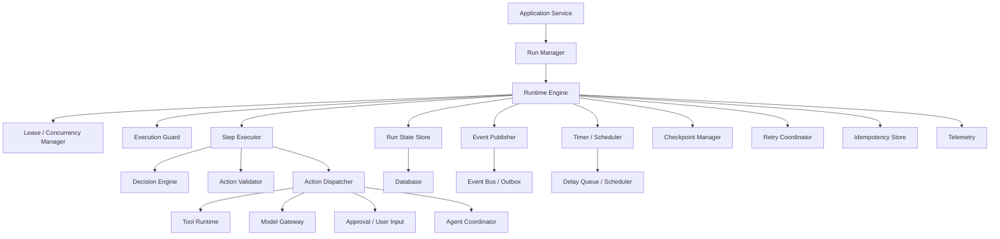
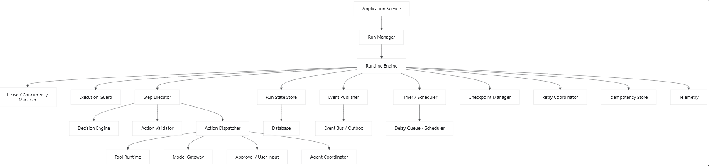
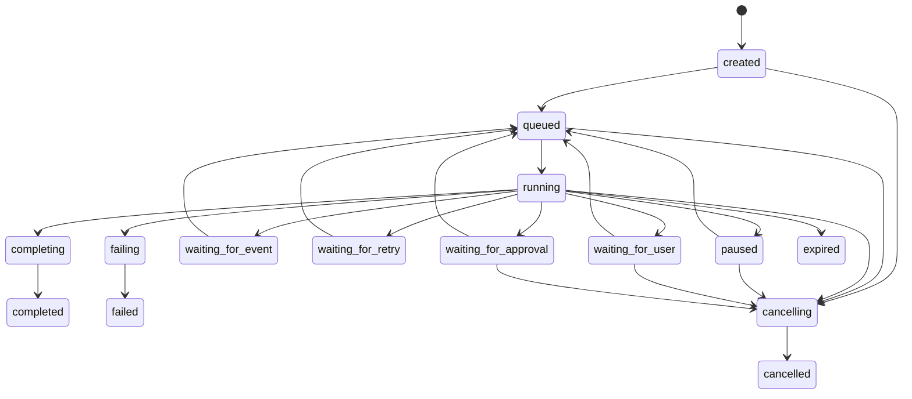
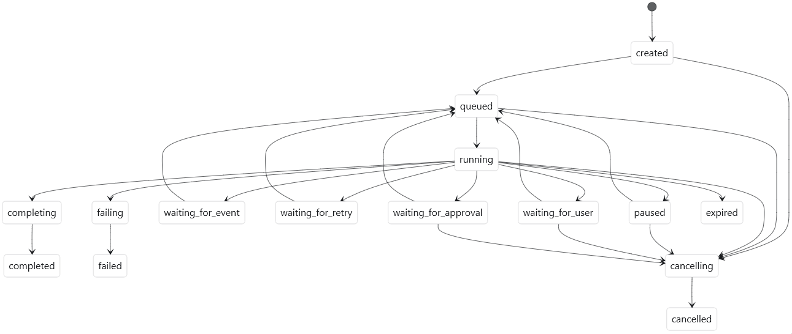
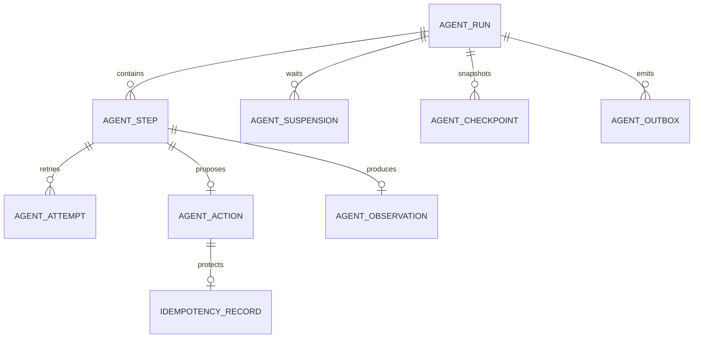

## 前言

Agent Runtime 的本质不是一个简单的 `while` 循环，而是：

> 一个持久化的、可中断的、受预算约束的状态机执行引擎。

它接收 Agent 的决策，验证并执行动作，将执行结果转换为 Observation，更新运行状态，然后驱动下一轮决策。

```
Agent Policy：决定下一步做什么
Agent Runtime：保证这一步被安全、可靠、可恢复地执行
```

------

# 一、Agent Runtime 的职责边界

Runtime 负责：

- Agent Run 生命周期
- Step 执行循环
- 状态转换
- 超时、取消和截止时间
- Step、Token、成本、Tool Call 等预算控制
- 模型调用和工具调用的重试编排
- 暂停、恢复和 Checkpoint
- 用户输入等待
- 人工审批等待
- 并发和租约控制
- 状态持久化
- 幂等执行
- 事件发布
- 错误分类与故障恢复
- Worker 崩溃后的接管
- 运行记录与可观测性

Runtime 不负责：

- 理解具体业务含义
- 编写或拼接 Prompt
- 决定使用哪些业务数据
- 实现具体 Tool
- 实现 LLM Provider 协议
- 决定退款、审批等业务规则
- 保存长期 Memory
- 进行知识检索

这些职责应分别交给：

```
AgentPolicy / DecisionEngine
ContextCompiler
ToolRuntime
LLMGateway
Business Policy
MemoryService
KnowledgeService
```

------

# 二、整体架构

````

````



建议拆成以下主要组件：

1. `RunManager`
2. `RuntimeEngine`
3. `StepExecutor`
4. `DecisionEngine`
5. `ActionValidator`
6. `ActionDispatcher`
7. `ExecutionGuard`
8. `RetryCoordinator`
9. `CheckpointManager`
10. `SuspendManager`
11. `LeaseManager`
12. `IdempotencyStore`
13. `RunStateStore`
14. `EventPublisher`
15. `TimerScheduler`
16. `RuntimeRecoveryService`
17. `RuntimeObserver`

------

# 三、核心领域模型

## 1. Run、Step、Attempt 的关系

必须区分三个层级：

```
AgentRun
├── Step 1
│   ├── Decision Attempt 1
│   └── Action Attempt 1
├── Step 2
│   ├── Decision Attempt 1
│   ├── Action Attempt 1：失败
│   └── Action Attempt 2：成功
└── Step 3
```

- `Run`：一次完整 Agent 任务
- `Step`：一次状态推进
- `Attempt`：某个操作的一次实际尝试

重试不应该增加逻辑 Step 数，但必须增加 Attempt 数。

------

## 2. Run 状态机

```
type AgentRunStatus =
  | "created"
  | "queued"
  | "running"
  | "suspending"
  | "waiting_for_user"
  | "waiting_for_approval"
  | "waiting_for_event"
  | "waiting_for_retry"
  | "paused"
  | "completing"
  | "completed"
  | "failing"
  | "failed"
  | "cancelling"
  | "cancelled"
  | "expired";
```

状态转换示意：

````

````



不能允许任意状态跳转。应由显式状态机控制：

```typescript
const allowedTransitions: Record<
  AgentRunStatus,
  AgentRunStatus[]
> = {
  created: ["queued", "cancelling"],
  queued: ["running", "cancelling", "expired"],
  running: [
    "suspending",
    "waiting_for_user",
    "waiting_for_approval",
    "waiting_for_event",
    "waiting_for_retry",
    "paused",
    "completing",
    "failing",
    "cancelling",
    "expired",
  ],
  suspending: [
    "waiting_for_user",
    "waiting_for_approval",
    "waiting_for_event",
    "paused",
    "failing",
  ],
  waiting_for_user: ["queued", "cancelling", "expired"],
  waiting_for_approval: ["queued", "cancelling", "expired"],
  waiting_for_event: ["queued", "cancelling", "expired"],
  waiting_for_retry: ["queued", "cancelling", "expired"],
  paused: ["queued", "cancelling", "expired"],
  completing: ["completed", "failing"],
  completed: [],
  failing: ["failed"],
  failed: [],
  cancelling: ["cancelled"],
  cancelled: [],
  expired: [],
};
```

------

## 3. AgentRun

```typescript
interface AgentRun {
  id: string;

  agent: {
    id: string;
    version: string;
  };

  status: AgentRunStatus;

  input: AgentInput;
  output?: AgentOutput;
  failure?: AgentFailure;

  state: AgentWorkingState;

  counters: RuntimeCounters;
  budget: ExecutionBudget;

  suspension?: Suspension;

  currentStepId?: string;

  configSnapshot: {
    agentVersion: string;
    promptVersion?: string;
    modelConfigVersion: string;
    runtimeConfigVersion: string;
  };

  concurrency: {
    version: number;
    leaseOwner?: string;
    leaseExpiresAt?: string;
  };

  timing: {
    createdAt: string;
    queuedAt?: string;
    startedAt?: string;
    deadlineAt?: string;
    completedAt?: string;
    updatedAt: string;
  };

  metadata?: Record<string, string>;
}
```

Working State 应保持可序列化：

```typescript
interface AgentWorkingState {
  objective: string;

  conversation: AgentMessage[];

  plan?: AgentPlan;

  workingMemory: Record<string, JsonValue>;

  observations: Observation[];

  pendingAction?: AgentActionRecord;

  artifactRefs: ArtifactRef[];
}
```

------

## 4. Step

```typescript
type AgentStepStatus =
  | "created"
  | "deciding"
  | "decision_completed"
  | "validating"
  | "waiting"
  | "executing"
  | "completed"
  | "failed"
  | "cancelled";

interface AgentStep {
  id: string;
  runId: string;

  sequence: number;
  status: AgentStepStatus;

  stateBeforeVersion: number;

  decision?: AgentDecision;
  action?: AgentAction;
  observation?: Observation;

  attempts: StepAttempt[];

  startedAt: string;
  completedAt?: string;

  error?: AgentFailure;
}
```

------

## 5. Attempt

```typescript
interface StepAttempt {
  id: string;
  runId: string;
  stepId: string;

  operation:
    | "decision"
    | "model_call"
    | "tool_call"
    | "event_publish"
    | "state_commit";

  attemptNumber: number;

  status: "started" | "succeeded" | "failed" | "timed_out";

  idempotencyKey?: string;

  startedAt: string;
  completedAt?: string;

  error?: AgentFailure;
}
```

------

# 四、Runtime 的核心输入输出协议

Runtime 不应该直接接收 Prompt，而应接收 Agent 定义与输入：

```typescript
interface AgentRuntime {
  start(
    request: StartAgentRunRequest,
  ): Promise<AgentRunHandle>;

  execute(
    runId: string,
    options?: ExecuteRunOptions,
  ): Promise<AgentRunResult>;

  resume(
    request: ResumeAgentRunRequest,
  ): Promise<AgentRunHandle>;

  pause(
    runId: string,
    reason?: string,
  ): Promise<void>;

  cancel(
    runId: string,
    reason?: string,
  ): Promise<void>;

  getRun(runId: string): Promise<AgentRun>;

  streamEvents(
    runId: string,
    cursor?: string,
  ): AsyncIterable<AgentEvent>;
}
```

启动请求：

```typescript
interface StartAgentRunRequest {
  agentId: string;
  input: AgentInput;

  sessionId?: string;
  userId?: string;
  tenantId?: string;

  execution?: Partial<ExecutionPolicy>;

  idempotencyKey?: string;

  metadata?: Record<string, string>;
}
```

运行句柄：

```typescript
interface AgentRunHandle {
  runId: string;
  status: AgentRunStatus;

  eventStreamUrl?: string;
  statusUrl?: string;
}
```

------

# 五、Agent 与 Runtime 的接口边界

建议将 Agent Core 抽象为 `DecisionEngine`：

```typescript
interface DecisionEngine {
  decide(
    request: AgentDecisionRequest,
  ): Promise<AgentDecision>;
}

interface AgentDecisionRequest {
  definition: AgentDefinition;

  state: Readonly<AgentWorkingState>;

  runtime: {
    runId: string;
    stepId: string;
    stepNumber: number;
    remainingBudget: RemainingBudget;
  };

  availableCapabilities: CapabilityDescriptor[];

  signal: AbortSignal;
}
```

Runtime 不关心 DecisionEngine 内部是：

- LLM Agent
- 规则引擎
- Workflow
- Planner/Executor
- 混合策略

决策结果必须结构化：

```typescript
type AgentDecision =
  | {
      type: "execute_action";
      action: AgentAction;
    }
  | {
      type: "complete";
      output: AgentOutput;
    }
  | {
      type: "fail";
      failure: AgentFailure;
    }
  | {
      type: "yield";
      reason: string;
    };
```

------

# 六、Action 设计

Action 是 Runtime 可以理解和执行的命令。

```typescript
type AgentAction =
  | ToolCallAction
  | RequestUserInputAction
  | RequestApprovalAction
  | WaitForEventAction
  | DelegateAction
  | EmitMessageAction
  | UpdateStateAction;
```

## Tool Action

```typescript
interface ToolCallAction {
  type: "tool_call";

  actionId: string;
  toolId: string;
  arguments: JsonValue;

  timeoutMs?: number;

  retryPolicy?: RetryPolicy;

  idempotency?: {
    key?: string;
  };
}
```

## 请求用户输入

```typescript
interface RequestUserInputAction {
  type: "request_user_input";

  actionId: string;
  prompt: string;

  inputSchema?: JsonSchema;

  timeoutAt?: string;

  onTimeout?: "fail" | "cancel" | "use_default";
  defaultValue?: JsonValue;
}
```

这里的 `prompt` 是给用户看的问题，不是模型 Prompt。

## 人工审批

```typescript
interface RequestApprovalAction {
  type: "request_approval";

  actionId: string;

  approval: {
    title: string;
    reason: string;

    proposedOperation: {
      type: string;
      target: string;
      parameters: JsonValue;
      sideEffect: string;
    };

    expiresAt?: string;
  };
}
```

## 等待外部事件

```typescript
interface WaitForEventAction {
  type: "wait_for_event";

  actionId: string;

  eventType: string;
  correlationKey: string;

  timeoutAt?: string;
}
```

## 子 Agent 委托

```typescript
interface DelegateAction {
  type: "delegate";

  actionId: string;
  targetAgentId: string;

  objective: string;
  input: JsonValue;

  waitMode: "blocking" | "non_blocking";

  limits?: Partial<ExecutionBudget>;
}
```

------

# 七、Action Dispatcher

Runtime 不应包含大量：

```
if (action.type === "tool_call") ...
```

建议通过 Handler Registry 分派：

```typescript
interface ActionHandler<TAction extends AgentAction = AgentAction> {
  readonly actionType: TAction["type"];

  execute(
    action: TAction,
    context: ActionExecutionContext,
  ): Promise<ActionExecutionResult>;
}
```

Dispatcher：

```typescript
interface ActionDispatcher {
  dispatch(
    action: AgentAction,
    context: ActionExecutionContext,
  ): Promise<ActionExecutionResult>;
}

class DefaultActionDispatcher implements ActionDispatcher {
  private readonly handlers = new Map<
    AgentAction["type"],
    ActionHandler
  >();

  register(handler: ActionHandler): void {
    this.handlers.set(handler.actionType, handler);
  }

  async dispatch(
    action: AgentAction,
    context: ActionExecutionContext,
  ): Promise<ActionExecutionResult> {
    const handler = this.handlers.get(action.type);

    if (!handler) {
      throw new RuntimeError(
        "unsupported_action",
        `Unsupported action type: ${action.type}`,
      );
    }

    return handler.execute(action, context);
  }
}
```

执行结果可能是完成，也可能要求挂起：

```typescript
type ActionExecutionResult =
  | {
      type: "completed";
      observation: Observation;
      usage?: UsageDelta;
    }
  | {
      type: "suspended";
      suspension: Suspension;
    }
  | {
      type: "failed";
      failure: AgentFailure;
    };
```

------

# 八、StepExecutor

`StepExecutor` 负责一次完整状态推进：

```
创建 Step
→ 请求决策
→ 验证决策
→ 保存待执行 Action
→ 执行 Action
→ 生成 Observation
→ 更新 State
→ 完成 Step
```

接口：

```
interface StepExecutor {
  executeStep(
    context: StepExecutionContext,
  ): Promise<StepTransition>;
}

interface StepExecutionContext {
  run: AgentRun;
  definition: AgentDefinition;

  lease: RunLease;

  signal: AbortSignal;
}
```

返回值：

```
type StepTransition =
  | {
      type: "continue";
      run: AgentRun;
      step: AgentStep;
      events: AgentEvent[];
    }
  | {
      type: "suspend";
      run: AgentRun;
      step: AgentStep;
      suspension: Suspension;
      events: AgentEvent[];
    }
  | {
      type: "complete";
      run: AgentRun;
      step: AgentStep;
      output: AgentOutput;
      events: AgentEvent[];
    }
  | {
      type: "fail";
      run: AgentRun;
      step: AgentStep;
      failure: AgentFailure;
      events: AgentEvent[];
    };
```

核心实现：

```typescript
class DefaultStepExecutor implements StepExecutor {
  constructor(
    private readonly decisionEngine: DecisionEngine,
    private readonly actionValidator: ActionValidator,
    private readonly dispatcher: ActionDispatcher,
    private readonly store: RuntimeStore,
    private readonly retry: RetryCoordinator,
  ) {}

  async executeStep(
    context: StepExecutionContext,
  ): Promise<StepTransition> {
    const { run, definition, signal } = context;

    let step = await this.store.createStep({
      runId: run.id,
      sequence: run.counters.steps + 1,
      stateBeforeVersion: run.concurrency.version,
    });

    const decision = await this.retry.execute(
      {
        operation: "decision",
        policy: definition.execution.decisionRetry,
      },
      ({ signal: attemptSignal }) =>
        this.decisionEngine.decide({
          definition,
          state: run.state,
          runtime: {
            runId: run.id,
            stepId: step.id,
            stepNumber: step.sequence,
            remainingBudget: calculateRemainingBudget(run),
          },
          availableCapabilities: [],
          signal: attemptSignal,
        }),
      signal,
    );

    step = await this.store.saveDecision(
      step.id,
      decision,
    );

    if (decision.type === "complete") {
      return createCompletionTransition(
        run,
        step,
        decision.output,
      );
    }

    if (decision.type === "fail") {
      return createFailureTransition(
        run,
        step,
        decision.failure,
      );
    }

    if (decision.type === "yield") {
      return createYieldTransition(
        run,
        step,
        decision.reason,
      );
    }

    const validation = await this.actionValidator.validate({
      definition,
      run,
      step,
      action: decision.action,
    });

    if (validation.type === "rejected") {
      const observation = rejectionToObservation(validation);

      return createContinueTransition(
        run,
        step,
        observation,
      );
    }

    if (validation.type === "approval_required") {
      return createApprovalSuspensionTransition(
        run,
        step,
        validation.approval,
      );
    }

    // 在产生外部副作用之前，先持久化执行意图。
    await this.store.markActionPending(
      run.id,
      step.id,
      decision.action,
      run.concurrency.version,
    );

    const result = await this.dispatcher.dispatch(
      decision.action,
      {
        runId: run.id,
        stepId: step.id,
        userId: run.metadata?.userId,
        signal,
      },
    );

    return mapActionResultToTransition(
      run,
      step,
      result,
    );
  }
}
```

------

# 九、Runtime Engine 执行循环

Runtime Engine 负责循环，但不负责一次 Step 内部细节。

```typescript
interface RuntimeEngine {
  execute(
    runId: string,
    options?: ExecuteRunOptions,
  ): Promise<AgentRunResult>;
}
```

实现示意：

```typescript
class DefaultRuntimeEngine implements RuntimeEngine {
  constructor(
    private readonly store: RuntimeStore,
    private readonly definitions: AgentDefinitionRegistry,
    private readonly leases: RunLeaseManager,
    private readonly guard: ExecutionGuard,
    private readonly steps: StepExecutor,
    private readonly events: RuntimeEventPublisher,
    private readonly checkpoints: CheckpointManager,
  ) {}

  async execute(
    runId: string,
    options: ExecuteRunOptions = {},
  ): Promise<AgentRunResult> {
    const lease = await this.leases.acquire(
      runId,
      options.workerId ?? "local-worker",
    );

    const abortController = new AbortController();

    try {
      let run = await this.store.requireRun(runId);
      const definition = await this.definitions.get(
        run.agent.id,
        run.agent.version,
      );

      run = await this.store.transitionRun(
        run.id,
        run.concurrency.version,
        "running",
      );

      while (!isTerminalStatus(run.status)) {
        await this.leases.renew(lease);

        const guardResult = await this.guard.check({
          run,
          definition,
          signal: abortController.signal,
        });

        if (guardResult.type === "stop") {
          run = await this.stopFromGuard(run, guardResult);
          break;
        }

        const transition = await this.steps.executeStep({
          run,
          definition,
          lease,
          signal: abortController.signal,
        });

        run = await this.commitTransition(
          run,
          transition,
        );

        await this.events.publish(
          transition.events,
        );

        if (transition.type !== "continue") {
          break;
        }

        if (definition.execution.checkpointEveryStep) {
          await this.checkpoints.create(run);
        }
      }

      return toAgentRunResult(run);
    } finally {
      await this.leases.release(lease);
    }
  }
}
```

生产实现中，事件发布不应简单地发生在数据库提交之后，否则存在：

```
状态已保存，但事件未发布
```

应使用 Transactional Outbox，后文会展开。

------

# 十、ExecutionGuard：统一限制检查

不要在循环中零散写各种限制判断。应统一成 Guard Pipeline。

```typescript
interface ExecutionGuard {
  check(
    context: ExecutionGuardContext,
  ): Promise<GuardResult>;
}

interface ExecutionGuardContext {
  run: AgentRun;
  definition: AgentDefinition;
  signal: AbortSignal;
}

type GuardResult =
  | { type: "continue" }
  | {
      type: "stop";
      reason:
        | "cancelled"
        | "deadline_exceeded"
        | "step_limit_exceeded"
        | "cost_limit_exceeded"
        | "token_limit_exceeded"
        | "tool_call_limit_exceeded"
        | "model_call_limit_exceeded";
      failure?: AgentFailure;
    };
```

组合多个 Guard：

```typescript
interface RuntimeGuard {
  check(context: ExecutionGuardContext): Promise<GuardResult>;
}

class CompositeExecutionGuard implements ExecutionGuard {
  constructor(
    private readonly guards: RuntimeGuard[],
  ) {}

  async check(
    context: ExecutionGuardContext,
  ): Promise<GuardResult> {
    for (const guard of this.guards) {
      const result = await guard.check(context);

      if (result.type === "stop") {
        return result;
      }
    }

    return { type: "continue" };
  }
}
```

典型 Guard：

```
CancellationGuard
DeadlineGuard
StepBudgetGuard
TokenBudgetGuard
CostBudgetGuard
ToolCallBudgetGuard
ModelCallBudgetGuard
RunStatusGuard
TenantQuotaGuard
```

------

# 十一、预算模型

Step 上限只是最基础的一种限制。推荐统一预算：

```typescript
interface ExecutionBudget {
  maxSteps: number;

  maxDurationMs: number;

  maxModelCalls?: number;
  maxToolCalls?: number;

  maxInputTokens?: number;
  maxOutputTokens?: number;

  maxCost?: {
    amount: number;
    currency: string;
  };

  maxDelegations?: number;

  maxConsecutiveFailures?: number;
}
```

计数器：

```typescript
interface RuntimeCounters {
  steps: number;

  modelCalls: number;
  toolCalls: number;
  delegations: number;

  inputTokens: number;
  outputTokens: number;

  estimatedCost: number;

  consecutiveFailures: number;
}
```

剩余预算：

```
interface RemainingBudget {
  steps: number;
  durationMs: number;

  modelCalls?: number;
  toolCalls?: number;

  inputTokens?: number;
  outputTokens?: number;

  cost?: number;
}
```

注意：预算检查必须同时发生在：

1. Step 开始前
2. Model/Tool 调用前
3. 调用完成后更新 Usage 时

对于输出 Token 等无法完全预知的消耗，调用前应设置硬上限。

------

# 十二、超时与取消设计

## 1. 三层超时

建议区分：

```
Run Deadline      整个 Agent Run 的截止时间
Step Timeout      单个 Step 的最大时间
Operation Timeout 单次 Model/Tool 调用的最大时间
```

```typescript
interface ExecutionPolicy {
  runTimeoutMs: number;
  stepTimeoutMs: number;

  decisionTimeoutMs: number;
  toolTimeoutMs: number;

  maxSteps: number;

  checkpointEveryStep: boolean;

  decisionRetry: RetryPolicy;
  toolRetry: RetryPolicy;
}
```

## 2. 取消必须可传播

统一使用 `AbortSignal`：

```typescript
interface ActionExecutionContext {
  runId: string;
  stepId: string;

  signal: AbortSignal;

  userId?: string;
  tenantId?: string;
}
```

组合多个信号：

```typescript
function createOperationSignal(
  parent: AbortSignal,
  timeoutMs: number,
): AbortSignal {
  return AbortSignal.any([
    parent,
    AbortSignal.timeout(timeoutMs),
  ]);
}
```

但需要理解：

> AbortSignal 只能表达取消意图，不能保证外部系统真的停止执行。

例如付款接口已经收到请求，即使本地取消，也不能假设付款没有发生。后续必须通过幂等键和状态查询确认结果。

------

# 十三、重试架构

Runtime 应区分三类重试：

```
Operation Retry：一次模型或工具调用重试
Step Retry：整个 Step 重新执行
Run Retry：从 Checkpoint 恢复运行
```

通常优先使用 Operation Retry，谨慎使用 Step Retry。

```typescript
interface RetryPolicy {
  maxAttempts: number;

  initialDelayMs: number;
  maxDelayMs: number;

  multiplier: number;
  jitter: "none" | "full" | "equal";

  retryableErrors: RuntimeErrorCode[];

  respectRetryAfter: boolean;
}
```

Coordinator：

```typescript
interface RetryCoordinator {
  execute<T>(
    options: RetryExecutionOptions,
    operation: (
      context: RetryAttemptContext,
    ) => Promise<T>,
    parentSignal: AbortSignal,
  ): Promise<T>;
}

interface RetryAttemptContext {
  attempt: number;
  signal: AbortSignal;
}

interface RetryExecutionOptions {
  operation: string;
  policy: RetryPolicy;
  idempotencyKey?: string;
}
```

重试判断不能只依赖 HTTP 状态码：

```typescript
interface RetryClassifier {
  classify(
    error: unknown,
    context: RetryClassificationContext,
  ): RetryDecision;
}

type RetryDecision =
  | { retry: false; reason: string }
  | {
      retry: true;
      delayMs?: number;
      reason: string;
    };
```

不应该自动重试：

- 鉴权错误
- 参数错误
- 权限拒绝
- 人工拒绝
- 非幂等 Tool 且结果未知
- 内容安全拒绝
- 预算耗尽

------

# 十四、幂等与副作用安全

分布式系统无法廉价地保证外部副作用“恰好执行一次”。实际目标应是：

> 至少一次调度 + 幂等执行 + 可核对结果。

Tool 调用的幂等键可以是：

```
runId / stepId / actionId
```

```typescript
interface IdempotencyStore {
  begin(
    key: string,
    requestHash: string,
    expiresAt?: string,
  ): Promise<IdempotencyBeginResult>;

  complete(
    key: string,
    result: JsonValue,
  ): Promise<void>;

  fail(
    key: string,
    error: AgentFailure,
    outcome: "known_not_executed" | "unknown",
  ): Promise<void>;

  get(key: string): Promise<IdempotencyRecord | null>;
}
```

状态：

```
type IdempotencyBeginResult =
  | { type: "acquired" }
  | {
      type: "completed";
      cachedResult: JsonValue;
    }
  | {
      type: "in_progress";
      owner?: string;
    }
  | {
      type: "failed_unknown";
      requiresReconciliation: true;
    };
```

对外部写操作，理想顺序是：

```
1. 验证 Action
2. 保存 pending action
3. 创建幂等记录
4. 调用外部系统，并传递幂等键
5. 保存外部结果
6. 更新 Action 为 completed
7. 更新 Agent State
```

如果第 4 步后 Worker 崩溃：

- 如果外部系统支持幂等键，可安全重试；
- 如果不支持，应进入 `unknown outcome`；
- 先查询外部状态或人工处理；
- 不能盲目再次执行。

------

# 十五、暂停与恢复

## 1. Suspension 模型

暂停不是异常，而是一等状态：

```
type Suspension =
  | UserInputSuspension
  | ApprovalSuspension
  | ExternalEventSuspension
  | RetrySuspension
  | ManualSuspension;
interface BaseSuspension {
  id: string;
  runId: string;
  stepId: string;
  actionId: string;

  status: "waiting" | "resolved" | "expired" | "cancelled";

  createdAt: string;
  expiresAt?: string;
}
```

用户输入：

```typescript
interface UserInputSuspension extends BaseSuspension {
  type: "user_input";

  question: string;
  inputSchema?: JsonSchema;
}
```

审批：

```typescript
interface ApprovalSuspension extends BaseSuspension {
  type: "approval";

  proposedOperation: JsonValue;
  reason: string;

  operationHash: string;
}
```

外部事件：

```typescript
interface ExternalEventSuspension extends BaseSuspension {
  type: "external_event";

  eventType: string;
  correlationKey: string;
}
```

## 2. 恢复输入

```typescript
type ResumePayload =
  | {
      type: "user_input";
      suspensionId: string;
      value: JsonValue;
    }
  | {
      type: "approval";
      suspensionId: string;
      decision: "approved" | "rejected";
      comment?: string;
    }
  | {
      type: "external_event";
      suspensionId: string;
      event: JsonValue;
    }
  | {
      type: "retry_due";
      suspensionId: string;
    };
```

恢复接口：

```
interface ResumeAgentRunRequest {
  runId: string;
  payload: ResumePayload;
  idempotencyKey: string;
}
```

恢复流程：

```
校验 Run 是否处于等待状态
→ 校验 suspensionId
→ 校验输入 Schema / 审批身份
→ 原子地消费 Suspension
→ 生成 Observation
→ 保存到 State
→ Run 转为 queued
→ 投递执行任务
```

必须防止同一审批或用户输入被重复消费。

------

# 十六、人工确认的安全设计

审批时必须冻结待执行动作：

```
interface FrozenApprovalOperation {
  actionId: string;
  toolId: string;

  arguments: JsonValue;
  argumentsHash: string;

  sideEffect: string;

  requestedAt: string;
}
```

审批后不能重新让模型生成工具参数，再拿新的参数执行。

正确流程：

```
模型提出 Action A
→ Runtime 验证
→ 冻结 A 的参数和 Hash
→ 用户批准 A
→ Runtime 执行被冻结的 A
```

错误流程：

```
用户批准“执行退款”
→ 再让模型决定退款金额和账户
```

审批服务：

```typescript
interface ApprovalService {
  create(
    request: ApprovalRequest,
  ): Promise<ApprovalTicket>;

  resolve(
    ticketId: string,
    decision: ApprovalResolution,
    actor: ApprovalActor,
  ): Promise<void>;

  verify(
    ticketId: string,
    operationHash: string,
  ): Promise<ApprovalVerification>;
}
```

------

# 十七、并发控制

并发问题有两个层面。

## 1. 单个 Run 的互斥执行

同一个 Run 不能被两个 Worker 同时推进。

使用 Lease：

```typescript
interface RunLease {
  runId: string;
  ownerId: string;
  token: string;
  expiresAt: string;
}

interface RunLeaseManager {
  acquire(
    runId: string,
    ownerId: string,
    ttlMs?: number,
  ): Promise<RunLease>;

  renew(lease: RunLease): Promise<RunLease>;

  release(lease: RunLease): Promise<void>;

  assertValid(lease: RunLease): Promise<void>;
}
```

Lease 必须配合乐观锁。仅有 Lease 仍可能发生：

```
旧 Worker 卡顿
→ Lease 过期
→ 新 Worker 获得 Lease
→ 旧 Worker 恢复运行并继续写入
```

因此写入时需要 fencing token：

```typescript
interface RunLease {
  runId: string;
  ownerId: string;

  fencingToken: number;

  expiresAt: string;
}
```

数据库只接受大于等于当前 fencing token 的写入。

## 2. 平台资源并发

还需要限制：

- 租户并发 Run 数
- Agent 并发数
- Model Provider 并发数
- Tool 并发数
- 单用户并发数

```typescript
interface ConcurrencyLimiter {
  acquire(
    resource: ConcurrencyResource,
    permits: number,
    signal: AbortSignal,
  ): Promise<ConcurrencyPermit>;

  release(permit: ConcurrencyPermit): Promise<void>;
}
```

这些限制不应全部由 Runtime 自己实现；Runtime 只负责调用统一 Limiter。

------

# 十八、状态持久化

## 1. RuntimeStore 接口

```typescript
interface RuntimeStore {
  createRun(
    run: NewAgentRun,
  ): Promise<AgentRun>;

  getRun(runId: string): Promise<AgentRun | null>;

  requireRun(runId: string): Promise<AgentRun>;

  transitionRun(
    runId: string,
    expectedVersion: number,
    targetStatus: AgentRunStatus,
    patch?: Partial<AgentRun>,
  ): Promise<AgentRun>;

  createStep(
    input: NewAgentStep,
  ): Promise<AgentStep>;

  saveDecision(
    stepId: string,
    decision: AgentDecision,
  ): Promise<AgentStep>;

  markActionPending(
    runId: string,
    stepId: string,
    action: AgentAction,
    expectedRunVersion: number,
  ): Promise<void>;

  commitTransition(
    input: CommitStepTransition,
  ): Promise<CommittedTransition>;

  createCheckpoint(
    checkpoint: AgentCheckpoint,
  ): Promise<void>;

  getLatestCheckpoint(
    runId: string,
  ): Promise<AgentCheckpoint | null>;
}
```

## 2. 原子提交

一次 Step 完成时，以下操作应尽可能在一个数据库事务中完成：

```
更新 Step
更新 Run State
更新预算计数
追加 Observation
创建 Checkpoint
写入 Outbox Event
```

```typescript
interface CommitStepTransition {
  runId: string;
  stepId: string;

  expectedRunVersion: number;
  fencingToken: number;

  newRunStatus: AgentRunStatus;
  statePatch: AgentStatePatch;

  observation?: Observation;
  usageDelta?: UsageDelta;

  checkpoint?: AgentCheckpoint;

  events: AgentEvent[];
}
```

------

# 十九、Checkpoint 设计

State 和 Checkpoint 不完全相同：

- State：当前权威状态
- Checkpoint：可用于恢复或审计的稳定快照

```typescript
interface AgentCheckpoint {
  id: string;
  runId: string;

  sequence: number;
  stateVersion: number;

  runStatus: AgentRunStatus;
  state: AgentWorkingState;
  counters: RuntimeCounters;

  pendingAction?: AgentActionRecord;
  suspension?: Suspension;

  createdAt: string;

  checksum: string;
}
```

Checkpoint 创建时机：

- 每个 Step 完成后
- 外部副作用执行前
- 外部副作用执行后
- 暂停前
- 配置要求的固定间隔
- 人工要求暂停时

如果 State 本身已经是数据库中的权威快照，不必每步再复制一份巨大 JSON。可以采用：

```
当前状态表 + 追加事件 + 周期性完整快照
```

------

# 二十、事件发布与 Transactional Outbox

直接这样做有一致性漏洞：

```
await store.save(run);
await eventBus.publish(event);
```

可能发生：

```
数据库提交成功
→ 进程崩溃
→ 事件永远没有发布
```

推荐在同一数据库事务中：

```
更新 Run/Step
+ 写入 runtime_outbox
```

独立 Publisher 再发送：

```typescript
interface OutboxStore {
  append(
    events: AgentEvent[],
    transaction: DatabaseTransaction,
  ): Promise<void>;

  claimBatch(
    ownerId: string,
    limit: number,
  ): Promise<OutboxRecord[]>;

  markPublished(
    ids: string[],
  ): Promise<void>;

  markFailed(
    id: string,
    failure: string,
  ): Promise<void>;
}
```

事件消费者必须幂等，因为 Outbox 通常提供至少一次投递。

------

# 二十一、事件模型

```typescript
type AgentEvent =
  | RunCreatedEvent
  | RunQueuedEvent
  | RunStartedEvent
  | RunSuspendedEvent
  | RunResumedEvent
  | RunCompletedEvent
  | RunFailedEvent
  | RunCancelledEvent
  | StepStartedEvent
  | DecisionCompletedEvent
  | ActionProposedEvent
  | ActionRejectedEvent
  | ActionStartedEvent
  | ActionCompletedEvent
  | ActionFailedEvent
  | ApprovalRequestedEvent
  | ApprovalResolvedEvent
  | UserInputRequestedEvent
  | UserInputReceivedEvent
  | RetryScheduledEvent
  | CheckpointCreatedEvent
  | BudgetUpdatedEvent;
```

统一事件头：

```typescript
interface AgentEventEnvelope<TPayload = JsonValue> {
  id: string;
  type: string;

  runId: string;
  stepId?: string;
  actionId?: string;

  sequence: number;

  occurredAt: string;

  aggregateVersion: number;

  traceId?: string;
  correlationId?: string;
  causationId?: string;

  payload: TPayload;
}
```

`sequence` 用于保证单个 Run 内事件排序。

------

# 二十二、Timer 与延迟任务

以下情况需要可靠 Timer：

- Retry Backoff
- 审批超时
- 用户输入超时
- 等待外部事件超时
- Run Deadline
- Lease 恢复扫描

不能依赖进程内 `setTimeout`，因为进程重启后定时器会丢失。

```typescript
interface RuntimeScheduler {
  schedule(
    task: ScheduledRuntimeTask,
  ): Promise<string>;

  cancel(taskId: string): Promise<void>;

  claimDueTasks(
    ownerId: string,
    limit: number,
  ): Promise<ScheduledRuntimeTask[]>;
}
type ScheduledRuntimeTask =
  | {
      type: "resume_retry";
      runId: string;
      suspensionId: string;
      executeAt: string;
    }
  | {
      type: "expire_suspension";
      runId: string;
      suspensionId: string;
      executeAt: string;
    }
  | {
      type: "expire_run";
      runId: string;
      executeAt: string;
    };
```

------

# 二十三、崩溃恢复

RuntimeRecoveryService 定期扫描异常运行：

```typescript
interface RuntimeRecoveryService {
  recoverAbandonedRuns(
    options?: RecoveryOptions,
  ): Promise<RecoveryReport>;

  reconcileUnknownActions(
    options?: ReconciliationOptions,
  ): Promise<ReconciliationReport>;
}
```

需要处理：

```
状态为 running，但 Lease 已过期
状态为 executing，但没有活跃 Worker
Action 是 pending，但不存在结果
Action 外部结果未知
Outbox 长时间未发布
Retry 时间已经到期但 Run 未入队
```

恢复策略：

```
纯决策调用失败/中断
→ 通常可以重新调用

只读且幂等的 Tool
→ 可以使用同一幂等键重试

支持幂等键的写 Tool
→ 使用原幂等键重试或查询结果

不支持幂等的写 Tool，结果未知
→ 进入 reconciliation / 人工处理

已经存在持久化 Observation
→ 不重复执行 Action，继续下一步
```

------

# 二十四、错误体系

```typescript
type RuntimeErrorCode =
  | "run_not_found"
  | "invalid_state_transition"
  | "state_version_conflict"
  | "lease_conflict"
  | "lease_expired"
  | "cancelled"
  | "deadline_exceeded"
  | "step_timeout"
  | "operation_timeout"
  | "step_limit_exceeded"
  | "token_limit_exceeded"
  | "cost_limit_exceeded"
  | "tool_call_limit_exceeded"
  | "decision_failed"
  | "invalid_decision"
  | "action_rejected"
  | "action_failed"
  | "approval_denied"
  | "suspension_expired"
  | "idempotency_conflict"
  | "unknown_external_outcome"
  | "persistence_failed"
  | "event_publish_failed"
  | "internal_error";
interface AgentFailure {
  code: RuntimeErrorCode;
  message: string;

  retryable: boolean;

  category:
    | "user"
    | "policy"
    | "model"
    | "tool"
    | "infrastructure"
    | "runtime";

  safeDetails?: Record<string, JsonValue>;

  runId?: string;
  stepId?: string;
  actionId?: string;
  attemptId?: string;

  cause?: unknown;
}
```

错误必须区分：

- 此操作能否重试
- 此 Step 能否继续
- 此 Run 能否恢复
- 是否需要人工核对
- 是否可以安全暴露给用户

------

# 二十五、ActionValidator

模型提出动作后，必须在执行前由代码验证：

```typescript
interface ActionValidator {
  validate(
    input: ActionValidationInput,
  ): Promise<ActionValidationResult>;
}

interface ActionValidationInput {
  definition: AgentDefinition;
  run: AgentRun;
  step: AgentStep;
  action: AgentAction;
}
```

结果：

```typescript
type ActionValidationResult =
  | {
      type: "allowed";
      normalizedAction: AgentAction;
    }
  | {
      type: "rejected";
      code: string;
      reason: string;
      feedbackToAgent?: Observation;
    }
  | {
      type: "approval_required";
      approval: ApprovalRequest;
    };
```

验证内容包括：

- Action 类型是否允许
- Tool 是否绑定到该 Agent
- 参数是否符合 Schema
- 用户权限是否满足
- 是否越权访问其他租户
- 是否超过预算
- 是否需要审批
- 是否涉及危险副作用
- 幂等信息是否完整
- 参数是否需要脱敏
- 当前 Run 状态是否允许执行

------

# 二十六、状态 Reducer

状态更新建议采用纯函数 Reducer，而不是在各组件中随意修改对象。

```
interface StateReducer {
  reduce(
    state: Readonly<AgentWorkingState>,
    event: RuntimeDomainEvent,
  ): AgentWorkingState;
}
```

示例：

```typescript
function reduceAgentState(
  state: Readonly<AgentWorkingState>,
  event: RuntimeDomainEvent,
): AgentWorkingState {
  switch (event.type) {
    case "observation_received":
      return {
        ...state,
        observations: [
          ...state.observations,
          event.observation,
        ],
        pendingAction: undefined,
      };

    case "action_pending":
      return {
        ...state,
        pendingAction: event.action,
      };

    case "plan_updated":
      return {
        ...state,
        plan: event.plan,
      };

    case "message_emitted":
      return {
        ...state,
        conversation: [
          ...state.conversation,
          event.message,
        ],
      };

    default:
      return state;
  }
}
```

好处：

- 容易测试
- 状态变化可预测
- 方便事件重放
- 避免执行逻辑和状态修改耦合
- 更容易实现审计和 Debug

------

# 二十七、同步与异步执行模式

对外可以支持三种模式：

```
type RunMode = "sync" | "async" | "stream";
```

但 Runtime 内部最好始终使用相同的持久化执行模型。

## Sync

```
创建 Run
→ 当前请求线程执行
→ 完成或超时后返回
```

## Async

```
创建 Run
→ 投递队列
→ Worker 执行
→ 返回 runId
```

## Stream

```
创建 Run
→ Worker 执行
→ Client 订阅 Run Event
→ SSE/WebSocket 推送
```

不要为三种模式实现三套 Runtime。它们只应在调度和结果交付方式上不同。

------

# 二十八、推荐数据库实体

```
agent_runs
agent_steps
agent_attempts
agent_actions
agent_observations
agent_suspensions
agent_checkpoints
agent_run_leases
agent_idempotency_records
agent_scheduled_tasks
agent_outbox
agent_usage_records
agent_artifacts
agent_audit_logs
```

核心关系：

````

````

------

# 二十九、核心 API 汇总

下面是一组相对完整但仍可落地的 TypeScript 接口。

```typescript
type JsonPrimitive = string | number | boolean | null;

type JsonValue =
  | JsonPrimitive
  | JsonValue[]
  | { [key: string]: JsonValue };

interface AgentRuntime {
  start(
    request: StartAgentRunRequest,
  ): Promise<AgentRunHandle>;

  execute(
    runId: string,
    options?: ExecuteRunOptions,
  ): Promise<AgentRunResult>;

  resume(
    request: ResumeAgentRunRequest,
  ): Promise<AgentRunHandle>;

  pause(runId: string, reason?: string): Promise<void>;

  cancel(runId: string, reason?: string): Promise<void>;

  getRun(runId: string): Promise<AgentRun>;

  streamEvents(
    runId: string,
    cursor?: string,
  ): AsyncIterable<AgentEventEnvelope>;
}

interface RuntimeEngine {
  execute(
    runId: string,
    options?: ExecuteRunOptions,
  ): Promise<AgentRunResult>;
}

interface StepExecutor {
  executeStep(
    context: StepExecutionContext,
  ): Promise<StepTransition>;
}

interface DecisionEngine {
  decide(
    request: AgentDecisionRequest,
  ): Promise<AgentDecision>;
}

interface ActionValidator {
  validate(
    input: ActionValidationInput,
  ): Promise<ActionValidationResult>;
}

interface ActionDispatcher {
  dispatch(
    action: AgentAction,
    context: ActionExecutionContext,
  ): Promise<ActionExecutionResult>;
}

interface ActionHandler<
  TAction extends AgentAction = AgentAction,
> {
  readonly actionType: TAction["type"];

  execute(
    action: TAction,
    context: ActionExecutionContext,
  ): Promise<ActionExecutionResult>;
}

interface ExecutionGuard {
  check(
    context: ExecutionGuardContext,
  ): Promise<GuardResult>;
}

interface RetryCoordinator {
  execute<T>(
    options: RetryExecutionOptions,
    operation: (
      context: RetryAttemptContext,
    ) => Promise<T>,
    parentSignal: AbortSignal,
  ): Promise<T>;
}

interface RunLeaseManager {
  acquire(
    runId: string,
    ownerId: string,
    ttlMs?: number,
  ): Promise<RunLease>;

  renew(lease: RunLease): Promise<RunLease>;

  release(lease: RunLease): Promise<void>;
}

interface CheckpointManager {
  create(run: AgentRun): Promise<AgentCheckpoint>;

  restore(
    runId: string,
    checkpointId?: string,
  ): Promise<AgentRun>;
}

interface RuntimeStore {
  createRun(run: NewAgentRun): Promise<AgentRun>;

  getRun(runId: string): Promise<AgentRun | null>;

  transitionRun(
    runId: string,
    expectedVersion: number,
    targetStatus: AgentRunStatus,
    patch?: Partial<AgentRun>,
  ): Promise<AgentRun>;

  createStep(input: NewAgentStep): Promise<AgentStep>;

  commitTransition(
    input: CommitStepTransition,
  ): Promise<CommittedTransition>;

  getLatestCheckpoint(
    runId: string,
  ): Promise<AgentCheckpoint | null>;
}

interface RuntimeEventPublisher {
  publish(events: AgentEventEnvelope[]): Promise<void>;

  stream(
    runId: string,
    cursor?: string,
  ): AsyncIterable<AgentEventEnvelope>;
}

interface RuntimeScheduler {
  schedule(
    task: ScheduledRuntimeTask,
  ): Promise<string>;

  cancel(taskId: string): Promise<void>;
}

interface IdempotencyStore {
  begin(
    key: string,
    requestHash: string,
  ): Promise<IdempotencyBeginResult>;

  complete(
    key: string,
    result: JsonValue,
  ): Promise<void>;

  fail(
    key: string,
    failure: AgentFailure,
    outcome: "known_not_executed" | "unknown",
  ): Promise<void>;
}

interface RuntimeRecoveryService {
  recoverAbandonedRuns(): Promise<RecoveryReport>;

  reconcileUnknownActions(): Promise<ReconciliationReport>;
}
```

------

# 三十、建议的代码目录

```
agent-runtime/
├── domain/
│   ├── agent-run.ts
│   ├── agent-step.ts
│   ├── agent-action.ts
│   ├── observation.ts
│   ├── suspension.ts
│   ├── checkpoint.ts
│   ├── runtime-event.ts
│   └── runtime-error.ts
│
├── application/
│   ├── start-run.ts
│   ├── execute-run.ts
│   ├── resume-run.ts
│   ├── pause-run.ts
│   └── cancel-run.ts
│
├── engine/
│   ├── runtime-engine.ts
│   ├── step-executor.ts
│   ├── state-machine.ts
│   ├── state-reducer.ts
│   └── execution-guard.ts
│
├── actions/
│   ├── action-dispatcher.ts
│   ├── action-validator.ts
│   ├── tool-action-handler.ts
│   ├── user-input-handler.ts
│   ├── approval-handler.ts
│   ├── event-wait-handler.ts
│   └── delegation-handler.ts
│
├── reliability/
│   ├── retry-coordinator.ts
│   ├── idempotency-store.ts
│   ├── checkpoint-manager.ts
│   ├── run-lease-manager.ts
│   ├── recovery-service.ts
│   └── reconciliation-service.ts
│
├── scheduling/
│   ├── runtime-queue.ts
│   ├── runtime-scheduler.ts
│   └── timeout-processor.ts
│
├── persistence/
│   ├── runtime-store.ts
│   ├── run-repository.ts
│   ├── step-repository.ts
│   ├── checkpoint-repository.ts
│   └── outbox-store.ts
│
├── events/
│   ├── event-publisher.ts
│   ├── outbox-publisher.ts
│   └── event-stream.ts
│
└── observability/
    ├── runtime-tracer.ts
    ├── runtime-metrics.ts
    ├── audit-recorder.ts
    └── usage-recorder.ts
```

------

# 三十一、最小可用版本如何裁剪

第一版不必一次实现所有内容。建议至少保留：

```
RuntimeEngine
StepExecutor
DecisionEngine
ActionValidator
ActionDispatcher
RuntimeStore
ExecutionGuard
EventPublisher
```

第一阶段能力：

- 单 Agent Run
- 单 Worker
- 强类型 Decision/Action/Observation
- Step 上限
- Run/Operation 超时
- Tool 执行
- 每 Step 持久化
- 基础取消
- 基础事件记录

第二阶段增加：

- 异步队列
- Lease 和乐观锁
- 人工审批
- 用户输入等待
- Checkpoint 和恢复
- Retry Scheduler
- Transactional Outbox
- Tool 幂等

第三阶段增加：

- 多租户并发控制
- 子 Agent
- 分布式 Worker
- 未知外部结果核对
- Event Sourcing
- 多区域恢复

------

# 三十二、关键设计原则

1. Runtime 是持久化状态机，不是 Prompt 循环。
2. `Run → Step → Attempt` 必须分层。
3. Agent 负责决策，Runtime 负责可靠执行。
4. Decision、Action、Observation 必须结构化。
5. 每次外部副作用之前先保存执行意图。
6. 不追求不现实的“全局恰好一次”，应使用幂等键和结果核对。
7. 暂停是一等状态，不是异常。
8. 恢复通过 Observation 推进状态，不能偷偷篡改历史。
9. 审批必须冻结具体操作参数。
10. 单 Run 互斥需要 Lease、fencing token 和乐观锁共同保证。
11. 状态提交与事件记录通过 Transactional Outbox 保持一致。
12. 可靠 Timer 必须持久化，不能依赖进程内定时器。
13. 所有预算和截止时间由统一 ExecutionGuard 检查。
14. 状态更新尽量通过纯 Reducer 完成。
15. Runtime 只调度能力，不实现业务、Prompt 或 Provider 逻辑。

最终，Agent Runtime 可以浓缩成这个状态转换函数：

```typescript
// ts
type RuntimeTransition = (
  run: AgentRun,
  decision: AgentDecision,
) => Promise<{
  action?: AgentAction;
  observation?: Observation;
  nextRun: AgentRun;
  events: AgentEventEnvelope[];
}>;
```

它的核心闭环是：

```
持久化状态
→ 获取执行权
→ 检查限制
→ 请求 Agent 决策
→ 验证 Action
→ 持久化执行意图
→ 执行 Action
→ 生成 Observation
→ 原子提交新状态和事件
→ 继续、暂停、完成或失败
```

只要这个闭环具备强类型、持久化、幂等、取消、租约和恢复能力，Agent Runtime 才真正从“Demo 里的循环”升级为可用于生产环境的执行基础设施。me 持久化机制（TypeScript + Prisma + Redis 实现）。