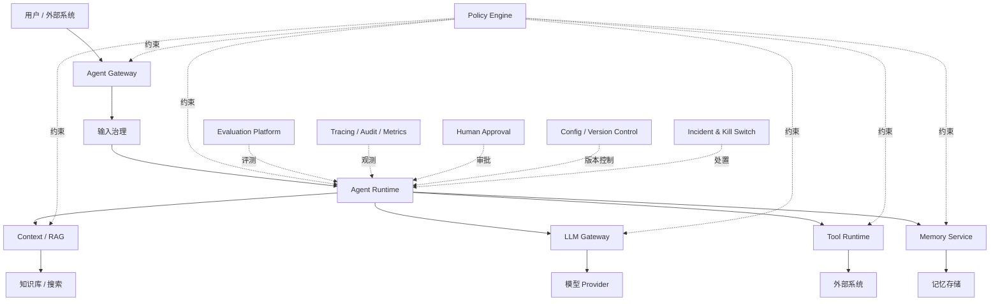
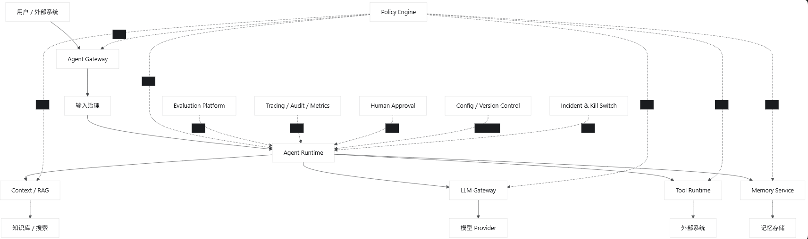
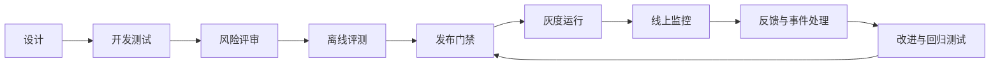
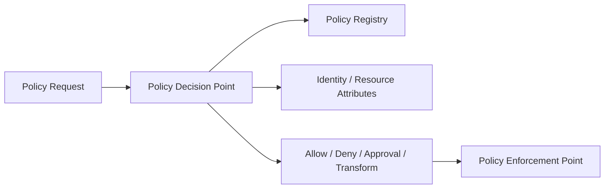
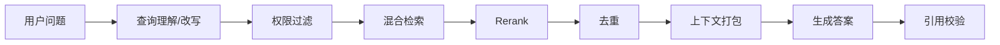
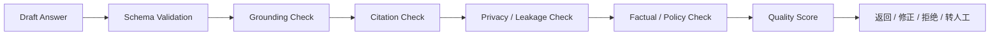

## 前言

Agent 治理的本质不是给 System Prompt 增加几条规则，而是：

> 用可执行策略、受控能力、质量评测和完整证据链，把概率性的模型行为约束在可接受的业务边界内。

一个成熟的治理体系至少要同时解决六个问题：

1. Agent 有没有资格做这件事？
2. Agent 获取的数据是否正确且有权限？
3. Agent 提出的动作是否安全、合规？
4. Agent 的回答是否准确、相关、有证据？
5. 发生错误后能否追踪、停止、恢复和追责？
6. Agent、Prompt、模型或工具升级后，质量是否退化？

------

# 一、Agent 治理体系总体架构

建议将治理设计成横切整个 Agent 生命周期的控制平面，而不是某个孤立模块。

````

````



治理体系可以划分为五个平面：

```
1. Policy Plane       策略定义、决策和执行
2. Control Plane      配置、版本、发布、权限和生命周期
3. Runtime Plane      调用、工具、状态、预算和执行控制
4. Quality Plane      评测、反馈、质量门禁和持续优化
5. Observability Plane 日志、指标、Trace、审计和告警
```

------

# 二、治理对象是什么

不要只治理“最终回答”。Agent 的问题可能发生在整条链路中的任意位置。

完整治理对象包括：

```
Agent Definition
Prompt
Context
Conversation
Memory
Knowledge / RAG
Model
Model Provider
Tool
Action
Workflow
Agent Run
Output
Configuration
Evaluation Dataset
Human Approval
```

每个对象都应具备：

- 唯一 ID
- 版本
- 所有者
- 状态
- 权限
- 风险等级
- 发布时间
- 变更原因
- 审计记录
- 回滚能力

例如一次回答应能追踪到：

```
Agent version
Prompt version
Context compiler version
Knowledge index version
Model alias
实际 Deployment
Tool versions
Policy version
Runtime config version
Evaluation baseline version
```

------

# 三、治理生命周期

Agent 治理不是仅在请求时做一次安全检查，而应覆盖完整生命周期：

````

````

推荐划分为：

## 1. 设计时治理

- 明确 Agent 的目标和禁止事项
- 明确使用者、数据范围、工具权限
- 对动作和数据进行风险分级
- 建立输出质量标准
- 设计人工介入点
- 设计失败和降级行为

## 2. 构建时治理

- Prompt 版本管理
- Tool Schema 校验
- 单元测试和场景测试
- 安全测试
- Prompt Injection 测试
- RAG 检索质量测试
- 模型兼容性测试

## 3. 发布时治理

- 离线评测门禁
- 人工评审
- 配置完整性检查
- 权限审核
- 灰度发布
- A/B 或 Champion–Challenger
- 自动回滚条件

## 4. 运行时治理

- 输入过滤
- 权限验证
- Context 数据隔离
- Tool 动作校验
- 人工审批
- Token、成本和 Step 限制
- 输出验证
- 敏感信息脱敏
- 实时告警与 Kill Switch

## 5. 运行后治理

- Trace 审计
- 质量抽样
- 用户反馈归因
- 错误聚类
- 评测集沉淀
- 事故复盘
- Prompt、知识和工具持续改进

------

# 四、治理层级

不是所有 Agent 都需要相同强度的治理。建议先进行风险分级。

| 等级 | 典型场景                   | 风险               | 治理要求                               |
| ---- | -------------------------- | ------------------ | -------------------------------------- |
| L0   | 内容改写、头脑风暴         | 低                 | 基础过滤、日志、质量评测               |
| L1   | 企业知识问答               | 中低               | 权限 RAG、引用、无依据拒答             |
| L2   | 客服、业务建议             | 中                 | 事实验证、敏感信息保护、抽样审核       |
| L3   | 修改数据、发送消息         | 高                 | Action 校验、人工审批、幂等、审计      |
| L4   | 金融、医疗、法律、生产运维 | 极高               | 确定性规则、双重审批、强审计、严格降级 |
| L5   | 高影响自主决策             | 不可接受或特殊批准 | 原则上禁止完全自主执行                 |

风险由多个维度组成：

```typescript
interface AgentRiskAssessment {
  dataSensitivity:
    | "public"
    | "internal"
    | "confidential"
    | "restricted";

  actionImpact:
    | "none"
    | "read"
    | "reversible_write"
    | "irreversible_write"
    | "external_communication";

  decisionImpact:
    | "informational"
    | "operational"
    | "financial"
    | "legal"
    | "safety_critical";

  autonomy:
    | "answer_only"
    | "recommend"
    | "act_with_approval"
    | "act_autonomously";

  audienceScale: "individual" | "team" | "organization" | "public";
}
```

风险越高：

- 模型自主空间越小
- 确定性规则越多
- 审批越严格
- 可用工具越少
- 日志保存越完整
- 上线门槛越高
- 失败时越倾向停止而不是猜测

------

# 五、Policy Plane：策略治理架构

Policy Engine 是治理体系的核心执行组件。

Prompt 中的规则只能影响模型倾向，Policy Engine 中的规则才能形成强制约束。

````

````

## 核心概念

- PDP：Policy Decision Point，做策略判断
- PEP：Policy Enforcement Point，执行策略结果
- PIP：Policy Information Point，提供用户、资源和环境属性
- PAP：Policy Administration Point，管理策略版本与发布

策略不能只有 `allow/deny`，还应支持：

```typescript
type PolicyEffect =
  | "allow"
  | "deny"
  | "require_approval"
  | "redact"
  | "transform"
  | "restrict"
  | "audit_only";
```

核心接口：

```typescript
interface PolicyEngine {
  evaluate(
    request: PolicyEvaluationRequest,
  ): Promise<PolicyDecision>;
}

interface PolicyEvaluationRequest {
  subject: {
    userId?: string;
    tenantId?: string;
    roles: string[];
    permissions: string[];
  };

  actor: {
    agentId: string;
    agentVersion: string;
    runId: string;
  };

  resource?: {
    type: string;
    id?: string;
    ownerId?: string;
    classification?: string;
    tenantId?: string;
  };

  action: {
    type: string;
    name: string;
    parameters?: JsonValue;
    sideEffect?: string;
  };

  environment: {
    time: string;
    channel: string;
    region?: string;
    riskLevel?: string;
  };
}

interface PolicyDecision {
  effect: PolicyEffect;

  reason: string;
  policyIds: string[];

  obligations?: PolicyObligation[];
}
```

Obligation 表示允许执行时必须附加的约束：

```typescript
// ts
type PolicyObligation =
  | {
      type: "mask_fields";
      fields: string[];
    }
  | {
      type: "limit_result_count";
      maximum: number;
    }
  | {
      type: "require_citation";
    }
  | {
      type: "require_approval";
      approvalPolicyId: string;
    }
  | {
      type: "record_full_audit";
    }
  | {
      type: "restrict_tool_arguments";
      schema: JsonSchema;
    };
```

------

# 六、治理必须分布到关键执行点

Policy Engine 不应只在 API 入口调用一次。

推荐设置以下 Policy Enforcement Point：

```
1. Agent 启动前
2. Context 获取前
3. Memory 读取前
4. RAG 文档返回前
5. 模型选择前
6. Tool 暴露给模型前
7. Action 执行前
8. 子 Agent 委托前
9. Memory 写入前
10. 最终输出返回前
```

例如：

```typescript
interface GovernanceInterceptor {
  beforeRun(
    context: RunGovernanceContext,
  ): Promise<GovernanceResult>;

  beforeModelCall(
    context: ModelCallGovernanceContext,
  ): Promise<GovernanceResult>;

  beforeAction(
    context: ActionGovernanceContext,
  ): Promise<GovernanceResult>;

  afterObservation(
    context: ObservationGovernanceContext,
  ): Promise<GovernanceResult>;

  beforeOutput(
    context: OutputGovernanceContext,
  ): Promise<GovernanceResult>;
}
```

------

# 七、输入治理

输入治理的目标不是简单屏蔽敏感词，而是判断输入是否：

- 合法
- 有权限
- 属于 Agent 能力范围
- 包含恶意指令
- 包含敏感数据
- 存在歧义
- 需要转人工
- 需要更高风险等级

推荐处理链路：

```
身份和租户识别
→ 请求 Schema 校验
→ 输入大小限制
→ 文件类型与病毒检查
→ PII/敏感数据识别
→ Prompt Injection 风险分析
→ 意图与范围判断
→ 风险分类
→ 允许 / 拒绝 / 降级 / 转人工
```

输入分类结果：

```typescript
interface InputAssessment {
  allowed: boolean;

  intent?: string;
  inScope: boolean;

  riskLevel: "low" | "medium" | "high" | "critical";

  detectedData: Array<{
    type: string;
    sensitivity: string;
    locations: TextSpan[];
  }>;

  threats: Array<{
    type:
      | "prompt_injection"
      | "data_exfiltration"
      | "privilege_escalation"
      | "malicious_file"
      | "unsafe_request";
    confidence: number;
  }>;

  requiredActions: Array<
    "redact" | "clarify" | "deny" | "approval" | "human_handoff"
  >;
}
```

注意：Prompt Injection 检测器不能作为唯一防线。更重要的是：

- 不可信内容没有高权限指令能力
- 工具权限由代码控制
- 数据按租户过滤
- Action 由 Policy Engine 验证
- 输出经过泄露检查

------

# 八、身份、租户与权限治理

Agent 不应拥有一个无边界的“系统超级账号”。

权限应当是：

```
用户权限
∩ Agent 允许权限
∩ 当前场景权限
∩ Tool 所需权限
∩ 当前资源权限
```

可以形式化为：

```typescript
effectivePermissions =
  intersect(
    user.permissions,
    agent.allowedPermissions,
    scenario.allowedPermissions,
    runtime.delegatedPermissions,
  );
```

Tool 执行时传递代表当前用户或受限服务身份的 Credential，而不是万能密钥。

```typescript
interface CapabilityGrant {
  capability: string;
  resourceScope: ResourceScope;

  constraints?: {
    allowedOperations?: string[];
    maxRecords?: number;
    expiresAt?: string;
    requireApproval?: boolean;
  };
}
```

多租户治理必须保证：

- 数据库查询带 tenant filter
- 向量检索带 tenant filter
- Memory 带 tenant scope
- Cache key 包含 tenant
- Artifact 有访问控制
- Trace 和日志按租户隔离
- 子 Agent 不扩大权限
- Model Provider 的数据策略符合租户要求

------

# 九、Prompt 治理

Prompt 治理至少包含四个方面。

## 1. 结构治理

Prompt 应模块化：

```
Identity
Mission
Constraints
Workflow
Tool Policy
Output Contract
Examples
```

每个 Section 具备：

- ID
- 版本
- 所有者
- 优先级
- 信任级别
- 是否必须
- Token 上限
- 适用条件

## 2. 变更治理

Prompt 不能直接在线覆盖：

```
创建 Draft
→ 自动测试
→ 离线评测
→ 安全评测
→ 人工审核
→ 灰度发布
→ 监控
→ 全量或回滚
```

## 3. 冲突治理

应明确优先级：

```
平台安全规则
> 应用规则
> Agent 规则
> 工作流指令
> 用户要求
> 检索资料与工具结果中的文本
```

检索资料和工具结果是数据，不是高权限指令。

## 4. Prompt 泄露治理

不应依靠“不要泄露 System Prompt”这一句。

需要：

- 不把密钥放入 Prompt
- 不把无关敏感配置放入 Context
- 输出泄露检测
- 限制 Tool 返回
- 敏感数据脱敏
- 对内部规则使用最小披露原则

------

# 十、Context 治理

问答质量很大程度上取决于 Context，而不是模型参数。

Context 治理需要回答：

- 这条信息从哪里来？
- 是否与问题相关？
- 是否过期？
- 是否允许当前用户读取？
- 是否和其他信息冲突？
- 是否可能包含恶意指令？
- 是否因 Token 预算被裁剪？

建议每个 Context Item 带有：

```typescript
interface GovernedContextItem {
  id: string;
  type:
    | "user_input"
    | "conversation"
    | "memory"
    | "knowledge"
    | "tool_result"
    | "runtime_state";

  content: JsonValue;

  provenance: {
    sourceType: string;
    sourceId?: string;
    createdAt?: string;
    updatedAt?: string;
  };

  trust:
    | "system"
    | "verified"
    | "external"
    | "user"
    | "untrusted";

  relevance: number;
  confidence?: number;

  permissions?: string[];
  tenantId?: string;

  expiresAt?: string;

  modelVisibility: boolean;
}
```

Context Compiler 应执行：

```
权限过滤
→ 来源验证
→ 相关性选择
→ 时效性判断
→ 冲突检测
→ 去重
→ 不可信内容隔离
→ Token 预算分配
→ 编译 Manifest
```

Manifest 用于说明：

- 哪些信息进入模型
- 哪些被丢弃
- 为什么丢弃
- 使用了多少 Token
- 数据来源是什么
- 哪些内容不可信

------

# 十一、RAG 与知识治理

高质量问答不能只看生成答案，还要治理检索链路。

````

````

## 知识入库治理

文档进入知识库前：

- 来源是否合法
- 是否有所有者
- 是否包含敏感信息
- 是否过期
- 权限标签是否正确
- 文档版本是否明确
- Chunk 是否保留语义
- 引文位置是否可追踪

## 检索质量治理

至少评估：

```
Recall@K
Precision@K
MRR
NDCG
Context Relevance
权限过滤正确率
过期文档命中率
引用定位准确率
```

## 生成质量治理

回答必须区分：

- 有证据支持的事实
- 根据证据作出的推断
- 无法确认的信息

高风险场景推荐：

```
没有足够证据 → 拒绝给确定性答案
证据冲突     → 显式说明冲突
知识已过期   → 提示时效性
需要实时状态 → 调用实时工具
```

## 引用治理

“答案带引用”不等于引用有效。

需要验证：

1. 引用来源真实存在
2. 用户有权访问来源
3. 引用内容支持对应结论
4. 引用位置准确
5. 引用不是模型虚构
6. 来源时效性符合要求

------

# 十二、Memory 治理

Memory 可能改善个性化，也可能长期保存错误、隐私和 Prompt Injection。

Memory 写入应经过：

```
候选记忆生成
→ 是否值得长期保存
→ 隐私识别
→ 用户授权
→ 事实验证
→ 去重与冲突判断
→ 选择 Scope 和有效期
→ 持久化
```

Memory 核心治理字段：

```typescript
interface GovernedMemory {
  id: string;
  scope: "run" | "session" | "user" | "tenant" | "agent";

  content: JsonValue;
  summary: string;

  source: MemorySource;

  confidence: number;
  importance: number;

  sensitivity: string;
  permissions: string[];

  status:
    | "candidate"
    | "active"
    | "superseded"
    | "disputed"
    | "expired"
    | "deleted";

  createdAt: string;
  expiresAt?: string;
}
```

需要支持：

- 用户查看
- 用户更正
- 用户删除
- 自动过期
- 冲突标记
- 来源追踪
- 被新事实替代
- Memory Poisoning 检测

模型生成的总结不应自动成为高置信度事实。

------

# 十三、模型治理

模型治理不是只选择“最强模型”，而是管理模型适用范围和变化风险。

每个模型 Deployment 应记录：

- 支持能力
- 上下文窗口
- Tool Calling 质量
- Structured Output 质量
- 多语言质量
- 安全策略
- 数据保留政策
- 地域
- 成本
- 延迟
- 版本
- 已知缺陷
- 允许的业务场景

```typescript
interface ModelGovernanceProfile {
  deploymentId: string;

  approvedScenarios: string[];
  prohibitedScenarios: string[];

  riskLevel: string;

  requiredCapabilities: string[];

  dataPolicy: {
    allowedClassifications: string[];
    allowedRegions: string[];
    retentionAllowed: boolean;
    trainingUseAllowed: boolean;
  };

  qualityThresholds: {
    taskSuccessRate?: number;
    groundedness?: number;
    toolCallAccuracy?: number;
    schemaCompliance?: number;
  };
}
```

模型路由之前需要检查：

```
业务场景是否批准
→ 数据等级是否允许发给该 Provider
→ 模型能力是否满足
→ 质量基线是否达标
→ 当前健康状态是否正常
→ 成本和延迟是否合规
```

Fallback 也必须治理。不能因为主模型不可用，就自动把受限数据发送给不合规的备用 Provider。

------

# 十四、Tool 与 Action 治理

Agent 最大风险通常不是“说错”，而是“做错”。

Tool 治理需要做到：

- 默认不开放
- 显式白名单
- 最小权限
- 输入 Schema 校验
- 输出 Schema 校验
- 副作用分类
- 幂等控制
- 超时和并发限制
- 凭证隔离
- 人工审批
- 完整审计

```typescript
interface GovernedToolDescriptor {
  id: string;
  version: string;

  sideEffect:
    | "none"
    | "read"
    | "reversible_write"
    | "irreversible_write"
    | "external_communication";

  riskLevel: "low" | "medium" | "high" | "critical";

  inputSchema: JsonSchema;
  outputSchema?: JsonSchema;

  requiredPermissions: string[];

  approvalPolicy?: string;

  idempotency:
    | "naturally_idempotent"
    | "idempotency_key_required"
    | "non_idempotent";

  limits?: {
    timeoutMs?: number;
    maxResultBytes?: number;
    maxCallsPerRun?: number;
  };
}
```

动作执行前必须做代码级验证：

```typescript
interface ActionGovernanceService {
  evaluate(
    request: GovernedActionRequest,
  ): Promise<ActionGovernanceDecision>;
}

type ActionGovernanceDecision =
  | {
      type: "allow";
      normalizedArguments: JsonValue;
      obligations: PolicyObligation[];
    }
  | {
      type: "deny";
      reason: string;
    }
  | {
      type: "require_approval";
      approval: ApprovalRequest;
      frozenActionHash: string;
    };
```

人工批准的必须是冻结后的具体参数，而不是宽泛意图。

------

# 十五、Runtime 治理

Runtime 是治理规则落地的主要执行点。

至少应控制：

- 最大 Step
- 最大模型调用数
- 最大 Tool 调用数
- 最大 Token
- 最大成本
- 最大运行时间
- 连续失败次数
- 子 Agent 数量
- 并发数
- 暂停和取消
- 异常恢复
- 未知副作用结果

```typescript
interface RuntimeGovernancePolicy {
  maxSteps: number;
  maxDurationMs: number;

  maxModelCalls: number;
  maxToolCalls: number;
  maxDelegations: number;

  maxInputTokens?: number;
  maxOutputTokens?: number;
  maxCost?: number;

  maxConsecutiveFailures: number;

  requiredCheckpoints: Array<
    "before_external_write"
    | "after_external_write"
    | "before_suspension"
    | "every_step"
  >;

  failMode: "closed" | "safe_degradation";
}
```

高风险系统一般应 fail closed：

```
策略服务不可用       → 不执行高风险动作
权限信息缺失         → 拒绝访问
审批状态无法确认     → 不执行
工具写入结果未知     → 停止并核对
引用无法验证         → 不给确定性结论
```

------

# 十六、输出治理

输出治理不应只有敏感词检测。它应验证答案的完整质量契约。

````

````

输出检查维度：

- 是否回答了用户的问题
- 是否遵守输出格式
- 是否有依据
- 引用是否支持结论
- 是否包含幻觉
- 是否泄露敏感数据
- 是否违反业务政策
- 是否使用过期信息
- 是否过度自信
- 是否包含不可执行的承诺
- 是否应给出免责声明或转人工

核心接口：

```typescript
interface OutputGovernor {
  evaluate(
    request: OutputEvaluationRequest,
  ): Promise<OutputGovernanceDecision>;
}

interface OutputEvaluationRequest {
  question: JsonValue;
  draft: AgentOutput;

  evidence: EvidenceItem[];

  agent: {
    id: string;
    version: string;
    scenario: string;
  };

  userContext: AccessContext;
}

type OutputGovernanceDecision =
  | {
      type: "accept";
      output: AgentOutput;
      scores: QualityScores;
    }
  | {
      type: "revise";
      feedback: QualityIssue[];
      maxRevisionAttempts: number;
    }
  | {
      type: "refuse";
      safeOutput: AgentOutput;
      reason: string;
    }
  | {
      type: "human_review";
      reason: string;
      draft?: AgentOutput;
    };
```

不要无限触发“模型检查模型”的循环。应限制修正次数，并由确定性规则处理明确问题。

------

# 十七、问答质量的定义

“回答质量好”不能只用一个主观分数表达。

推荐拆成以下维度：

```typescript
interface QualityScores {
  taskSuccess: number;
  relevance: number;
  correctness: number;
  groundedness: number;
  completeness: number;
  citationAccuracy: number;
  instructionCompliance: number;
  formatCompliance: number;
  clarity: number;
  safety: number;
  freshness?: number;
  latency?: number;
  costEfficiency?: number;
}
```

## 1. Task Success

是否真正解决用户任务。

例如用户问“订单什么时候送达”，只回答“订单已发货”仍不算成功。

## 2. Relevance

是否围绕问题回答，有没有大量无关内容。

## 3. Correctness

结论在客观上是否正确。

## 4. Groundedness

回答中的事实是否能由给定 Context、工具结果或可靠知识支持。

## 5. Completeness

问题中的关键子问题是否全部覆盖。

## 6. Citation Accuracy

引用是否真实、准确，并真正支持结论。

## 7. Instruction Compliance

是否遵守系统、业务和用户要求。

## 8. Format Compliance

是否符合 JSON Schema、字段和协议约定。

## 9. Safety

是否包含越权信息、危险建议或不当内容。

## 10. Freshness

是否使用满足场景时效要求的数据。

## 11. Cost/Latency

不能为了小幅质量提升无限增加模型调用、延迟和成本。

------

# 十八、质量评测体系

成熟的质量治理一般采用四层评测：

```
确定性校验
+ 基于数据的自动指标
+ LLM Judge
+ 人工评审
```

## 第一层：确定性校验

最可靠，适合验证：

- JSON Schema
- 必填字段
- 引用 ID 是否存在
- 数据权限
- 数值范围
- Tool 参数
- SQL 结果
- 关键词和正则规则
- 是否包含禁止字段

## 第二层：自动任务指标

适合有标准答案或可执行结果的任务：

- Exact Match
- F1
- Retrieval Recall
- Tool Selection Accuracy
- Tool Argument Accuracy
- Task Completion Rate
- SQL Execution Accuracy
- Code Test Pass Rate

## 第三层：LLM Judge

适合评估：

- 相关性
- 完整性
- 清晰度
- Groundedness
- 风格
- 多维 Rubric

但需要控制 Judge 偏差：

- 使用明确评分 Rubric
- 隐藏被测模型身份
- 随机交换答案顺序
- 多次采样或多个 Judge
- 使用锚点示例
- 定期与人工标注校准
- 不让 Judge 替代确定性验证

## 第四层：人工评审

适合：

- 高风险场景
- 新 Agent 上线
- 新模型切换
- 边界案例
- 用户投诉
- 自动评测分歧
- 重要事故复盘

------

# 十九、评测数据集架构

没有高质量评测集，就无法真正治理 Agent 质量。

评测集应包含：

```typescript
interface EvaluationCase {
  id: string;
  datasetVersion: string;

  scenario: string;
  riskLevel: string;

  input: JsonValue;

  environment?: JsonValue;
  mockToolResults?: JsonValue[];
  knowledgeSnapshot?: string;

  expected?: {
    answer?: JsonValue;
    requiredFacts?: string[];
    prohibitedClaims?: string[];
    expectedTools?: ExpectedToolCall[];
    acceptableOutcome?: string;
  };

  rubric: EvaluationRubric;

  tags: string[];

  source:
    | "curated"
    | "production_failure"
    | "user_feedback"
    | "synthetic"
    | "red_team";
}
```

评测集至少包含：

- 正常高频问题
- 长尾问题
- 模糊输入
- 信息不足问题
- 冲突证据
- 过期资料
- 权限不足
- Prompt Injection
- Tool 失败
- Provider 超时
- 超长上下文
- 用户要求危险操作
- 多轮上下文
- 用户纠正模型
- 正确行为应当是拒答的场景

生产事故和用户差评必须沉淀为回归用例。

------

# 二十、质量发布门禁

Agent、Prompt、模型、RAG 或 Tool 发生变化时，都应触发回归评测。

```typescript
interface QualityGate {
  evaluate(
    candidate: ReleaseCandidate,
    baseline: ReleaseBaseline,
  ): Promise<QualityGateDecision>;
}

interface QualityGateDecision {
  passed: boolean;

  metrics: Record<string, {
    baseline: number;
    candidate: number;
    delta: number;
    threshold: number;
  }>;

  failedCases: string[];
  riskAssessment: string;
}
```

门禁不能只看平均分。建议同时检查：

```
总体任务成功率不能下降
高风险场景必须全部通过
权限泄露必须为 0
危险 Tool 错误调用必须为 0
Schema 合规率达到阈值
P95 延迟不能明显恶化
单位成功任务成本不能明显恶化
特定关键场景不能退化
```

例如：

```
quality_gate:
  task_success_rate:
    minimum: 0.90
    max_regression: 0.02

  groundedness:
    minimum: 0.92

  citation_accuracy:
    minimum: 0.95

  schema_compliance:
    minimum: 0.995

  permission_leakage:
    maximum: 0

  dangerous_action_false_positive:
    maximum: 0

  p95_latency_ms:
    maximum: 12000
```

------

# 二十一、线上质量治理

离线评测无法覆盖真实流量，线上还需要持续治理。

推荐监控：

## 运行质量

- Run 成功率
- Task 完成率
- 平均 Step 数
- 重试率
- 超时率
- 取消率
- 转人工率
- 循环耗尽率

## 回答质量

- 用户点赞/点踩
- 追问率
- 用户纠正率
- 重复提问率
- 引用点击率
- 无依据陈述率
- 拒答率
- 错误拒答率

## Tool 质量

- Tool 选择准确率
- 参数 Schema 失败率
- Tool 成功率
- 写操作审批率
- 审批拒绝率
- 重复副作用率
- 未知结果率

## RAG 质量

- 无检索结果率
- 低相关 Context 比例
- 权限过滤拦截量
- 过期知识命中率
- 引用无效比例

## 模型质量

- Provider 错误率
- Fallback 比例
- Structured Output 失败率
- Tool Call 解析失败率
- Token 与成本
- P50/P95/P99 延迟

------

# 二十二、用户反馈闭环

用户反馈不能只存一个点赞或点踩。

需要结构化归因：

```typescript
interface AgentFeedback {
  runId: string;
  responseId: string;

  rating?: number;

  categories: Array<
    | "incorrect"
    | "incomplete"
    | "irrelevant"
    | "outdated"
    | "bad_citation"
    | "unsafe"
    | "too_verbose"
    | "tool_error"
    | "permission_problem"
  >;

  comment?: string;

  correctedAnswer?: JsonValue;

  createdAt: string;
}
```

反馈处理流程：

```
收集反馈
→ 关联完整 Trace
→ 判断问题发生在哪一层
→ 聚类同类错误
→ 形成修复方案
→ 添加评测用例
→ 修改 Prompt/RAG/Tool/模型/策略
→ 回归评测
→ 灰度发布
```

错误不能一律归因于 Prompt。典型归因：

| 表象       | 可能根因                              |
| ---------- | ------------------------------------- |
| 回答错误   | 知识错误、检索失败、模型推断错误      |
| 引用错误   | Chunk 定位错误、模型伪造引用          |
| 没调用工具 | Tool 描述差、路由错误、Prompt 问题    |
| 参数错误   | Schema 不清晰、缺少校验               |
| 泄露数据   | ACL 失败、Context 污染、输出未脱敏    |
| 回答过时   | 知识版本或时效策略问题                |
| 反复循环   | Runtime 终止条件或 Observation 不清晰 |

------

# 二十三、Red Team 治理

应持续进行对抗性测试，而不是上线前一次性测试。

测试维度：

- Prompt Injection
- 间接 Prompt Injection
- 越权访问
- 跨租户数据泄露
- Tool 参数操纵
- 诱导执行危险动作
- System Prompt 套取
- Memory Poisoning
- RAG Poisoning
- 恶意文件
- 超长输入
- 编码和语言绕过
- 多轮逐步诱导
- 通过子 Agent 扩权
- 通过 Tool 结果注入指令

Red Team 结果应转换成：

- 防御策略
- 自动测试
- 回归评测集
- 告警规则
- 事故响应剧本

------

# 二十四、人工介入治理

人工介入不应只有“批准/拒绝”两个按钮，还应覆盖：

```
Approval       批准具体高风险动作
Review         审核高风险回答
Handoff        Agent 无法处理时转人工
Correction     人工纠正答案或状态
Intervention   运行中停止或修改执行范围
Reconciliation 核对结果未知的外部操作
```

应保存：

- 谁操作
- 何时操作
- 审核的具体内容
- 审核时对应的参数 Hash
- 决策理由
- 是否覆盖自动策略
- 后续执行结果

高风险操作可采用双人审批或职责分离：

```
Agent 提议
→ 业务人员确认业务合理性
→ 权限人员确认合规性
→ Runtime 执行被冻结动作
```

------

# 二十五、配置和版本治理

Agent 的线上行为由多个版本共同决定：

```
Agent Definition
Prompt
Model Alias / Deployment
Generation Parameters
Tool
Policy
Knowledge Index
Memory Policy
Runtime Policy
Output Validator
```

推荐使用配置快照：

```typescript
interface AgentGovernanceSnapshot {
  snapshotId: string;

  agentVersion: string;
  promptVersion: string;
  modelRoutingVersion: string;
  toolBindingVersion: string;
  policyBundleVersion: string;
  knowledgeSnapshotVersion?: string;
  runtimePolicyVersion: string;
  outputPolicyVersion: string;

  createdAt: string;
}
```

一次 Run 启动后尽量固定快照，避免运行中规则漂移。

配置发布流程：

```
Draft
→ Validate
→ Evaluate
→ Review
→ Canary
→ Active
→ Deprecated
→ Archived
```

必须支持快速回滚到上一稳定快照。

------

# 二十六、可观测性和审计

一次 Agent Run 应能够重建完整因果链：

```
用户输入
→ 输入风险判断
→ Context 选择
→ 模型请求
→ 模型决策
→ Action 校验
→ Tool 执行
→ Observation
→ 最终回答
→ 输出检查
→ 用户反馈
```

统一 Trace：

```typescript
interface GovernanceTrace {
  traceId: string;
  runId: string;

  agentSnapshot: AgentGovernanceSnapshot;

  policyDecisions: PolicyDecisionRecord[];
  contextManifest: ContextManifest;

  modelCalls: ModelCallRecord[];
  actionDecisions: ActionDecisionRecord[];
  toolCalls: ToolCallRecord[];

  outputEvaluation?: OutputEvaluationRecord;
  userFeedback?: AgentFeedback[];

  finalStatus: string;
}
```

审计日志与普通调试日志不同：

- 调试日志用于排错，可以按保留期删除
- 审计日志用于证明谁在何时做了什么，应防篡改
- 业务敏感内容不应因审计目的无限保存
- 应记录内容 Hash、引用或脱敏摘要
- 应设置数据保留和删除策略

------

# 二十七、事故响应与 Kill Switch

必须假设 Agent 会出现异常。

需要提供多级停止能力：

```
停止某个 Run
停止某个 Agent
停止某个 Tool
停止某个模型 Deployment
停止某个租户的 Agent 能力
禁止所有外部写操作
平台级紧急停止
```
```typescript
interface AgentKillSwitch {
  disableAgent(
    agentId: string,
    reason: string,
  ): Promise<void>;

  disableTool(
    toolId: string,
    reason: string,
  ): Promise<void>;

  blockActionType(
    actionType: string,
    reason: string,
  ): Promise<void>;

  enableReadOnlyMode(
    scope: GovernanceScope,
    reason: string,
  ): Promise<void>;

  cancelActiveRuns(
    filter: RunFilter,
    reason: string,
  ): Promise<number>;
}
```

事故处理流程：

```
检测异常
→ 限制影响范围
→ 停止相关能力
→ 保存证据
→ 识别受影响 Run 和用户
→ 修复
→ 回归评测
→ 灰度恢复
→ 复盘
```

------

# 二十八、治理组件核心接口

下面是一组可以落地的 TypeScript 核心抽象。

```typescript
type JsonValue =
  | null
  | boolean
  | number
  | string
  | JsonValue[]
  | { [key: string]: JsonValue };

interface AgentGovernanceService {
  assessInput(
    request: InputGovernanceRequest,
  ): Promise<InputGovernanceDecision>;

  buildContextPolicy(
    request: ContextGovernanceRequest,
  ): Promise<ContextGovernanceDecision>;

  authorizeAction(
    request: ActionGovernanceRequest,
  ): Promise<ActionGovernanceDecision>;

  evaluateOutput(
    request: OutputGovernanceRequest,
  ): Promise<OutputGovernanceDecision>;

  recordOutcome(
    outcome: GovernedRunOutcome,
  ): Promise<void>;
}

interface PolicyEngine {
  evaluate(
    request: PolicyEvaluationRequest,
  ): Promise<PolicyDecision>;
}

interface RiskEngine {
  assess(
    request: RiskAssessmentRequest,
  ): Promise<RiskAssessment>;
}

interface ContextGovernor {
  filter(
    items: GovernedContextItem[],
    context: AccessContext,
  ): Promise<GovernedContextResult>;
}

interface ModelGovernor {
  authorizeDeployment(
    request: ModelGovernanceRequest,
  ): Promise<ModelGovernanceDecision>;
}

interface ActionGovernor {
  authorize(
    request: ActionGovernanceRequest,
  ): Promise<ActionGovernanceDecision>;
}

interface OutputGovernor {
  evaluate(
    request: OutputGovernanceRequest,
  ): Promise<OutputGovernanceDecision>;
}

interface EvaluationService {
  evaluateRun(
    request: RunEvaluationRequest,
  ): Promise<RunEvaluationResult>;

  evaluateRelease(
    request: ReleaseEvaluationRequest,
  ): Promise<ReleaseEvaluationResult>;
}

interface AuditService {
  append(
    event: GovernanceAuditEvent,
  ): Promise<void>;

  query(
    filter: AuditQuery,
  ): Promise<GovernanceAuditEvent[]>;
}

interface IncidentService {
  report(
    incident: AgentIncident,
  ): Promise<IncidentRecord>;

  contain(
    incidentId: string,
    actions: ContainmentAction[],
  ): Promise<void>;
}
```

------

# 二十九、治理决策统一协议

各治理组件最好使用统一决策表达：

```typescript
type GovernanceEffect =
  | "allow"
  | "deny"
  | "revise"
  | "redact"
  | "require_approval"
  | "human_handoff"
  | "safe_degradation";

interface GovernanceDecision<T = JsonValue> {
  effect: GovernanceEffect;

  result?: T;

  reason: string;
  reasonCode: string;

  riskLevel: "low" | "medium" | "high" | "critical";

  policyIds: string[];

  obligations: GovernanceObligation[];

  auditRequired: boolean;
}
```

这样 Runtime 可以统一处理：

```typescript
async function enforceDecision<T>(
  decision: GovernanceDecision<T>,
): Promise<T | undefined> {
  switch (decision.effect) {
    case "allow":
    case "revise":
    case "redact":
      return decision.result;

    case "require_approval":
      throw new SuspensionRequired("approval");

    case "human_handoff":
      throw new SuspensionRequired("human_handoff");

    case "safe_degradation":
      return decision.result;

    case "deny":
      throw new GovernanceDeniedError(
        decision.reasonCode,
        decision.reason,
      );
  }
}
```

------

# 三十、如何系统性提高 Agent 问答质量

问答质量治理应该遵循一条清晰链路：

```
理解正确
→ Context 正确
→ 证据充分
→ 推理受控
→ 输出可验证
→ 反馈能闭环
```

## 方法一：先做问题分流

不同问题采用不同执行策略：

```
闲聊/改写             → 直接生成
企业知识问答          → RAG
实时业务状态          → Tool 查询
精确计算              → 计算工具
受监管专业建议        → 规则 + 检索 + 人工
高风险写操作          → Workflow + 审批
信息不足              → 澄清问题
超出范围              → 明确拒答或转人工
```

路由错误会使后续模型再强也难以补救。

## 方法二：要求模型基于证据回答

建立证据契约：

```typescript
interface EvidenceBackedAnswer {
  answer: string;

  claims: Array<{
    text: string;
    evidenceIds: string[];
    confidence: "high" | "medium" | "low";
  }>;

  unknowns: string[];
}
```

不要只要求模型在结尾列几个来源，而应建立“结论—证据”绑定。

## 方法三：不确定时允许澄清和拒答

低质量 Agent 经常被设计成“必须回答”。

正确策略是：

```
用户意图不清楚 → 询问关键澄清问题
证据不足       → 说明无法确认
数据冲突       → 展示冲突
实时性不足     → 调用工具或声明时间范围
权限不足       → 不猜测、不绕过
```

## 方法四：使用结构化输出

关键任务尽量使用 Schema：

```typescript
interface QAResult {
  answer: string;
  evidenceIds: string[];
  confidence: number;
  limitations: string[];
  requiresHumanReview: boolean;
}
```

然后由程序验证，不符合则有限次数修正。

## 方法五：将事实查询交给工具

模型不应凭记忆回答：

- 当前订单状态
- 当前价格
- 用户余额
- 库存
- 实时天气
- 生产系统状态
- 法规最新版本

应通过实时工具获取，并在回答中标注更新时间。

## 方法六：建立 Reviewer，但不要迷信 Reviewer

Reviewer 适合检查：

- 是否遗漏问题
- 是否有无依据结论
- 引用是否支持主张
- 是否符合格式
- 是否违反业务规范

确定性检查应优先于 LLM Reviewer。

## 方法七：限制自我修正循环

```
初次生成
→ 自动检查
→ 最多修正 1～2 次
→ 仍不通过则拒绝或转人工
```

无限反思通常只会增加成本和不稳定性。

## 方法八：使用生产失败驱动迭代

每个失败都应该进入：

```
错误归因
→ 可复现用例
→ 评测集
→ 修复
→ 回归门禁
```

这比不停凭感觉调整 Prompt 更有效。

------

# 三十一、治理失败的常见模式

## 1. 只靠 System Prompt 治理

问题：模型规则是软约束，无法代替权限、审批和参数校验。

## 2. 只在最终输出做安全检查

问题：危险 Tool 可能已经执行，输出拦截为时已晚。

## 3. 所有问题都交给 LLM Judge

问题：Judge 也会偏差、幻觉和不稳定。

## 4. 只看平均质量分

问题：平均分可能掩盖少量但严重的权限泄露和危险动作。

## 5. 上线后直接覆盖 Prompt 和模型

问题：无法复现问题，也无法快速回滚。

## 6. 让 Agent 继承系统超级权限

问题：一旦受到注入攻击，影响范围极大。

## 7. 有引用就视为可信

问题：引用可能虚构、不相关、过期或无权限。

## 8. 只优化“回答看起来好”

问题：流畅不等于正确；礼貌不等于任务完成。

## 9. 所有异常都自动重试

问题：可能重复执行外部写操作。

## 10. 只收集点赞点踩，不做归因

问题：无法知道应修改 Prompt、知识、工具还是 Runtime。

------

# 三十二、推荐的治理模块目录

```
governance/
├── domain/
│   ├── governance-decision.ts
│   ├── risk-level.ts
│   ├── policy.ts
│   ├── obligation.ts
│   └── audit-event.ts
│
├── policy/
│   ├── policy-engine.ts
│   ├── policy-registry.ts
│   ├── policy-evaluator.ts
│   └── enforcement-points.ts
│
├── identity/
│   ├── access-context.ts
│   ├── capability-grant.ts
│   └── tenant-isolation.ts
│
├── input/
│   ├── input-governor.ts
│   ├── sensitive-data-detector.ts
│   ├── injection-detector.ts
│   └── intent-risk-classifier.ts
│
├── context/
│   ├── context-governor.ts
│   ├── provenance-validator.ts
│   ├── freshness-policy.ts
│   └── permission-filter.ts
│
├── model/
│   ├── model-governor.ts
│   ├── deployment-policy.ts
│   └── fallback-governor.ts
│
├── actions/
│   ├── action-governor.ts
│   ├── tool-policy.ts
│   ├── approval-policy.ts
│   └── argument-validator.ts
│
├── output/
│   ├── output-governor.ts
│   ├── grounding-validator.ts
│   ├── citation-validator.ts
│   ├── leakage-detector.ts
│   └── schema-validator.ts
│
├── evaluation/
│   ├── evaluation-service.ts
│   ├── dataset-registry.ts
│   ├── evaluators/
│   ├── quality-gate.ts
│   └── regression-runner.ts
│
├── observability/
│   ├── governance-tracer.ts
│   ├── quality-metrics.ts
│   ├── audit-service.ts
│   └── alert-service.ts
│
└── incidents/
    ├── kill-switch.ts
    ├── incident-service.ts
    ├── containment-service.ts
    └── recovery-service.ts
```

------

# 三十三、落地优先级

## 第一阶段：基本可控

先实现：

- Agent、Prompt、模型、Tool 版本管理
- 输入和输出 Schema 校验
- Tool 白名单与权限检查
- Step、Token、时间、成本限制
- RAG 权限过滤和引用
- 完整 Run Trace
- 基础离线评测集
- 用户反馈记录
- Kill Switch

## 第二阶段：生产治理

增加：

- Policy Engine
- 风险分级
- 人工审批
- Prompt Injection 测试
- Grounding 和引用验证
- 发布质量门禁
- 灰度和自动回滚
- 生产失败自动沉淀评测案例
- 租户级预算和数据策略

## 第三阶段：治理平台化

增加：

- 治理策略后台
- 多维评测平台
- Champion–Challenger
- 自动错误聚类
- 质量趋势分析
- Red Team 自动化
- Agent 风险台账
- 模型和 Provider 合规档案
- 跨 Agent 治理规则复用

------

# 三十四、最终架构原则

1. 治理是控制平面，不是 Prompt 的一个 Section。
2. 先对 Agent 场景进行风险分级，再决定治理强度。
3. Prompt 规则是软约束，Policy、权限和 Tool 校验是硬约束。
4. 治理必须覆盖输入、Context、模型、Action、Tool、Memory 和输出。
5. 所有高风险副作用都必须在执行前治理。
6. 数据权限应在数据源和检索层强制执行。
7. 回答质量必须拆成可测量的多个维度。
8. 确定性验证优先，LLM Judge 和人工评审作为补充。
9. 评测必须覆盖正常、边界、故障和对抗场景。
10. 每次发布都经过质量门禁、灰度和可回滚流程。
11. 每个生产失败都应沉淀为回归用例。
12. 一次 Run 必须能够还原完整配置、证据和决策链。
13. 高风险情况下应停止、拒绝或转人工，而不是让模型猜测。
14. Fallback 也必须满足数据合规和质量要求。
15. Agent 越自主，治理、审批、审计和限制就必须越强。

最终可以把 Agent 治理浓缩为四个闭环：

```
风险闭环：
识别风险 → 策略决策 → 强制执行 → 事故处置

质量闭环：
定义指标 → 构建评测集 → 发布门禁 → 线上反馈 → 回归改进

证据闭环：
问题 → Context → 来源 → 结论 → 引用验证

责任闭环：
用户请求 → Agent 决策 → 策略判断 → 工具执行 → 最终结果 → 审计记录
```

真正高质量、可治理的 Agent，不是“永远都能回答”，而是：

> 知道什么时候查询、什么时候行动、什么时候澄清、什么时候拒绝，并且每一个结论和动作都能说明依据、权限、版本与责任链。