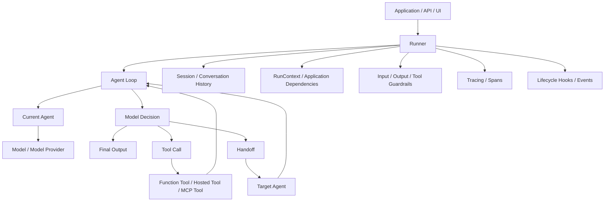
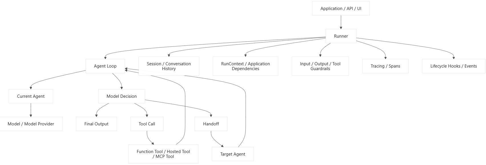
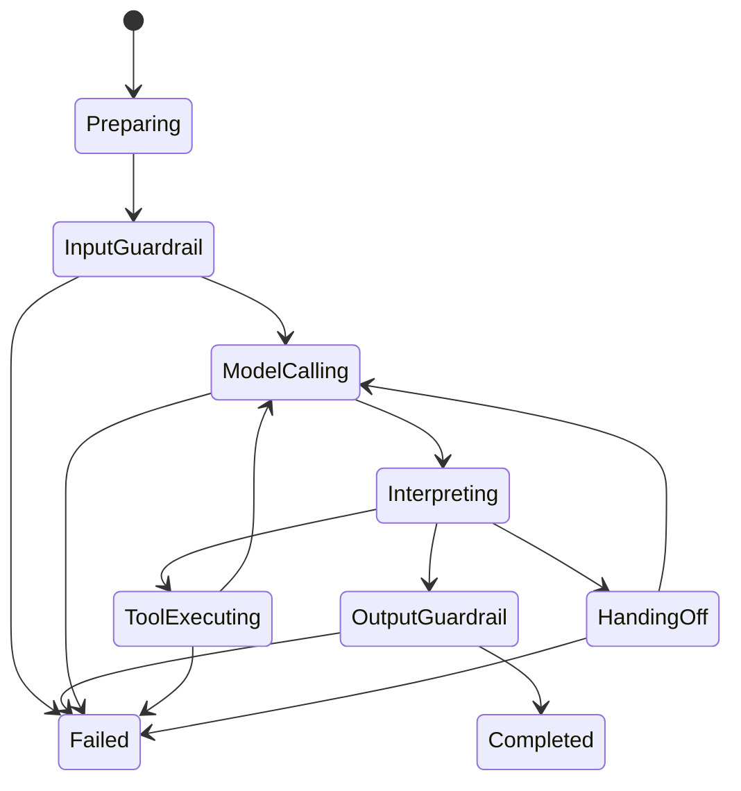
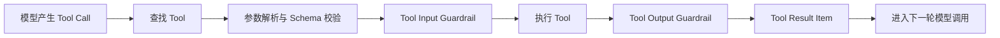
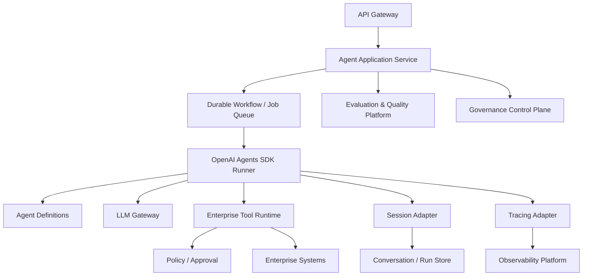

## 前言

OpenAI Agents SDK 的核心，它原生关注的核心概念通常包括：

- `Agent`
- `Runner`
- `Tool`
- `Handoff`
- `Guardrail`
- `RunContext`
- `Session`
- `Tracing`
- 流式事件
- MCP/外部能力接入
- Realtime/Voice 等扩展场景

其中：

- Memory 通常由 Session、历史消息和应用自己的持久化服务共同实现。
- Workflow 通常通过 Agent loop、Tools、Handoffs 和应用代码组合出来。
- 它不是 Temporal、Camunda 一类具有完整持久化工作流语义的引擎。
- 它也不是完整的模型网关、知识库、权限平台或治理平台。

所以更准确的本质是：

```
OpenAI Agents SDK
=
Agent 声明模型
+ Agent Loop 运行时
+ Tool 执行协议
+ Handoff 协作协议
+ Guardrail 检查机制
+ Session 上下文连续性
+ Tracing 可观测性
```

------

# 一、整体架构

````

````



它可以划分为六个逻辑层次：

```
1. Definition Layer
   Agent、Tool、Handoff、Output Type 的声明

2. Runtime Layer
   Runner、Agent Loop、Run State、终止判断

3. Capability Layer
   Function Tools、Hosted Tools、MCP、Computer、File Search 等

4. Coordination Layer
   Handoff、Agent-as-Tool、Manager/Worker 模式

5. Safety Layer
   Input Guardrail、Output Guardrail、Tool Guardrail

6. Observability Layer
   Tracing、Span、Hooks、Streaming Events
```

------

# 二、核心对象关系

```
Runner
  └── 执行 Agent
        ├── Instructions
        ├── Model + Model Settings
        ├── Tools
        ├── Handoffs
        ├── Guardrails
        ├── Output Type
        └── Hooks

执行过程中：
Agent → Model → Tool/Handoff/Final Output
                  ↓
             再次进入 Agent Loop
```

其中最重要的架构关系是：

```
Agent 是声明
Runner 是执行器
Model 是决策器
Tool 是能力
Handoff 是控制权转移
Guardrail 是风险检查
Session 是历史连续性
RunContext 是应用依赖
Tracing 是执行证据
```

------

# 三、Agent：声明式智能体定义

`Agent` 主要描述“这个智能体是谁、如何工作、拥有什么能力”。

概念化接口：

```typescript
// ts
interface Agent<TContext, TOutput> {
  name: string;
  instructions:
    | string
    | ((
        context: RunContext<TContext>,
        agent: Agent<TContext, TOutput>,
      ) => Promise<string> | string);

  model?: string | Model;
  modelSettings?: ModelSettings;

  tools?: Tool<TContext>[];
  handoffs?: Handoff<TContext>[];

  inputGuardrails?: InputGuardrail<TContext>[];
  outputGuardrails?: OutputGuardrail<TContext, TOutput>[];

  outputType?: OutputSchema<TOutput>;

  hooks?: AgentHooks<TContext>;

  handoffDescription?: string;
}
```

Agent 定义包含四类内容。

## 1. 行为定义

- `name`
- `instructions`
- `handoffDescription`

## 2. 推理配置

- `model`
- `modelSettings`
- `outputType`

## 3. 能力配置

- `tools`
- `handoffs`

## 4. 治理配置

- `inputGuardrails`
- `outputGuardrails`
- Tool guardrails
- Hooks
- Tracing metadata

Agent 本身通常不应保存本次运行的可变业务状态。这样同一个 Agent 定义可以安全复用：

```
AgentDefinition：相对静态，可共享
RunState：每次调用独立
RunContext：本次运行依赖
Session：跨调用历史
```

------

# 四、Runner：真正的运行时核心

`Runner` 是 SDK 最关键的组件。

它负责：

1. 接收初始 Agent 和用户输入
2. 获取 Session 历史
3. 执行输入 Guardrail
4. 为当前 Agent 构造模型请求
5. 调用模型
6. 解析模型输出
7. 执行 Tool Call
8. 处理 Handoff
9. 把结果重新放回循环
10. 检测最终输出
11. 执行输出 Guardrail
12. 更新 Session
13. 生成 Trace 和事件
14. 返回运行结果

抽象接口：

```typescript
interface AgentRunner {
  run<TContext, TOutput>(
    agent: Agent<TContext, TOutput>,
    input: AgentInput,
    options?: RunOptions<TContext>,
  ): Promise<RunResult<TContext, TOutput>>;

  runStreamed<TContext, TOutput>(
    agent: Agent<TContext, TOutput>,
    input: AgentInput,
    options?: RunOptions<TContext>,
  ): Promise<StreamedRunResult<TContext, TOutput>>;
}
```

运行配置：

```typescript
interface RunOptions<TContext> {
  context?: TContext;
  session?: Session;

  maxTurns?: number;

  model?: string | Model;
  modelSettings?: ModelSettings;

  hooks?: RunHooks<TContext>;

  tracing?: {
    enabled?: boolean;
    workflowName?: string;
    traceId?: string;
    groupId?: string;
    metadata?: Record<string, unknown>;
  };

  signal?: AbortSignal;
}
```

核心循环可以抽象为：

```typescript
async function runAgentLoop<TContext, TOutput>(
  initialAgent: Agent<TContext, TOutput>,
  input: AgentInput,
  options: RunOptions<TContext>,
): Promise<RunResult<TContext, TOutput>> {
  let currentAgent = initialAgent;
  let items = normalizeInput(input);
  let turn = 0;

  while (turn < (options.maxTurns ?? 10)) {
    turn++;

    await runInputGuardrails(currentAgent, items, options);

    const response = await callModel({
      agent: currentAgent,
      items,
      context: options.context,
    });

    const decision = interpretModelResponse(response);

    if (decision.type === "tool_calls") {
      const toolResults = await executeTools(
        currentAgent,
        decision.calls,
        options,
      );

      items = append(items, response.items, toolResults);
      continue;
    }

    if (decision.type === "handoff") {
      currentAgent = await executeHandoff(
        decision.handoff,
        options,
      );

      items = append(
        items,
        response.items,
        decision.handoffItem,
      );

      continue;
    }

    if (decision.type === "final_output") {
      const output = await parseOutput(
        decision.content,
        currentAgent.outputType,
      );

      await runOutputGuardrails(
        currentAgent,
        output,
        options,
      );

      return {
        finalOutput: output,
        lastAgent: currentAgent,
        newItems: items,
      };
    }
  }

  throw new MaxTurnsExceededError();
}
```

真实实现会更复杂，但这就是它的核心语义。

------

# 五、Agent Loop：有限状态循环

从状态机角度看，Runner 大致处理这些状态：

````

````

模型的一轮输出最终只能导向几种运行时语义：

```typescript
type ModelDecision =
  | {
      type: "tool_calls";
      calls: ToolCall[];
    }
  | {
      type: "handoff";
      handoff: HandoffCall;
    }
  | {
      type: "final_output";
      content: unknown;
    };
```

因此它不是简单聊天循环，而是：

```
Model Output
→ 运行时解释
→ 执行副作用或转移控制权
→ 生成新输入项
→ 再次调用模型
```

------

# 六、RunResult：运行结果不仅是文本

SDK 的结果通常不应被理解为单一字符串。一个完整结果需要包含：

```typescript
interface RunResult<TContext, TOutput> {
  finalOutput: TOutput;

  lastAgent: Agent<TContext, TOutput>;

  newItems: RunItem[];

  rawResponses?: ModelResponse[];

  input?: RunItem[];

  context?: RunContext<TContext>;

  usage?: Usage;

  guardrailResults?: GuardrailResult[];

  traceId?: string;

  toInputList(): RunItem[];
}
```

几个关键字段：

- `finalOutput`：最终回答或结构化结果
- `lastAgent`：最终完成任务的 Agent
- `newItems`：本轮新增的消息、Tool、Handoff 等事件
- `rawResponses`：底层模型响应
- `usage`：Token 等用量
- `toInputList()`：将本次结果转换成下一轮输入

这一设计说明 SDK 内部的核心数据不是字符串，而是一个不断追加的 Run Item 序列。

------

# 七、Run Items：统一运行记录

Agent 运行过程中可能产生：

```
用户消息
模型消息
Reasoning Item
Tool Call
Tool Result
Handoff Call
Handoff Result
Final Output
```

可以抽象为：

```
type RunItem =
  | MessageItem
  | ToolCallItem
  | ToolCallOutputItem
  | HandoffCallItem
  | HandoffOutputItem
  | ReasoningItem;
```

这种设计的价值在于：

- Tool 结果可以标准化反馈给模型
- Handoff 可以被记录为上下文事件
- 流式事件和最终结果可以复用同一协议
- Trace 可以关联具体 Item
- 下一轮调用不必重新拼接任意字符串

------

# 八、Tool：Agent 能力边界

Tool 把普通函数、托管能力或外部协议暴露给模型。

主要类型通常可以理解为：

```
Function Tool
Hosted Tool
MCP Tool
Agent-as-Tool
```

## 1. Function Tool

把应用函数暴露为模型工具：

```typescript
interface FunctionTool<TContext, TInput, TOutput> {
  name: string;
  description: string;

  parameters: JsonSchema;

  invoke(
    context: RunContext<TContext>,
    input: TInput,
  ): Promise<TOutput>;

  inputGuardrails?: ToolInputGuardrail<TContext, TInput>[];
  outputGuardrails?: ToolOutputGuardrail<TContext, TOutput>[];
}
```

示例：

```typescript
const getWeatherTool: FunctionTool<
  AppContext,
  { city: string },
  { temperature: number; condition: string }
> = {
  name: "get_weather",
  description: "查询指定城市的实时天气",
  parameters: {
    type: "object",
    properties: {
      city: { type: "string" },
    },
    required: ["city"],
    additionalProperties: false,
  },

  async invoke(context, input) {
    return context.context.weatherService.getWeather(
      input.city,
    );
  },
};
```

## 2. Hosted Tool

由模型平台提供的托管能力，例如：

- Web Search
- File Search
- Computer
- Code Interpreter
- Image Generation
- 其他平台托管能力

这些工具不一定在应用进程内执行，但对 Agent Loop 来说仍表现为能力调用。

## 3. MCP Tool

MCP 用于把外部工具服务器接入 Agent。

```
Agent
→ Runner
→ MCP Client
→ MCP Server
→ 外部系统
```

MCP 主要解决工具发现和调用协议标准化，不自动解决：

- 用户授权
- 数据权限
- 高风险审批
- 副作用幂等
- 租户隔离
- 工具结果可信度

这些仍需要应用治理。

------

# 九、Tool 执行生命周期

````

````

比较完整的抽象：

```typescript
interface ToolExecutor {
  execute<TContext>(
    call: ToolCall,
    tools: Tool<TContext>[],
    context: RunContext<TContext>,
  ): Promise<ToolCallOutputItem>;
}

async function executeTool<TContext>(
  tool: Tool<TContext>,
  call: ToolCall,
  context: RunContext<TContext>,
): Promise<ToolCallOutputItem> {
  const input = tool.parseInput(call.arguments);

  await runToolInputGuardrails(tool, input, context);

  const result = await tool.invoke(context, input);

  const governedResult =
    await runToolOutputGuardrails(tool, result, context);

  return {
    type: "tool_call_output",
    callId: call.id,
    output: serializeToolResult(governedResult),
  };
}
```

在生产系统里，还应在 SDK Tool 外围增加：

- 权限检查
- 超时
- 重试
- 限流
- 审批
- 幂等键
- 凭证注入
- 日志脱敏
- 审计记录
- 结果截断和 Artifact 存储

------

# 十、Handoff：控制权转移机制

Handoff 不等于普通工具调用。

普通工具调用：

```
当前 Agent 保持控制权
→ 调用一个能力
→ 获取结果
→ 当前 Agent 继续运行
```

Handoff：

```
当前 Agent 将任务控制权交给目标 Agent
→ 目标 Agent 成为当前 Agent
→ 后续决策由目标 Agent 负责
```

抽象接口：

```
interface Handoff<TContext, TInput = unknown> {
  name: string;
  description: string;

  targetAgent: Agent<TContext, unknown>;

  inputSchema?: JsonSchema;

  onHandoff?: (
    context: RunContext<TContext>,
    input: TInput,
  ) => Promise<void>;

  inputFilter?: (
    history: RunItem[],
  ) => RunItem[];

  isEnabled?: (
    context: RunContext<TContext>,
  ) => boolean | Promise<boolean>;
}
```

Handoff 的关键能力：

## 1. 目标 Agent 描述

模型必须知道什么时候应该转交。

## 2. 结构化 Handoff 输入

可以让路由 Agent提取转交所需信息：

```
interface RefundHandoffInput {
  orderId: string;
  reason: string;
  urgency?: string;
}
```

## 3. Input Filter

转交时不一定把全部历史交给目标 Agent：

```
const inputFilter = (
  history: RunItem[],
): RunItem[] => {
  return selectRelevantHistory(history);
};
```

这对于以下方面非常重要：

- 最小化上下文
- 避免敏感数据泄漏
- 降低 Token 消耗
- 防止无关历史干扰
- 限制跨 Agent 权限扩散

------

# 十一、Handoff 与 Agent-as-Tool 的区别

这是 SDK 架构中最重要的设计选择之一。

| 维度     | Handoff                 | Agent-as-Tool               |
| -------- | ----------------------- | --------------------------- |
| 控制权   | 转移给目标 Agent        | 主 Agent 保持控制权         |
| 最终答复 | 目标 Agent 可以直接完成 | 子 Agent 返回结果给主 Agent |
| 适用模式 | 分诊、职责路由          | Manager/Worker              |
| 上下文   | 可过滤后传递            | 通常传递明确任务输入        |
| 用户体验 | 像转接部门              | 像后台调用专家              |
| 编排者   | 当前 Agent 放弃主导     | 主 Agent 汇总结果           |

## Handoff 模式

```
Triage Agent
├── Billing Agent
├── Refund Agent
└── Technical Support Agent
```

## Agent-as-Tool 模式

```
Research Manager
├── 调用 Search Agent
├── 调用 Analysis Agent
└── 调用 Writing Agent
最终由 Research Manager 汇总
```

概念化代码：

```
function agentAsTool<TContext, TOutput>(
  agent: Agent<TContext, TOutput>,
  options: {
    toolName: string;
    toolDescription: string;
  },
): Tool<TContext> {
  return {
    name: options.toolName,
    description: options.toolDescription,

    async invoke(context, input) {
      const result = await Runner.run(agent, input, {
        context: context.context,
      });

      return result.finalOutput;
    },
  };
}
```

------

# 十二、Guardrails：检查与中断机制

Guardrail 的核心不是替代业务权限系统，而是在关键阶段执行检查并阻止不合规运行。

常见类型：

```
Input Guardrail
Output Guardrail
Tool Input Guardrail
Tool Output Guardrail
```

## 1. Input Guardrail

检查初始输入是否允许进入主要 Agent 流程：

```
interface InputGuardrail<TContext> {
  name: string;

  run(
    context: RunContext<TContext>,
    agent: Agent<TContext, unknown>,
    input: AgentInput,
  ): Promise<GuardrailResult>;
}
```

## 2. Output Guardrail

检查 Agent 最终输出：

```
interface OutputGuardrail<TContext, TOutput> {
  name: string;

  run(
    context: RunContext<TContext>,
    agent: Agent<TContext, TOutput>,
    output: TOutput,
  ): Promise<GuardrailResult>;
}
```

## 3. Tool Guardrail

检查 Tool 输入或输出：

```
interface ToolInputGuardrail<TContext, TInput> {
  run(
    context: RunContext<TContext>,
    tool: Tool<TContext>,
    input: TInput,
  ): Promise<GuardrailResult>;
}
```

统一结果：

```
interface GuardrailResult {
  tripwireTriggered: boolean;

  outputInfo?: unknown;

  reason?: string;
}
```

如果触发 Tripwire，Runner 通常会中断相应阶段并抛出专门异常：

```
class GuardrailTripwireTriggered extends Error {
  constructor(
    public readonly guardrailName: string,
    public readonly outputInfo?: unknown,
  ) {
    super(`Guardrail triggered: ${guardrailName}`);
  }
}
```

------

# 十三、Guardrail 不是完整治理系统

需要明确它的边界。

Guardrail 适合：

- 输入分类
- 内容安全检查
- 输出格式检查
- 敏感信息检测
- 范围检查
- Tool 参数风险检查

Guardrail 不能单独替代：

- RBAC/ABAC
- 租户隔离
- 数据库权限
- Tool 幂等
- 事务
- 人工审批工作流
- 合规审计
- 预算中心
- 生产 Kill Switch

正确组合：

```
Guardrail：Agent 运行时检查
Policy Engine：组织级策略决策
Tool Runtime：能力执行治理
基础设施权限：最终安全边界
```

------

# 十四、RunContext：依赖注入而不是模型上下文

`RunContext` 很容易和发送给模型的 Context 混淆。

它通常用于保存应用依赖和本次运行资源：

```typescript
interface AppContext {
  userId: string;
  tenantId: string;

  database: Database;
  orderService: OrderService;
  permissionService: PermissionService;

  locale: string;
}
```

然后传给 Runner：

```typescript
const result = await Runner.run(agent, userInput, {
  context: {
    userId: "u-123",
    tenantId: "tenant-a",
    database,
    orderService,
    permissionService,
    locale: "zh-CN",
  },
});
```

Tool 或动态 Instructions 可以读取它：

```
async function dynamicInstructions(
  runContext: RunContext<AppContext>,
): Promise<string> {
  return `
当前用户 ID：${runContext.context.userId}
语言：${runContext.context.locale}
`;
}
```

关键原则：

> RunContext 中的内容默认不是全部发送给模型。

RunContext 可以包含：

- 数据库连接
- Service Client
- Credential Resolver
- 用户身份
- 租户信息
- Logger
- Trace Context

而模型 Context 只应包含经过选择和编译的信息。

------

# 十五、Session：会话连续性与短期记忆

Session 的主要作用是管理跨多次 Runner 调用的历史信息。

```
第一次调用：
Session History + 用户输入
→ Runner
→ 新 Run Items
→ 写回 Session

第二次调用：
更新后的 Session History + 新用户输入
→ Runner
```

抽象接口：

```
interface Session {
  getItems(
    limit?: number,
  ): Promise<RunItem[]>;

  addItems(
    items: RunItem[],
  ): Promise<void>;

  popItem?(): Promise<RunItem | undefined>;

  clearSession?(): Promise<void>;
}
```

使用方式：

```
const session = new PersistentSession({
  sessionId: "conversation-123",
});

const first = await Runner.run(agent, "我的订单在哪？", {
  session,
  context: appContext,
});

const second = await Runner.run(agent, "预计什么时候到？", {
  session,
  context: appContext,
});
```

第二次调用可以利用第一次的订单语境。

------

# 十六、Session 不等于完整 Memory

建议区分：

```
Session
  保存对话连续性和近期 Run Items

Working Memory
  保存当前 Run 的计划、状态、临时事实

Long-term Memory
  保存跨会话的稳定偏好、事实和经验

Knowledge
  保存企业文档和外部知识
```

SDK 的 Session 可以作为 Memory 架构的一个基础，但生产系统通常还需要自己的：

```typescript
interface MemoryService {
  search(
    query: MemoryQuery,
  ): Promise<MemoryItem[]>;

  write(
    input: MemoryWriteInput,
  ): Promise<MemoryItem>;

  forget(
    memoryId: string,
  ): Promise<void>;
}
```

Memory 结果应先经过权限、相关性和 Token 预算选择，然后才进入动态 Instructions 或模型输入。

------

# 十七、Workflow：SDK 中如何表达工作流

OpenAI Agents SDK 通常不是通过一个重型 BPMN 引擎定义 Workflow，而是通过组合原语表达：

```
Agent Loop
Tools
Handoffs
Agent-as-Tool
Application Code
Structured Output
Hooks
Sessions
```

常见工作流模式如下。

## 1. Routing

```
Triage Agent
→ Handoff 到专业 Agent
```

## 2. Manager–Worker

```
Manager Agent
→ 把专业 Agent 当 Tool 调用
→ 汇总最终结果
```

## 3. Deterministic Chain

```typescript
const classification = await Runner.run(
  classifierAgent,
  input,
);

const research = await Runner.run(
  researchAgent,
  classification.finalOutput,
);

const answer = await Runner.run(
  writerAgent,
  research.finalOutput,
);
```

编排由应用代码确定，模型不能任意改变顺序。

## 4. Evaluator–Optimizer

```
let draft = await Runner.run(writerAgent, input);

for (let i = 0; i < 2; i++) {
  const review = await Runner.run(
    reviewerAgent,
    draft.finalOutput,
  );

  if (review.finalOutput.approved) {
    break;
  }

  draft = await Runner.run(writerAgent, {
    originalTask: input,
    previousDraft: draft.finalOutput,
    feedback: review.finalOutput.feedback,
  });
}
```

## 5. Parallel Fan-out/Fan-in

```
const [market, technical, legal] =
  await Promise.all([
    Runner.run(marketAgent, input),
    Runner.run(technicalAgent, input),
    Runner.run(legalAgent, input),
  ]);

const result = await Runner.run(synthesisAgent, {
  market: market.finalOutput,
  technical: technical.finalOutput,
  legal: legal.finalOutput,
});
```

复杂、长时间、必须可靠恢复的业务流程，建议由外部工作流引擎承载：

```
Temporal / Durable Workflow
        ↓
每个 Workflow Activity 内调用 Runner
        ↓
OpenAI Agents SDK 负责局部智能决策
```

边界是：

```
确定性、持久化、强一致流程 → Workflow Engine
局部开放式智能决策        → Agents SDK
```

------

# 十八、Tracing：一等可观测性

Tracing 是 Agents SDK 相比手写 Agent Loop 的重要价值之一。

典型 Trace 层次：

```
Trace: Customer Support Workflow
├── Agent Span: Triage Agent
│   ├── Generation Span
│   └── Handoff Span
├── Agent Span: Refund Agent
│   ├── Generation Span
│   ├── Tool Span: get_order
│   ├── Tool Span: calculate_refund
│   └── Generation Span
└── Guardrail Span
```

核心概念：

- Trace：一次完整业务工作流
- Span：其中一个执行步骤
- Generation Span：模型调用
- Function Span：工具调用
- Handoff Span：控制权转移
- Guardrail Span：安全检查

概念接口：

```
interface TraceContext {
  traceId: string;
  workflowName: string;
  groupId?: string;
  metadata?: Record<string, unknown>;
}

interface Tracer {
  startTrace(
    context: TraceContext,
  ): Trace;

  startSpan(
    trace: Trace,
    input: StartSpanInput,
  ): Span;

  endSpan(
    span: Span,
    result?: unknown,
  ): void;

  recordError(
    span: Span,
    error: unknown,
  ): void;
}
```

生产系统还需要补充：

- 敏感字段脱敏
- Prompt/Response 保留策略
- Trace 访问权限
- Token 和成本统计
- 业务结果关联
- 用户反馈关联
- 审计存储

------

# 十九、Hooks：生命周期扩展点

Hooks 用于在 Agent 运行的关键阶段执行应用逻辑：

```
interface RunHooks<TContext> {
  onAgentStart?(
    context: RunContext<TContext>,
    agent: Agent<TContext, unknown>,
  ): Promise<void>;

  onAgentEnd?(
    context: RunContext<TContext>,
    agent: Agent<TContext, unknown>,
    output: unknown,
  ): Promise<void>;

  onToolStart?(
    context: RunContext<TContext>,
    agent: Agent<TContext, unknown>,
    tool: Tool<TContext>,
  ): Promise<void>;

  onToolEnd?(
    context: RunContext<TContext>,
    agent: Agent<TContext, unknown>,
    tool: Tool<TContext>,
    result: unknown,
  ): Promise<void>;

  onHandoff?(
    context: RunContext<TContext>,
    from: Agent<TContext, unknown>,
    to: Agent<TContext, unknown>,
  ): Promise<void>;
}
```

Hooks 适合：

- 指标
- 日志
- 审计
- 用量统计
- 业务事件
- Debug
- 轻量治理扩展

但不建议把核心业务逻辑全部藏进 Hooks，否则运行流程会变得隐式、难以测试。

------

# 二十、流式架构

流式运行不只是输出 Token delta，还可能产生语义事件：

```
type StreamEvent =
  | {
      type: "raw_model_event";
      data: unknown;
    }
  | {
      type: "run_item_event";
      item: RunItem;
    }
  | {
      type: "agent_updated";
      agent: Agent<unknown, unknown>;
    }
  | {
      type: "tool_started";
      toolName: string;
    }
  | {
      type: "tool_completed";
      result: unknown;
    }
  | {
      type: "handoff";
      from: string;
      to: string;
    };
```

因此前端可以显示：

```
正在分析问题
→ 正在调用订单查询工具
→ 已获得订单状态
→ 已转交退款专员
→ 正在生成最终回答
```

而不只是逐字显示模型输出。

------

# 二十一、模型抽象层

Agent 通常不应该被硬编码到唯一模型。

```
interface Model {
  getResponse(
    request: ModelRequest,
  ): Promise<ModelResponse>;

  streamResponse(
    request: ModelRequest,
  ): AsyncIterable<ModelStreamEvent>;
}
```

模型请求需要统一表达：

```
interface ModelRequest {
  systemInstructions?: string;

  input: RunItem[];

  tools: ToolDefinition[];
  handoffs: HandoffDefinition[];

  outputSchema?: JsonSchema;

  settings?: ModelSettings;
}
```

这一层可以支持：

- OpenAI 模型
- OpenAI-compatible Provider
- 自定义 Model Provider
- 测试用 Fake Model
- 记录/回放 Model

不过不同模型对 Tool Calling、结构化输出、Reasoning、Handoff 表现不同，不能只做到 HTTP 字段兼容，还需要能力检查和行为评测。

------

# 二十二、结构化输出

Agent 可以声明输出类型，让最终结果从自由文本变成强类型业务对象。

```
interface SupportDecision {
  category:
    | "billing"
    | "refund"
    | "technical"
    | "other";

  answer: string;

  confidence: number;

  requiresHumanReview: boolean;
}
```

Agent 声明：

```
const supportAgent: Agent<
  AppContext,
  SupportDecision
> = {
  name: "Support Agent",

  instructions: `
分析用户问题并给出客服处理结果。
`,

  outputType: supportDecisionSchema,
};
```

Runner 负责：

```
将输出 Schema 发送给模型
→ 解析模型输出
→ 验证 Schema
→ 返回类型化 finalOutput
```

结构化输出适合：

- 路由结果
- Action 建议
- 分类
- 评分
- 业务决策草案
- API 返回对象

但 Schema 正确不等于内容事实正确，仍需业务校验。

------

# 二十三、错误体系

架构上至少应区分：

```
Model Error
Tool Error
Input Guardrail Tripwire
Output Guardrail Tripwire
Tool Guardrail Tripwire
Max Turns Exceeded
Structured Output Error
Handoff Error
MCP Error
Session Error
User Cancellation
```

概念化错误：

```typescript
type AgentSDKError =
  | ModelInvocationError
  | ToolExecutionError
  | GuardrailTripwireError
  | MaxTurnsExceededError
  | OutputValidationError
  | HandoffExecutionError
  | SessionPersistenceError
  | RunCancelledError;
```

生产应用不应统一返回“Agent 执行失败”，而应根据错误类型决定：

```
模型临时失败      → 重试或模型 Fallback
Tool 参数错误     → 反馈给模型有限次数修正
Tool 业务错误     → 作为 Observation 返回
Guardrail 触发    → 安全拒绝或转人工
Max Turns         → 终止并保留 Trace
Session 写入失败  → 避免误报成功
高风险结果未知    → 停止并人工核对
```

------

# 二十四、SDK 的主要架构优势

## 1. 少量核心原语

核心概念不多：

```
Agent
Runner
Tool
Handoff
Guardrail
Session
Tracing
```

学习和组合成本相对较低。

## 2. Agent Loop 标准化

避免每个团队都重新实现：

- Tool Call 解析
- Tool 结果回填
- Handoff
- 最大轮数
- 流式事件
- 结构化输出
- Trace

## 3. Python/TypeScript 代码优先

工作流可以通过普通代码表达：

- 条件
- 循环
- 并行
- 错误处理
- 测试
- 依赖注入

## 4. Handoff 是一等概念

不需要把多 Agent 协作伪装成普通 Function Tool。

## 5. 可观测性内建

模型、工具、Handoff、Guardrail 可以形成统一 Trace。

## 6. 与 OpenAI 模型能力贴近

能较自然地使用模型原生 Tool Calling、结构化输出、Reasoning 和托管工具能力。

------

# 二十五、SDK 不提供或不应独自承担的能力

理解边界比理解功能更重要。

## 1. 不等于持久化工作流引擎

默认不要假设它完整提供：

- Worker 崩溃恢复
- 跨天 Timer
- 分布式 Lease
- Exactly-once Activity
- Saga
- 长期 Checkpoint
- 可靠审批任务队列

长任务应结合外部工作流引擎。

## 2. 不等于完整 Memory 平台

Session 主要解决历史连续性，不等于：

- Memory 抽取
- 长期记忆
- 冲突消解
- 隐私治理
- 用户查看和删除
- 生命周期管理

## 3. 不等于企业级治理平台

Guardrail 不等于：

- IAM
- ABAC
- 审批中心
- 数据防泄漏平台
- 评测平台
- 事故管理
- 合规审计平台

## 4. 不等于完整 LLM Gateway

如果需要多 Provider、成本路由、限流、熔断、统一计费，通常仍需独立 Gateway。

## 5. 不等于 RAG 平台

虽然可以使用 File Search、MCP 或自定义 Tool，但知识入库、ACL、Rerank、引用校验等仍是应用责任。

------

# 二十六、生产级扩展架构

实际企业应用中，可以把 SDK 放在 Agent Core/局部运行时的位置：

````

````

职责建议如下：

| 组件                | 主要职责                                   |
| ------------------- | ------------------------------------------ |
| Agents SDK          | 局部 Agent Loop、Tools、Handoff、Guardrail |
| Application Service | 用例入口、用户和租户、业务流程             |
| Workflow Engine     | 长任务、可靠恢复、审批等待、Timer          |
| LLM Gateway         | Provider、模型路由、成本、限流             |
| Tool Runtime        | 权限、幂等、审批、凭证、审计               |
| Session Store       | 对话历史和短期连续性                       |
| Memory Service      | 长期记忆和治理                             |
| Policy Engine       | 组织级可执行策略                           |
| Evaluation Platform | 离线评测、回归门禁、线上质量               |
| Observability       | Trace、指标、日志和告警                    |

------

# 二十七、推荐封装方式

不要让业务代码到处直接调用 SDK。可以在外层增加自己的端口。

```typescript
interface EnterpriseAgentRuntime {
  run<TInput, TOutput>(
    request: EnterpriseAgentRequest<TInput>,
  ): Promise<EnterpriseAgentResult<TOutput>>;
}

interface EnterpriseAgentRequest<TInput> {
  agentId: string;
  input: TInput;

  user: {
    userId: string;
    tenantId: string;
    permissions: string[];
  };

  execution: {
    sessionId?: string;
    maxTurns?: number;
    timeoutMs?: number;
    maxCost?: number;
  };

  idempotencyKey?: string;
}
```

适配 SDK：

```typescript
class OpenAIAgentsRuntime
  implements EnterpriseAgentRuntime {
  constructor(
    private readonly registry: AgentRegistry,
    private readonly sessions: SessionFactory,
    private readonly policy: PolicyEngine,
    private readonly usage: UsageRecorder,
  ) {}

  async run<TInput, TOutput>(
    request: EnterpriseAgentRequest<TInput>,
  ): Promise<EnterpriseAgentResult<TOutput>> {
    const definition =
      await this.registry.resolve<TOutput>(
        request.agentId,
      );

    await this.policy.assertCanRun({
      agentId: request.agentId,
      user: request.user,
      input: request.input,
    });

    const session = request.execution.sessionId
      ? await this.sessions.open(
          request.execution.sessionId,
        )
      : undefined;

    const result = await Runner.run(
      definition.agent,
      request.input,
      {
        session,
        maxTurns: request.execution.maxTurns,
        context: {
          user: request.user,
          services: definition.services,
        },
      },
    );

    await this.usage.record(result);

    return {
      output: result.finalOutput,
      lastAgent: result.lastAgent.name,
      usage: result.usage,
      traceId: result.traceId,
    };
  }
}
```

这样做的好处是：

- SDK 升级被限制在 Adapter 内
- 业务代码不依赖 SDK 类型
- 可以替换或并存其他 Runtime
- 统一增加权限、成本和审计
- 便于测试

------

# 二十八、测试架构

Agents SDK 应从多个层次测试。

## 1. Agent Definition 测试

- 是否绑定正确工具
- Handoff 是否正确配置
- Guardrail 是否注册
- 输出 Schema 是否正确

## 2. Tool 单元测试

- 参数校验
- 权限
- 成功路径
- 错误路径
- 超时
- 幂等性

## 3. Fake Model 测试

通过确定性模型输出测试 Runner 行为：

```
class FakeModel implements Model {
  constructor(
    private readonly responses: ModelResponse[],
  ) {}

  async getResponse(): Promise<ModelResponse> {
    const response = this.responses.shift();

    if (!response) {
      throw new Error("No fake response available");
    }

    return response;
  }
}
```

可测试：

```
模型请求 Tool
→ Tool 执行
→ 结果回填
→ 模型输出 Final Answer
```

## 4. Handoff 测试

- 正确目标 Agent
- 输入是否过滤
- 是否传递必要上下文
- Handoff 是否可能循环
- 最大 Turn 是否有效

## 5. Guardrail 测试

- 正常输入不误拦截
- 高风险输入正确拦截
- 输出泄露被检测
- Tool 参数风险被拦截

## 6. E2E 评测

使用真实模型验证：

- Task Success
- Tool Selection Accuracy
- Tool Argument Accuracy
- Handoff Accuracy
- Groundedness
- 安全性
- 成本和延迟

------

# 二十九、常见架构误区

## 1. 把 Agent 当作有状态对象

Agent 定义应尽量保持可复用；运行状态应放在 Run、Context 或 Session 中。

## 2. 把 RunContext 全部发送给模型

RunContext 是应用依赖容器，不等于模型上下文。

## 3. 把 Handoff 当 Tool

两者的控制权语义不同。

## 4. 认为 Session 就是完整长期 Memory

Session 更接近会话历史管理。

## 5. 用 Guardrail 替代权限系统

Guardrail 是检查机制，基础设施权限才是硬边界。

## 6. 用 Handoff 构建所有多 Agent 场景

需要主 Agent 汇总时，更适合 Agent-as-Tool。

## 7. 用 Agents SDK 替代持久化工作流引擎

跨小时、跨天、带审批和外部副作用的流程需要更可靠的编排层。

## 8. Tool 内直接使用超级权限

Tool 必须使用当前用户和租户范围内的最小权限。

## 9. 把业务逻辑藏进 Hooks

Hooks 更适合横切逻辑，不适合承载关键流程。

## 10. 没有限制 Agent 循环

必须设置最大 Turn、超时、Tool 次数和成本预算。

------

# 三十、OpenAI Agents SDK 的本质抽象

可以把它浓缩为以下接口模型：

```typescript
interface AgentRuntime<TContext> {
  run<TOutput>(
    agent: Agent<TContext, TOutput>,
    input: AgentInput,
    options: RunOptions<TContext>,
  ): Promise<RunResult<TContext, TOutput>>;
}

interface Agent<TContext, TOutput> {
  instructions: Instructions<TContext>;
  model: Model;

  tools: Tool<TContext>[];
  handoffs: Handoff<TContext>[];

  inputGuardrails: InputGuardrail<TContext>[];
  outputGuardrails: OutputGuardrail<TContext, TOutput>[];

  outputType?: OutputSchema<TOutput>;
}

interface Model {
  respond(
    request: ModelRequest,
  ): Promise<ModelResponse>;
}

interface Tool<TContext> {
  invoke(
    context: RunContext<TContext>,
    input: unknown,
  ): Promise<unknown>;
}

interface Handoff<TContext> {
  targetAgent: Agent<TContext, unknown>;

  transfer(
    context: RunContext<TContext>,
    input: unknown,
  ): Promise<void>;
}

interface Guardrail<TInput> {
  check(input: TInput): Promise<GuardrailResult>;
}
```

其运行语义可以进一步压缩成：

```typescript
while (!finished && turns < maxTurns) {
  const response = await currentAgent.model.respond(
    buildModelRequest(
      currentAgent,
      runItems,
    ),
  );

  if (response.requestsTools) {
    runItems.push(
      ...await executeTools(response.toolCalls),
    );
    continue;
  }

  if (response.requestsHandoff) {
    currentAgent = resolveTargetAgent(
      response.handoff,
    );
    continue;
  }

  finalOutput = validateOutput(response);
  finished = true;
}
```

------

# 三十一、最终判断

OpenAI Agents SDK 的架构核心不是“多个 Agent 互相聊天”，而是三个关键机制：

```
1. Agent Loop
   将模型输出解释为 Tool、Handoff 或 Final Output

2. Capability Composition
   通过 Tools、MCP、Hosted Tools、Agent-as-Tool 扩展能力

3. Controlled Coordination
   通过 Handoff、Guardrail、Session 和 Tracing 管理协作过程
```

从系统架构看，它最适合被定位为：

> Agent 应用中的智能决策运行时和局部编排内核。

它解决的是：

- 如何声明 Agent
- 如何执行 Agent Loop
- 如何调用 Tool
- 如何转交给其他 Agent
- 如何进行运行时检查
- 如何维持会话历史
- 如何观察执行过程

它不应单独承担：

- 企业权限体系
- 长期 Memory 治理
- 可靠长流程
- 多 Provider 模型治理
- 高风险审批
- 知识治理
- 质量评测平台
- 完整生产运维治理

生产级架构的合理组合是：

```
企业应用控制面
    +
可靠工作流与任务调度
    +
OpenAI Agents SDK 智能运行时
    +
受治理的 Tool Runtime
    +
LLM Gateway
    +
Memory / Knowledge
    +
Evaluation / Observability / Policy
```

一句话概括：

> OpenAI Agents SDK 把“模型调用”提升成了“带工具、转交、安全检查、会话和追踪的 Agent Loop”，但真正的生产级 Agent 系统仍需在它外部补齐持久化执行、权限治理、质量评测、知识管理和基础设施可靠性。