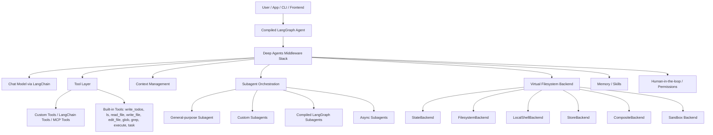
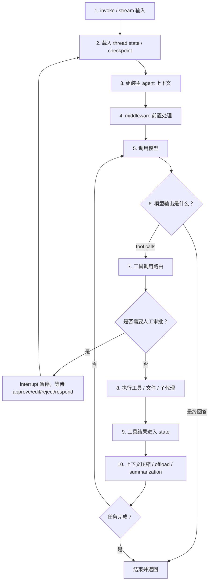
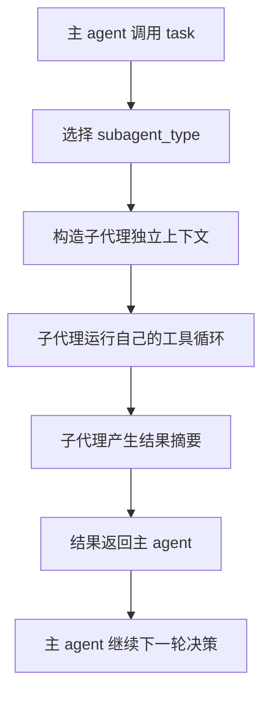
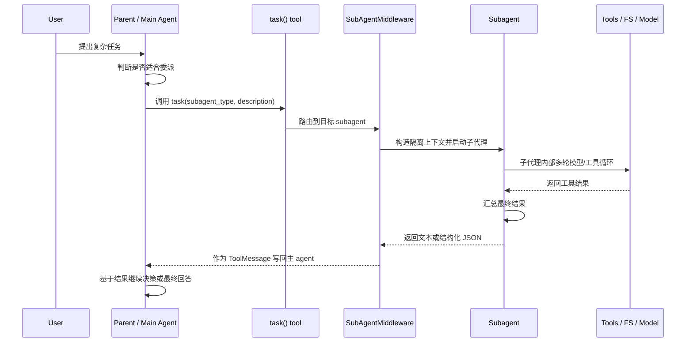

## 架构分析

下面基于 LangChain 官方 Deep Agents 文档和仓库 README 分析。注意：官方现在主要使用 `docs.langchain.com/oss/python/deepagents/...`，不是旧式 `langchain.org` 页面。

**一句话定位**

Deep Agents 不是一个全新的底层 agent runtime，而是一个“电池已装好”的 agent harness：底层用 LangGraph 做持久执行、流式、checkpoint、HITL 等运行时能力；中间用 LangChain 的 `create_agent`/tool-calling 基础；上层把规划、文件系统、子代理、上下文压缩、记忆、技能、权限等默认组合起来。官方 README 也明确说：LangGraph 是 runtime，LangChain `create_agent` 是轻量 harness，Deep Agents 是更强约束、更完整的 harness。
来源：[Deep Agents overview](https://docs.langchain.com/oss/python/deepagents/overview)、[GitHub README](https://github.com/langchain-ai/deepagents)

**整体架构**

````

````

它的核心是“coordinator-worker”结构：主 agent 负责理解目标、制定计划、选择工具、委派任务；子 agent 在隔离上下文中完成具体工作，只把浓缩结果返回主 agent。官方前端文档也直接称其为 coordinator-worker architecture。
来源：[Frontend overview](https://docs.langchain.com/oss/python/deepagents/frontend/overview)

**核心模块**

| 模块               | 组件                                                         | 作用                                                         |
| ------------------ | ------------------------------------------------------------ | ------------------------------------------------------------ |
| Agent 构造层       | `create_deep_agent(...)`                                     | 主入口，接收 `model`、`tools`、`system_prompt`、`middleware`、`subagents`、`skills`、`memory`、`backend`、`interrupt_on`、`checkpointer`、`store` 等参数，最后返回一个 LangGraph `CompiledStateGraph`。来源：[Customization](https://docs.langchain.com/oss/python/deepagents/customization) |
| 模型层             | LangChain chat model                                         | 支持 `provider:model` 字符串或已初始化模型对象。理论上任何支持 tool calling 的模型都可用，包括 OpenAI、Anthropic、Google、OpenRouter、Fireworks、Baseten、Ollama 等。来源：[Overview](https://docs.langchain.com/oss/python/deepagents/overview) |
| Middleware 层      | 默认 middleware stack                                        | Deep Agents 的真正“架构胶水”。默认包括 `TodoListMiddleware`、`FilesystemMiddleware`、`SubAgentMiddleware`、`SummarizationMiddleware`、`AnthropicPromptCachingMiddleware`、`PatchToolCallsMiddleware`；使用 memory、skills、HITL 时还会加入对应 middleware。来源：[Customization](https://docs.langchain.com/oss/python/deepagents/customization) |
| 规划层             | `write_todos`                                                | 让 agent 把复杂任务拆成 todo，追踪状态，并随执行过程调整计划。来源：[Overview](https://docs.langchain.com/oss/python/deepagents/overview) |
| 工具层             | 自定义 tools、LangChain tools、MCP tools                     | 用户可传入普通函数、LangChain tool、tool dict，也可以接入任意 MCP server 暴露的工具。来源：[Tools](https://docs.langchain.com/oss/python/deepagents/tools) |
| 内置 harness tools | `ls`、`read_file`、`write_file`、`edit_file`、`glob`、`grep`、`execute`、`task`、`write_todos` | 提供文件操作、shell 执行、子代理调用、规划能力。`execute` 只有 shell/sandbox 后端支持。来源：[Tools](https://docs.langchain.com/oss/python/deepagents/tools) |
| 虚拟文件系统层     | backend protocol                                             | 所有文件工具都通过可插拔 backend 操作，不直接绑定某一种存储。支持内存状态、本地磁盘、LangGraph store、LangSmith Context Hub、组合路由、sandbox 等。来源：[Backends](https://docs.langchain.com/oss/python/deepagents/backends) |
| 上下文管理         | offloading + summarization                                   | 大工具输入/输出会被写入文件系统，只在上下文中保留路径和预览；历史消息接近上下文窗口上限时自动总结，并把原始会话文本保存在文件系统。来源：[Context engineering](https://docs.langchain.com/oss/python/deepagents/context-engineering) |
| 子代理层           | `task` tool、general-purpose subagent、custom subagents、compiled subagents | 主 agent 通过 `task` 委派任务。默认会自动加入同步 `general-purpose` 子代理；也可定义专用子代理，或传入已编译 LangGraph graph。来源：[Subagents](https://docs.langchain.com/oss/python/deepagents/subagents) |
| 记忆层             | `memory=[...]` + backend                                     | 长期记忆以文件形式存在，例如 `AGENTS.md`，由 backend 控制存储范围。可做 agent-scoped memory 或 user-scoped memory。来源：[Memory](https://docs.langchain.com/oss/python/deepagents/memory) |
| 技能层             | `skills=[...]` + `SKILL.md`                                  | 用 progressive disclosure 方式加载能力：启动时只读 skill frontmatter，相关时再读完整 `SKILL.md` 和辅助文件。来源：[Skills](https://docs.langchain.com/oss/python/deepagents/skills) |
| 安全与人工审批     | `interrupt_on`、permissions、HITL                            | 可对敏感工具调用或文件路径操作暂停，等待人类 approve/edit/reject/respond。需要 checkpointer 来恢复运行。来源：[Human-in-the-loop](https://docs.langchain.com/oss/python/deepagents/human-in-the-loop) |
| 可观测与前端       | `stream_events`、`stream.subagents`、LangSmith metadata      | 可以分别观察主 agent 消息、子代理流、工具调用、状态值；子代理 run 会带 `lc_agent_name` 便于 LangSmith 过滤。来源：[Subagents](https://docs.langchain.com/oss/python/deepagents/subagents)、[Frontend overview](https://docs.langchain.com/oss/python/deepagents/frontend/overview) |

**核心流程**

1. **初始化流程**
   开发者调用 `create_deep_agent`，传入模型、工具、系统提示、backend、memory、skills、subagents 等。Deep Agents 解析模型 profile，组装系统 prompt，加入默认 middleware，注册内置工具和用户工具，最后编译成 LangGraph graph。
2. **提示词组装流程**
   系统 prompt 不是一整块硬编码文本，而是分层拼装：用户传入的 `system_prompt` 在前，SDK 默认 base prompt 在中间，模型 profile 的 suffix 在最后。内置工具、文件系统、todo、subagent、memory、skills、HITL 等也会通过 middleware 追加对应说明。
   这点很关键：Deep Agents 的“可靠性”很大程度来自 prompt + middleware + tool surface 的共同约束。
3. **主 agent 执行流程**
   用户输入进入 LangGraph graph；主 agent 读取当前 messages、state、runtime context、可见工具和系统指令；模型决定下一步是直接回答、写 todo、调用工具、读写文件、调用子代理，还是请求人工审批。
4. **规划流程**
   遇到复杂任务时，模型使用 `write_todos` 生成结构化任务列表，持续更新任务状态。这让 agent 不只是一次性 tool calling，而是有一个显式工作台。
5. **工具调用流程**
   模型调用自定义工具、MCP 工具或内置工具。工具调用前可能被 middleware 拦截，例如 HITL 审批、权限检查、tool call 修复、日志、缓存等。工具输出如果太大，会被 offload 到虚拟文件系统，只把路径和摘要留在上下文里。
6. **文件系统流程**
   `ls/read_file/write_file/edit_file/glob/grep` 不直接访问某个固定磁盘，而是通过 backend。默认 `StateBackend` 是线程内 scratchpad；`FilesystemBackend` 访问本地目录；`StoreBackend` 做跨线程持久存储；`CompositeBackend` 可以把 `/workspace/`、`/memories/` 等路径路由到不同 backend。
7. **子代理委派流程**
   主 agent 判断某个任务会污染上下文或需要专门能力，就调用 `task`。子代理拿到独立上下文、自己的 system prompt、工具集、模型和权限配置，完成任务后返回精简结果。主 agent 不继承子代理的所有中间 tool calls，因此上下文更干净。
8. **上下文压缩流程**
   当工具输入/输出或历史消息变大，Deep Agents 先做 offloading，把大内容写入文件系统；如果上下文仍接近模型限制，再触发 summarization，把旧消息压缩成结构化摘要，同时保存原始会话记录。
9. **长期记忆和技能流程**
   memory 文件会作为稳定上下文进入系统提示或被按需读取；skills 则更像“可发现的工作流包”：启动时只暴露名称和描述，模型判断相关时再读完整内容。这是 Deep Agents 避免系统 prompt 无限膨胀的设计之一。
10. **人工审批流程**
       对危险工具或受保护路径，agent 会暂停运行并返回 interrupt。外部系统或用户做出 approve/edit/reject/respond 决策后，用相同 thread/checkpoint 恢复执行。

**架构设计取舍**

Deep Agents 的设计核心不是“让模型更聪明”，而是给模型一个更像真实工作环境的 harness：有计划板、有文件系统、有可委派工人、有长期记忆、有权限边界、有上下文压缩、有流式可观测性。它适合长任务、研究、编码、文档生成、数据分析这类多步骤任务。

它的代价也很明显：系统复杂度更高，middleware 和 backend 配置会影响行为；如果给本地文件或 shell 权限，安全边界必须由 sandbox、permissions、HITL 来保证。官方 README 也提醒 Deep Agents 基本是“trust the LLM”模型，边界应放在工具和 sandbox 层，而不是期待模型自我约束。
来源：[GitHub README Security](https://github.com/langchain-ai/deepagents)、[Backends](https://docs.langchain.com/oss/python/deepagents/backends)

##  agent 执行流程

下面把 Deep Agents 的**主 agent 执行流程**拆成一条完整链路。你可以把它理解为：主 agent 是“调度器 + 状态机 + 工具调用循环”，每一轮都在 LangGraph runtime 上执行，靠 middleware 给模型提供计划、文件系统、子代理、上下文压缩、审批等能力。

**总览**

LangChain 对 agent 的定义是：模型在循环中调用工具，直到任务完成。Deep Agents 本质上还是这个 core tool-calling loop，但预装了规划、文件系统、上下文管理、子代理、HITL 等 harness 能力。官方也说 Deep Agents 使用 LangGraph runtime 来获得 durable execution、streaming、human-in-the-loop 等能力。
来源：[LangChain Agents](https://docs.langchain.com/oss/python/langchain/agents)、[Deep Agents overview](https://docs.langchain.com/oss/python/deepagents/overview)


````

````

**1. 输入进入 LangGraph graph**

主流程从：

```
agent.invoke({"messages": [{"role": "user", "content": "..."}]})
```

或：

```
agent.stream(...)
```

开始。输入不是直接扔给 LLM，而是作为一次 state update 进入 LangGraph graph。LangChain 文档说明 agent invocation 是向 agent 的 `State` 传入更新；所有 agent state 都包含 messages。如果配置了 `thread_id` 和 checkpointer，历史消息和 checkpoint 会按线程恢复。
来源：[LangChain Agents Invocation](https://docs.langchain.com/oss/python/langchain/agents)

这一层的核心作用：

| 输入                            | 作用                                                         |
| ------------------------------- | ------------------------------------------------------------ |
| `messages`                      | 本轮用户输入和已有对话状态                                   |
| `config.configurable.thread_id` | 决定恢复哪条会话/任务线程                                    |
| `context`                       | 每次调用时传入的运行时上下文，例如 user_id、API key、tenant 信息 |
| `checkpointer`                  | 支持中断后恢复、跨轮状态持久化                               |

**2. 恢复主 agent 状态**

如果有 checkpoint，LangGraph 会恢复上一次运行留下的 graph state。这个 state 通常包括：

| 状态内容          | 用途                                 |
| ----------------- | ------------------------------------ |
| message history   | 主 agent 看到的对话上下文            |
| todo list         | 当前任务计划和进度                   |
| filesystem state  | 虚拟文件系统中的文件                 |
| memory references | 长期记忆或技能索引                   |
| pending interrupt | 如果之前因 HITL 暂停，需要从这里继续 |
| subagent results  | 已完成委派任务的摘要结果             |

这一步让 Deep Agents 能做长任务，而不是每次从零开始。

**3. 组装主 agent 的输入上下文**

模型调用前，Deep Agents 会把多类上下文拼成模型可见内容。官方 context engineering 页面把它分成几类：input context、runtime context、context compression、subagent isolation、long-term memory。
来源：[Context engineering](https://docs.langchain.com/oss/python/deepagents/context-engineering)

主 agent 实际看到的上下文大致包括：

| 上下文          | 来源                                  | 作用                                      |
| --------------- | ------------------------------------- | ----------------------------------------- |
| system prompt   | `system_prompt` + 默认 harness prompt | 告诉模型身份、任务方式、如何使用工具      |
| tool prompts    | middleware 注入                       | 告诉模型有哪些工具、何时使用              |
| memory          | memory middleware / backend           | 提供跨会话知识或偏好                      |
| skills metadata | skills middleware                     | 先暴露技能名称/描述，需要时再读完整 skill |
| runtime context | invoke 时传入                         | 给工具/middleware 用的运行时配置          |
| messages        | state                                 | 当前对话和历史步骤                        |
| todo list       | TodoListMiddleware                    | 当前计划状态                              |
| file references | FilesystemMiddleware                  | 大结果或工作产物的路径                    |

关键点：Deep Agents 的主 agent 不是只靠 prompt，它靠 prompt + state + middleware + tools 一起塑形。

**4. Middleware 前置处理**

在模型调用前，middleware 会介入。Deep Agents 预装的关键 middleware 包括：

| Middleware                        | 主 agent 执行中的作用                                        |
| --------------------------------- | ------------------------------------------------------------ |
| `TodoListMiddleware`              | 提供 `write_todos`，让主 agent 规划和更新任务                |
| `FilesystemMiddleware`            | 提供虚拟文件系统工具，例如 `read_file/write_file/edit_file/grep/glob` |
| `SubAgentMiddleware`              | 提供 `task` 工具，用于委派子代理                             |
| `SummarizationMiddleware`         | 上下文接近限制时压缩历史                                     |
| `MemoryMiddleware`                | 加载和管理长期记忆                                           |
| `SkillsMiddleware`                | 按需暴露技能能力                                             |
| `HumanInTheLoopMiddleware`        | 对敏感工具调用触发审批                                       |
| prompt caching / patch tool calls | 提升模型调用效率或修正工具调用格式                           |

官方 customization 页面提到 Deep Agents 的 built-in prompt 会教模型使用规划、虚拟文件系统和子代理；middleware 添加特殊工具时，也会把对应说明追加到 system prompt。
来源：[Customization](https://docs.langchain.com/oss/python/deepagents/customization)

**5. 调用模型：主 agent 决策点**

此时模型接收：

```
system prompt
+ 工具描述
+ memory / skills / todo / file references
+ messages
+ runtime-visible instructions
```

模型输出有两类：

| 输出                   | 含义                                                         |
| ---------------------- | ------------------------------------------------------------ |
| 普通 assistant message | 认为任务已完成，返回最终答案或阶段性答复                     |
| tool calls             | 认为需要行动，比如搜索、读文件、写 todo、委派子代理、执行命令 |

这就是主 agent 的“脑”：它不是直接执行工作，而是在每一步决定下一步动作。

**6. 主 agent 判断是否需要规划**

对于复杂任务，主 agent 通常先调用：

```
write_todos
```

官方把它定义为内置规划工具，用于把复杂任务拆成离散步骤、追踪进度，并在新信息出现时调整计划。
来源：[Deep Agents overview](https://docs.langchain.com/oss/python/deepagents/overview)

一个典型 todo 状态可能是：

```
[
  {"content": "理解用户目标", "status": "completed"},
  {"content": "检索相关资料", "status": "in_progress"},
  {"content": "整理架构分析", "status": "pending"}
]
```

这一步的价值是：主 agent 有了显式工作记忆，不用把整个计划隐含在模型上下文里。

**7. 工具调用路由**

如果模型输出 tool calls，harness 会把调用路由到对应工具。Deep Agents 支持三类工具：

| 工具类型          | 示例                                                         |
| ----------------- | ------------------------------------------------------------ |
| 用户自定义工具    | Python function、LangChain tool                              |
| MCP 工具          | 数据库、API、浏览器、文件系统等 MCP server 暴露的工具        |
| 内置 harness 工具 | `ls/read_file/write_file/edit_file/glob/grep/execute/task/write_todos` |

官方 tools 页面列出 Deep Agents 默认带有这些 harness tools。
来源：[Tools](https://docs.langchain.com/oss/python/deepagents/tools)

路由前后 middleware 可能做这些事：

| 动作         | 例子                                    |
| ------------ | --------------------------------------- |
| 校验工具参数 | 工具 schema 校验                        |
| 判断权限     | 文件路径是否可读/写                     |
| 审批拦截     | `delete_file`、`write_file`、高成本 API |
| 输出压缩     | 大结果写入虚拟文件系统                  |
| 重试/修复    | transient error 或 tool call 格式问题   |

**8. HITL 审批分支**

如果某个工具在 `interrupt_on` 里配置为需要审批，主 agent 不会继续执行，而是触发 interrupt。官方 HITL 文档说明，敏感工具操作可以通过 LangGraph interrupt 暂停；恢复需要 checkpointer 保存 interrupt 和 resume 之间的状态。
来源：[Human-in-the-loop](https://docs.langchain.com/oss/python/deepagents/human-in-the-loop)

审批结果通常有几种：

| 人类动作 | 后续                                |
| -------- | ----------------------------------- |
| approve  | 原工具调用继续执行                  |
| edit     | 修改工具参数后执行                  |
| reject   | 跳过或返回拒绝信息                  |
| respond  | 给 agent 一段人类反馈，让它重新决策 |

所以 HITL 不是流程外的人工聊天，而是主 agent 状态机里的一个暂停点。

**9. 执行普通工具**

普通工具执行后，结果会回写为 tool message。下一轮模型调用会看到这个结果，并继续决策。

例如：

```
User: 分析某个 repo
AI: tool_call grep(...)
Tool: 返回匹配结果
AI: tool_call read_file(...)
Tool: 返回文件内容
AI: 总结或继续调用工具
```

如果结果很大，Deep Agents 会把内容 offload 到文件系统，只在上下文中保留路径、预览或摘要。官方称这是 context compression 的一部分。
来源：[Context engineering](https://docs.langchain.com/oss/python/deepagents/context-engineering)

**10. 文件系统工具分支**

当主 agent 调用：

```
ls / read_file / write_file / edit_file / glob / grep
```

请求会进入 `FilesystemMiddleware`，再由 backend 执行。backend 可能是：

| Backend             | 作用                                     |
| ------------------- | ---------------------------------------- |
| `StateBackend`      | 默认内存/线程内文件系统，适合 scratchpad |
| `FilesystemBackend` | 映射到本地目录                           |
| `StoreBackend`      | 基于 LangGraph Store 的跨线程持久存储    |
| `CompositeBackend`  | 不同路径路由到不同 backend               |
| sandbox backend     | 隔离环境，支持 shell/code 执行           |

文件系统不是附属功能，它是 Deep Agents 管理长上下文的核心。主 agent 可以把中间产物、长文档、工具大输出、原始记录放到文件中，然后在后续按需读取。

**11. 子代理委派分支**

当主 agent 调用：

```
task(...)
```

就进入子代理流程。官方 subagents 文档说：只要存在同步 subagent，Deep Agents 就会附加 `SubAgentMiddleware` 和 `task` 工具；主 agent 用 subagent 的 `name` 和 `description` 来决定何时委派。
来源：[Subagents](https://docs.langchain.com/oss/python/deepagents/subagents)

子代理调用流程：


````

````

主 agent 与子代理的关键隔离：

| 隔离点                          | 效果                          |
| ------------------------------- | ----------------------------- |
| 独立 message history            | 子代理中间过程不污染主上下文  |
| 独立 system prompt              | 专用角色更稳定                |
| 独立 tool set                   | 降低错误工具调用概率          |
| 独立 model 可选                 | 某些子任务可用更便宜/更强模型 |
| 独立 interrupt/permissions 可选 | 子代理权限可收紧或覆盖        |

所以主 agent 更像 coordinator：它决定“谁来做”，而不是所有细节都自己塞进一个上下文窗口里做。

**12. 上下文压缩与摘要**

每次工具结果、子代理结果、文件引用、消息历史更新后，middleware 会评估上下文是否太大。Deep Agents 有两类主要压缩：

| 压缩方式      | 触发                 | 结果                             |
| ------------- | -------------------- | -------------------------------- |
| Offloading    | 工具输入/输出太大    | 写入虚拟文件系统，模型只看到引用 |
| Summarization | 历史消息接近窗口限制 | 旧消息被总结，原始记录保存       |

这一步是长任务能跑下去的关键。否则主 agent 在多轮工具调用后很快会被上下文窗口撑爆。

**13. 回到模型循环**

工具结果进入 state 后，主 agent 再次调用模型。模型根据新状态继续选择：

| 选择         | 说明                     |
| ------------ | ------------------------ |
| 更新 todo    | 标记完成、追加新任务     |
| 继续工具调用 | 还缺信息                 |
| 委派子代理   | 任务适合隔离执行         |
| 读写文件     | 需要持久化或读取中间产物 |
| 请求审批     | 遇到敏感动作             |
| 最终回答     | 任务完成                 |

这就是主 agent 的主体循环：

```
observe state
→ reason with model
→ choose action
→ execute action
→ update state
→ compress context if needed
→ repeat
```

**14. 结束条件**

主 agent 结束通常有几种情况：

| 结束方式                        | 含义                                |
| ------------------------------- | ----------------------------------- |
| 模型输出最终 answer             | 正常完成                            |
| graph 达到 recursion/step limit | 防止无限循环                        |
| 工具错误不可恢复                | 返回错误或让模型解释                |
| HITL interrupt 未恢复           | 暂停，不算真正结束                  |
| async subagent 仍在跑           | 主 agent 可能先返回可继续查询的状态 |

如果是 `stream`，前端可以看到中间消息、工具调用、子代理事件。Deep Agents 还增加了 `stream.subagents`，让每个委派任务有自己的独立流。
来源：[Deep Agents overview](https://docs.langchain.com/oss/python/deepagents/overview)

**用一句更工程化的话总结**

Deep Agents 的主 agent 执行流程不是“LLM 一次回答”，而是一个 LangGraph 驱动的循环状态机：

```
输入 state
→ 恢复 checkpoint
→ 组装 prompt/context/tools
→ middleware 注入能力和约束
→ LLM 决策
→ 工具/文件/子代理/HITL 分支
→ 结果回写 state
→ 上下文压缩
→ 再次决策
→ 最终回答或暂停
```

主 agent 的核心职责有三个：**维持任务全局状态、决定下一步行动、把复杂工作分派到合适的工具或子代理**。它本身不是单纯的“执行者”，更像一个持续运行的任务协调器。

## 子代理委派流程

下面专门拆 **Deep Agents 的子代理委派流程**。官方把同步子代理描述为：主 agent，也就是 supervisor/coordinator，会阻塞等待子代理完成；子代理用于“context quarantine”，即把会污染主上下文的大量中间工具调用隔离出去。来源：[LangChain Deep Agents Subagents](https://docs.langchain.com/oss/python/deepagents/subagents)

**整体链路**


````

````

**1. 子代理注册阶段**

子代理不是执行时临时凭空生成的，而是在 `create_deep_agent(...)` 时注册。

典型配置：

```
research_subagent = {
    "name": "research-agent",
    "description": "Used to research more in depth questions",
    "system_prompt": "You are a great researcher",
    "tools": [internet_search],
    "model": "openai:gpt-5.4",
}

agent = create_deep_agent(
    model="google_genai:gemini-3.5-flash",
    subagents=[research_subagent],
)
```

每个 dictionary-based subagent 主要有这些字段：

| 字段              | 作用                                                         |
| ----------------- | ------------------------------------------------------------ |
| `name`            | 子代理唯一标识。主 agent 调用 `task()` 时用这个名字指定子代理 |
| `description`     | 给主 agent 看的能力说明。主 agent 根据它判断何时委派         |
| `system_prompt`   | 子代理自己的系统提示词，不继承主 agent 的 system prompt      |
| `tools`           | 子代理可用工具。未指定时默认继承主 agent 工具；指定后会完全覆盖 |
| `model`           | 可覆盖主 agent 模型                                          |
| `middleware`      | 子代理自己的附加 middleware                                  |
| `interrupt_on`    | 子代理工具调用的人类审批规则                                 |
| `skills`          | 子代理自己的 skill 集合；普通自定义子代理不继承主 agent skills |
| `permissions`     | 子代理自己的文件系统权限                                     |
| `response_format` | 子代理返回结构化 JSON 的 schema                              |

来源：[SubAgent fields](https://docs.langchain.com/oss/python/deepagents/subagents)

**2. 默认 general-purpose 子代理注入**

Deep Agents 默认会自动加入一个同步 `general-purpose` 子代理，除非你显式关闭或自己定义同名子代理。

它的特点是：

| 特点                  | 含义                                  |
| --------------------- | ------------------------------------- |
| 默认存在              | 主 agent 通常天然拥有 `task` 委派能力 |
| 有文件系统工具        | 适合处理多步骤、大上下文任务          |
| 默认使用同一模型      | 除非覆盖                              |
| 默认访问同一工具      | 除非覆盖                              |
| 会继承主 agent skills | 这是普通自定义子代理与它的重要区别    |

如果既没有默认 `general-purpose`，也没有传入同步 `subagents`，Deep Agents 就不会挂载 `SubAgentMiddleware` 和 `task` 工具。来源：[Default subagent](https://docs.langchain.com/oss/python/deepagents/subagents)

**3. 主 agent 判断是否要委派**

主 agent 在模型决策阶段会看到所有可用子代理的 `name` 和 `description`，以及 `task` 工具说明。然后它判断当前任务是否适合委派。

官方建议适合委派的场景：

| 场景                    | 为什么适合                                         |
| ----------------------- | -------------------------------------------------- |
| 多步骤任务              | 子代理可以自己跑多轮工具调用，主上下文只拿最终结果 |
| 工具输出很大            | 避免搜索结果、文件内容、数据库结果撑爆主上下文     |
| 专业领域任务            | 子代理可以有专门 system prompt 和工具集            |
| 需要不同模型能力        | 比如主 agent 用便宜模型，研究子代理用强模型        |
| 主 agent 应保持协调职责 | 主 agent 只做任务分解、合并和最终判断              |

不适合委派的场景：

| 场景                            | 原因                 |
| ------------------------------- | -------------------- |
| 简单单步任务                    | 委派开销大于收益     |
| 主 agent 必须保留所有中间上下文 | 子代理隔离会隐藏细节 |
| 任务很小                        | 直接工具调用更简单   |

来源：[Why use subagents](https://docs.langchain.com/oss/python/deepagents/subagents)

**4. 主 agent 调用 `task()`**

一旦决定委派，主 agent 会发起类似这样的工具调用：

```
task(
  subagent_type="research-agent",
  description="Research recent advances in quantum computing and return a concise summary with sources."
)
```

其中关键参数通常是：

| 参数                    | 作用                                                       |
| ----------------------- | ---------------------------------------------------------- |
| `subagent_type`         | 目标子代理名称，例如 `research-agent` 或 `general-purpose` |
| `description`           | 给子代理的任务说明                                         |
| 可能还有上下文/附加输入 | 取决于具体版本和工具 schema                                |

这一步在主 agent 视角里只是一次普通 tool call，但它背后不是执行单个函数，而是启动另一个 agent graph/tool-calling loop。

**5. `SubAgentMiddleware` 接管路由**

`task()` 工具调用会进入 `SubAgentMiddleware`。它负责：

| 动作               | 说明                                                  |
| ------------------ | ----------------------------------------------------- |
| 查找目标子代理     | 根据 `subagent_type` 匹配注册的 subagent              |
| 校验配置           | 确认子代理存在、类型可执行                            |
| 构造子代理运行环境 | model、tools、prompt、middleware、skills、permissions |
| 传递必要状态       | 把任务说明、必要上下文、runtime context 传进去        |
| 标记 metadata      | 子代理运行会带 `lc_agent_name`，便于 LangSmith 追踪   |

官方文档提到，子代理产生的 runs 会在 metadata 里带 `lc_agent_name`，例如 `research-agent`，用于 tracing 和过滤。来源：[Subagent streaming and tracing](https://docs.langchain.com/oss/python/deepagents/subagents)

**6. 构造子代理隔离上下文**

这是子代理架构最关键的一步。

子代理不是直接共享主 agent 的完整消息历史。它会获得一个更小、更专门的上下文，通常包括：

| 子代理上下文                 | 来源                           |
| ---------------------------- | ------------------------------ |
| 子代理自己的 `system_prompt` | subagent config                |
| 子代理可用工具说明           | subagent tools                 |
| 任务描述                     | 主 agent 的 `task()` 调用      |
| 必要文件/状态引用            | backend 或 filesystem          |
| runtime context              | 调用时传入的上下文             |
| skills metadata              | 如果子代理配置了 skills        |
| permissions / HITL 配置      | 子代理自己的权限或继承主 agent |

隔离的结果是：子代理内部搜索、读文件、查数据库、尝试工具的中间消息不会全部塞回主 agent。主 agent 只收到最终产物。这就是官方说的 “keep the main agent’s context clean”。来源：[Subagents context management](https://docs.langchain.com/oss/python/deepagents/subagents)、[Context engineering](https://docs.langchain.com/oss/python/deepagents/context-engineering)

**7. 子代理内部独立执行循环**

子代理启动后，本质上自己也是一个 agent。它会重复执行：

```
读取任务说明
→ 调用自己的模型
→ 选择自己的工具
→ 执行工具
→ 观察工具结果
→ 继续推理
→ 得出最终结果
```

例如研究子代理可能内部做：

```
1. 调用 web_search
2. 读取多个搜索结果
3. 再搜索更具体的问题
4. 过滤来源
5. 汇总发现
6. 返回简短结论
```

主 agent 不会看到这 6 步的完整细节，只会看到子代理最终返回的总结。

**8. 子代理使用自己的工具边界**

子代理可用工具由配置决定：

| 配置方式             | 行为                                                      |
| -------------------- | --------------------------------------------------------- |
| 不写 `tools`         | 默认继承主 agent 工具                                     |
| 显式写 `tools`       | 完全覆盖继承，只能用指定工具                              |
| general-purpose 默认 | 通常有文件系统工具，并可继承主 agent 工具/skills          |
| CompiledSubAgent     | 直接运行预编译 LangGraph graph，由它自己的 graph 决定能力 |

这个设计让你可以收窄子代理权限。例如：

```
code_review_agent = {
    "name": "code-reviewer",
    "description": "Reviews code for correctness and risk",
    "system_prompt": "Review code and return findings only.",
    "tools": [read_file, grep],
}
```

这样子代理不能乱写文件或执行命令。

**9. 子代理可走 HITL / permissions**

如果子代理调用敏感工具，它也可能触发人工审批。`interrupt_on` 可以继承主 agent，也可以由子代理覆盖；`permissions` 也可以由子代理单独设置。

这意味着权限边界可以分层：

| 层级                   | 控制什么                   |
| ---------------------- | -------------------------- |
| 主 agent permissions   | 主协调器可做什么           |
| 子代理 permissions     | 某类专门任务可做什么       |
| tool-level interrupt   | 哪些动作必须人工批准       |
| filesystem permissions | 哪些路径可读、可写、可编辑 |

所以委派不是“给子代理全权自由”，而是可以给它一个更窄的工作空间。

**10. 子代理生成最终结果**

子代理结束时返回两种形式之一：

| 返回类型    | 说明                                                         |
| ----------- | ------------------------------------------------------------ |
| 普通文本    | 默认返回子代理最后一条消息文本                               |
| 结构化 JSON | 如果配置了 `response_format`，返回符合 schema 的 JSON 序列化结果 |

官方说明：如果配置 `response_format`，parent agent 收到的是 JSON-serialized structured data；否则收到最后一条 message text。来源：[Structured output](https://docs.langchain.com/oss/python/deepagents/subagents)

例如：

```
{
  "summary": "Recent advances include ...",
  "confidence": 0.87,
  "sources": ["https://..."]
}
```

这对主 agent 后续程序化处理很重要，比如比较多个子代理结果、生成表格、触发下游工具。

**11. 结果作为 ToolMessage 回流主 agent**

子代理结果不是作为一段“隐藏记忆”回来的，而是作为 `task()` 工具调用的结果进入主 agent 的消息流。

主 agent 看到的不是：

```
子代理全部搜索过程 + 每次工具调用 + 每条网页内容
```

而是类似：

```
ToolMessage from task:
"Research summary: ... Sources: ..."
```

或者结构化 JSON。

这就是委派流程的关键收益：**主 agent 得到高信噪比结果，而不是一堆中间噪声。**

**12. 主 agent 继续协调**

拿到子代理结果后，主 agent 会继续下一轮模型决策：

| 后续动作             | 示例                                            |
| -------------------- | ----------------------------------------------- |
| 继续委派另一个子代理 | 让 `code-reviewer` 检查 `research-agent` 的结论 |
| 调用普通工具         | 读取文件、写报告、查数据库                      |
| 更新 todo            | 标记某个子任务完成                              |
| 合并多个结果         | 把几个子代理输出整合成最终答案                  |
| 追问子代理           | 如果结果不够，重新调用同一个或另一个 subagent   |
| 最终回答用户         | 输出整理后的结论                                |

这就是 coordinator-worker 模式：主 agent 不是被子代理替代，而是把子代理结果纳入全局任务状态继续调度。

**13. Streaming 和 tracing 分支**

如果使用 streaming，Deep Agents 可以同时流出 coordinator 和每个 delegated subagent 的事件。官方示例里用 `stream_events(...).interleave("messages", "subagents")` 分别消费主 agent 消息和子代理消息。来源：[Subagents streaming](https://docs.langchain.com/oss/python/deepagents/subagents)

这对前端很重要：

| 流                   | 用户看到什么                     |
| -------------------- | -------------------------------- |
| coordinator messages | 主 agent 的总体进展              |
| subagent started     | 哪个子代理被启动                 |
| subagent messages    | 子代理内部阶段性输出             |
| subagent status      | 子代理是否完成                   |
| tool calls           | 哪些工具被调用                   |
| LangSmith metadata   | 用 `lc_agent_name` 区分 run 来源 |

**完整步骤清单**

更工程化地列出来，子代理委派流程是：

1. 开发者在 `create_deep_agent` 中注册同步子代理，或使用默认 `general-purpose`。
2. Deep Agents 检测存在同步子代理，于是挂载 `SubAgentMiddleware` 和 `task` 工具。
3. 主 agent 在 prompt/tool 描述中看到可用子代理的 `name` 和 `description`。
4. 用户请求进入主 agent。
5. 主 agent 判断当前任务是否复杂、专业、长上下文或需要隔离。
6. 主 agent 选择目标子代理。
7. 主 agent 调用 `task(subagent_type=..., description=...)`。
8. `SubAgentMiddleware` 捕获 `task` 调用。
9. middleware 根据 `subagent_type` 找到子代理配置。
10. middleware 构造子代理独立运行上下文。
11. 子代理加载自己的 system prompt、tools、model、middleware、skills、permissions。
12. 子代理开始自己的 agent loop。
13. 子代理调用工具、读取文件、搜索、分析或执行专门任务。
14. 子代理内部上下文可能膨胀，但主要留在子代理隔离区。
15. 子代理完成任务并生成最终文本或结构化 JSON。
16. middleware 将子代理结果包装成 `task()` 的 ToolMessage。
17. 结果回到主 agent 的消息状态。
18. 主 agent 读取结果，继续调度、再次委派、调用工具或输出最终答案。
19. tracing/streaming 系统用子代理名称标记运行，便于前端展示和 LangSmith 调试。

**最核心的设计点**

子代理委派流程的本质不是“多一个模型回答问题”，而是：

```
主 agent 保持全局任务状态
子代理隔离执行局部复杂任务
主 agent 只接收压缩后的结果
```

所以它解决的是三个问题：**上下文污染、能力专门化、权限收窄**。这也是 Deep Agents 子代理设计最有价值的地方。