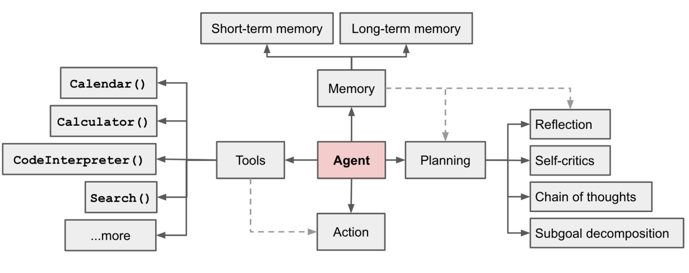
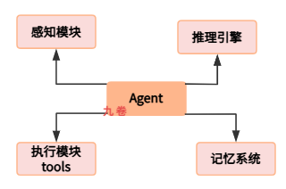
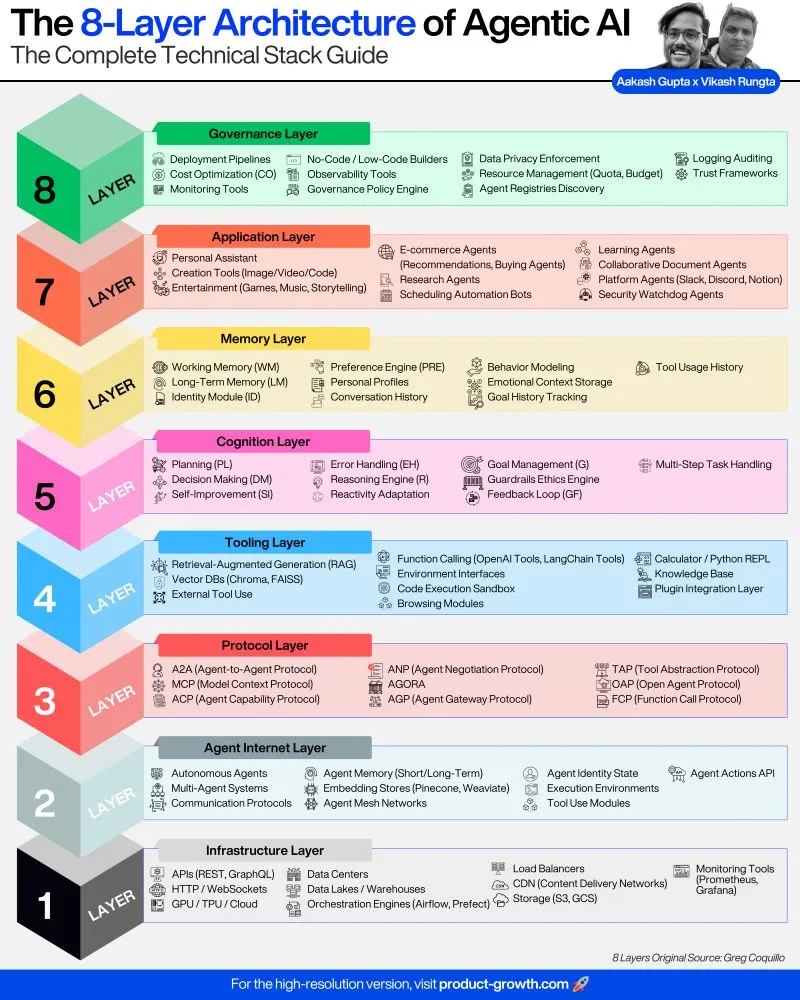
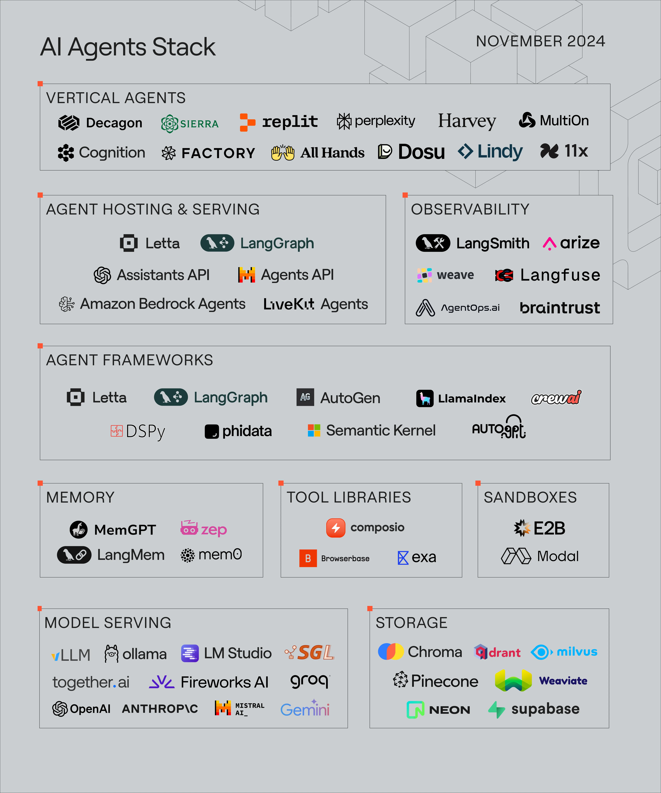
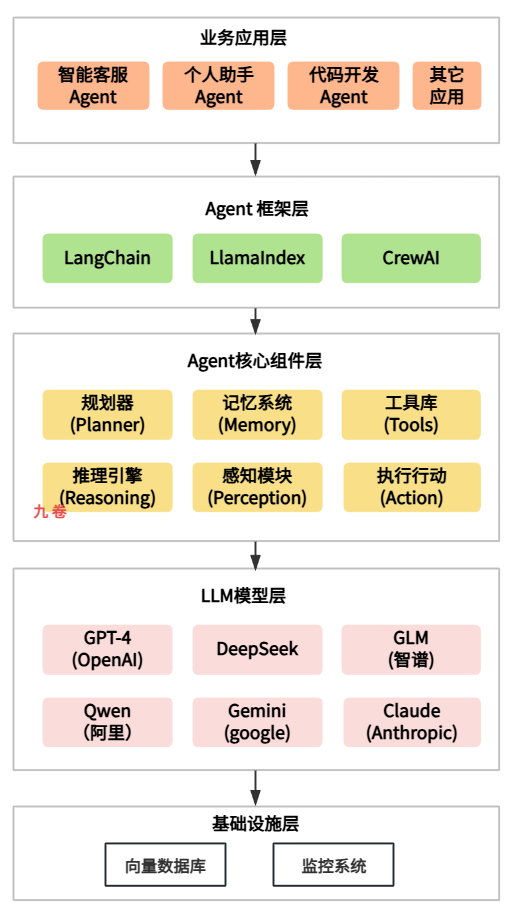

## 一、什么是AI Agent应用

AI Agent（人工智能代理或智能体）应用是当前人（2026）工智能领域最有前景的发展方向之一。简单的说，AI Agent 是一种能够自主感知环境、进行决策、执行动作的智能系统。与传统的静态 AI 模型不同，AI Agent 具备主动性、反应性和适应性，能够在复杂环境中完成多步骤任务。

在 2024-2025 年的大模型时代，AI Agent 成为了LLM（大型语言模型）落地应用的核心载体。大模型虽然具备强大的语言理解和生成能力，但本身只是被动响应查询的工具。而 AI Agent 则赋予了大模型"行动能力"，它不仅具备语言理解与生成能力，还能通过多轮对话和语义推理，实现动态响应，它能够调用工具、访问外部信息、规划任务执行流程，并在执行过程中不断调整策略。

这种从被动回答到主动行动的转变，使得 AI Agent 能够真正成为人类的智能助手，在编程、数据分析、研究辅助、智能客服、个人助手等众多场景中发挥价值。

AI Agent 的特征包括：

- 决策能力：基于信息推理规划，选择行动策略
- 感知能力：从环境中获取必要信息，如传感器、摄像头、API等数据源
- 行动能力：执行具体任务或操作
- 协作能力：与其它 Agent 或人类协作
- 学习能力：通过与环境的交互不断改进策略

这些特征使得 AI Agent 不仅仅是简单的问答工具，而是能够真正参与工作流程的智能实体。

## 二、开发Agent应用需要的技术知识体系

### LLM大模型知识

在 AI Agent 开发中，对 LLM 大模型知识的深入理解是为 AI Agent 应用开发打下良好的基础。

首先需要掌握 Transformer 架构的原理，这是现代大语言模型的核心基础。Transformer 通过自注意力机制（Self-Attention）实现了对序列数据的长距离依赖建模，理解其工作原理对于后续的 Agent 开发有很大的帮助。

其次是提示工程（Prompt Engineering）技术。提示工程是调用大模型能力的核心技能，包括如何设计有效的系统提示（System Prompt）、用户提示（User Prompt）和上下文提示（Context Prompt）。在 Agent 开发中，提示工程直接影响模型的推理能力和任务完成质量。需要掌握的技术包括：思维链提示（Chain of Thought）、few-shot 学习、角色扮演提示、以及结构化输出提示等高级提示技术。

第三是模型能力与限制的理解。不同的大模型在推理能力、长上下文处理、多模态理解、代码生成等方面表现的差异。Agent 开发者需要了解如何根据任务需求选择合适的模型，也就是大模型的选型能力，以及如何通过技术手段弥补特定模型的不足。例如，了解模型的幻觉问题并设计相应的验证机制，了解模型的上下文窗口限制并设计合理的记忆管理策略等等。

第四是模型部署与服务化相关的知识。虽然不是每个 Agent 开发者都需要训练模型，但理解模型推理的性能特征、资源消耗、以及如何通过 API 或本地部署方式调用模型是必要的基础知识。

### AI Agent核心概念与技术

下面这张图是 OpenAI 应用研究主管翁丽莲(Lilian Weng)写的一篇 blog 文章里的: [LLM Powered Autonomous Agents](https://lilianweng.github.io/posts/2023-06-23-agent/)，将 Agent 定义为`LLM + memory + planning + Tools + Action`，即大语言模型、记忆、任务规划、工具使用的集合。

（图来自 Lilian Weng 的 blog， Agent 结构组成图）

上面的图定义了 Agent  由 4 个组件组成：

- Planning 规划模块：负责信息决策，任务规划，分解为子任务。里面还有 4 个子类 
  - Subgoal decomposition 目标分解，分解为子目标
  - Chain of thoughts 思维链，连续学习思考
  - Reflection & Self-critics 反思和自我修正 ，如何对过去的行为进行自我批评和反省，并指导接下来的行动
- Memory：记忆模块。长期记忆和短期记忆
- Tools：调用工具执行任务。比如日历、计算器、代码解释器和搜索功能等等工具，或者其它工具，这些扩展了 Agent 的能力。
- Action：执行动作。根据规划和记忆来执行具体行动。

还有的将 Agent 的基本组成结构分为以下四个核心组件：

- 感知模块（Perception）：负责收集环境信息。把收集的信息转换为对自然语言输入的理解，如句法分析、关键词提取。实现多轮对话的上下文理解等等。

- 推理引擎（Reasoning Engine）：负责分析信息和做出决策，一般是调用 LLM 做推理。比如确定请求类型是查询、生成还是操作等。任务分解与规划，将复杂任务划分为多个子步骤等。

- 工具库（Tools）或执行模块：将决策结果转换为具体执行动作。比如工具的调用、对 API 接口调用或外部系统控制，是实际完成任务的系统。

- 记忆系统（Memory）：负责存储和检索信息。存储 Agent 智能体运行过程中的短期与长期记忆的信息，包括用户历史对话信息、中间状态信息、上下文摘要等，是支持多轮交互与状态保持的记忆系统。

这四个组件相互作用组成复杂 Agent 系统的基础。

规划与推理能力是 Agent 区别于普通 AI 应用的关键技术。

这包括 任务分解（Task Decomposition）将复杂任务拆分为可执行的子任务、目标重构（Goal Rewriting）根据执行反馈调整目标、思维链推理（Chain of Thought）展示推理过程提高可解释性、以及反思机制（Reflection）让 Agent 评估自身行为的有效性。

工具调用（Tool Calling）是 Agent 与外部世界交互的重要能力。

这涉及如何定义工具规范、构建工具描述、实现工具调用接口、以及处理工具返回结果。需要了解工具调用的错误处理、权限控制、以及多个工具的协同调用等高级主题内容。

记忆管理是构建长期交互 Agent 的关键技术。

这包括短期记忆（当前会话上下文）、长期记忆（持久化存储的知识和经验）、以及如何实现记忆的检索和遗忘机制。常用的技术包括向量数据库、知识图谱、以及基于规则的记忆管理策略。

### AI Agent技术栈

**Agentic AI 技术栈分层图**

（图来自：[Aakash Gupta](https://aakashgupta.medium.com/?source=post_page---byline--6794d75ac988---------------------------------------)）

1. **基础设施层 (Infrastructure Layer)**：这是整个系统的物理和底层网络支撑。
- 计算资源： GPU/TPU、云端数据中心。

- 存储与数据： 数据湖/仓库、S3/GCS 存储。

- 通信与调度： REST/GraphQL API、Airflow/Prefect 任务调度。

2. **智能体互联网层 (Agent Internet Layer)**：专注于智能体之间的连接与状态管理。
- 核心功能： 自主智能体系统、智能体 action 、长短记忆、工具使用。

- 状态维护： 嵌入向量数据库（Pinecone, Weaviate）、运行环境、网格网络。

3. **协议层 (Protocol Layer)**：定义了智能体之间及与外部通信的标准。
- 通信协议： A2A（智能体对智能体）、MCP（模型上下文协议）。

- 协作规范： 协商协议、网关协议、函数调用协议（FCP）。

4. **工具层 (Tooling Layer)**：赋予智能体“手”和“眼”，让其能与现实世界交互。
- 能力增强： RAG（检索增强生成）、代码执行沙箱、浏览模块。

- 外部集成： 函数调用（OpenAI Tools）、计算器、插件集成系统。

5. **认知层 (Cognition Layer)**：这是智能体的“大脑”核心，负责思考与逻辑。
- 决策机制： 推理引擎、规划（Planning）、自我改进。

- 反馈控制： 错误处理、伦理护栏、反馈循环。

6. **记忆层 (Memory Layer)**：管理智能体的知识储备和历史经验。
- 存储类型： 工作记忆（WM）、长期记忆（LM）。

- 个性化： 用户画像、对话历史、偏好引擎。

7. **应用层 (Application Layer)**：针对具体行业或场景的落地形态。
- 个人助手： 创作工具、娱乐、日程自动化。

- 企业应用： 电商智能体、研发助手、安全监控、协作文档。

8. **治理层 (Governance Layer)**：负责系统的安全性、合规性和可控性。
- 管理工具： 部署流水线、成本优化（CO）、监控工具。
- 合规与信任： 数据隐私强制执行、审计日志、信任框架、预算管理。

**letta的技术Agent Stack**

下面的 AI Agent Stack 图来来自 [letta blog](https://www.letta.com/blog/ai-agents-stack):

（AI Agent技术栈 图来自  letta.com）

详细的解释可以看这里：https://www.letta.com/blog/ai-agents-stack

## 三、构建AI Agent应用的分层架构

构建AI Agent应用涉及多个技术层次的协同工作，下面用图展示完整的技术分层架构：

## 四、Agent执行流程

## 参考

- https://lilianweng.github.io/posts/2023-06-23-agent/  LLM Powered Autonomous Agents 大语言模型驱动的智能体 作者：Lilian Weng
- https://www.zhihu.com/question/445556653 如何最简单、通俗地理解Transformer
- https://www.letta.com/blog/ai-agents-stack AI Agent技术栈 letta.com
- https://aakashgupta.medium.com/the-8-architectural-layers-of-agentic-ai-a-complete-guide-for-product-managers-6794d75ac988  AI Agent的技术栈8个分层图：产品经理完整指南

 