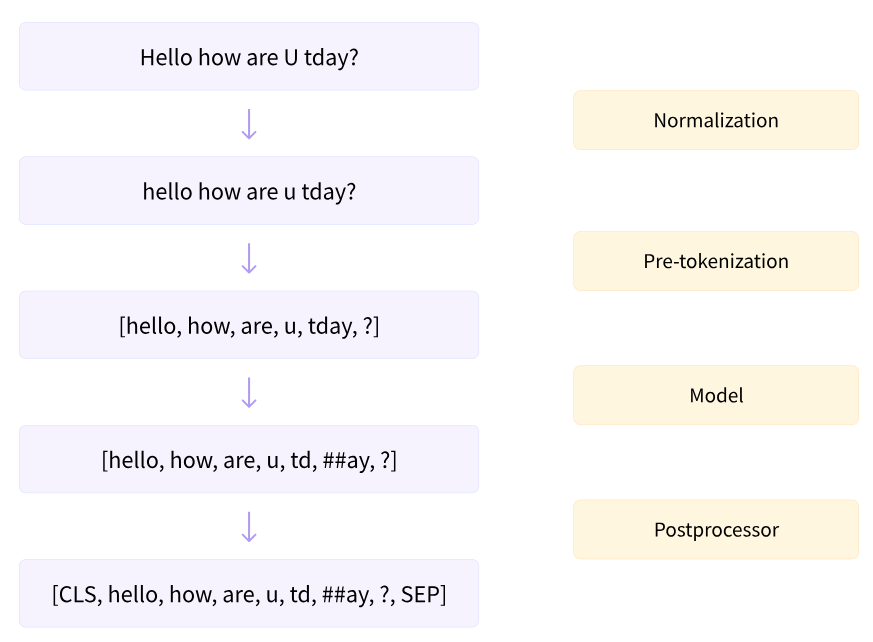

## 一、前言

当我们谈论人工智能时，大语言模型（Large Language Model，简称 LLM）无疑是当前最重要的技术之一。从 ChatGPT 到 DeepSeek，从 MiniMax 到通义千问，这些能够与人类进行流畅对话的大模型系统背后，都离不开 LLM 技术的支撑。

那么，LLM 大模型究竟是什么？它由哪些技术构成？这些技术又是如何协同工作的？本文将逐进行一下科普学习。

大语言模型通过海量数据的训练，学会了根据已有的文字内容预测接下来最可能出现的文字，从而生成连贯、有意义的文本回复。这种看似简单的预测下一个词的能力，正是 LLM 所有神奇功能的根源。

理解 LLM 的关键在于认识到它是一个概率系统，而非具有意识的存在。当模型输出“今天天气真好”时，它并不是真的“知道”天气的好坏，而是在无数训练数据的影响下，计算出在这个语境下“最可能”出现的文字组合。

这种概率本质帮助我们建立对 LLM 的准确认知：它是一个极其强大的统计预测工具。

## 二、技术基础

### 机器学习

要理解 LLM 的技术构成，我们需要从机器学习（Machine Learning）这一基础概念说起。传统的计算机程序是人类编写明确规则的逻辑系统——代码，程序员写代码告诉计算机“如果遇到这种情况，就那样处理”。而机器学习则完全不同：程序员不再编写具体的规则，而是让计算机自己从大量数据中发现规律。

举个例子，

如果我们想让计算机识别猫和狗的照片，传统方法需要程序员详细描述“猫有尖耳朵、胡须，而狗有下垂的耳朵”等规则。但机器学习的方法是给计算机展示大量标注好的猫和狗的照片，让它自己总结出区分两者的规律。这种让数据自己说话的方式，正是机器学习的核心思想。

机器学习主要分为三种类型：**监督学习、无监督学习和强化学习**。

- 监督学习是最常见的方式，就像老师教学生一样，给定输入和对应的正确输出，让模型学习输入与输出之间的映射关系。

- 无监督学习则没有标注好的答案，模型需要自己发现数据中的结构和模式。

- 强化学习通过奖励和惩罚机制，让模型在与环境的交互中学习最优策略。

LLM 的训练过程综合运用了这三种学习方式：在预训练阶段使用无监督学习，在微调阶段使用监督学习，在人类反馈阶段使用强化学习。

### 深度学习

深度学习（Deep Learning）是机器学习的一个重要分支，它的核心是神经网络（Neural Network）。

神经网络的设计灵感来源于人脑的工作方式——人脑由大量的神经元组成，每个神经元接收信号、处理信息、然后传递给其他神经元。人工神经网络正是模仿这一结构：用数学模型构建神经元，并通过大量神经元的连接来处理信息。

一个典型的神经网络包含多个层次：

输入层接收原始数据，隐藏层进行复杂的数学变换，输出层给出最终结果。之所以称为深度学习，是因为隐藏层的数量可以很多（从几个到几百个不等），形成了多层的网络结构。每一层都在前一层的基础上进行更高层次的特征提取，这使得深度学习能够处理非常复杂的模式。

以识别图片中的猫咪为例：

- 第一层可能识别出边缘和轮廓
- 第二层组合这些边缘形成耳朵、眼睛等部件
- 第三层进一步组合部件形成完整的猫咪面部。

网络层数越深，能够捕捉的特征就越抽象、越复杂。这就是深度学习深度的含义——它通过多层非线性变换，能够学习数据中极其复杂的特征表示。

### 自然语言处理

自然语言处理（Natural Language Processing，简称 NLP）是人工智能的一个重要分支，致力于让计算机能够理解、生成和分析人类语言。

传统 NLP 面临诸多挑战：语言具有歧义性，同样的词语在不同语境下可能有不同含义；语言具有灵活性，新的词汇、表达方式不断涌现；语言还具有复杂性，语法、语义、语用等多个层面都需要处理。

在 LLM 出现之前，NLP 领域经历了多次技术变革。早期的基于规则的方法需要语言学家手工编写语法规则，这种方法难以处理语言的复杂性和灵活性。后来出现的统计学习方法通过分析大量文本数据来发现语言规律，但效果仍然有限。直到深度学习的引入，尤其是Transformer 架构的出现，NLP 领域才迎来了革命性的突破。

LLM 可以被理解为 NLP 领域的一次质的飞跃。

此前的 NLP 系统通常是针对特定任务设计的专用系统——翻译系统只能做翻译，问答系统只能回答问题。而 LLM 通过大规模预训练，学习了广泛的语言知识和世界知识，展现出了强大的通用能力：一个训练好的 LLM 可以通过简单的提示（Prompt）来完成各种不同的语言任务，真正实现了从专用人工智能向通用人工智能的跨越。

## 三、核心架构：Transformer的革命

### 从RNN到Transformer

在了解 Transformer 之前，我们首先需要知道它的前身：

循环神经网络（Recurrent Neural Network，简称 RNN）及其改进版本长短期记忆网络（Long Short-Term Memory，简称LSTM）。

早期的序列生成模型（如机器翻译、文本生成）主要使用 RNN，它能够处理序列数据——将前一个位置的输出作为下一个位置的输入，从而捕捉序列中的时序信息。

然而，RNN 存在严重的缺陷。当序列很长时，RNN 很难有效地学习远距离位置之间的依赖关系，早期的信息在经过多步传递后会逐渐稀释，难以对后面的输出产生影响。这就是所谓的“长距离依赖问题”。

虽然 LSTM 通过引入门控机制在一定程度上缓解了这个问题，但计算效率仍然很低——RNN 必须按顺序逐步处理，无法并行计算。

2017年，谷歌的研究团队发表了划时代的论文**《Attention Is All You Need》**，提出了 **Transformer** 架构。这一架构完全摒弃了循环结构，仅依靠注意力机制（Attention Mechanism）来处理序列数据。

Transformer的出现解决了 RNN 的两个核心痛点：

第一，它支持并行计算，能够同时处理序列中的所有位置，大大提高了计算效率；

第二，它通过注意力机制直接建立任意两个位置之间的联系，能够更好地捕捉长距离依赖关系。

Transformer 的革命性在于它证明了：

> 只需要注意力机制，就能构建出比循环神经网络更强大、更高效的序列处理模型。

这一发现开启了 NLP 领域的新纪元，后续几乎所有重要的大语言模型——包括 GPT 系列、BERT 系列、LLaMA 系列等——都以Transformer 作为基础架构。

### 注意力机制：理解上下文的钥匙

注意力机制（Attention Mechanism）是 Transforme r的核心创新，也是理解 LLM 工作原理的关键。

> 简单来说，注意力机制让模型在处理每个词时，能够关注到输入序列中其他与之相关的词，而不是盲目地处理所有信息。

让我们通过一个具体例子来理解。考虑句子：

> “银行利率的调整会影响它的收益。”

这里的“它”指的是“银行”还是“利率”？人类可以轻松根据语境判断，但机器如何理解？

对于 RNN 来说，当处理到“它”这个词时，相关信息可能已经在前面的处理中稀释了。而注意力机制允许模型直接“查看”前面所有词的信息，并计算每个词与当前词的关联程度——在这个例子中，“银行”和“利率”都会获得较高的注意力权重，因为它们与“它”的语义关联最强。

从技术实现角度，注意力机制通过三个关键矩阵来完成计算：

**查询矩阵（Query）**代表当前位置的“需求”，

**键矩阵（Key）**代表每个位置能够提供的“信息”，

**值矩阵（Value）**则是实际的信息内容。

模型通过计算 Query 与 Key 的相似度来确定注意力权重，然后用这些权重对 Value 进行加权求和，得到最终的输出。这种设计精妙地实现了按需获取信息的功能。

**自注意力（Self-Attention）**是注意力机制的一种重要形式，它让输入序列中的每个词都可以与序列中的其他词进行交互。

自注意力能够捕捉句子中词语之间的各种关系：语法关系（如主语和谓语）、语义关系（如上下义词）、指代关系（如代词与指代对象）等。正是这种强大的关系建模能力，使得 LLM 能够深入理解语言的深层含义。

### 编码器与解码器

Transformer架构由两部分组成：编码器（Encoder）和解码器（Decoder）。

编码器负责理解输入文本，将原始的文字序列转换为计算机可以处理的内部表示；

解码器则基于编码器的输出，逐步生成目标文本。

编码器采用双向注意力机制，这意味着它在处理每个词时能够同时看到该词左侧和右侧的上下文信息。这种设计使编码器特别擅长理解输入文本的含义——就像一个人阅读一段文字时，既能看到前面的内容，也能预见后面的发展，从而更准确地把握当前内容的含义。BERT等模型就是典型的编码器架构，它们在文本理解任务（如情感分析、问答）中表现出色。

解码器采用单向注意力机制（也称为因果注意力），它在处理每个词时只能看到该词左侧的历史信息，而无法看到右侧尚未生成的内容。这种设计符合文本生成的任务特性——我们在生成下一个词时，只能基于已经生成的词来预测，而不能作弊看到未来的内容。GPT 系列模型就是典型的解码器架构，它们在文本生成任务中展现出了强大的能力。

**现代 LLM 主要有三种架构选择**：纯编码器（如 BERT）、纯解码器（如 GPT）、编码器-解码器混合（如 T5）。

其中，纯解码器架构已成为主流。这是因为纯解码器在生成任务中表现优异，且随着模型规模的增大，其理解和生成能力都在不断提升，展现出了良好的缩放定律（Scaling Law）。当前最成功的 LLM，如ChatGPT、Claude 等，都基于纯解码器架构。

## 四、LLM的核心组件

### 分词Tokenization

分词（Tokenization）是 LLM处理文本的第一步，也是将人类语言转换为机器可处理形式的关键环节。由于计算机只能处理数字，无法直接理解文字，因此我们需要将文字转换为数字表示。分词就是完成这一转换的过程：将输入的文本分割成模型能够处理的最小单元——**词元（Token）**。

分词面临诸多挑战。

**首先** 是歧义性问题：同一个句子可能有多种分词方式，例如“研究生物”可以分词为“研究/生物”（研究生命的科学）或“研/究生物”（从事研究的工作人员）。

**其次** 是未登录词问题：训练数据中从未出现过的词（生僻字、专有名词、网络新词等）如何处理？

**第三** 是效率问题：分词粒度越细，序列长度越长，计算成本越高；粒度越粗，语义表示越粗糙。

常见的分词方法包括：

- **基于词的分词**（将词语作为基本单元）
- **基于字符的分词**（将每个汉字或英文字母作为单元）
- **基于子词的分词**（如BPE、WordPiece等方法）

现代 LLM 普遍采用子词分词方法，它通过统计训练语料中词的出现频率，将高频词保持为完整单元，将低频词拆分为常见的子词单元。这种方法在词汇量和解码效率之间取得了良好平衡。

下面是分词步骤的高级概括:

(图来自 [huggingface.co llm](https://huggingface.co/learn/llm-course/chapter6/4))

以 GPT-4 为例，其分词器将英文文本拆分为约等于半个单词的子词单元，中文则大约 1-2 个字符一个 Token。理解 Token 的概念对于使用 LLM 很重要：因为 API 通常按照 Token 数量计费，了解大约多少个字符对应 一个 Token 可以帮助估算成本。例如，通常4个英文字符约等于 1 个 Token，而 1-2 个中文字符约等于 1 个 Token。

### 嵌入向量

嵌入（Embedding）是LLM的又一核心概念，它解决了如何将文字转换为有意义的数学表示的问题。

嵌入的核心理念是：将每个词映射为一个多维向量，这个向量蕴含了词的语义信息。语义相近的词，在向量空间中的距离也应该相近。

## 参考

- https://arxiv.org/abs/1706.03762 Attention Is All You Need
- https://blog.dailydoseofds.com/p/implement-attention-is-all-you-need Implement "Attention is all you need"
- https://zhuanlan.zhihu.com/p/638884759  【重温经典】Attention is all you need 6周年重读（上）
- https://zhuanlan.zhihu.com/p/1955006993891828447【重温经典】Attention is all you need 6周年重读（中）
- https://huggingface.co/learn/llm-course/chapter6/4  Normalization and pre-tokenization