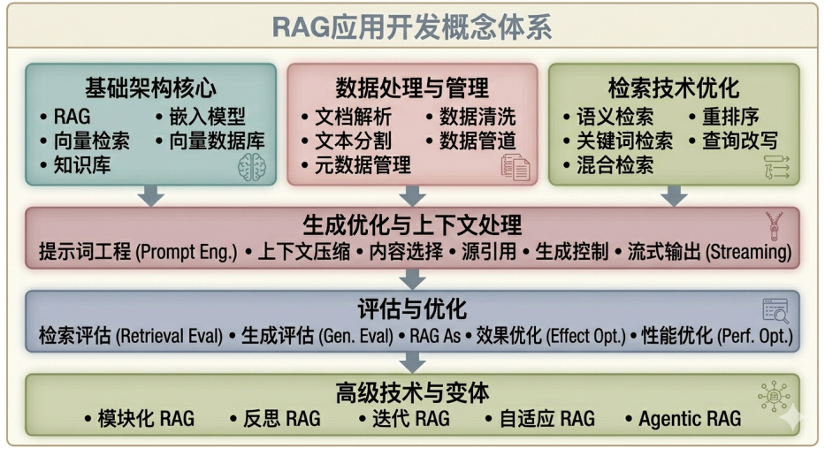

> RAG  应用开发相关的 50 个重要概念解释

RAG（Retrieval-Augmented Generation，检索增强生成）是当前大语言模型应用领域最重要的架构范式之一，它通过结合外部知识检索来增强模型的生成能力，有效解决了大模型的知识时效性、幻觉问题和领域知识缺乏等核心痛点。 RAG 技术架起了传统信息检索与现代生成式人工智能之间的桥梁，使得构建可靠、可控的企业级AI应用成为可能。

本文系统梳理了 RAG 应用开发中最重要的 50 个重要概念，涵盖基础架构、数据处理、检索技术、生成优化、评估部署等六大维度，为开发者提供一份全面而系统的知识参考。

深入理解这些概念能够帮助工程师们更好地设计和实现高质量的 RAG 系统，推动人工智能技术在知识密集型场景中的落地应用。

RAG应用开发概念体系图：

   （AI生成图片）

## 一、基础架构与核心概念

 RAG  的基础架构是整个系统的骨架，它定义了数据如何流动、信息如何检索、生成如何进行。理解这些基础概念对于构建有效的 RAG  系统至关重要。 RAG 架构的核心思想很简单：先从知识库中检索相关信息，然后将这些信息作为上下文提供给大模型来生成答案。这种架构的优势在于它结合了检索系统的精确性和生成模型的灵活性，能够在保证答案准确性的同时生成自然流畅的语言。

### 1. 检索增强生成

检索增强生成（Retrieval-Augmented Generation， RAG）是一种结合外部知识检索来增强大语言模型生成能力的架构范式。

RAG 的核心工作流程是：当用户提出问题时，系统首先从外部知识库中检索与问题相关的文档或信息片段，然后将这些检索到的内容作为上下文提供给大模型，最后大模型基于检索到的真实信息生成回答。

RAG 技术有效解决了大语言模型的几个关键局限性：知识时效性问题（可以通过更新知识库来更新模型知识）、幻觉问题（回答基于真实检索内容）、领域知识缺乏问题（可以接入专业领域的知识库）。

RAG 已成为企业级 AI 应用的主流架构选择，特别是在需要准确事实信息的应用场景中。

### 2. 向量检索

向量检索（Vector Retrieval）是将文本等非结构化数据转换为向量表示，然后在向量空间中查找与查询向量最相似结果的技术。

向量检索的核心步骤包括：首先使用嵌入模型（Embedding Model）将文本转换为高维向量；然后构建索引以支持高效的相似度搜索；最后通过计算查询向量与文档向量之间的距离来确定相关性。

向量检索的优势在于能够捕捉语义相似性，而不仅仅是关键词匹配，这使得它能够找到在字面上不相关但语义上相关的内容。在 RAG 系统中，向量检索是实现语义搜索的关键技术，其检索质量直接影响最终的回答质量。常用的向量相似度度量包括余弦相似度、欧氏距离和点积等。

### 3. 知识库

知识库（Knowledge Base）是存储和组织结构化或非结构化知识的系统，是 RAG 系统的核心数据来源。

知识库的内容可以来自多种渠道：企业文档（PDF、Word、PPT等）、网站内容、数据库记录、API 返回数据等。知识库的设计需要考虑几个关键因素：内容覆盖度（是否包含足够全面的知识）、更新机制（如何保持知识的时效性）、组织结构（如何组织知识以便于检索）、权限管理（如何控制不同用户对不同知识的访问）。

在 RAG 应用中，知识库的质量直接决定了系统能够提供的答案范围和质量，因此知识库的构建和维护是 RAG 系统成功应用的关键环节。

### 4. 文档加载器

文档加载器（Document Loader）是从各种数据源读取和解析数据的组件，是 RAG 数据管道的起点。

文档加载器需要处理多种文件格式：结构化数据（JSON、XML、CSV）、半结构化数据（HTML、Markdown）、非结构化数据（PDF、Word、TXT）。

不同的文档格式需要不同的解析策略：PDF 需要 OCR 或布局分析来处理扫描件和复杂排版；HTML 需要解析 DOM 结构提取文本内容；Word 需要处理段落格式和嵌入对象。

文档加载器还需要处理编码问题、格式转换、内容清洗等常见的数据处理任务。在实际应用中，选择合适的文档加载器或根据特定格式开发专门的加载器是构建 RAG 系统的首要步骤。

### 5. 文本分割

文本分割（Text Chunking）是将长文档切分为较小、语义连贯的片段的处理过程，是 RAG 系统中至关重要的预处理步骤。

文本分割的目的是创建大小适中、语义完整的文本块，以便于检索和作为上下文提供。

常见的分割策略包括：固定大小分割（按字符数或Token数直接切分）、语义分割（按段落或主题自然分割）、递归分割（使用层次化的分隔符进行分割）、特殊分割（针对代码、表格等特殊内容的分割）。

文本分割的挑战在于平衡信息完整性和检索精度：块太小可能丢失上下文信息，块太大可能引入过多无关信息。重叠分割（相邻块之间保留重叠区域）是一种常用的优化策略，能够减少关键信息被切断的风险。

### 6. 嵌入模型

嵌入模型（Embedding Model）是将文本转换为向量表示的模型，是实现语义检索的基础。嵌入模型的核心思想是将语义相似的文本映射到向量空间中相近的位置，使得可以通过向量相似度来衡量语义相关性。

常用的嵌入模型包括：稠密嵌入（如 BERT 系列模型生成的上下文相关嵌入）、稀疏嵌入（如BM25等基于词频的嵌入）、 Colbert 嵌入（使用 ColBERT 等 late interaction 机制的嵌入）。

选择嵌入模型需要考虑几个因素：语义理解能力、维度与存储开销、多语言支持、推理速度。

在 RAG 系统中，嵌入模型的选择对检索质量有决定性影响，通常需要在效果和效率之间找到平衡。

### 7. 向量数据库

向量数据库（Vector Database）是专门用于存储和检索高维向量数据的数据库系统，是 RAG 系统的核心基础设施组件。向量数据库的主要功能包括：向量存储（高效存储大量向量数据）、索引构建（支持高速的相似度搜索）、相似度计算（支持多种距离度量）、过滤查询（支持带条件的向量搜索）。

主流的向量数据库包括Milvus、Pinecone、Weaviate、Chroma、Qdrant等，它们在性能、功能和生态系统方面各有特点。向量数据库的关键技术包括：索引算法（如HNSW、IVF、PQ）、距离度量（如余弦相似度、欧氏距离、L2距离）、分片与分布式支持等。

选择合适的向量数据库需要根据数据规模、查询性能要求、功能需求等因素综合考虑。

### 8. 混合检索

混合检索（Hybrid Retrieval）是结合多种检索方法以获得更好检索结果的技术策略。

典型的混合检索组合包括：向量检索加关键词检索（同时利用语义相关性和关键词匹配）、多粒度检索（结合不同大小的文本块进行检索）、多向量检索（为同一文档创建多种向量表示）、多模型检索（使用多个嵌入模型取长补短）。

混合检索的优势在于能够综合不同检索方法的优势：向量检索擅长语义匹配但可能遗漏精确关键词匹配，关键词检索（如 BM25）擅长精确匹配但无法处理语义变化，两者结合能够获得更全面的检索结果。在实际应用中，混合检索通常能够显著提升检索质量，是高级 RAG 系统的常见选择。

### 9. 重排序

重排序（Reranking）是对初步检索结果进行二次排序以提升结果相关性的技术。在 RAG 系统中，初步检索（通常使用向量检索）会返回大量候选结果，但这些结果的相关性可能参差不齐。重排序模型能够对这些候选结果进行更精细的相关性评估，生成一个更加准确的排序。

常用的重排序方法包括：基于BERT的重排序模型（如Cross-Encoder）、基于学习的排序模型（如LambdaMART）、基于规则的排序（结合多种信号进行加权）。

重排序虽然增加了计算开销，但能够显著提升最终提供给大模型的上下文质量，是构建高质量 RAG 系统的重要环节。特别是在检索结果数量较多或检索质量不够稳定的情况下，重排序的作用尤为明显。

### 10. 上下文窗口管理

上下文窗口管理（Context Window Management）是指对 RAG 系统输入给大模型的上下文内容进行优化控制的机制。

由于大模型的上下文窗口有限（即使是支持长上下文的模型也有 Token 限制）， RAG 系统需要精心选择和组织检索到的内容。

上下文管理的策略包括：内容选择（从检索结果中选择最相关的内容）、内容压缩（对长内容进行摘要以节省空间）、分层检索（先检索摘要再检索细节）、滑动窗口（分批处理大量检索结果）。

有效的上下文管理能够使 RAG 系统在有限的窗口内最大化有效信息的传递，提升生成质量的同时避免超出Token限制。

## 二、数据处理与文档管理

数据是 RAG 系统的血液，数据处理的质量直接影响整个系统的表现。文档管理涉及到从原始数据到可检索知识库的完整处理流程，包括数据提取、清洗、转换、存储等环节。

高质量的数据处理不仅能够提升检索效果，还能够增强系统的稳定性和可靠性。在企业级 RAG 应用中，数据处理往往是最耗时和复杂的环节，需要投入大量精力进行设计和优化。

### 11. 文档解析

文档解析（Document Parsing）是从各种格式的文档中提取文本内容的处理过程，是构建知识库的第一步。

文档解析需要处理多种挑战：格式多样性（PDF、Word、Excel、HTML、Markdown等）、布局复杂性（多栏、表格、图文混排）、内容类型多样性（正文、标题、页眉页脚、脚注尾注）。

针对不同类型的文档需要采用不同的解析策略：PDF 可以使用专门的 PDF 解析库或 OCR 技术；HTML 需要解析DOM结构并区分主要内容与导航元素；Word需要处理样式信息并提取纯文本。

文档解析的质量直接影响后续处理的效果，因此在构建 RAG 系统时需要特别关注文档解析环节的准确性和完整性。

### 12. 表格处理

表格处理（Table Processing）是 RAG 系统中处理表格数据的技术，包括表格识别、表格解析和表格检索等环节。表格是企业文档中常见的数据形式，包含大量结构化信息。

表格处理的挑战在于：表格结构识别（从扫描件或复杂排版中识别表格）、表格内容提取（准确提取表头、行、列、单元格内容）、表格语义理解（理解表格的含义和关系）。

处理后的表格可以转换为文本描述、JSON结构或单独建索引，以便于检索时能够准确匹配用户查询。在金融报告、统计数据、产品目录等表格密集型文档的处理中，表格处理能力至关重要。

### 13. 图像与图表处理

图像与图表处理（Image and Chart Processing）是 RAG 系统中处理视觉内容的技术，包括图像识别、图表理解和多模态嵌入等。

随着多模态大模型的发展， RAG 系统 increasingly 能够处理图像内容。图像处理的主要任务包括：光学字符识别（OCR，从图像中提取文字）、图表理解（理解图表表达的信息）、布局分析（识别文档中的图像、图表、公式等元素）、视觉问答（回答关于图像内容的问题）。

在处理包含大量图表的文档（如研究报告、财报、说明书）时，图像与图表处理能力对于提供完整的知识覆盖至关重要。多模态嵌入技术使得系统能够同时理解文本和图像内容，实现更全面的语义检索。

### 14. 元数据管理

元数据管理（Metadata Management）是指对文档的描述性信息进行组织和管理的技术。元数据包括文档的标题、作者、创建时间、修改时间、来源、分类、标签等结构化信息。

在 RAG 系统中，元数据的作用包括：检索过滤（通过元数据限定检索范围，如只检索特定时间或类别的文档）、结果排序（将元数据作为排序信号之一）、文档关联（通过元数据建立文档之间的关系）、权限控制（通过元数据实现不同用户的访问控制）。

良好的元数据管理需要建立统一的数据模型和命名规范，确保元数据的一致性和可用性。在企业级应用中，元数据管理还涉及到与现有文档管理系统、资产管理系统等IT基础设施的集成。

### 15. 数据清洗

数据清洗（Data Cleaning）是对原始数据进行预处理以提升数据质量的过程，包括去除噪声、纠正错误、统一格式等操作。

在 RAG 系统中，数据清洗的目标是确保知识库中的数据准确、一致、可检索。常见的数据清洗任务包括：编码处理（统一字符编码，处理乱码）、格式标准化（统一日期、数字、货币等格式）、去重处理（识别和合并重复或近似重复的内容）、噪声去除（去除无关内容如广告、水印、页码等）、异常值处理（处理格式错误或内容异常的数据）。

数据清洗虽然不直接产生价值，但它为后续的处理和检索奠定了基础，是构建高质量 RAG 系统的必要环节。

### 16. 数据版本控制

数据版本控制（Data Version Control）是对知识库内容进行版本管理和变更追踪的实践。

在企业应用场景中，知识库内容需要不断更新和维护，数据版本控制能够追踪内容的变更历史、支持内容的回滚、方便多人协作编辑。

数据版本控制的实现方式包括：基于时间戳的版本管理（记录每次修改的时间和内容）、基于变更日志的版本管理（记录每次修改的具体变更）、基于分支的版本管理（支持并行编辑和后续合并）。

在 RAG 系统中，数据版本控制还涉及到版本切换（使用不同版本的知识库进行检索）、版本对比（比较不同版本内容的差异）等功能。良好的数据版本控制是实现知识库持续优化和多人协作的基础设施。

### 17. 数据管道

数据管道（Data Pipeline）是连接数据源和 RAG 系统的一系列数据处理步骤的自动化流程。

典型的数据管道包括：数据抽取（从各种来源提取数据）、数据转换（格式转换、内容处理）、数据加载（写入向量数据库和文档存储）、数据验证（检查数据质量）。数据管道设计需要考虑：处理效率（支持批量处理和增量更新）、容错能力（处理失败时的重试和恢复）、监控告警（及时发现处理异常）、可扩展性（支持数据量增长）。

在企业级 RAG 应用中，数据管道通常需要7×24小时运行，支持各种数据源的持续接入，是保证知识库时效性的关键系统。

### 18. 增量更新

增量更新（Incremental Update）是只处理新增或变化的数据而不是全量重建的更新策略，是保证知识库时效性的重要技术。在数据量较大的场景下，全量重建索引的成本很高，增量更新能够显著降低维护成本。

增量更新的实现需要：变化检测（识别新增或修改的文档）、差异化处理（只处理变化的部分）、索引更新（将变化反映到向量索引中）、一致性维护（确保增量更新后的系统状态一致）。

增量更新与全量重建通常配合使用：日常使用增量更新进行日常维护，定期进行全量重建以修复可能的积累性问题。良好的增量更新机制能够在保证系统性能的同时确保知识的时效性。

## 三、检索技术与优化

检索是 RAG 系统的核心环节，检索质量直接决定了最终回答的质量。检索技术涉及到从简单的关键词匹配到复杂的语义理解等多种方法，需要根据具体场景选择和组合。检索优化是一个持续的过程，需要通过数据分析、效果评估来不断改进。高级的检索技术能够显著提升系统的准确性和用户体验，是构建差异化竞争优势的关键。

### 19. 语义检索

语义检索（Semantic Retrieval）是基于文本语义进行检索而非简单关键词匹配的技术，是现代 RAG 系统的主流检索方式。

语义检索的核心是利用嵌入模型将查询和文档都转换为向量表示，然后在向量空间中通过相似度计算来找到语义相关的内容。与传统关键词检索相比，语义检索能够处理同义词表达、概念理解、上下文推理等复杂情况。

例如，用户搜索“如何治疗感冒”时，系统能够找到包含“感冒治疗方法”或“感冒了怎么办”等不同表述的相关内容。语义检索的实现依赖于高质量的嵌入模型和高效的向量索引，是 RAG 系统实现智能化体验的基础技术。

### 20. 关键词检索

关键词检索（Keyword Retrieval）是最传统的文本检索方式，基于词频和词项匹配来评估文档相关性。

BM25（Best Matching 25）是目前最广泛使用的关键词检索算法，它基于词频和逆文档频率等统计指标来计算相关性得分。关键词检索的优势在于：计算效率高、结果可解释性强、对特定术语和专有名词敏感。

在 RAG 系统中，关键词检索通常与向量检索配合使用，构成混合检索策略。关键词检索特别适合处理需要精确匹配的查询，如特定术语搜索、品牌名称搜索、产品型号搜索等场景。

优化关键词检索需要关注词表构建、分词策略、停用词处理等因素。

### 21. 向量索引

向量索引（Vector Index）是用于加速高维向量相似度搜索的数据结构，是实现大规模向量检索的关键技术。

由于直接计算所有向量与查询向量的距离在大规模数据上不可行，需要使用近似最近邻（ANN）算法来加速搜索。

常用的向量索引算法包括：HNSW（Hierarchical Navigable Small World，基于图形的近似最近邻搜索）、IVF（Inverted File倒排索引，引入聚类加速搜索）、PQ（Product Quantization，乘积量化压缩向量并加速距离计算）、LSH（Locality-Sensitive Hashing，局部敏感哈希）。

不同的索引算法在搜索速度、召回率、内存占用等方面有不同特点，需要根据数据规模和性能要求进行选择。在实际应用中，HNSW因其优秀的综合性能成为最流行的选择。

### 22. 近似最近邻搜索

近似最近邻搜索（Approximate Nearest Neighbor，ANN）是用于在大规模数据中快速找到与查询点最相似结果的技术。

由于精确最近邻搜索的计算复杂度在高维空间中呈指数增长，ANN通过牺牲一定的精度来换取搜索效率的大幅提升。ANN算法的核心思想是在搜索速度和准确性之间取得平衡：使用索引结构减少需要计算距离的候选向量数量，同时保证返回结果与真正最近邻足够接近。

评估ANN算法的指标包括：召回率（返回结果中真正最近邻的比例）、QPS（每秒查询数）、延迟（单次查询的响应时间）。

在 RAG 系统中，ANN技术使得在百万级甚至亿级文档中进行毫秒级检索成为可能。

### 23. 检索查询改写

检索查询改写（Query Rewriting）是将用户原始查询转换为更适合检索系统的表达形式的技术，是提升检索召回率的重要手段。

用户 Query 的表述方式可能与知识库中的文档表述存在差异，直接使用原始 Query 检索可能遗漏相关内容。

查询改写的策略包括：同义词扩展（添加 Query 的同义词和相关词）、短语提取（识别 Query 中的关键短语）、伪反馈扩展（利用初始检索结果中的相关词扩展Query）、语义改写（使用LLM生成语义等价但更适合检索的表达）。

查询改写能够在不改变底层检索系统的情况下显著提升检索效果，是 RAG 系统优化的重要方向。

### 24. 查询理解

查询理解（Query Understanding）是深入分析用户查询意图和需求的技术，是实现精准检索的前置环节。

查询理解的任务包括：意图识别（判断用户想要什么类型的答案）、实体提取（识别查询中的关键实体和概念）、需求分类（判断查询涉及的知识领域和类型）、上下文利用（利用对话历史理解当前查询）。

在 RAG 系统中，良好的查询理解能够帮助系统选择合适的检索策略、过滤不相关的结果、调整返回内容的侧重点。查询理解可以利用传统 NLP 技术（如NER、意图分类），也可以利用大模型进行更深层的语义分析。准确的查询理解是提升用户体验的关键因素。

### 25. 跨语言检索

跨语言检索（Cross-Language Retrieval）是支持使用一种语言查询检索另一种语言知识库的技术，是实现多语言知识应用的重要能力。

跨语言检索的实现方式包括：机器翻译方法（将Query翻译后进行检索）、跨语言嵌入（使用多语言嵌入模型将不同语言的文本映射到统一向量空间）、跨语言索引（建立语言无关的索引结构）。

跨语言嵌入是目前最流行的方法，它使用多语言预训练模型（如mBERT、XLM-R）生成语言无关的向量表示，使得中文Query可以直接检索英文文档。在全球化企业应用中，跨语言检索能力使得统一知识库的建设成为可能，大大降低了多语言内容管理的复杂度。

### 26. 稀疏检索

稀疏检索（Sparse Retrieval）是使用稀疏向量表示进行检索的技术，传统的信息检索方法多属于此类。与稠密检索（向量检索）相比，稀疏检索的向量大部分维度为零，通常只记录词项的存在与否或权重。

典型的稀疏检索方法包括：BM25、TF-IDF、Lucene等。

稀疏检索的优势在于：对特定术语精确匹配能力强、结果可解释性好、计算效率高、内存占用低。在 RAG 系统中，稀疏检索常与稠密检索配合使用构成混合检索策略：稠密检索负责语义匹配，稀疏检索负责关键词精确匹配，两者结合能够获得更全面的检索结果。稀疏检索特别适合处理专业术语、缩写、产品型号等需要精确匹配的查询。

### 27. 稠密检索

稠密检索（Dense Retrieval）是使用稠密向量表示进行检索的技术，是现代语义检索的主流方法。稠密检索使用深度学习模型（通常是Transformer）将文本编码为稠密向量，这些向量能够捕捉深层的语义信息。

稠密检索的优势在于：语义理解能力强、能处理同义词和表达变化、能进行概念级别的匹配。

近年来，基于预训练语言模型的稠密检索取得了显著进展，如DPR、ANCE、ColBERT等模型在多个检索基准上取得了领先效果。在 RAG 系统中，稠密检索是实现智能化语义搜索的核心技术，但其对特定术语的精确匹配能力通常不如稀疏检索，因此往往与稀疏检索结合使用。

### 28. 领地感知检索

领地感知检索（Domain-Aware Retrieval）是针对特定专业领域进行优化的检索技术，旨在提升特定领域内的检索效果。

领域适配的方法包括：领域数据微调（使用领域数据微调嵌入模型和重排序模型）、领域词典构建（建立领域术语词典辅助检索）、领域规则定制（根据领域特点制定检索规则）、领域知识图谱（结合知识图谱增强领域理解）。

在医疗、法律、金融等专业领域，通用模型往往无法准确理解领域术语和专业知识，需要进行专门的领域适配。领地感知检索能够显著提升专业领域 RAG 系统的准确性和可靠性，是企业级专业应用的重要技术需求。

### 29. 图检索

图检索（Graph Retrieval）是利用知识图谱结构进行检索的技术，能够利用实体之间的关系提升检索的准确性和丰富性。

图检索的流程包括：查询中的实体识别、知识图谱中的实体链接、关系路径推理、子图提取等环节。

与纯文本检索相比，图检索能够理解实体之间的关系，如“公司A的CEO是谁”这类涉及关系推理的查询。

在 RAG 系统中，图检索可以单独使用，也可以与向量检索结合使用：先通过向量检索找到相关文档，再通过图检索进行关系推理和结果扩展。图检索特别适合处理涉及实体关系查询、多跳推理查询等复杂问题。

### 30. 网页检索

网页检索（Web Retrieval）是从互联网上获取实时信息的技术，使 RAG 系统能够回答涉及最新信息或超出知识库范围的查询。

网页检索通常通过搜索引擎API（如Bing、Google）实现，包括网页抓取、内容提取、结果排序等步骤。

在 RAG 系统中，网页检索可以作为知识库的补充：当用户Query涉及的知识不在知识库中时，系统可以自动从网上检索相关信息。

网页检索的挑战包括：网络延迟和稳定性、内容质量参差不齐、爬虫协议遵守、反爬机制应对等。网页检索与知识库检索的协调使用是实现全面知识覆盖的重要策略。

## 四、生成优化与上下文处理

生成是 RAG 系统的最终输出环节，生成质量决定了用户的直接体验。

生成优化涉及到如何组织检索结果、如何设计提示词、如何控制生成质量等多个方面。上下文处理则是确保大模型能够有效利用检索到的信息。由于大模型有Token数量限制，如何在有限的上下文中最大化有价值信息的传递是一个核心挑战。良好的生成优化能够使 RAG 系统的回答更加准确、完整、有帮助。

### 31. 提示词工程

提示词工程（Prompt Engineering）是设计和优化输入提示词以获得期望输出的技术，是 RAG 系统中控制生成质量的关键手段。

在 RAG 应用中，提示词通常包含：系统指令（定义 RAG 系统的工作方式和行为规范）、检索结果（将检索到的相关内容格式化为上下文）、用户Query（原始用户问题）。

好的提示词设计需要考虑：清晰的任务指令、适当的上下文信息、明确的输出格式要求、避免幻觉的引导等。

提示词工程的经验包括：使用分隔符区分不同部分、明确要求基于提供信息回答、要求引用来源、设置适当的回答长度等。

持续优化提示词是提升 RAG 系统效果的重要迭代手段。

### 32. 上下文压缩

上下文压缩（Context Compression）是对长检索内容进行压缩以适应有限上下文窗口的技术。

上下文压缩的策略包括：句子级别压缩（提取每个句子中的关键信息）、段落级别压缩（对每个段落生成摘要）、全局摘要（对整个检索内容生成综合摘要）、选择性保留（只保留与Query最相关的部分）。

压缩方法可以是基于规则的提取式压缩，也可以是基于模型的生成式压缩。上下文压缩的挑战在于在压缩率和信息保留之间取得平衡：过度压缩可能丢失关键信息，压缩不足则可能超出窗口限制。在实际应用中，需要根据大模型的窗口大小和检索内容的长度选择合适的压缩策略。

### 33. 内容选择

内容选择（Content Selection）是决定哪些检索结果应该被送入生成阶段的过滤过程。

简单的方法是选择排名最高的 Top-K 结果，但更智能的方法需要考虑：相关性阈值过滤（只保留相关性高于阈值的结果）、多样性保障（避免选择内容重复的结果）、新鲜度加权（优先选择更新的内容）、权威性考量（优先选择权威来源的内容）。

内容选择的目标是在有限的上下文中选择最相关、最有价值的内容。高级的内容选择还需要处理冲突信息：当多个检索结果提供矛盾信息时，需要进行信息验证或同时呈现不同观点。良好的内容选择能够显著提升生成答案的质量。

### 34. 源引用

源引用（Source Citation）是在生成回答时标注信息来源的技术，增强回答的可信度和可追溯性。

源引用的实现方式包括：直接引用（在回答中标注引用的文档或片段）、编号引用（使用编号引用文末的完整来源列表）、链接引用（在回答中提供来源的链接）。源引用不仅提升了用户体验（用户可以验证信息），也是 RAG 系统区别于纯生成模型的重要优势。

在实现上，源引用需要追踪每个检索结果的标识，并在生成时将引用信息正确地融入输出。良好的源引用设计需要在引用准确性和阅读流畅性之间找到平衡。

### 35. 生成控制

生成控制（Generation Control）是控制大模型输出内容的技术，包括格式控制、长度控制、风格控制等。在 RAG 系统中，生成控制的目标是确保输出符合预期要求。

常见的生成控制包括：输出格式控制（要求输出为JSON、Markdown等特定格式）、长度控制（限制输出的详细程度）、风格控制（调整回答的专业程度或口语化程度）、安全控制（防止生成有害内容）。

生成控制可以通过提示词设计来实现，也可以通过后处理对输出进行格式化和过滤。在企业级应用中，生成控制还需要考虑合规要求，确保输出内容符合行业规范和监管要求。

### 36. 多轮对话支持

多轮对话支持（Multi-turn Conversation Support）是 RAG 系统处理连续多轮对话的能力，是构建对话式AI应用的基础。

多轮对话的挑战包括：上下文维护（如何在多轮对话中保持上下文连贯）、指代消解（理解代词和省略指代的具体内容）、意图追踪（理解对话过程中用户意图的变化）、历史利用（有效利用对话历史信息）。

在 RAG 系统中，多轮对话支持需要在每轮对话中整合当前Query和历史对话信息，可能需要进行对话历史摘要或选择性的历史信息提取。良好的多轮对话支持能够提供更自然、更高效的交互体验，是对话式 RAG 应用的核心能力。

### 37. 流式输出

流式输出（Streaming Output）是边生成边返回结果而不是等待完整生成后再返回的技术，能够显著减少用户等待时间。

流式输出的实现是在大模型生成过程中逐步返回已经完成的 Token，而不是等待完整回答生成完毕。在 RAG 系统中，由于检索和生成都需要时间，流式输出能够将等待时间从“检索时间+生成时间”减少到“检索时间+流式输出时间”。

流式输出特别适合长回答场景，用户可以在生成过程中逐步看到内容，而不需要等待完整结果。实现流式输出需要注意：与前端的数据传输协议、处理中断和取消、保持输出格式正确等。

### 38. 结构化输出

结构化输出（Structured Output）是要求大模型生成特定结构格式输出的技术，如 JSON、XML、表格等。

结构化输出的优势在于：便于程序解析和处理、提升输出的一致性、便于与其他系统集成。

在 RAG 系统中，结构化输出常用于需要返回特定格式答案的场景，如 FAQ 问答（返回问题和答案对）、实体抽取（返回识别出的实体及其属性）、数据查询（返回结构化的数据表格）。

实现结构化输出的方法包括：提示词中明确指定格式要求、使用输出解析器（Output Parser）解析和验证生成内容、处理格式错误时的重试逻辑。结构化输出是企业级 RAG 应用的重要需求，需要在提示设计和错误处理两方面进行优化。

## 五、评估与优化

评估是确保 RAG 系统质量的关键环节，需要建立全面的评测体系来衡量系统在各个维度的表现。 RAG 系统的评估比传统软件更加复杂，因为它涉及检索和生成两个阶段，每个阶段都有多个质量维度。持续优化则是基于评估结果不断改进系统的实践，是一个持续迭代的过程。良好的评估和优化实践能够确保 RAG 系统在实际应用中保持高质量表现。

### 39. 检索评估指标

检索评估指标是衡量检索质量的量化标准，常用的指标包括：

召回率（Recall，检索到的相关文档占所有相关文档的比例）、精确率（Precision，检索结果中相关文档的比例）、平均精度均值（MAP，综合考虑排序质量的指标）、归一化折损累积增益（NDCG，考虑位置相关性的排序质量指标）、Hit Rate（至少检索到一个相关文档的查询比例）。

在 RAG 系统中，检索评估通常需要人工标注相关文档集合作为ground truth，然后计算系统检索结果与ground truth的吻合程度。高质量的检索评估能够帮助识别检索环节的问题，指导检索算法的优化方向。

### 40. 生成评估指标

生成评估指标是衡量生成质量的量化标准，包括自动化指标和人工评估两个层面。

自动化指标包括：BLEU（基于n-gram重叠的相似度指标）、ROUGE（基于召回的摘要评估指标）、METEOR（考虑同义词匹配的评估指标）、chrF（基于字符n-gram的评估指标）。然而，这些自动化指标与人类对生成质量的判断往往存在较大差距。

人工评估通常从以下维度进行：有帮助性（是否回答了用户问题）、准确性（提供的信息是否正确）、流畅性（语言是否自然连贯）、完整性（是否提供了完整的信息）。

在 RAG 系统中，由于有检索到的信息来源作为参考，生成评估还需要特别关注是否正确利用了检索内容、是否存在幻觉等问题。

### 41. 端到端评估

端到端评估（End-to-End Evaluation）是从用户视角评估整个 RAG 系统表现的方法，衡量系统满足用户需求的整体能力。

端到端评估的指标通常更接近实际应用场景，如：任务完成率（用户问题是否得到解决）、用户满意度（通过问卷或反馈收集）、回答准确率（基于人工判断的正确回答比例）、响应质量（综合多个质量维度的评分）。

端到端评估需要设计代表性的测试用例，覆盖各种类型的用户Query和知识库内容。端到端评估的结果是 RAG 系统最终效果的直接反映，是判断系统是否满足上线要求的关键依据。在实际应用中，端到端评估通常需要结合自动化测试和人工评估两种方式。

### 42.  RAG As评估

 RAG As（Retrieval-Augmented Generation Assessment）是专门为 RAG 系统设计的评估框架，提供了一套标准化的评估指标和方法论。 

RAG As 的核心指标包括：Context Precision（检索到的内容与问题的相关性）、Context Recall（检索内容对回答问题的覆盖程度）、Answer Faithfulness（生成答案与检索内容的一致程度）、Answer Relevance（生成答案与问题的相关程度）。 

RAG As的优势在于它专门针对 RAG 系统的特点进行设计，能够更准确地评估检索和生成协同工作的效果。 RAG As提供了自动化计算部分指标的方法，通过使用大模型来评估检索质量和生成质量，大大降低了评估成本。在 RAG 系统开发和优化过程中， RAG As提供了一套实用的评估工具。

### 43. 效果优化

效果优化（Effectiveness Optimization）是基于评估结果改进 RAG 系统检索和生成质量的实践。

效果优化的方向包括：检索优化（改进嵌入模型、调整检索策略、优化索引参数）、生成优化（改进提示词设计、调整模型参数、优化上下文组织）、系统优化（改进数据处理流程、增加知识覆盖、提升系统稳定性）。

效果优化通常是一个迭代的过程：进行评估、发现问题、分析原因、实施改进、再次评估。

常用的优化方法包括：针对薄弱环节的定向优化、AB测试验证优化效果、用户反馈驱动的持续改进。在企业级应用中，效果优化需要有明确的优化目标、系统的优化流程和有效的评估机制。

### 44. 性能优化

性能优化（Performance Optimization）是改进 RAG 系统响应速度和吞吐能力的实践，直接影响用户体验和系统可用性。

性能优化的方面包括：检索性能优化（优化向量索引、调整检索参数、增加缓存）、生成性能优化（选择更快的模型、优化提示词长度、实现流式输出）、系统性能优化（负载均衡、水平扩展、资源调度）。

性能优化的目标是在保证效果的前提下尽可能降低延迟和提高吞吐量。常见的性能优化技术包括：缓存热门查询结果、异步处理耗时操作、预计算和预热、使用更小的模型处理简单查询等。性能优化需要持续进行，随着数据量和请求量的增长，系统性能可能逐渐下降，需要及时进行优化。

### 45. 成本优化

成本优化（Cost Optimization）是降低 RAG 系统运行成本的实践，涉及计算资源、API调用、存储等多个方面。

成本优化的策略包括：模型选择（根据任务复杂度选择合适的模型，复杂任务用大模型，简单任务用小模型）、缓存利用（缓存频繁访问的检索结果和生成结果）、数据压缩（使用更紧凑的数据格式存储和传输）、资源调度（在低负载时段进行批量处理）。

成本优化需要在效果、性能和成本之间找到平衡，不能为了降低成本而显著牺牲用户体验。在企业级应用中，成本优化是一个持续关注的问题，需要建立成本监控和预警机制，及时发现和处理成本异常。

## 六、高级技术与变体

 RAG 技术正在快速发展，各种高级变体不断涌现，为特定场景提供了更精细的解决方案。这些高级技术通常在基础 RAG 架构上进行扩展，解决特定类型的问题或满足特殊需求。了解这些高级技术能够帮助开发者根据具体应用场景选择最合适的方案，构建更具竞争力的 RAG 应用。

### 46. 模块化 RAG 

模块化 RAG （Modular  RAG ）是将 RAG 系统分解为多个独立模块并进行灵活组合的架构模式。与基础的 RAG 流水线相比，模块化 RAG 将检索、生成、重排序等环节作为独立模块，每个模块可以独立替换和优化。

模块化 RAG 的优势包括：灵活性高（可以根据需求选择和组合不同模块）、可维护性好（模块可以独立开发和测试）、易于扩展（添加新模块不影响现有系统）。

在模块化 RAG 架构中，各模块之间通过标准化接口进行交互，支持动态路由和条件触发。例如，可以根据Query类型选择不同的检索策略，根据检索结果选择是否进行重排序等。模块化 RAG 是企业级复杂 RAG 系统推荐的架构模式。

### 47. 反思 RAG 

反思 RAG （Reflective  RAG ）是引入自我反思机制来提升 RAG 系统效果的架构变体。反思 RAG 的核心思想是让系统在生成回答后进行自我检查，评估回答的质量和完整性，必要时进行修正或补充。

反思 RAG 的实现通常包括：生成初始回答、评估回答质量（检查是否回答了问题、是否引用了来源、是否存在幻觉）、如有问题则进行二次检索或重新生成。

反思机制可以利用大模型本身来实施，通过设计专门的反思提示来引导模型评估自己的输出。反思 RAG 能够显著提升回答的准确性和可靠性，特别适合对质量要求较高的应用场景，但会增加系统的响应时间和计算成本。

### 48. 迭代 RAG 

迭代 RAG （Iterative  RAG ）是支持多轮检索-生成迭代的架构模式，用于处理需要深入推理的复杂问题。

在迭代 RAG 中，系统不是一次性完成检索和生成，而是进行多轮迭代：每轮检索相关文档、基于检索内容进行推理和生成、如果生成结果不够完整或准确则进行下一轮检索和生成。迭代 RAG 特别适合处理多跳问题（需要多个步骤推理的问题）和深入研究类查询（需要全面收集信息的问题）。

实现迭代 RAG 需要设计迭代终止条件（如达到最大轮次或满足质量阈值）和迭代策略（如如何选择下一轮检索的Query）。迭代 RAG 能够提升复杂问题的处理能力，但响应时间较长，需要根据场景需求权衡使用。

### 49. 自适应 RAG 

自适应 RAG （Adaptive  RAG ）是根据 Query 特点自动选择最优处理策略的架构模式。

与固定流程的 RAG 不同，自适应 RAG 能够分析每个Query的类型和特点，然后动态选择合适的检索策略、模型配置和处理流程。

自适应 RAG 的实现包括：Query 分析（判断 Query 的类型、复杂度、领域等）、策略路由（根据分析结果选择处理策略）、动态配置（调整检索数量、模型选择、提示词模板等）。

例如，对于简单的事实性问题可以使用轻量级处理，对于复杂的多跳问题则启用迭代检索和更强大的模型。自适应 RAG 能够在保证效果的同时优化资源利用，是构建高效 RAG 系统的重要方向。

### 50. Agentic  RAG 

Agentic  RAG 是将 RAG 与Agent技术结合的架构模式，赋予 RAG 系统更强的自主性和主动性。

在Agentic  RAG 中，系统不仅仅是响应用户的Query，而是能够主动规划任务、调用工具、执行复杂操作。Agentic  RAG 的核心能力包括：任务规划（将复杂问题分解为多个子任务）、工具使用（调用搜索、计算、API等多种工具）、动态决策（根据执行结果调整行动计划）、多步推理（进行深层次的知识推理和整合）。

Agentic  RAG 特别适合构建复杂的知识工作助手，能够处理需要多步骤操作和多源信息整合的任务。结合 Agent 技术的 RAG 系统代表了企业级AI应用的发展方向，能够提供更强大、更灵活的知识服务能力。

## 七、概念总结表格

| 序号 | 概念           | 解释说明                                                     |
| :--: | -------------- | ------------------------------------------------------------ |
|  1   | 检索增强生成   | 结合外部知识检索来增强大语言模型生成能力的架构范式           |
|  2   | 向量检索       | 将文本转换为向量并在向量空间中查找相似结果的技术             |
|  3   | 知识库         | 存储和组织结构化或非结构化知识的系统，是 RAG 系统的核心数据来源 |
|  4   | 文档加载器     | 从各种数据源读取和解析数据的组件，是 RAG 数据管道的起点      |
|  5   | 文本分割       | 将长文档切分为较小、语义连贯片段的处理过程                   |
|  6   | 嵌入模型       | 将文本转换为向量表示的模型，是实现语义检索的基础             |
|  7   | 向量数据库     | 专门用于存储和检索高维向量数据的数据库系统                   |
|  8   | 混合检索       | 结合多种检索方法以获得更好检索结果的技术策略                 |
|  9   | 重排序         | 对初步检索结果进行二次排序以提升结果相关性的技术             |
|  10  | 上下文窗口管理 | 对 RAG 系统输入给大模型的上下文内容进行优化控制的机制        |
|  11  | 文档解析       | 从各种格式文档中提取文本内容的处理过程                       |
|  12  | 表格处理       | RAG 系统中处理表格数据的技术，包括表格识别和内容提取         |
|  13  | 图像与图表处理 | RAG 系统中处理视觉内容的技术，包括OCR和图表理解              |
|  14  | 元数据管理     | 对文档的描述性信息进行组织和管理的技术                       |
|  15  | 数据清洗       | 对原始数据进行预处理以提升数据质量的过程                     |
|  16  | 数据版本控制   | 对知识库内容进行版本管理和变更追踪的实践                     |
|  17  | 数据管道       | 连接数据源和 RAG 系统的一系列数据处理步骤的自动化流程        |
|  18  | 增量更新       | 只处理新增或变化的数据而不是全量重建的更新策略               |
|  19  | 语义检索       | 基于文本语义进行检索而非简单关键词匹配的技术                 |
|  20  | 关键词检索     | 基于词频和词项匹配评估文档相关性的传统检索方式               |
|  21  | 向量索引       | 用于加速高维向量相似度搜索的数据结构                         |
|  22  | 近似最近邻搜索 | 在大规模数据中快速找到与查询点最相似结果的技术               |
|  23  | 检索查询改写   | 将用户原始查询转换为更适合检索系统表达形式的技术             |
|  24  | 查询理解       | 深入分析用户查询意图和需求的技术                             |
|  25  | 跨语言检索     | 支持使用一种语言查询检索另一种语言知识库的技术               |
|  26  | 稀疏检索       | 使用稀疏向量表示进行检索的技术，如BM25                       |
|  27  | 稠密检索       | 使用稠密向量表示进行检索的现代语义检索技术                   |
|  28  | 领地感知检索   | 针对特定专业领域进行优化的检索技术                           |
|  29  | 图检索         | 利用知识图谱结构进行检索的技术                               |
|  30  | 网页检索       | 从互联网上获取实时信息的技术                                 |
|  31  | 提示词工程     | 设计和优化输入提示词以获得期望输出的技术                     |
|  32  | 上下文压缩     | 对长检索内容进行压缩以适应有限上下文窗口的技术               |
|  33  | 内容选择       | 决定哪些检索结果应该被送入生成阶段的过滤过程                 |
|  34  | 源引用         | 在生成回答时标注信息来源的技术                               |
|  35  | 生成控制       | 控制大模型输出内容的技术，包括格式、长度、风格控制           |
|  36  | 多轮对话支持   | RAG 系统处理连续多轮对话的能力                               |
|  37  | 流式输出       | 边生成边返回结果而不是等待完整生成后再返回的技术             |
|  38  | 结构化输出     | 要求大模型生成特定结构格式输出的技术                         |
|  39  | 检索评估指标   | 衡量检索质量的量化标准，如召回率、精确率、MAP等              |
|  40  | 生成评估指标   | 衡量生成质量的量化标准，包括自动化指标和人工评估             |
|  41  | 端到端评估     | 从用户视角评估整个 RAG 系统表现的方法                        |
|  42  | RAG As评估     | 专门为 RAG 系统设计的评估框架                                |
|  43  | 效果优化       | 基于评估结果改进 RAG 系统检索和生成质量的实践                |
|  44  | 性能优化       | 改进 RAG 系统响应速度和吞吐能力的实践                        |
|  45  | 成本优化       | 降低 RAG 系统运行成本的实践                                  |
|  46  | 模块化 RAG     | 将 RAG 系统分解为多个独立模块并进行灵活组合的架构模式        |
|  47  | 反思 RAG       | 引入自我反思机制来提升 RAG 系统效果的架构变体                |
|  48  | 迭代 RAG       | 支持多轮检索-生成迭代的架构模式，用于处理复杂问题            |
|  49  | 自适应 RAG     | 根据Query特点自动选择最优处理策略的架构模式                  |
|  50  | Agentic  RAG   | 将 RAG 与Agent技术结合的架构模式，赋予系统更强的自主性       |

## 八、概念关系图谱

​    （AI生成图片）

掌握以上 50 个重要概念，能够帮助开发者建立起完整的 RAG 应用开发知识体系。

这些概念相互关联、协同作用，共同构成了 RAG 技术的专业基础。在实际项目开发中，不同的应用场景可能需要侧重不同的概念和技术组合，需要根据具体需求进行灵活选择和优化。随着 RAG 技术的快速发展，新的概念和方法仍在不断涌现，建议持续关注学术前沿和工程实践的最新进展，不断更新和完善知识体系，以构建更加智能和可靠的 RAG 应用。