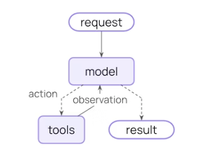
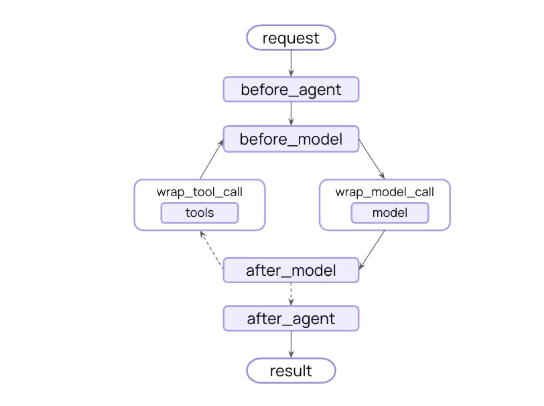

## LangChain介绍

LangChain 是由 Harrison Chase 于 2022 年 10 月开发的开源框架，旨在简化大语言模型应用的开发流程。该框架的核心思想是通过可组合和模块化组件实现大语言模型与业务系统的无缝对接。

## LangChain 整体组件

>  LangChain v1.2.17 版本
>

### **LangChain 的主要组件**

```bash
LangChain 
├── Agent Layer
├── Model Layer
├── Tool Layer
├── Message Layer
├── Embedding Layer
├── Context Layer
├── Structured Output Layer
├── Streaming Layer
└── Runtime Layer
```

底层生态是：

```bash
LangChain
   ↓
LangChain Core
   ↓
LangGraph
   ↓
Provider Packages
```

- LangChain：

  LangChain 是开始构建基于大型语言模型（LLM）的 AI Agent 和应用程序的最简便方式。只需不到 10 行代码，您即可连接 OpenAI、Anthropic、Google 等平台。LangChain 提供预构建的智能代理架构和模型集成方案，助您快速入门，并将大型语言模型无缝融入您的智能代理和应用程序中。

- LangChain Core：
  LangChain Core 包含驱动 LangChain 生态系统的基础抽象。这些抽象设计得尽可能模块化和简单
  
- LangGraph：

  LangGraph 是一个用于构建具有弹性的 Agents（以图的形式表示）的框架。langgraph 包是主要入口，提供了定义带状态、多步骤代理工作流所需的一切。以下包共同构成了 LangGraph 生态系统：

## 主要组件介绍

### Agents

#### 介绍

Agent 模块，它让大语言模型能够自主决定调用哪些工具来完成任务。Agent 使用 LLM大模型语言作为推理引擎，根据输入内容动态决定下一步操作。

核心架构图可以这样理解：

```json
                    用户请求
                        ↓
                 Agent (create_agent)
                        ↓
      ┌────────────────────────────────┐
      │                                │
      ↓                                ↓
Messages/Context                 Middleware
      ↓                                ↓
      └──────────────┬─────────────────┘
                     ↓
              Chat Model
                     ↓
      ┌──────────────┼──────────────┐
      ↓              ↓              ↓
    Tools      Embeddings     Structured Output
      ↓              ↓              ↓
     API          Vector DB       JSON
                     ↓
                Streaming
                     ↓
                  返回结果
```

**langchain.agents** 模块主要功能：

- 创建 Agent

- Tool Calling

- State 管理

- Middleware

- Structured Output
- memory

#### create agent

核心入口就是：`create_agent()`。

基础使用**create_agent** ：

[create_agent](https://reference.langchain.com/python/langchain/agents/factory/create_agent?v=1.2.17) 提供一个生产准备的代理实现。

> create_agent 利用 LangGraph 构建基于图的代理运行时。图由节点（步骤）和边（连接）组成，定义了你的智能体如何处理信息。

create_agent 代码例子：

```python
from langchain.agents import create_agent

agent = create_agent("openai:gpt-5.4", tools=tools)
```

> 上面程序中，模型标识符字符串支持自动推断（例如，“gpt-5.4”将被推断为“openai:gpt-5.4”）

为了更好地控制模型配置，可以直接使用初始化模型实例。在在下面例子中，我们使用 [ChatOpenAI](https://reference.langchain.com/python/langchain-openai/chat_models/base/ChatOpenAI)。

还可以参见 [Chat models](https://docs.langchain.com/oss/python/integrations/chat)，了解其他可用的聊天模型类别。

```python
from langchain.agents import create_agent
from langchain_openai import ChatOpenAI

model = ChatOpenAI(
    model="gpt-5.4",
    temperature=0.1,
    max_tokens=1000,
    timeout=30
    # ... (other params)
)
agent = create_agent(model, tools=tools)
```

### memory

提供了在运行链时存储程序状态信息的能力，支持短时记忆和长时记忆。在对话场景中，该模块能够存储历史对话记录，保证长对话的准确性。Memory 组件可以与 Chain 和 Agent 无缝集成，实现上下文感知的对话系统。

在 v1.2.17版本中，memory变成了：

> State + Checkpointer + Store

**memory的一些API**：

- checkpointer：给 Agent 添加短期记忆

例如使用内存保存：

```python
from langgraph.checkpoint.memory import InMemorySaver

checkpointer = InMemorySaver()
```

InMemorySaver 内存保存

PostgresSaver 基于 PostgreSQL数据库

- state_schema：自定义 Agent 状态

用 Pydantic 或 TypedDict 把业务状态一起保存：

```python
class MyState(AgentState):
    user_name: str
```

- trim_messages()：裁剪历史消息。

例如：只保留最近10轮。

### Middleware

Middleware 是在 Agent 执行生命周期中插入控制逻辑。它就像一个钩子Hook。

没加 middleware 前：



加了 middleware 之后：



它可以控制：

- Prompt
- Memory
- Tool
- Model
- Output
- 安全策略

**例如插入middleware到一个执行流程中**：

```json
User Input
    ↓
Middleware
    ↓
  Model
    ↓
  Tools
    ↓
Middleware
    ↓
  Output
```

比如一些middleware：

- @dynamic_prompt ：这个middleware 是动态修改 Prompt。

- @before_model - 模型调用前触发。

- @after_model - 模型调用后触发
- middleware=[] - 把中间件挂载到 Agent

```python
middleware=[
   trim_messages,
   inject_prompt
]
```


### Models

models 层组件，LangChain 最底层的能力，负责连接各种大模型和使用大模型。

大型语言模型（LLMs）是功能强大的人工智能工具，它能够像人类一样理解和生成文本。它们用途广泛，既能撰写内容、进行语言翻译、生成摘要，又能回答问题，且无需针对每项任务进行专门训练。

除了生成文本外，许多大模型还支持：

- 工具调用——调用外部工具（如数据库查询或API调用），并在响应中使用其结果。
- 结构化输出——模型的响应必须遵循预定义的格式。
- 多模态处理——处理并返回文本以外的数据，例如图像、音频和视频。
- 推理——模型通过多步骤推理得出结论。

models（大语言模型） 是 Agent 的推理引擎。它们驱动智 Agent 的决策过程，决定调用哪些工具、如何解读结果，以及何时给出最终答案。

您选择的大语言模型的质量和能力直接影响 Agent 的可靠性和性能。不同的模型在不同的任务上表现各异——有些更擅长遵循复杂的指令，有些更擅长结构化推理，还有些支持更大的上下文窗口以处理更多信息。

LangChain 的标准模型接口为您提供了多种供应商集成选项，使您能够轻松尝试和切换不同模型，从而找到最适合您项目的解决方案。

LangChain集成的大模型使用参考docs：  [models docs](https://docs.langchain.com/oss/python/langchain/models)

### Messages

在 LangChain 中，Messages 是模型上下文（model context）的基本单元。它们代表模型的输入和输出，既包含内容，也包含在与大型语言模型（LLM）交互时用于表示对话状态所需的元数据。

Messages 是包含以下内容的对象：

- **Role** 角色 - 标识消息类型（例如系统、用户）
- **Content** 内容 - 表示消息的实际内容（如文本、图片、音频、文档等）
- **Metadata** 元数据 - 可选字段，例如响应信息、消息ID和令牌使用情况

LangChain 提供了一种标准消息类型，可以在所有模型提供商中使用，确保无论调用哪个模型都具有一致的行为。


主要消息类型：

- HumanMessage 用户消息
- AIMessage AI消息
- SystemMessage 系统消息
- ToolMessage 工具返回消息
- trim_messages()  长上下文裁剪


**基本使用**：

使用消息的最简单方式是创建消息对象，并在调用时传递给模型。

```python
from langchain.chat_models import init_chat_model
from langchain.messages import HumanMessage, AIMessage, SystemMessage

model = init_chat_model("gpt-5-nano")

system_msg = SystemMessage("You are a helpful assistant.")
human_msg = HumanMessage("Hello, how are you?")

# Use with chat models
messages = [system_msg, human_msg]
response = model.invoke(messages)  # Returns AIMessage
```

更多使用方法请参考文档：https://docs.langchain.com/oss/python/langchain/messages

### Tools

Tools工具模块， 它扩展了 Agent 的功能 -- 能够调用外部能力，使其能够获取实时数据、执行代码、查询外部数据库，并在现实世界中采取行动。

从技术实现来看，tools 是具有明确输入和输出的可调用函数，这些参数会被传递给聊天模型。模型会根据对话上下文决定何时调用tools，以及提供哪些输入参数。

**基本使用**

使用 [`@tool`](https://reference.langchain.com/python/langchain-core/tools/convert/tool)  装饰器创建一个工具：

```python
from langchain.tools import tool

@tool
def search_database(query: str, limit: int = 10) -> str:
    """Search the customer database for records matching the query.

    Args:
        query: Search terms to look for
        limit: Maximum number of results to return
    """
    return f"Found {limit} results for '{query}'"
```

### Streaming

LangChain 实现了一个流式系统，用于实时更新。

流式传输对于提升基于大型语言模型（LLM）的应用程序响应性至关重要。通过逐步显示输出，甚至在完整响应准备就绪之前，流式传输显著提升了用户体验（UX），尤其是在处理LLM延迟问题时。

使用 LangChain 流式传输的类型：
- Stream agent progress 代理进度——在每个代理步骤后获取状态更新。
- Stream LLM tokens 大模型 token——在生成语言模型令牌时进行流式传输。
- Stream thinking / reasoning tokens 流式传输思考/推理令牌——在生成模型推理时显示出来。
- Stream custom updates 流式传输自定义更新——发出用户定义的信号（例如，“已获取 10/100 条记录”）。
- Stream multiple modes 流式传输多种模式——可选择更新（代理进度）、消息（LLM 令牌元数据）或自定义（任意用户数据）。

更多细信息请参考文档：：https://docs.langchain.com/oss/python/langchain/streaming

### Structured output

Structured output 结构化输出允许Agents代理以特定且可预测的格式返回数据。你不用在解析自然语言的响应信息，而是获得以 JSON 对象、Pydantic 模型或数据类形式存在的结构化数据，你的应用程序可以直接使用。

LangChain 的 create_agent 方法会自动处理结构化输出。用户只需设置所需的结构化输出模式，当模型生成结构化数据时，系统会自动捕获并验证该数据，然后将其存储在代理状态的 ‘structured_response’ 键中。

```python
def create_agent(
    ...
    response_format: Union[
        ToolStrategy[StructuredResponseT],
        ProviderStrategy[StructuredResponseT],
        type[StructuredResponseT],
        None,
    ]
```

更多信息参考文档：https://docs.langchain.com/oss/python/langchain/structured-output

## 参考

- https://docs.langchain.com/oss/python/langchain/overview langchain概述
- https://docs.langchain.com/oss/python/concepts/memory  记忆文档
- https://docs.langchain.com/oss/python/langchain/short-term-memory 短期记忆文档
- https://docs.langchain.com/oss/python/langchain/agents agents文档
- https://reference.langchain.com/ langchain参考文档
- https://docs.langchain.com/oss/python/langchain/models model
- https://docs.langchain.com/oss/python/langchain/streaming streaming
- https://docs.langchain.com/oss/python/langchain/middleware/overview langchain middleware中间件
- https://reference.langchain.com/python/langchain/agents/middleware langchain middleware