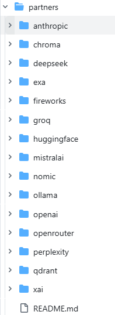

## LangChain整体包文件结构

在 LangChain v1.2+ 中，它的包都在根目录 libs/ 下，下面是它的结构：

```plaintext
langchain-ai/libs/
├── core/                # langchain-core（核心抽象层，v1.2+）
├── langchain_v1/        # 主包 langchain（v1.x，用户直接调用）
├── LangChain/           # LangChain Classic，旧版chain、langchain-community 的重新导出、索引 API、已弃用的功能等。
                         # 在大多数情况下，应使用 langchain 主包。
├── partners/            # 厂商专属集成包（OpenAI/Anthropic 等）
├── text-splitters/       # 独立文本分割器包
├── standard-tests/        # 接口一致性测试套件
├── model-profiles/       # 模型能力元数据
```

## langchain-core核心抽象层

所有组件的**基础依赖**，定义统一接口。langchain-core 目录主要组件介绍。

- runnables：统一调用接口（`invoke/stream/batch`），支持组件组合。`Runnable` 协议。

- language_models：BaseLLM`/`BaseChatModel。LLM / 聊天模型基类，定义通用调用规范

- prompts：prompt 提示词模板，支持动态变量渲染。PromptTemplate`/`ChatPromptTemplate

- messages：多轮对话消息类型定义。HumanMessage`/`AIMessage`/`SystemMessage

- tools：工具基类，定义工具调用 schema 与执行逻辑

- indexing：该包包含辅助逻辑，帮助处理数据索引。一种“向量存储”，同时避免内容重复和覆盖内容

- documents ：该模块为处理检索增强数据提供了核心抽象。生成（RAG）流水线、向量存储和文档处理工作流程

- vectorstores：向量存储抽象，定义向量增删查等接口

- callbacks：回调系统，支持日志 / 追踪 / 流式处理监控

- output_parsers：解析LLM调用的输出为结构化数据

- tracers：追踪器是用于追踪运行的类。可观测性

## langchain（v1.2+ 主包，langchain_v1） 

  **精简后仅保留 6 大核心模块**，专注 Agent 工程化。

| 组件目录       | 核心函数 / 类                 | 功能说明                                |
| -------------- | ----------------------------- | --------------------------------------- |
| agents/        | `create_agent()`/`AgentState` | Agent 工厂函数，创建智能体；状态管理    |
| chat_models/   | `init_chat_model()`           | 统一聊天模型初始化（支持多厂商）        |
| embeddings/    | `init_embeddings()`           | 统一嵌入模型初始化，用于文本向量化      |
| tools/         | 工具注册 / 适配类             | 工具定义与绑定，支持模型调用外部能力    |
| messages/      | 消息适配层                    | 复用 core 消息类型，补充 Agent 场景适配 |
| rate_limiters/ | 速率限制工具                  | 控制模型 / 工具调用频率，避免超限       |

## LangChain(LangChain Classic，旧版chain、langchain-community)

存放**非官方 / 第三方集成**，依赖可选以保持轻量。一些功能：

- 第三方模型集成，非主流厂商 LLM / 聊天模型（如本地开源模型）
- 向量存储集成，Pinecone/Chroma/FAISS 等向量库适配
- 文档加载器，PDF/Markdown/ 数据库 / 网页等文档加载能力
- 文本分割器，补充 core 分割策略，支持长文本分块
- 工具集成，Tavily 搜索 / PythonREPL / 文件工具等常用工具

等等功能。

## partners（厂商专属集成包）

主流厂商（LLM、搜索、向量数据库等）作为独立的一个包，提供官方级别支持。



## model-profiles模块

langchain-model-profiles 是一款用于获取和更新模型能力数据的 CLI 工具，它从 [models.dev](https://github.com/sst/models.dev) 获取数据用于 LangChain 集成包。
LangChain 聊天模型会暴露一个 .profile 字段，提供对模型功能（如上下文窗口大小、支持的模态、工具调用、结构化输出等）的程序访问。该CLI工具帮助维护者保持数据的最新。

该软件包建立在 [models.dev](https://github.com/sst/models.dev)  项目的基础上，该项目是一个开源项目，提供模型能力数据。
LangChain 模型通过一些额外字段补充 models.dev 数据.

## text-splitters

LangChain Text Splitters 包含用于将各种文本文件分割成块的实用工具

## 另外一个独立包 langgraph

https://github.com/langchain-ai/langgraph 这个是编排 agent 的核心，作为 Agent 底层运行时。

- 状态图编，排基于状态机管理 Agent 多轮对话 / 工具调用循环
- 预构建 Agent，`createReactAgent` 快速创建 ReAct 范式智能体
- 中间件middleware支持，扩展 Agent 生命周期（如重试 / 日志 / 权限控制）
- 状态管理，持久化 / 恢复 Agent 对话状态，支持断点续聊

## 参考

- https://reference.langchain.com/python/langchain-core langchain core
- https://docs.langchain.com/oss/python/integrations/providers/overview  LangChain 提供了一个广泛的生态系统，llm
- https://github.com/sst/models.dev 大模型数据库