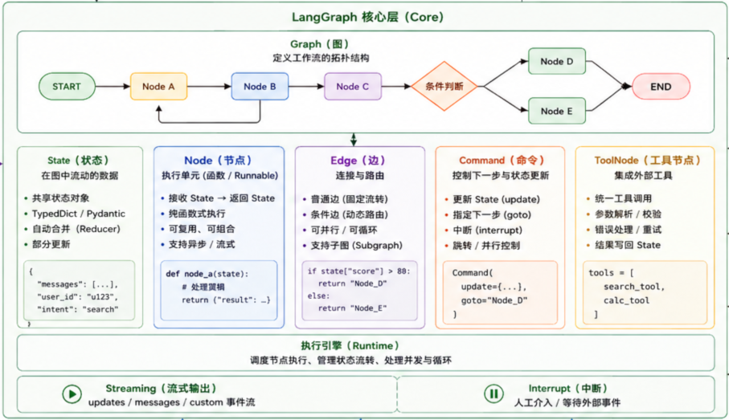
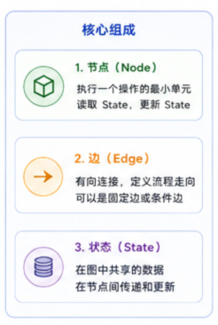

## LangGraph设计思想与架构

LangGraph 是 LangChain 生态系统的新成员，专门为构建基于大语言模型的有状态、多 Agent 代理应用程序而设计。该库的设计灵感来源于Pregel 算法，采用图的方式协调多个LLM或状态。

LangGraph 的核心概念是状态（State）。每个图执行都会创建一个状态，这个状态在图的节点之间传递，每个节点执行后都会用其返回值更新内部状态。图的内部状态更新方式由特定的更新器（Reducer）定义，这种设计使得开发者可以精确控制状态在节点间的流动方式。

LangGraph 专注于智能体编排的重要底层能力：持久化执行、流式传输、人机协作（Human-in-the-loop）等

LangGraph 的主要特性包括：

- 支持循环流程，能够实现复杂的多轮交互；
- 提供精细的控制能力，可以精确控制每个节点的行为；
- 具备持久性特性，支持检查点（Checkpoint）功能；
- 能够与人类协作，实现人机交互的 workflow。

Langgraph核心层图：

## LangGraph核心组件

LangGraph 的核心组件构成了构建有状态应用程序的基础架构。

**有向图（Directed Graph）**是 LangGraph 的基本结构，由节点（Nodes）和边（Edges）组成。节点代表具体的操作步骤，边定义操作之间的流转关系。

LangGraph 支持条件边（Conditional Edges），允许根据节点输出动态决定下一步执行哪个节点。

**状态管理（State Management）**是LangGraph的核心功能。每个GraphExecution都会创建一个状态对象，这个对象在节点之间传递并被不断更新。开发者可以通过继承TypedDict来定义状态结构，指定每个状态的类型和默认值。状态更新器（Reducers）负责合并节点输出与现有状态，确保状态的一致性。

**检查点（Checkpoints）**是 LangGraph 的重要特性，允许在任意时刻保存和恢复图的状态。这一特性对于实现对话记忆、错误恢复和多轮交互至关重要。LangGraph提供了 MemorySaver、SqliteSaver 等多种检查点实现，开发者可以根据需求选择合适的持久化方案。

**预建代理（Prebuilt Agents）**是LangGraph提供的高层抽象，封装了常用的Agent逻辑。create_react_agent是最常用的预建代理，它实现了ReAct（Reasoning and Acting）推理模式，可以自动处理工具调用和结果解析。通过预建代理，开发者可以用最少的代码构建功能强大的Agent应用。