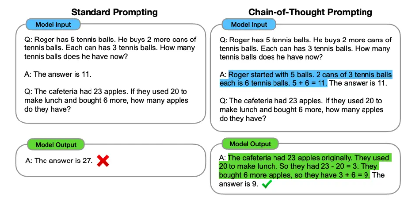

## 一、什么是提示词

### 提示词是什么

提示词（Prompt）是人与大语言模型（LLM）进行沟通的桥梁和纽带。简单来说，提示词就是我们向 LLM 大模型输入的文本内容，告诉大模型我们要它做什么的具体指令。

在技术层面来看，提示词是触发模型生成响应的输入信息，它决定了模型输出的方向、质量和准确性。

要理解提示词的概念，可以将其比喻为一位知识渊博的专家（LLM大模型）请教问题，这位专家读过海量的书籍和资料，掌握了广泛的知识，但如果你不清晰地表达自己的问题，专家也很难给出准确的答案。提示词就是这个“表达问题”的过程——你表达得越清晰、越具体，获得的答案就越符合预期。

从技术角度分析，提示词的核心作用在于引导模型的注意力机制。大模型的 Transformer 架构中的注意力机制会让模型关注输入文本中与其当前处理位置相关的内容。当我们输入提示词时，模型会分析提示词中每个部分与最终输出的关联程度，从而决定生成什么样的内容。因此，提示词的质量直接决定了模型能否准确理解用户的意图，并生成有用的响应。

总而言之，提示词（Prompt） 是驱动 LLM 生成内容的唯一输入信号，LLM 的所有输出都严格基于提示词的上下文进行生成。

### 提示词与LLM的关系

提示词与 LLM 之间存在着一种共生依存的关系。一方面，LLM 的强大能力为提示词提供了发挥作用的舞台——正是由于模型经过了大规模预训练和微调，才能够理解各种形式的提示词并做出合理响应。另一方面，提示词的存在使得用户能够有效地调用 LLM 的能力，而无需关心模型内部的复杂机制。

这种关系可以类比为软件界面与程序功能的关系。就像图形用户界面（GUI）让用户能够通过点击按钮来操作复杂的程序一样，提示词充当了用户与LLM交互的界面角色。用户通过精心设计的提示词，可以引导模型完成从简单的问答到复杂的推理、从文本生成到代码编写等各种任务，而无需了解模型内部机制是如何工作的。这给普通用户的使用带来了极大方便。

提示词在 LLM 应用中的地位至关重要，这主要体现在三个方面：

- 第一，提示词是用户控制模型行为的唯一方式——模型的所有输出都是对提示词的响应，用户无法直接修改模型的内部参数。

- 第二，提示词的设计直接影响输出质量——同一个模型，给出不同的提示词可能产生截然不同的结果。

- 第三，提示词工程已经成为使用 LLM 的关键技能——掌握提示词工程可以让用户以极低的成本获得高质量的输出。

### 提示词工作原理

理解提示词的工作原理需要了解 LLM 的核心工作机制。LLM 本质上是基于概率的文本生成系统，它会对给定的输入序列预测下一个最可能出现的词，然后把这个词添加到序列末尾，继续预测下一个词，如此循环直到生成完整的回答。

当我们输入提示词时，这个过程就开始了。模型首先将提示词分词转换为 Token 序列，然后通过嵌入层将每个 Token 转换为向量表示。这些向量进入 Transformer 架构的处理流程，注意力机制会根据当前正在生成的位置，计算对输入序列中各个部分的关注程度，从而决定下一个词应该是什么。

提示词设计的关键在于影响这个注意力分配的过程。通过在提示词中强调某些信息、提供具体的格式要求、或者设定特定的上下文， 用户可以引导模型的注意力更多地集中在相关的内容上，从而影响输出结果。这就像是在给模型提供线索，帮助它更好地理解用户的意图并生成符合期望的回答。

上面解释比较技术性，下面给一个比较白话的解释：

> LLM 是基于海量文本预训练的自回归生成式模型，核心能力是根据输入的上下文，预测并生成最合理的下一个文本最小单位（Token），它的所有知识与能力都固化在预训练后的模型权重中，无自主意识，所有输出完全由输入的提示词驱动。

## 二、提示词的基本构成

### 提示词要素基本构成

提示词包含以下基本要素：

**指令**：想要模型执行的特定任务或指令。

**上下文**：包含外部信息或额外的上下文信息，引导语言模型更好地响应。

**输入数据**：用户输入的内容或问题。

**输出指示**：指定输出的类型或格式。

除了上面所提出的，所有能影响模型输出的输入内容，除背景上下文、核心指令、输入、输出外，还包括角色设定、参考资料、少样本示例、约束条件等全部前置输入文本。

### 指令：告诉模型做什么

指令（Instruction）是提示词中最核心的部分，它明确告诉模型用户希望完成什么任务。指令应该是清晰、具体、可执行的，让模型能够准确理解用户的期望。	

你可以使用命令来指示模型执行各种简单任务，例如“写入”、“分类”、“总结”、“翻译”、“排序”等，从而为各种简单任务设计有效的提示。

指令的设计需要遵循几个原则：

- 首先，指令要明确具体。与其说“写一首诗”，不如说“写一首关于春天的七言绝句，要求押韵且意境优美”。

- 其次，指令要包含任务的关键要素，包括任务类型、具体要求、限制条件等。

- 第三，指令应该使用简洁的语言，避免可能引起歧义的表达。

常见的指令类型包括：

- **生成指令**（如“写一篇关于...的文章”）

- **分析指令**（如“分析这段话的情感倾向”）

- **转换指令**（如“把以下中文翻译成英文”）

- **总结指令**（如“用一句话概括以下内容”）

- **推理指令**（如“根据以下信息推理出正确答案”）

等等指令。

要写出合适的指令，还需要进行大量实验以找出最有效的方法。以不同的关键词（keywords），上下文（contexts）和数据（data）试验不同的指令（instruction），看看什么样是最适合你特定用例和任务的。通常，上下文越具体和跟任务越相关则效果越好。

### 上下文：提供背景信息

上下文（Context）为模型提供了理解任务所需的背景信息。好的上下文帮助模型在特定的领域或场景中给出更准确、更相关的回答。

上下文的作用体现在多个层面。

- 领域背景：可以帮助模型使用正确的专业术语和表达方式——例如，在医学问答中提供相关的病例信息，可以帮助模型做出更准确的诊断建议。

- 对话历史：让模型能够理解多轮对话的连贯性——在聊天场景中，模型需要知道之前讨论了什么，才能做出恰当的回应。

- 参考材料：可以为模型提供具体的信息来源——在问答时提供相关的文档片段，可以提高答案的准确性。

上下文并非越多越好。过长的上下文会增加模型的计算负担，可能导致关键信息被稀释，而且可能触发模型的懒政——模型可能过于依赖上下文而减少了自己的推理。因此，上下文应该经过精心筛选，只保留与当前任务最相关的信息。

### 输入数据：需要处理的内容

输入数据（Input Data）是提示词中需要模型处理的具体内容。这部分内容可能是需要翻译的文本、等待分析的数据、等待修改的代码，或者是任何需要模型进行处理的对象。输入数据的呈现方式会影响处理效果。

- 格式清晰：输入数据格式清晰更容易被模型正确理解——例如，将需要分析的文章段落用引号括起来，将需要翻译的句子单独放置。

- 结构化：数据结构化呈现可以帮助模型更好地理解复杂信息——如使用列表、表格等形式来组织数据。

- 标识边界：输入数据的边界也很重要——可以使用“以下是需要处理的内容：”、“输入：”等提示词来明确区分输入数据和其他部分。

### 输出格式：期望的响应形式

输出格式（Output Format）指定了用户期望的响应形式和结构。虽然这是可选项，但明确输出格式可以大大提高结果的可用性。

常见的输出格式包括：

- 纯文本，如“用简洁的语言回答”

- 结构化文本，如“以JSON格式输出”

- 列表形式，如“以 bullet point 形式列出”

- 代码块，如“用Python代码实现”

- 表格，如“以表格形式呈现对比信息”

等等输出格式。

指定输出格式的典型表达包括：“请用以下JSON格式输出”、“请分点列出”、“请用不超过100字概括”等。

通过这种方式，用户可以省去后续处理的麻烦，直接获得格式规范的输出。

## 三、提示词技术

### 零样本提示

零样本提示（Zero-shot Prompting）是指在不提供任何示例的情况下，直接要求模型完成某个任务。这种方式完全依赖模型从预训练中学到的知识来理解和执行任务。

零样本提示的典型形式是直接给出任务描述和输入，

例 1：

> 把以下句子翻译成英文：“我爱学习人工智能。”

模型需要依靠其预训练阶段学到的语言知识和翻译能力来完成这个任务。

例 2：

> 将文本分类为中性、负面或正面。
>
> 文本：我认为这次假期还可以。
>
> 情感：

输出：

> 中性

在上面的提示词中，我们没有向模型提供任何示例——这就是零样本能力。

零样本提示的优点是简洁直接，适用于任务简单明确、模型熟悉的场景。GPT-4 等大型模型在许多任务上即使没有示例也能表现良好，这得益于其海量预训练数据中包含的各种语言现象和任务模式。

然而，零样本提示也有局限性。对于复杂任务或特殊格式要求，模型可能无法准确理解用户的期望，导致输出不符合要求。此外，某些特定领域的任务可能需要模型具备专门的领域知识，而这些知识可能不在模型的覆盖范围内。

### 单样本和少样本提示

#### 单样本和少样本提示介绍

单样本提示（One-shot Prompting）提供一个示例，帮助模型理解任务的期望形式。少样本提示（Few-shot Prompting）则提供多个示例（通常2-5个），让模型更好地把握任务规律。

单样本One-shot提示给 1 个输入→输出，让模型模仿格式 / 逻辑。适合简单任务。

> 任务：把口语转成书面语。 
>
> 
>
> 示例： 
>
> 输入：这东西挺好用的 
>
> 输出：该产品使用效果良好 
>
> 
>
> 输入：我觉得这个方案还行 
>
> 输出：


少样本Few-shot提示的典型结构包括：任务描述、一个或多个输入-输出示例、以及需要模型处理的实际输入。

例子：

```yaml
任务：判断评论的情感是正面还是负面

示例1：
评论：这部电影太精彩了，我看得热泪盈眶
情感：正面

示例2：
评论：服务态度太差了，等了一个小时还没人接待
情感：负面

请判断以下评论的情感：
评论：商品质量还可以，就是物流太慢了
情感：
```

少样本提示的作用机制在于通过示例提供任务模式的直观展示。模型可以通过分析示例，学习到输入与输出之间的对应关系，从而在新任务上做出更准确的预测。

这种方式特别适合以下场景：任务格式特殊复杂、输出有特定的结构要求、需要模型遵循特定的领域规范等。

#### **少样本提示Few-shot要点**

要有效使用 Few-shot 提示词，需要注意以下几个技术要点：

- 示例的质量：这个至关重要。示例应该具有代表性和准确性，能够清晰地展示任务的正确处理方式。避免使用有错误或歧义的示例，因为模型可能会学习到这些示例的不良模式。

- 示例的数量：这个需要权衡。一般来说，2-5 个示例可以满足大多数任务的需求。过多的示例可能导致上下文过长，增加计算成本且可能稀释关键信息；但对于复杂任务或需要模型学习多种模式的情况，增加示例数量可能会有帮助。

- 示例的多样性：这个也需要考虑。如果任务涉及多种不同的情况，提供涵盖各种情况的示例可以帮助模型全面理解任务。例如，在情感分析任务中，提供包含不同表达方式（直接表达、讽刺表达、含蓄表达等）的示例，可以提高模型处理各类文本的能力。

- 示例的顺序：这个同样有影响。研究表明，将示例按照“从简单到复杂”的顺序排列，通常能让模型更好地理解任务要求。此外，将最终需要处理的任务紧跟在示例后面，可以确保模型集中注意力在最关键的内容上。

#### 少样本提示限制

以下例子来自：https://www.promptingguide.ai/zh/techniques/fewshot

标准的少样本提示对许多任务都有效，但仍然不是一种完美的技术，特别是在处理更复杂的推理任务时。让我们演示为什么会这样。您是否还记得之前提供的任务：

> 这组数字中的奇数加起来是一个偶数：15、32、5、13、82、7、1。
>
> A：

如果我们再试一次，模型输出如下：

> 是的，这组数字中的奇数加起来是107，是一个偶数。

这不是正确的答案，这不仅突显了这些系统的局限性，而且需要更高级的提示工程。

让我们尝试添加一些示例，看看少样本提示是否可以改善结果。

*提示：*

> 这组数字中的奇数加起来是一个偶数：4、8、9、15、12、2、1。
> A：答案是False。
>
> 这组数字中的奇数加起来是一个偶数：17、10、19、4、8、12、24。
> A：答案是True。
>
> 这组数字中的奇数加起来是一个偶数：16、11、14、4、8、13、24。
> A：答案是True。
>
> 这组数字中的奇数加起来是一个偶数：17、9、10、12、13、4、2。
> A：答案是False。
>
> 这组数字中的奇数加起来是一个偶数：15、32、5、13、82、7、1。
> A：

*输出：*

> 答案是True。

这没用。似乎少样本提示不足以获得这种类型的推理问题的可靠响应。上面的示例提供了任务的基本信息。如果您仔细观察，我们引入的任务类型涉及几个更多的推理步骤。换句话说，如果我们将问题分解成步骤并向模型演示，这可能会有所帮助。思维链（CoT）提示出现了，以解决更复杂的算术、常识和符号推理任务。以更技巧方式来写提示词，处理更复杂的任务。这就涉及到提示词工程。

## 四、提示词工程

### 什么是提示词工程

提示词工程（Prompt Engineering）是指设计和优化提示词，以提高 LLM 输出质量的一系列技术和方法。它涵盖了从基础的提示词撰写到高级的提示词优化策略的全过程。

提示词工程的重要性源于 LLM 的一个关键特性：**模型对提示词非常敏感**。

同一个任务，使用不同的提示词设计可能产生差异巨大的结果。一个精心设计的提示词可以让模型准确理解任务要求并给出高质量回答，而一个模糊或不当的提示词则可能导致模型产生无意义或错误的输出。因此，掌握提示词工程技能是有效使用 LLM 的关键。

提示词工程既是一门科学，也是一门艺术。从科学角度，它有一定的原则和技巧可以遵循；从艺术角度，优秀的提示词设计往往需要创造力和对任务特性的深入理解。随着 LLM 技术的不断发展，提示词工程已经成为人工智能领域的一个重要分支，出现了专门从事这项工作的提示词工程师职位。

### 提示词工程的核心组成

提示词工程包含多个核心组成部分，每个部分都有其特定的作用和设计原则。

**任务分析** ：提示词工程的第一步。在设计提示词之前，需要深入理解任务的本质：任务的目标是什么？需要什么样的输入？期望什么样的输出？有什么特殊的约束条件？只有清晰定义任务，才能设计出有效的提示词。

**提示词设计** ：将任务转化为具体提示词的过程。这需要考虑如何清晰地表达指令、如何提供必要的上下文、如何组织提示词的结构等。好的提示词设计应该做到：指令明确无歧义、上下文相关且适量、格式规范便于理解。

**迭代优化**：提示词工程的核心环节。初次设计的提示词往往不能达到最佳效果，需要通过反复测试和改进来优化。这一过程通常包括：分析模型输出的不足、理解问题产生的根源、调整提示词的相应部分、再次测试验证效果。

**技巧应用**：涉及各种具体的提示词优化技术。

这些提示词优化技术包括：

- 思维链提示词（CoT，Chain of Thought）
- 自我一致性提示词（Self-Consistency）
- 生成知识提示词（Generated Knowledge）
- 思维树提示词（ToT，Tree of Thoughts）
- 链式提示词（Prompt Chaining）
- 自动推理并使用工具（ART，Automatic Reasoning and Tool-use）
- 检索增强生成（RAG，Retrieval Augmented Generation）

等等，每种技巧都有其适用的场景和独特的优势。更多提示词技术详情请看这里 [promptingguide.ai的提示词技术讲解](https://www.promptingguide.ai/zh/techniques)。

## 五、高级提示词技术

下面说明一下几种高级提示词。

### 思维链提示词

思维链提示（CoT，Chain of Thought），它是一种重要的提示技巧，它是一种通过在提示词中引导模型展示其推理过程来提升推理能力的提示技术。

具体做法是在提示词中加入“让我们一步步思考”或“请解释你的推理过程”等引导语。研究表明，思维链提示可以显著提升模型在数学题、逻辑推理等需要多步思考的任务上的表现，通过显式地展示推理步骤，使模型能够进行更加准确、更加连贯的多步骤推理。



(图片来源：[Wei等人（2022）](https://arxiv.org/abs/2201.11903))

在 [Wei等人（2022）](https://arxiv.org/abs/2201.11903) 中引入的链式思考（CoT）提示通过中间推理步骤实现了复杂的推理能力。您可以将其与少样本提示相结合，以获得更好的结果，以便在回答之前进行推理的更复杂的任务。

从技术角度分析，思维链提示之所以有效，涉及到几个重要的机制。

- 首先，通过要求模型分解问题为多个子问题，每个子问题的难度相对降低，模型在每一步只需要关注一个具体的推理任务。

- 其次，中间的推理步骤为模型提供了“检查点”，可以在每一步验证推理的正确性，及时发现和纠正错误。

- 第三，推理步骤的存在使得整个思考过程更加透明，便于人类理解和干预。

思维链提示技术的使用场景在数学问题求解、逻辑推理类问题、代码调试和程序分析任务、复杂问题的拆解和分析、需要解释说明的教育类任务等等一些场景中。

**数学推理例子**

```yaml
问题：小明有23个苹果，小红给了他15个苹果，然后又送走了8个苹果。小明现在有多少个苹果？

使用思维链提示：
请逐步计算，每一步都展示出来。

步骤1：首先，小明原来有23个苹果
步骤2：小红给了他15个苹果，所以23 + 15 = 38个
步骤3：然后他又送走了8个苹果，所以38 - 8 = 30个
步骤4：因此，小明现在有30个苹果

答案：30个
```

这个例子展示了思维链提示的基本形式：通过将计算过程分解为多个明确的步骤，使推理过程透明化、可验证。

**实际应用示例：商业分析**

思维链提示还可以用于复杂的分析和决策场景：

```yaml
问题：某电商公司考虑是否要在下个季度推出会员订阅服务。请分析应该考虑哪些因素并给出建议。

使用思维链提示：
请系统性地分析这个问题。

第一步：明确问题核心
需要评估的是：是否应该推出会员订阅服务，以及如何推出。

第二步：识别利益相关方
- 客户：订阅服务的直接消费者
- 公司：服务的提供方，需要评估投入产出
- 竞争对手：可能的市场反应

第三步：分析有利因素
1. 客户留存：订阅模式可以提高客户粘性
2. 稳定收入：形成可预测的现金流
3. 数据价值：深入了解客户偏好

第四步：分析风险和挑战
1. 初期投入：需要开发订阅系统、制定定价策略
2. 用户接受度：客户是否愿意为订阅付费
3. 竞争对手反应：可能引发价格战

第五步：综合评估
权衡利弊，基于公司的具体情况给出建议。

建议：建议采用渐进式策略...（此处省略具体建议内容）
```

### 自我一致性提示词

自我一致性提示（Self-Consistency）由 [Wang等人（2022）](https://arxiv.org/pdf/2203.11171.pdf) 提出，自我一致性旨在“替换链式思维提示中使用的天真贪婪解码方法”。其想法是通过少样本 CoT 采样多个不同的推理路径，并使用生成结果选择最一致的答案。

它是继思维链提示之后出现的又一项重要的提示技术。它的核心思想建立在这样一个观察之上：对于同一个问题，模型在多次推理过程中可能会产生不同的结果，但正确的推理路径往往会产生最一致的答案。

通过让模型生成多个不同的推理路径，然后选择其中最一致的答案，自我一致性提示可以显著提高最终结果的可靠性。

自我一致性提示的工作原理可以类比为集思广益的投票过程。想象一个陪审团在做出裁决时，每个陪审员独立思考问题，然后大家一起讨论，最终选择最被广泛认可的裁决。自我一致性提示正是将这种集体智慧的机制引入到了单个AI模型的推理过程中——模型扮演着多个“陪审员”的角色，每个“陪审员”可能走不同的推理路径，但最终通过投票选出最一致的答案。

它使用一般场景有：

- 没有唯一标准答案的开放式问题，例如，问答系统、写作辅助、创意生成等任务，答案的正确性可能存在多种合理的解释
- 需要减少幻觉产生的场景，对自我一致性提示有强烈需求。LLM 有时会产生看似合理但实际错误的信息，这种现象被称为幻觉。通过让模型生成多个答案并选择最一致的，可以一定程度上抑制幻觉的影响——因为真正的知识通常会在多次推理中保持一致，而幻觉往往是不一致的。
- 复杂推理任务，自我一致性提示的另一重要应用领域。特别是数学证明、逻辑分析等需要严格推理的任务，单次推理可能因为某个环节的错误导致整个答案错误。通过多路径推理，可以从多个角度验证推理的正确性，提高最终答案的可靠性。
- 专家系统和决策支持类应用，也可以从自我一致性提示中受益。在医疗诊断、法律分析、金融预测等专业领域，多个独立的推理路径可以提供相互验证，提高决策的可信度。

**逻辑推理应用示例**

考虑一个复杂的逻辑推理问题：

```yaml
问题：如果明天不下雨，我就去爬山。如果我去爬山，我就会锻炼身体。如果我锻炼身体，我就会保持健康。请问在什么情况下我会保持健康？

使用自我一致性提示进行多路径推理：

推理路径1（正向分析）：
条件：明天不下雨
推论1：不去爬山 → 不锻炼身体 → 不会保持健康
等等，这个推理有误...

重新分析：
如果明天下雨 → 不去爬山 → 不锻炼身体 → 不保持健康
如果明天不下雨 → 去爬山 → 锻炼身体 → 保持健康
答案：明天下雨时我不会保持健康，明天不下雨时我会保持健康

推理路径2（逆向分析）：
目标：保持健康
反向条件：锻炼身体
反向条件：去爬山
反向条件：明天不下雨

因此：只有明天下雨时我才不会保持健康，明天不下雨时我会保持健康

推理路径3（条件分析）：
保持健康的充分条件链：不下雨 → 爬山 → 锻炼 → 健康
逆否命题：不健康 → 不锻炼 → 不爬山 → 下雨

综合结论：明天不下雨是我保持健康的充分条件

一致性分析：所有推理路径都指向相同结论

最终输出：只要明天不下雨，我就会保持健康。
```

###  链式提示词

链式提示词（Prompt Chaining），又称提示链，是一种将复杂任务分解为多个简单子任务，然后通过一系列相互关联的提示词逐步引导LLM 完成整个任务的技术。其核心思想是分而治之——与其让模型一次性完成一个复杂的任务，不如让它一步步来，每一步专注于一个具体的子任务。

链式提示的工作原理类似于工厂的生产流水线。在工厂里，一个复杂产品的制造会被分解为多个简单的工序，每个工序负责特定的步骤，最终所有工序的成果组合在一起形成完整的产品。类似地，链式提示将复杂任务分解为多个简单的“步骤”，每个步骤由一个提示词驱动，模型在该提示词的引导下完成特定的处理，然后将结果传递给下一步。

它的适用场景：

- 文档处理与分析是链式提示的典型应用场景。例如，一篇长文的摘要、提取关键信息、多维度分析等任务，都可以分解为“读取内容”、“识别主题”、“提取关键点”、“组织输出”等多个步骤。每个步骤由独立的提示词处理，最终组合成完整的分析报告。
- 多阶段写作任务同样适合使用链式提示。写一篇完整的商业提案可能包括“确定核心主题”、“设计文章结构”、“撰写各部分内容”、“审核与修改”等阶段。通过链式提示，模型可以在每个阶段聚焦于特定目标，产出的内容更加连贯、专业。
- 需要严格遵循流程的任务。例如，代码审查可能需要“检查语法错误”、“检查逻辑问题”、“检查安全漏洞”、“检查性能问题”等多个环节。链式提示确保每个环节都被系统性地处理，不会遗漏。
- 需要整合多种能力或信息来源的任务。例如，一个综合性的市场分析报告可能需要整合财务数据、行业趋势、竞争对手信息等多个来源的数据。链式提示可以将不同来源的数据处理分配给不同的步骤，最后统一整合。

**例子说明**

假设我们需要模型帮助我们分析和评估一家公司的财务状况。这个任务过于复杂，直接用一个提示词很难达到理想效果。使用链式提示词，我们可以将其分解为以下步骤：

**第一步：提取财务数据**

```
提示词1：
请从以下文本中提取关键的财务数据，包括：年收入、净利润、总资产、负债总额、现金流。请以结构化的格式输出，如果某项数据不存在，请标注"未提供"。

财务报告文本：
[此处提供财务报告内容]
```

**第二步：计算财务比率**

```
提示词2：
基于以下财务数据，计算以下财务比率：资产负债率、净利润率、毛利率、流动比率。每个比率请给出计算过程和结果。

财务数据：
[引用第一步的输出]
```

**第三步：分析与评估**

```
提示词3：
基于以下财务比率，对公司的财务状况进行分析。请从盈利能力、偿债能力、运营效率三个维度进行评估，并指出需要注意的风险点。

财务比率：
[引用第二步的输出]
```

一步一步来分析公司财务状况。

## 六、参考

- [Prompt Engineering Guide](https://www.promptingguide.ai/zh) 提示词工程指南

- https://www.promptingguide.ai/zh/techniques/zeroshot 零样板提示词学习

- https://arxiv.org/pdf/2109.01652.pdf  指令调整已被证明可以改善零样本学习

- https://www.promptingguide.ai/zh/techniques/cot  链式思考（CoT，Chain-of-Thought）提示

- https://arxiv.org/abs/2201.11903 思维链 CoT

- https://www.promptingguide.ai/zh/techniques/consistency 自我一致性提示词

- https://www.promptingguide.ai/zh/techniques/prompt_chaining  链式提示词

  